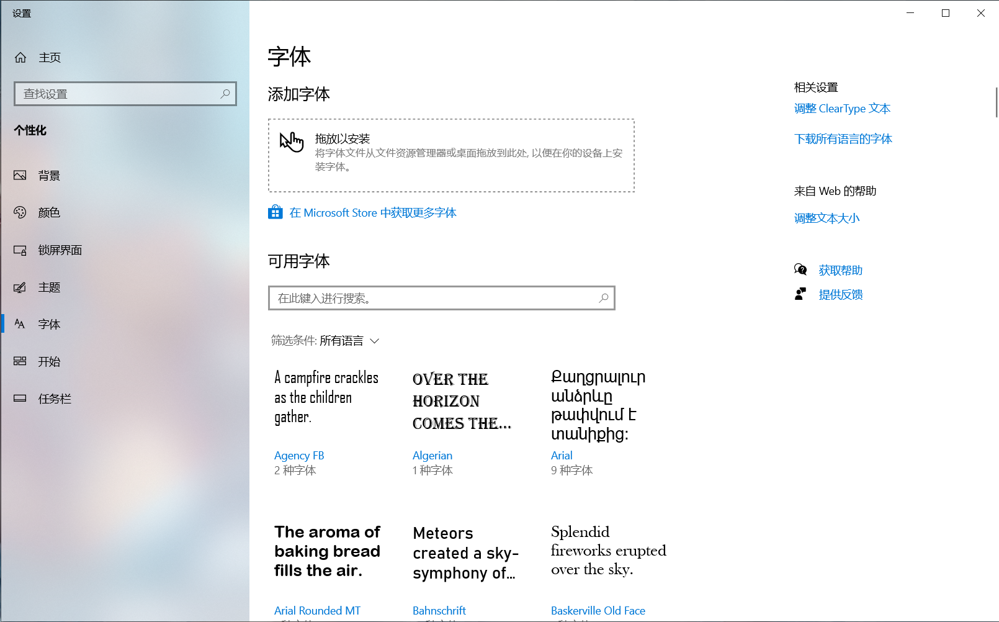
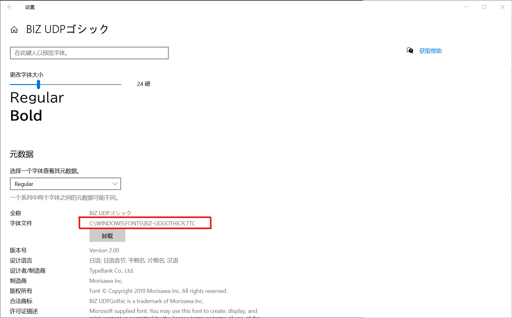
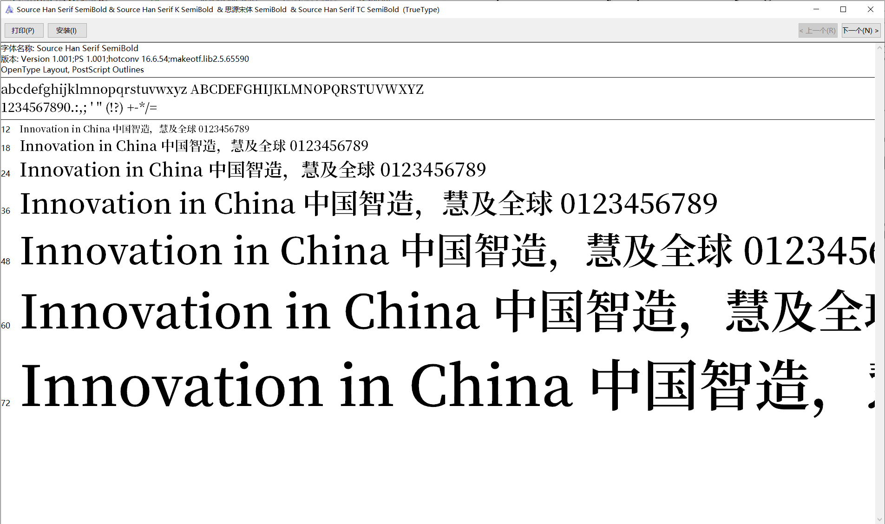
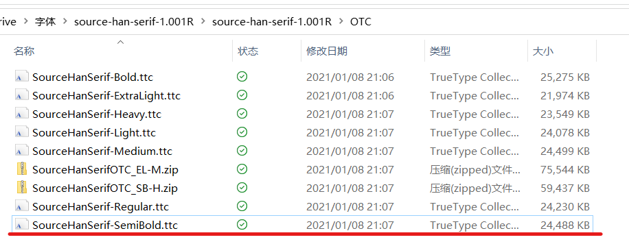
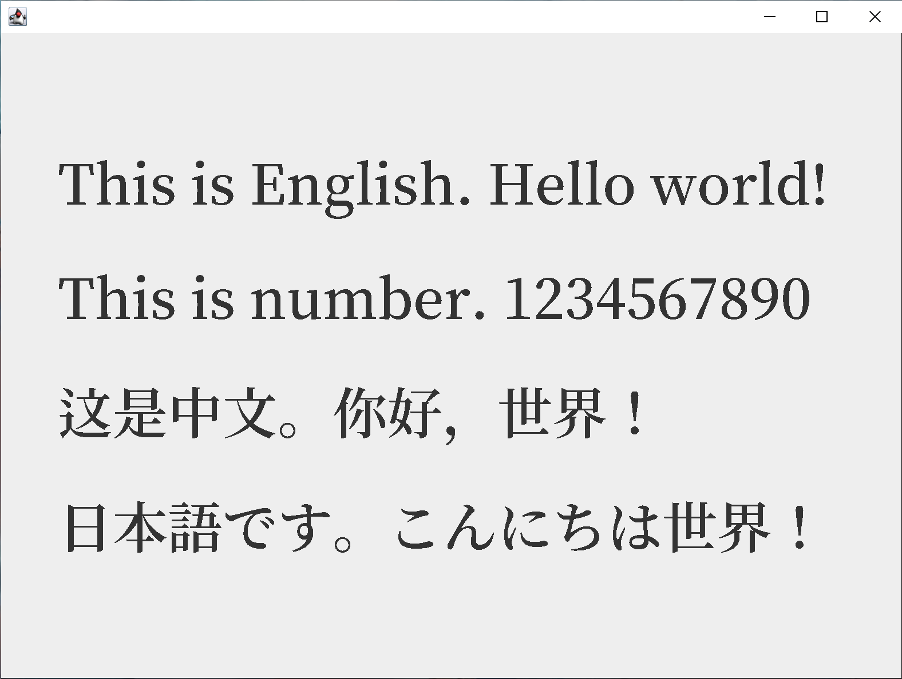
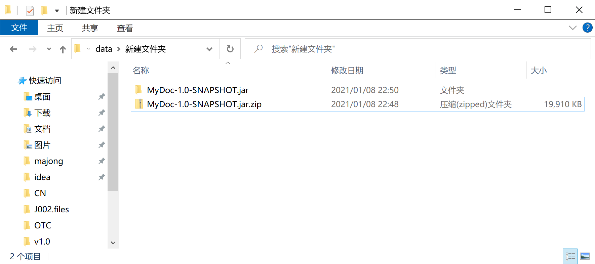
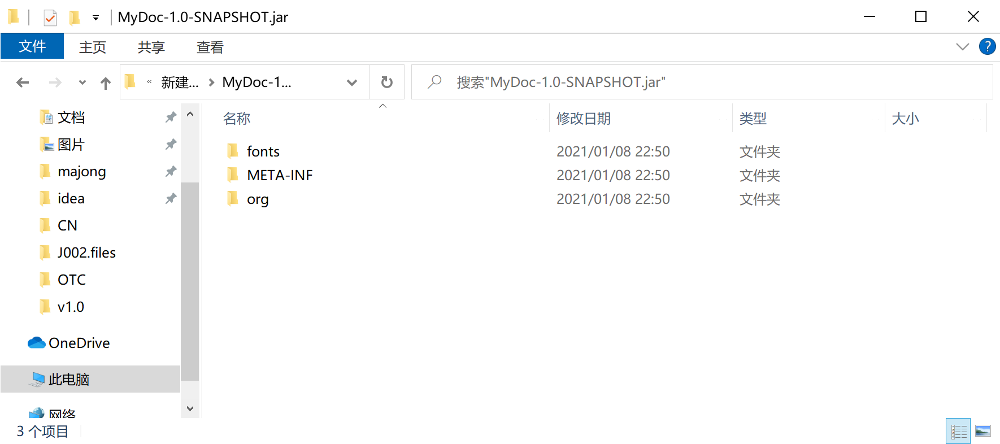
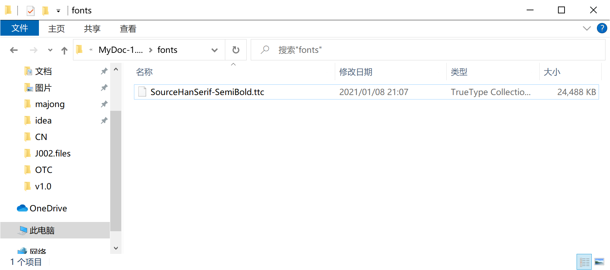

# 1.6.2 将字体文件嵌入程序内

更新日期: 2021/01/08

------------------------------------------

## 1.	概述

在GUI程序中，为了程序的美观我们经常会挑选一种合适的字体。但是如果程序要在其他机器上运行，而那台机器又没有安装这个字体就尴尬了。

这时，我们可以把字体文件嵌入程序内，在打包的时候字体文字会跟着进入最后的jar包里面。虽然jar包体积会变大，但是能保证程序在不同机器上的体验是一致的。

本小节主要包含如下内容：

- 准备字体文件
- 将字体文件复制到项目中
- 加载字体文件
- 在程序中使用字体
- 打包程序，观察结果中是否有字体文件
- 在其他机器上验证

## 2. 准备字体文件

Win10中已经预安装了很多字体，我们可以从系统的字体文件夹中挑选我们喜欢的字体。在Win10的`设置`中我们不难找到系统字体文件夹。

先打开字体设置。


随便选择一种字体。



常见的字体格式都是支持的。

但是，很遗憾这个目录我们看看就行。

<p style="color:red;"><b>因为随意使用字体是侵权的，尤其是在程序中嵌入字体。</b></p>

因此我们可以去寻找一些免费商用的字体，直接Google搜索`免费商用中文字体`，会发现可以选择的也有很多。要感谢有这么无私奉献的好兄弟。
但是在正式使用前，一定要看清楚授权协议，是否真的是可以免费用于字体嵌入式应用。有点字体是免费商用发布，但是并不能用于字体嵌入。

最经典的两款免费商用字体，是Google和Adobe联合开发的思源字体：

- 思源黑体
- 思源宋体

这两款字体的好处是涵盖了中日韩三种语言中的汉字。比如你的程序中要同时使用中文和日文，那么采用这种字体就可以使程序中不同语言的文本获得一致的观感。

我下载了思源宋体，发现它包含好几种格式，可以根据需要使用。我直接复制了字体安装说明上的介绍来进行说明。

| No. | 格式 | 名称 | 说明 |
|:---|:---|:---|:---|
| 1 | .ttc | Super OTC | 在单个字体文件中包含所有字体。 |
| 2 | .ttc | OTC | 按粗细分为 7 个文件，每个文件里包含所有语言的字形。 |
| 3 | .otf | OTF | 总共包含 28 种字体，分为 4 个特定于语言的子目录，每个子目录都包含 7 种粗细。对于非日语字体，文件名包含以语言标识（K、SC、TC）为后缀的系列名称。名称以 HW 为后缀的目录包含带有单字节字母和数字的字 |
| 4 | .otf | Subset OTF | 总共包含 28 种字体，分为 4 个子目录，即 JP（日本）、CN（中国）、KR（韩国）和 TW（台湾），每个子目录都包含 7 种粗细。文件名包含以国家 / 地区标识为后缀的系列名称。 |

由于我要同时显示中文和日文，为了使用上的便利，这里选择OTC格式。





这样我就准备好了字体文件，可以看到这个包含多国语言的字体文件有25M左右，还是挺大的。

## 3. 将字体文件复制到项目中

字体文件的使用，和普通的资源文件是相同的。比如图片、声音等资源文件。

以使用Maven构建的Java项目为例，可以放到存放资源文件的默认路径中`src/main/resource`。


## 4. 加载字体文件

分为三步。

第一步是加载文件。这和加载其他的资源文件是一样的。

!!! example "加载文件"
    ```java
    // 加载文件(假设我们的主类叫做App)
    InputStream inputStream = new App().getClass()
            .getClassLoader().getResourceAsStream("fonts/SourceHanSerif-SemiBold.ttc");
    ```

第二步是创建字体。

!!! example "创建字体"
    ```java
    // 创建字体
    Font font = Font.createFont(Font.TRUETYPE_FONT, inputStream);
    ```

这里要注意的是第一个参数，要根据你提供的字体文件的格式来选择正确的类型。

有两种类型

| No. | 类型 | 说明 |
|:--|:--|:--|
| 1 | TRUETYPE_FONT | TrueType字体。又叫做高保真字体，特点是显示清晰，漂亮美观。 |
| 2 | TYPE1_FONT | Type1字体。是一种在TrueType字体出现之前的字体，比较古老。显示效果不是太好。 |

基本上从外观就能区分出来了。Type1字体经常是满屏幕的狗牙，TrueType字体则清晰平滑。

第三步是注册字体到图形环境中。

!!! example "注册字体"
    ```java
    // 注册字体
    GraphicsEnvironment ge = GraphicsEnvironment.getLocalGraphicsEnvironment();
    ge.registerFont(font);
    ```

注册完成后，Java的图形环境系统就认为我们安装了这个字体，可以在程序中使用了。

## 5. 在程序中使用字体

在开始演示如何使用字体之前，我们先来做一点微小的准备工作。

就是先创建一个`JPanel`，也就是`面板`。然后我们将在这个`面板`上绘制文字。

!!! example "创建JPanel"
    ```java
    private static void displayWindow() {
        // 创建JFrame对象
        JFrame jFrame = new JFrame();

        // 设定大小、最大化、关闭动作等
        ... ...

        // 添加一个面板
        jFrame.add(new MyJPanel());

        // 显示窗口
        jFrame.setVisible(true);
    }

    // 自定义面板类
    public static class MyJPanel extends JPanel {
        // 绘制面板
        @Override
        protected void paintComponent(Graphics g) {
            super.paintComponent(g);
            // 绘制代码
            // TODO
        }
    }
    ```

然后我们就可以绘制文字了。

!!! example "绘制文字"
    ```java
    public static class MyJPanel extends JPanel {
        @Override
        protected void paintComponent(Graphics g) {
            super.paintComponent(g);
            // 绘制代码
            // 设定字体和文字大小
            g.setFont(font.deriveFont(48.0f));
            // 绘制文字
            int x = 50;
            int y = 150;
            g.drawString("This is English. Hello world!", x, y);
            y += 100;
            g.drawString("This is number. 1234567890", x, y);
            y += 100;
            g.drawString("这是中文。你好，世界！", x, y);
            y += 100;
            g.drawString("日本語です。こんにちは世界！", x, y);
        }
    }
    ```

我分别绘制了英文、数字、中文和日文。效果如下：



还是挺好看的。我们可以发现，中文和日文的`世界`是一模一样的，这就是我上面提到的一致性。

## 6. 打包程序，观察结果中是否有字体文件

关于如何打包，在别的文章中有专门的攻略，这里就不多做解释了。假设我们已经打好了jar包。

现在将jar包扩展名改为`.zip`并解压。会发现里面确实有我们的字体文件。





## 7. 在其他机器上验证

在其他没有安装这个字体的机器上运行这个jar包，会发现能够正确的用这个字体来显示文字。
