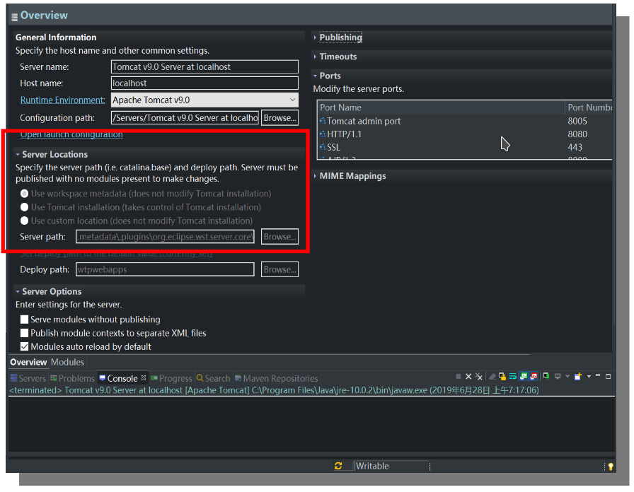

# 7.1 Tomcat

更新日期：2020-7-24

-------------------------------------

## 1. 项目发布目录

### 1.1 tomcat的默认发布目录

默认发布目录为TOMCAT根目录下的webapps文件夹。可以将Web工程的war包复制到这里，tomcat会自动将其解压。

### 1.2 Eclipse中的tomcat发布目录

在Eclipse调试web工程时，有时我们想确认发布出去的war包内容有没有问题。Eclipse设置了一个临时目录用来发布，而这个目录不是很方便我们查看，可以在如下位置进行配置:

有时这个位置是灰的不能改。此时可以先移除tomcat中发布的项目并右键tomcat执行Clean命令。
