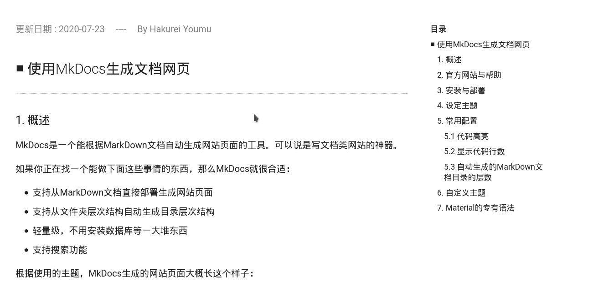

# 9.4 使用MkDocs生成文档网页

更新日期：2020-07-23

-----------------------------------------------------

## 1. 概述

MkDocs是一个能根据MarkDown文档自动生成网站页面的工具。可以说是写文档类网站的神器。

如果你正在找一个能做下面这些事情的东西，那么MkDocs就很合适：

- 支持从MarkDown文档直接部署生成网站页面
- 支持从文件夹层次结构自动生成目录层次结构
- 轻量级，不用安装数据库等一大堆东西
- 支持搜索功能

根据使用的主题，MkDocs生成的网站页面大概长这个样子：


可以看到，页面比较简洁。有基本的导航和搜索功能，并没有类似博客网站那种登录和评论之类的功能。

## 2. 官方网站与帮助

要查找如何安装使用MkDocs，或者想了解更为复杂的一些用法。最好的办法就是去MkDocs的官方网站，虽然有一个翻译过的中文官方网站，但是里面有些错误，并且版本也不是最新。建议去看原版的英文官方网站。

https://www.mkdocs.org/

同时不同的主题也有自己的官方网站，里面会介绍自己对MkDocs的一些扩展方案。

比如material主题的官方网站：
https://squidfunk.github.io/mkdocs-material/

## 3. 安装与部署

请完全安装英文官方网站手册下面的步骤进行安装和部署。只说一些需要注意的地方。

- 最好是按手册上说的使用pip进行安装，而不要使用系统自己的包管理器来安装
- 最后可以不build来生成html页面，如果你不需要的话

那么安装后的东西被放在哪里呢？

在Arch下，默认是放在Python的目录下面的。

```bash
/usr/lib/python3.8/site-packages
```

## 4. 设定主题

跟着官方手册一步一步来是最好的做法。

这里我选择了`material`这个主题。安装后也可以从上面提到的Python目录下面找到这个主题的所有文件。

## 5. 常用配置

在配置文件`mkdocs.yml`中，可以进行各种设定。包括主题、插件等。
下面的所有配置都是在这个文件中进行修改。并且我们使用Pymdownx这个版本的MarkDown。

### 5.1 代码高亮

这当然是必备的功能了。

```yaml
markdown_extensions:
    - pymdownx.highlight
```

### 5.2 显示代码行数

```yaml
markdown_extensions:
    - pymdownx.highlight:
        linenums: true
```

在MarkDown文件中，像通常那样书写代码块就行：

!!! example

    代码：
    
    ```
    > ```java
    > public static void main(String[] args) {
    >      
    >     System.out.println("Hellow world!");
    > }
    > ```
    ```

    效果如下：

    ```java
    public static void main(String[] args) {
        
        System.out.println("Hellow world!");
    }
    ```

### 5.3 自动生成的MarkDown文档目录的层数

```yaml
markdown_extensions:
    - toc:
        baselevel: 2
```

这里配置为两层。生成的目录如下图所示(右侧的目录)：（如果有5.1.1、5.1.2等章节则不会显示在目录中）



### 5.4 中文界面与中文搜索

```yaml
theme:
  language: 'zh'
```

### 5.5 绘制图形

需要先使用包管理器安装graphviz：

```bash
sudo pacman -S graphviz
```

然后去github上安装这个插件：

- sprin / markdown-inline-graphviz 

按照上面的说明进行操作即可。

!!! bug
    该项目文档中的插件名是错的，正确的写法是：
    ```yaml
    markdown_extensions:
        - markdown_inline_graphviz:
    ```

用法，就参考文档上的例子，这里就直接搬运过来：

!!! example "例子"
    
    代码：
    ```dot
    
    ```

    效果：



## 6. Material的专有语法

感觉比较好用的是各种提醒框。语法都是类似的。其实下面的`example`就已经在使用这种提醒框了。

以note为例：

!!! example

    代码：

    ```markdown
    !!! note "note的标题"
        这个一个note。
    ```

    效果如下：

    !!! note "note的标题"
        这个一个note。

并且提醒框是可以折叠的：

!!! example

    代码：

    ```markdown
    ??? note "折叠note的标题"
        这个一个note。
    ```

    效果如下：

    ??? note "折叠note的标题"
        这个一个note。
    
所有的提醒框有：

- note, seealso
- abstract, summary, tldr
- info, todo
- tip, hint, important
- success, check, done
- question, help, faq
- warning, caution, attention
- failure, fail, missing
- danger, error
- bug
- example
- quote, cite

看下所有这些效果吧，是不是感觉还挺好看的：

!!! seealso
    这是一个提醒框。

!!! summary
    这是一个提醒框。

!!! todo
    这是一个提醒框。

!!! tip
    这是一个提醒框。
    
!!! success
    这是一个提醒框。
    
!!! question
    这是一个提醒框。
    
!!! warning
    这是一个提醒框。
    
!!! failure
    这是一个提醒框。
    
!!! danger
    这是一个提醒框。
    
!!! bug
    这是一个提醒框。
    
!!! quote
    这是一个提醒框。
