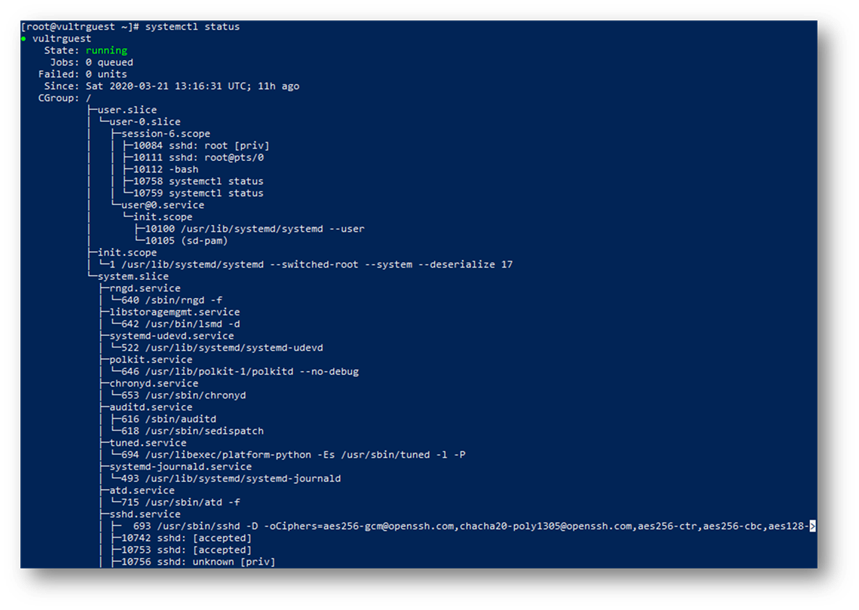
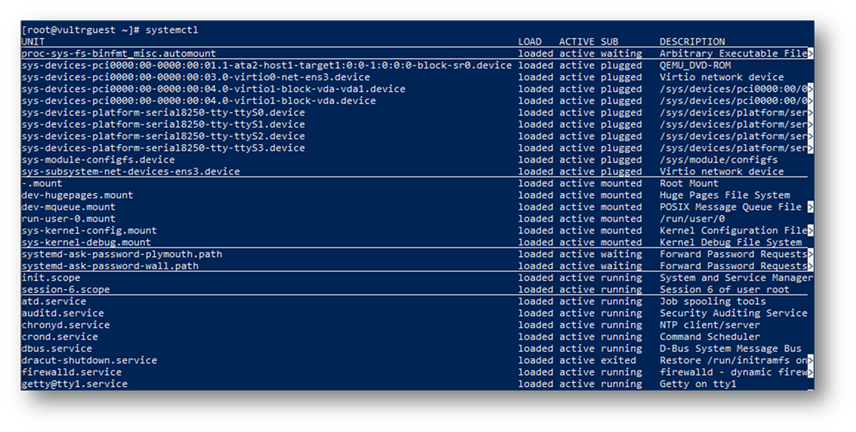

# 13.5 服务管理

更新日期：2020-7-24

----------------------------------

## 1. 概要

跟服务有关的内容比较多，在这里我主要关注如下两个话题：

- 列举当前系统中的服务
- 如何注册一个服务

服务主要由systemd系列命令来控制，而systemd负责的东西非常多。还有些诸如挂载点、sockets、设备、交换分区、文件路径、计时器之类的单元。这里我们只关注使用systemd管理服务。

## 2. 列举服务

首先是systemctl status命令，它将以树形图的方式列出服务的结构图信息。

执行示例:



然后还可以使用systemctl命令来用列表的形式列出所有运行中的服务的详细信息。

执行示例:



## 3. 注册一个服务

由systemd管理的服务都以文件的形式保存在固定的位置。使用如下的命令可以打印出所有这些位置。

```bash
systemctl show --property=UnitPath
```

通常我们只需要关心其结果中的两个位置:

```bash
/etc/systemd/system     # 管理员安装服务的位置，我们自己的服务通常放在这里
/usr/lib/systemd/system # 各种软件包安装服务的位置
```

我们可以仿照这些目录下的文件来编写我们自己的文件。

### 3.1 编写service文件

服务都以.service扩展名的形式保存在文件中。我们自己的服务文件通常保存在上面提到的/etc/systemd/system这个位置。

文件的写法以Tomcat服务为例:

```ini
[Unit]
Description=Apache Tomcat 9						
After=network.target
　
[Service]
User=tomcat　
Group=tomcat　
Type=oneshot　
PIDFile=/opt/apache-tomcat-9.0.26/tomcat.pid
RemainAfterExit=yes
　
ExecStart=/opt/apache-tomcat-9.0.26/bin/startup.sh
ExecStop=/opt/apache-tomcat-9.0.26/bin/shutdown.sh
ExecReStart=/opt/apache-tomcat-9.0.26/bin/shutdown.sh;/opt/apache-tomcat-9.0.26/bin/startup.sh 	
　
[Install]
WantedBy=multi-user.target
```

其中大部分项目看名字就知道意思。下面说明一些其中几个不太容易理解的项目。

!!! example "After"
    等待指定的单元运行后再启动。只是单纯的指定Requires=或者Wants=会使两个单元并行启动。

!!! example "Type=oneshot 或者 PIDFile=/path/*.pid 或者 RemainAfterExit=yes"
    这三个项目通常会组合起来使用。Oneshot表示这个服务的启动进程启动一次后就退出。RemainAfterExit设为yes则使systemd在服务进程退出后仍然认为服务处于运行状态。指定PIDFile可以使systemd能够跟踪服务的主进程，因为这个只启动一次的进程又创建了子进程作为服务的主进程。

除了oneshot种类的服务，还有很多其他种类的服务，我们可以按需选择。

```bash
simple      # 该服务会立即启动，并常驻。启动成功则服务就处于运行状态。 	　 	　 	　 	　 	　　
forking     # 该服务会启动一个子进程作为主进程，然后父进程也就是启动进程会退出。通常需要同时指定PIDFIle。	　
oneshot     # 只执行一次后立即退出。也可以与RemainAfterExit、PIDFile等组合起来使用。 	　 	　 	　 	　　
notify      # 基本与simple相同，只是服务启动成功的标志不是服务进程成功启动，而是需要服务进程的程序向systemd主动发送信号来表明服用就绪了。　
dbus        # 与系统总线有关。暂时不是很懂。 	　 	　 	　 	　 	　 	　 	　 	　　
idle        # 基本与simple相同，只是优先级比较低。当systemd处理完所有任务后才会来启动这类服务。
```

### 3.2 设置服务为开机启动

以上面创建的tomcat服务为例，使用如下命令即可:

```bash
systemctl enable tomcat.service
```

## 4. 删除服务

停止服务并删除对应的service文件即可。
