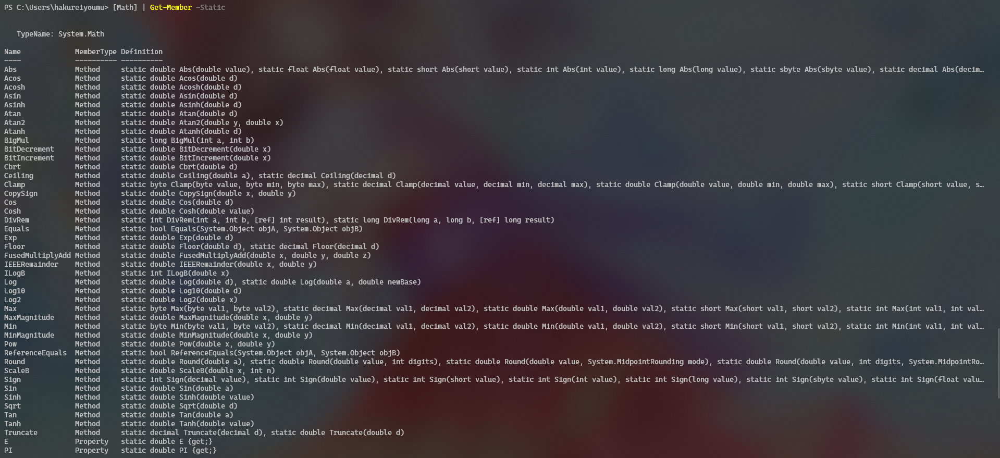

# 14.4 将PowerShell作为计算器使用

更新日期：2020/6/7

--------------------------------------

## 1. 概述

在使用电脑工作的时候，某些情况下我们可能会想要进行一些简单的数学运算。

例如：

```powershell
(1 + 146) * 22222 / 6
```

使用Win10自带的计算器程序可以满足绝大部分需求。但是对于程序员来说就不是很顺手了，类似于程序代码那样的计算工具会非常符合程序员的使用习惯。

正好，Win10自带的PowerShell就具备计算器的功能。它可以作为自带计算器程序的补充。

## 2. 四则运算

加减乘除是我们用的最多的。

```powershell
+
-
*
/
```
还可以取余数，例如3除以4取余数：

```powershell
3%4
```

## 3. 括号与优先级

同样举上面那个例子：
```powershell
(1 + 146) * 22222 / 6
```

括号可以随意嵌套。

## 4. 乘方

PowerShell并没有自带这个计算功能，但是可以借助于.NET平台的数学库来实现。

例如计算2的31次方。

```powershell
[Math]::Pow(2, 31)
```

## 5. 其它数学计算

.NET平台的数学库中包含了很多种运算。有需要时，我们可以通过查看[Math]的静态函数来了解它里面有没有我们想要的运算。

完整的函数列表如下：



## 6. 十六进制与容量单位

在PowerShell中可以直接使用16进制数，并用来进行各种运算。

例如：

```powershell
0xFF00FF
```

对于程序员来说，另一个很方便的功能是PowerShell内置了容量单位。

比如可以直接使用`1MB`这样的数值来参与运算。

支持的单位如下：


