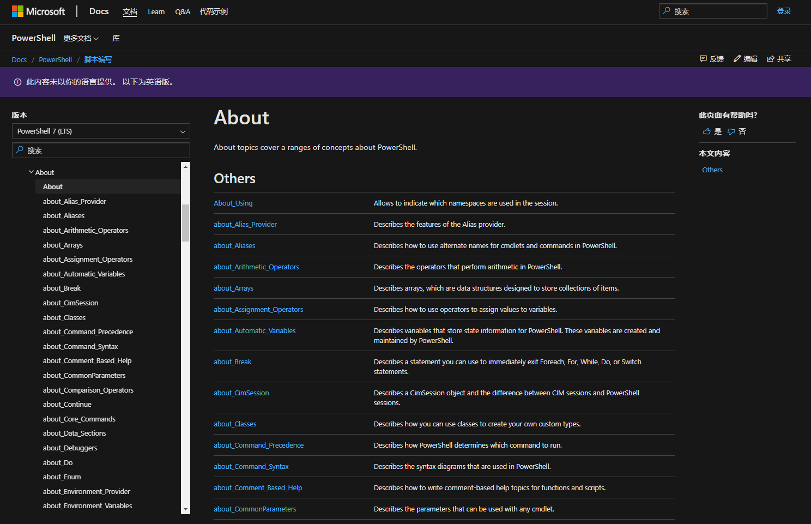

# 14.5 操作符与条件表达式

更新日期: 2020/06/17

------------------------------------------

## 1. 概述

每一种语言都有自己的运算符，而且通常都不太一样。按记忆力来使用往往容易混淆。所以本章我列了一些表格，以便在需要的时候快速查阅。

如果需要更为详尽的说明，可以去查询微软的官方文档。

https://docs.microsoft.com/zh-cn/powershell/module/microsoft.powershell.core/about/?view=powershell-7

上面的链接页面为`About`页面，里面有PowerShell各种基础系统的说明，其中就包括了运算符。虽然是全英文的没有翻译，但对于软件攻城狮来说肯定不是问题了。

## 2. 算术运算符

| 符号 | 说明 | 例子 |
|:-- |:-- |:--|
| + | 加法| 1 + 1 |
| - | 减法| 2 - 1 |
| * | 乘法| 3 * $x |
| / | 除法| file.size / 1MB |
| % | 余数| 4 % 3 (结果为1)|

## 3. 比较运算符

比较运算符通常会用来组建条件表达式。在`if`这类语句中用的上。

### 3.1. 值比较

符号 | 说明
:--- | :---
-eq | 等于 ==
-ne | 不等于 !=
-gt | 大于 >
-ge | 大于等于 >=
-lt | 小于 <
-le | 小于等于 <=

### 3.2. 字符串匹配

| 符号 | 说明 |
|:-- |:-- |
| -like | 匹配通配符|
| -notlike | 不匹配通配符|
| -match | 匹配正则表达式|
| -notmatch | 不匹配正则表达式|

### 3.3. 包含

| 符号 | 说明 | 例子
|:-- |:-- |:--
| -contains | 包含| "abc", "def" -contains "def" (注意：必须是完全包含)
| -notcontains | 不包含|同上
| -in | 在集合中存在|"def" -in "abc", "def"
| -notin | 在集合中不存在|同上

### 3.4. 类型比较

| 符号 | 说明 | 例子
|:-- |:-- |:--
| -is | 是XX类型| 1 -is [int]
| -isnot | 不是XX类型|同上

## 4. 逻辑运算符

| 符号 | 说明 |
|:-- |:-- |
| -and | 逻辑与|
| -or | 逻辑或|
| -xor | 逻辑异或|
| -not | 逻辑非|
| ! | 逻辑非(同-not)|

## 5. 二进制运算符

注意：只能在`integer`类型上使用按位运算符。

| 符号 | 说明 |
|:-- |:-- |
| -band | 按位与|
| -bnot | 按位非|
| -bor | 按位或|
| -bxor | 按位异或|
| -shl | 左移|
| -shr | 右移|