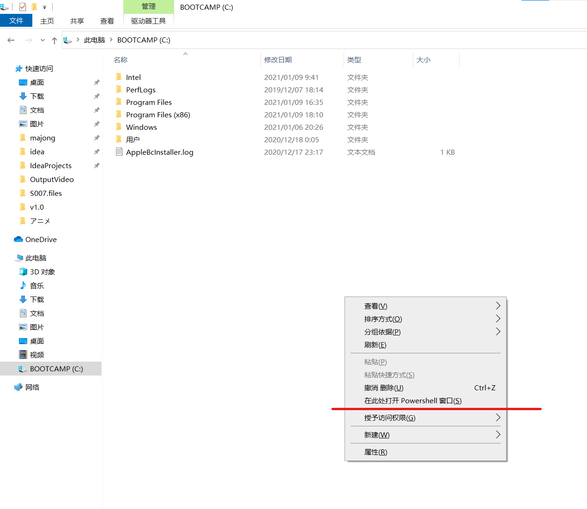
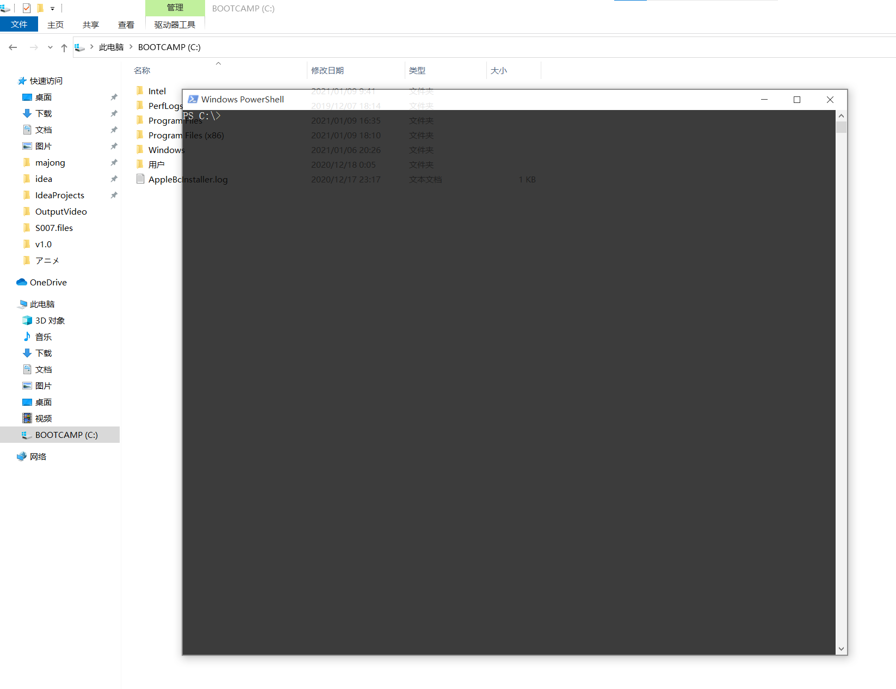
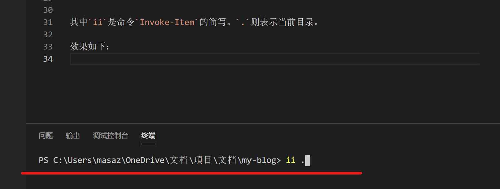
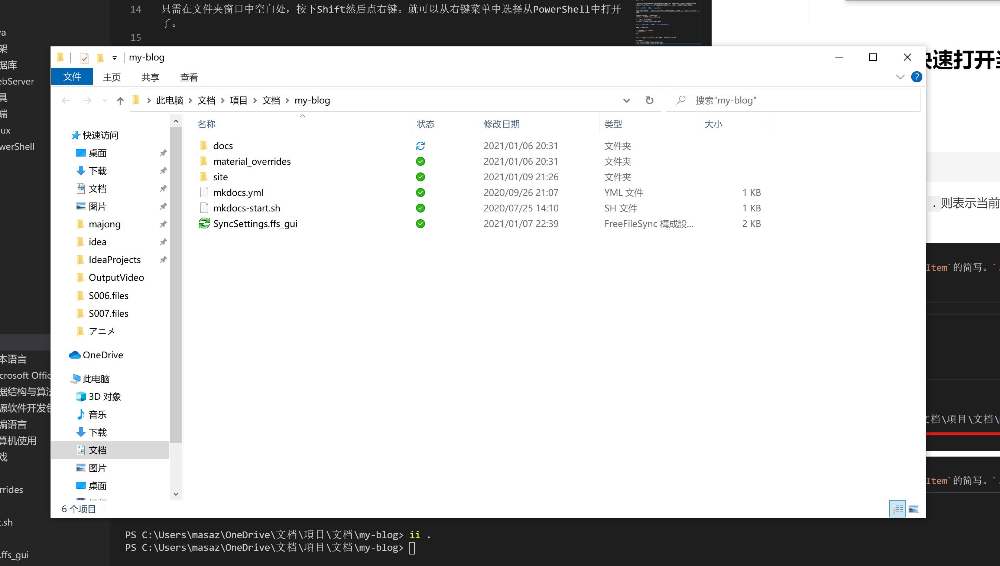

# 14.6 Win10下的当前目录与PowerShell

更新日期: 2021/01/09

------------------------------------------

## 1. 概述

在Win10中，可以快速从当前文件资源管理器窗口中打开PowerShell，并自动切换到此目录。
同样，在PowerShell中，也可以快速的敲命令来用当前路径打开文件资源管理器窗口。

## 2. 从文件夹中快速打开PowerShell

只需在文件夹窗口中空白处，按下Shift然后点右键。就可以从右键菜单中选择从PowerShell中打开了。

按下Shift键时的鼠标右键菜单：


打开了PowerShell窗口：


## 3. 在PowerShell中快速打开当前路径的文件夹

只需使用如下命令:

!!! example "打开文件夹"
    ```powershell
    ii .
    ```

其中`ii`是命令`Invoke-Item`的简写。`.`则表示当前目录。

效果如下：

