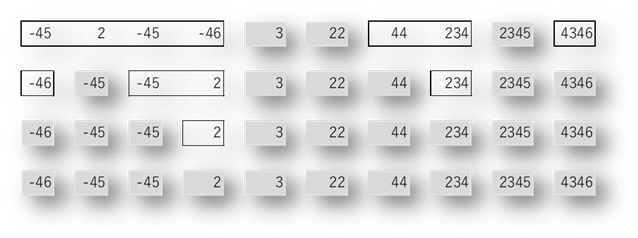
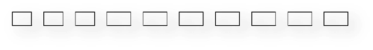
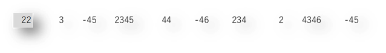
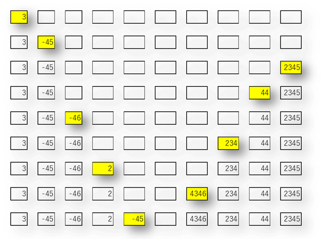
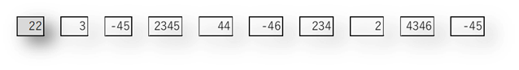
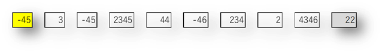
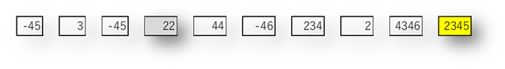
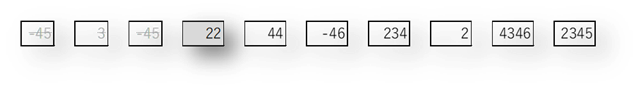
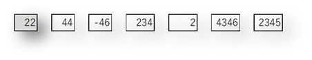
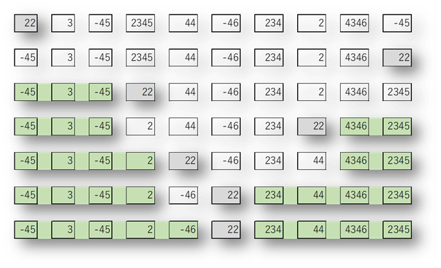

# 17.1 快速排序

更新日期: 2020/5/17

----------------------------------------------

## 1.	简介

从名字就可以看出来，排序算法很快，是比较排序中最快的算法。

## 2.	原理

快速排序的原理是，选取一个关键值，然后使用这个关键值，分治出左右两个数组。使左数组中的元素都比它小，右数组中的元素都比它大。
然后对左右两个数组执行同样的操作，一直递归下去，直到小数组只剩一个元素没法再分治。

例如对于数组：


选取第一个元素22为关键值进行分治。分治之后为:


然后不断重复这个过程



这样排序就完成了。那么最关键的分治如何实现呢？

先来一种简单的分治算法。

首先，先创建一个与待排序数组大小相等的临时数组。



然后就从左到右遍历原数组，与关键值比较，凡是小于等于关键值的就从左边依次放入临时数组。大于关键值的就依次从右边放入临时数组。

同样以下面的数组为例：



22为关键值，从3开始遍历到结尾的-45。放入元素的过程如下:



最后将关键值放入中间的空位:


这样一次分治过程就完成了，看起来还不错。

但是这个分治法有一个缺点，就是要用临时数组来存放中间结果。每次分治都要一个临时数组，最后还要复制回原来的数组里面。

所以典型的分治算法是采用原地分治，也即是不使用额外的临时数组空间。只在数组内部倒数据。

这个分治法可称之为反复横切分治法。具体过程如下：



首先关键值22位于最左侧，第一步就是从最右端开始找第一个小于22的数字。我们找到了-45，交换它与关键值的位置。那么第一次分治的结果就是：



这个例子举得不好，第一次分治看起来没什么乱用。

现在我们再从左找第一个大于22的元素，我们找到了2345，那么交换2345和关键值的位置，第二次分治的结果是：



此时，由于2345是第一个大于22的元素，那么它之前的三个元素，也就是-45, 3, -45一定小于或等于22，也就是说这三个元素以及分治完了。那么它们下次就不用管了。



现在数组变成了：



此时又跟一开始数组的状态一样了，都是关键值在开头第一个位置。那么我们只要重复刚才的过程就可以完成分治。

完整的分治过程如下：



至此，快速排序的所有细节我们都逐一实现了。

## 3.	代码示范(Java)

```java
public class QuickSort {                                                                    
                                                                    
    // 快速排序                                                                 
    public static void quickSort(int[] numArray) {                         
                                                                    
        _quickSort(numArray, 0, numArray.length - 1);                 
    }                                                                   
                                                                    
    // 对指定起始位置和结束位置的数据进行快速排序                                         
    private static void _quickSort(int[] numArray, int startIndex, int endIndex) {        
                                                                    
        // 如果起始位置和结束位置重回了，则这个数组只有一个元素，不需要排序             
        if (startIndex >= endIndex) {                                                                   
            return;                                                                 
        }                                                                   
                                                                    
        // 执行一次分治，返回值keyIndex用于界定分治后的左右数组         
        int keyIndex = _onceQuickSort(numArray, startIndex, endIndex);         
                                                                    
        // 对左数组进行排序                                                                 
        _quickSort(numArray, startIndex, keyIndex - 1);          
                                                                    
        // 对右数组进行排序                                                                 
        _quickSort(numArray, keyIndex + 1, endIndex);               
    }                                                                   
                                                                    
    // 执行一次分治，返回值用于界定分治后的左右数组                
    private static int _onceQuickSort(                                                                  
        int[] numArray, int startIndex, int endIndex) {           
                                                                            
        // 选择第一个位置的元素作为关键值                                                                  
        int key = numArray[startIndex];                                                                 
                                                                    
        // 反复横切直到切无可切                                                                   
        while (startIndex < endIndex) {                                                                 
                                                                    
            // 从右端寻找第一个小于key的元素                                                                 
            while (startIndex < endIndex) {      
                int endNum = numArray[endIndex];       
                if (endNum < key) {                                                                 
                                                                        
                    // 如果找到了就交换此值和key的位置，并退出循环结束右端查找        
                    numArray[endIndex] = numArray[startIndex];          
                    numArray[startIndex] = endNum;         
                    break;                                                                  
                } else {                                                                    
                    endIndex--;                                                                 
                }                                                                   
            }                                                                   
                                                                    
            // 从左端寻找第一个大于key的元素                                                                 
            while (startIndex < endIndex) {                  
                int startNum = numArray[startIndex];           
                if (startNum > key) {                                                                   
                                                                        
                    // 如果找到了就交换此值和key的位置，并退出循环结束左端查找          
                    numArray[startIndex] = numArray[endIndex];      
                    numArray[endIndex] = startNum;             
                    break;                                                                  
                } else {                                                                    
                    startIndex++;                                                                   
                }                                                                   
            }                                                                   
        }                                                                   
                                                                    
        return startIndex;                                                                  
    }                                                                   
}                                                                   
```