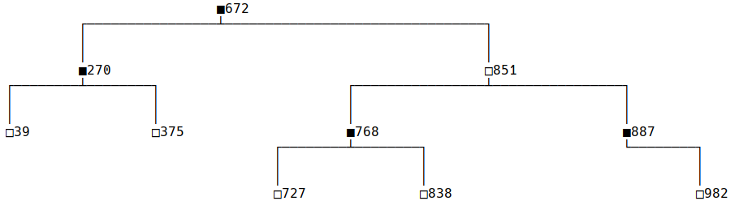
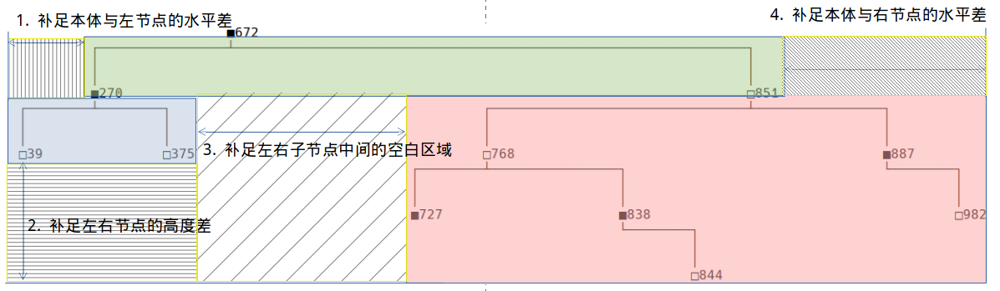
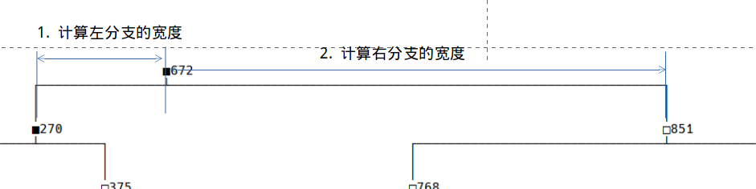

# 17.7 红黑树（3）绘制红黑树

更新日期：2020/09/19

-----------------------------------------------------

## 1. 概述

红黑树的结构和算法十分复杂。光靠纸上谈兵或者是脑子里过招是很难把所有过程都理清楚的。

插入和删除的过程要分成很多种情形来考虑。而且可能要经过多个步骤，并进行多次调整。如果能把这里面的步骤直观的输出出来，势必对我们大有帮助。

并且，由于红黑树是递归结构，靠debug查看变量值的办法来查看红黑树也不太行。这里我就实现一个用文本方式输出红黑树的程序。效果如下：

`■表示黑色节点，□表示红色节点`



如果是层次比较多的大图，可能会由于字体和行距等问题，图会显得不太整齐。在控制台的输出窗口中使用等宽字体可以显示的非常整齐。


## 2. 绘制方法

绘制的办法说起来也是很简单，就是写起来有点麻烦。

主要的过程用几张图来说明一下：

### 2.1 递归绘制本体和左右分支



上面这些补足的空白区域的大小仔细推敲一下就能想明白该怎么计算。无非就是从各段中查找节点交叉位置的符号。
还有些左右节点不存在的情况，也不难推敲。

### 2.2 绘制本体



本体只有4行，所有的线采用挂线符号来绘制。

`┌ ─ ┴ ─ ┐ │ ┘ └`

唯一的难点就是计算左右分支的宽度，并以此计算各种符号的位置。

在这图里，左右分支之所以要有一定的宽度，是为了能够显示下子分支，显然子分支的层数越多，就需要更大的宽度来显示。

比如，有1层子分支，宽度为10，两层为20，三层为40...

我这里采用的是：宽度 = 2 ^  (子分支深度 + 2)。[子分支深度=0时，宽度为0]
 
具体多少合适，可以自己慢慢调。

## 3. 代码示例

代码里为二叉树的实现与绘制，为了简单期间，节点的值为整数。红黑树可以自己改节点的字符串表示方法。

使用方法为：

```java
// 创建二叉树
BinaryTree bt = new BinaryTree();
// 随机插入20个数字
int max = 1000;
for (int i = 0; i < 20; i++) {
    int value = (int)(Math.random() * max);
    bt.add(value);
}
// 绘制二叉树
bt.print();
```

!!! example "BinaryTree.java"
    ```java
    package org.example.redblack;

    import java.util.ArrayList;
    import java.util.Collections;
    import java.util.List;

    // 二叉树
    public class BinaryTree {

        // 根节点
        protected Node root;

        // 添加元素
        public void add(int e) {

            System.out.println("bt.add(" + e + ");");

            // 没有根节点
            if (root == null) {
                root = createNewNode(e);
                return;
            } else {
                _add(root, e);
            }
        }

        // 创建新节点
        protected Node createNewNode(int e) {
            return new Node(e);
        }

        // 寻找最大节点
        protected Node findMax(Node n) {
            if (n == null) return null;
            if (n.right == null) return n;
            return findMax(n.right);
        }

        // 添加元素
        private void _add(Node n, int e) {

            if (e == n.value) {
                System.out.println("元素已经存在，忽略本次插入");
                return;
            } else if (e < n.value) {
                // 添加到左子树中
                if (n.left == null) {
                    n.left = createNewNode(e);
                    n.left.parent = n;
                } else {
                    _add(n.left, e);
                }
            } else {
                // 添加到右子树中
                if (n.right == null) {
                    n.right = createNewNode(e);
                    n.right.parent = n;
                } else {
                    _add(n.right, e);
                }
            }
        }

        // 查找指定值的节点
        protected Node searchNode(int e) {
            return _searchNode(root, e);
        }
        private Node _searchNode(Node n, int e) {
            // 元素不存在
            if (n == null) return null;

            // 递归查找
            if (e == n.value) return n;
            else if (e < n.value) return _searchNode(n.left, e);
            else return _searchNode(n.right, e);
        }

        // 取得兄弟节点
        protected Node getBrother(Node n) {
            if (n == n.parent.left) return n.parent.right;
            return n.parent.left;
        }

        //***************************二叉树的绘制*****************************
        private static final String LINE_CROSS = "┴";
        private static final String LINE_CROSS_LEFT = "┘";
        private static final String LINE_CROSS_RIGHT = "└";
        private static final String LINE_H = "─";
        private static final String LINE_V = "│";
        private static final String LINE_TURN_LEFT = "┌";
        private static final String LINE_TURN_RIGHT = "┐";
        // 绘制二叉树
        public void print() {
            List<String> drawStrs = getDrawStrings();

            for (String drawStr : drawStrs) {
                System.out.println(drawStr);
            }
        }

        // 取得二叉树绘制字符串
        public List<String> getDrawStrings() {
            List<String> rsts = new ArrayList<>();
            if (root == null) {
                rsts.add("■■空树■■");
                return rsts;
            }

            // 绘制以根节点为首的树
            List<String> treeStrs = _getDrawStrings(root);
            // 绘制根节点的值
            int crossLocation = findCrossLocation(treeStrs);
            String rootV = copyStringByCnt(" ", crossLocation) + root.toString();
            rsts.add(rootV);
            rsts.addAll(treeStrs);
            // 将结果集的所有行都补充到同一长度
            putInSpace(rsts);

            return rsts;
        }
        private List<String> _getDrawStrings(Node n) {

            List<String> rsts = new ArrayList<>();

            if (n == null) return rsts;
            if (n.left == null && n.right == null) return rsts;

            // *************绘制出各个部分*********
            // 本体
            List<String> nodeItself = drawNodeItself(n);
            // 左分支
            List<String> leftNode = _getDrawStrings(n.left);
            // 右分支
            List<String> rightNode = _getDrawStrings(n.right);

            // 拼接各个部分
            // 给本体补充左边分支的部分，以使本体的左节点与左分支的交叉点对齐
            if (leftNode.size() > 0) {
                int crossLocation = findCrossLocation(leftNode);
                insertBlankToLeft(nodeItself, crossLocation);
            }
            // 如果左右分支都有内容，则填充为同一大小
            if (leftNode.size() > 0 && rightNode.size() > 0) {
                int maxSize = Math.max(leftNode.size(), rightNode.size());
                insertBlankToDown(leftNode, maxSize - leftNode.size());
                insertBlankToDown(rightNode, maxSize - rightNode.size());
            }
            // 如果有右分支，则给右分支左边添加空白，以使本体的右节点与右分支的交叉点对齐
            if (rightNode.size() > 0) {
                int rl = findRightCrossLocation(nodeItself);
                int lw = (leftNode.size() > 0) ? leftNode.get(0).length() : 0;
                int rCrossLocation = findCrossLocation(rightNode);
                int blankW = rl - lw - rCrossLocation;
                insertBlankToLeft(rightNode, blankW);
            }
            // 将左右分支拼接在一起
            List<String> nodeStrs = combineNodeStrs(leftNode, rightNode);
            // 将所有行添加到结果中
            rsts.addAll(nodeItself);
            rsts.addAll(nodeStrs);
            // 将结果集的所有行都补充到同一长度
            putInSpace(rsts);

            return rsts;
        }

        // 将左右分支拼接在一起
        private List<String> combineNodeStrs(List<String> leftNode, List<String> rightNode) {

            if (leftNode.size() == 0) return rightNode;
            if (rightNode.size() == 0) return  leftNode;

            List<String> rsts = new ArrayList<>();
            for (int i = 0; i < leftNode.size(); i++) {
                rsts.add(leftNode.get(i) + rightNode.get(i));
            }

            return rsts;
        }

        // 查找右交叉点的位置
        private int findRightCrossLocation(List<String> strs) {
            return strs.get(0).indexOf(LINE_TURN_RIGHT);
        }

        // 在下面插入空白行
        private void insertBlankToDown(List<String> strs, int h) {
            int w = strs.get(0).length();
            String blank = copyStringByCnt(" ", w);
            for (int i = 0; i < h; i++) {
                strs.add(blank);
            }
        }

        // 在左边插入空白
        private void insertBlankToLeft(List<String> strs, int w) {
            String blank = copyStringByCnt(" ", w);
            for (int i = 0; i < strs.size(); i++) {
                String line = blank + strs.get(i);
                strs.set(i, line);
            }
        }

        // 查找交叉点的位置
        private int findCrossLocation(List<String> nodeStrs) {

            if (nodeStrs.isEmpty()) return 0;

            String firstLine = nodeStrs.get(0);
            return Math.max(
                    firstLine.indexOf(LINE_CROSS),
                    Math.max(
                            firstLine.indexOf(LINE_CROSS_LEFT),
                            firstLine.indexOf(LINE_CROSS_RIGHT)));
        }

        // 绘制节点本体
        private List<String> drawNodeItself(Node n) {

            List<String> rsts = new ArrayList<>();

            // 计算左右节点的树枝长度
            int lw = calcBrunchLen(n.left);
            int rw = calcBrunchLen(n.right);

            // 横线行
            {
                String line = "";
                // 左分支
                if (lw > 0) {
                    line += LINE_TURN_LEFT + copyStringByCnt(LINE_H, lw);
                }
                // 交叉点
                String cross = LINE_CROSS;
                if (lw == 0) cross = LINE_CROSS_RIGHT;
                if (rw == 0) cross = LINE_CROSS_LEFT;
                line += cross;
                // 右分支
                if (rw > 0) {
                    line += copyStringByCnt(LINE_H, rw) + LINE_TURN_RIGHT;
                }
                rsts.add(line);
            }
            // 两个竖线行
            {
                String line = "";
                if (lw > 0) line += LINE_V;
                line +=  copyStringByCnt(" ", lw + rw + 1);
                if (rw > 0) line += LINE_V;
                rsts.add(line);
                rsts.add(line);
            }
            // 值行
            {
                String line = "";
                // 左值
                if (lw > 0) {
                    line += n.left.toString();
                }
                // 空白
                if (rw > 0) {
                    int ww = 0;
                    if (lw > 0) ww += lw + 1;
                    ww += rw + 1;

                    line += copyStringByCnt(" ", ww - line.length());
                }
                // 右值
                if (rw > 0) {
                    line += n.right.toString();
                }
                rsts.add(line);
            }

            // 补充空格直至所有行的长度一致
            putInSpace(rsts);

            return rsts;
        }

        // 补充空格直至所有行的长度一致
        private void putInSpace(List<String> strs) {

            // 求得最大长度
            int max = 0;
            for (String str : strs) {
                if (str.length() > max) {
                    max = str.length();
                }
            }

            // 将所有行补充到最大长度
            for (int i = 0; i < strs.size(); i++) {
                String str = strs.get(i);
                str += copyStringByCnt(" ", max - str.length());
                strs.set(i, str);
            }
        }

        // 重复一个字符串指定次数
        private String copyStringByCnt(String str, int cnt) {
            return String.join("", Collections.nCopies(cnt, str));
        }

        // 计算节点的树枝长度
        private int calcBrunchLen(Node n) {
            // 计算节点深度
            int dep = getNodeDepth(n);

            if (dep == 0) return 0;

            // 根据深度映射出树枝长度
            return (int)Math.pow(2, (dep + 2) * 1);
        }

        // 计算节点深度
        private int getNodeDepth(Node n) {
            if (n == null) return 0;

            int leftDep = getNodeDepth(n.left);
            int rightDep = getNodeDepth(n.right);

            return Math.max(leftDep, rightDep) + 1;
        }
        //***************************二叉树的绘制*****************************

        // 节点定义
        protected class Node {

            // 节点的值
            protected int value;
            // 父节点
            protected Node parent;
            // 左右子树
            protected Node left, right;

            public Node(int e) {
                value = e;
            }

            // 绘制节点
            public String toString() {
                return String.valueOf(value);
            }
        }
    }
    ```
