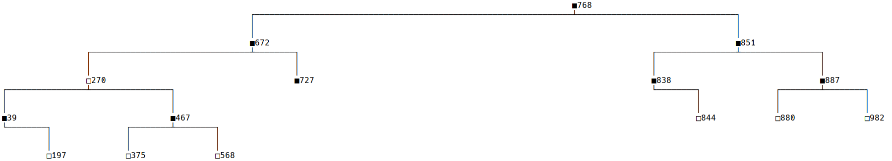

# 17.8 红黑树（4）插入

更新日期：2020/09/21

-----------------------------------------------------

## 1. 概述

红黑树的插入和删除操作是比较繁杂的，是红黑树的难点所在。这篇文章主要是描述一下解决这类问题的基本思路，试图把这团浆糊解释明白。

## 2. 基本思路

### 2.1 着手点

由于我们不知道如何处理这个问题，所以可以随意找一颗普通点的红黑树，来实际的做一些插入操作来看一看结果如何。

还是之前那棵普通的红黑树。

第一个问题就是往哪个地方插入，这个问题前面已经讨论过了。
    
    对于一个指定值的新节点，按照普通二叉树的规则就可以找到一个确定的位置。
    
很明显得先有空位才行吧，有空位的地方就是那些没有子节点的（叶子节点）和只有一个子节点的。上图中的树里这样的位置有很多，这里自然而然的就可以分为几种不同的情形来看。

我们前面说过，红黑树的插入就是先插入节点，然后再调整红黑树使其重新平衡。现在就可以来实践一下。

比如情形1:插入到图中最左边的黑色节点39

    由于这个节点已经有一个右

这里我先说明一下程序中解决这种`情形比较多的问题`的时候的通常的思路。

根据不同情形的解决难度，可以将问题划分为：

- 简单情形
- 较简单的情形
- 较复杂的情形
- 复杂情形

简单情形就是说我们只需一个简单的操作就能把这个问题解决，基本不需要动脑子。
复杂情形就是说我们得经过N多个步骤才能解决这个问题，需要耗费大量脑细胞。
较简单和较复杂就是中间的情形。

解决这种问题的关键就是：

!!! note 解决思路
    对于复杂的情形，可以执行一个简单的步骤，让它变成较复杂的情形。同理对较复杂的情形，可以执行一个简单的步骤，让它变成较复杂的情形。

也就是说，我们每次只做简单的一小步，把变简单的问题交给下面的人来处理。用图形来描述就是：

// TODO

这样的话，对于一个具体的问题，就有两件事情要做。

- 划分情形
- 思考每种情形怎么做简单的调整

## 2. 插入过程

按照上面的思路。我们来看一看插入过程。

## 3. 插入过程整理

## 4. 总结

## 5. 代码示例

