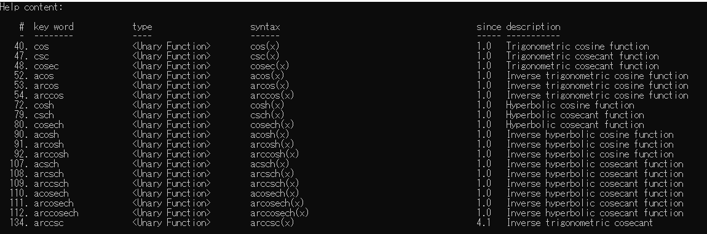

# 21.2 使用mXparser进行代数运算

更新日期：2020/4/2

-----------------------------------------------------

## 1.	概要	
    
mXparser是一个能让我们进行代数计算的库。虽然我们通常编写程序的时候几乎没有可能用到，但感觉还是挺有趣的。	
    
例如，我们可以给出未知数的值，来求解表达式的值:	
    
    设未知数x，y。
    x = 12
    y = 80
    则(x + y) * 10 -100 = 820
    
这个库还支持高等数学符号以及函数定义等更为复杂的用法。这里我们来列一下mXparser支持的各种特性:	
    
No.	| 特性	|			例子
--- | --- | ---
1 |	简单的表达式求值	|			(2 + 4) * 10
2 |	逻辑运算			|	(1=20)　|　(3 > 10)，逻辑运算的结果为1或者0
3	| 使用内置函数		|		sin(2) + if(2<3, 1, 0) - min(10, 80)
4 |	自定义函数			|	f(n) = n + 1
5	| 数列求和			|	sum(i, 1, 100, i * 2)，表示从2加到200，步长为2
6	| 求导数			|	der(sin(x), x, 1)
7	| 提供内置常数		|		如pi
8	| 自定义常数		|		比如定义 W = 80
9	| 定义递归函数		|		f(n) = f(n-1) + f(n-2)
10	| 质数相关操作		|		ispr(6)，测试6是否是质数
11	| 语法检查			|	
12	| 打印计算过程		|		
13	| 产生随机数		|		rUni(1,2)，产生1到2之间的小数随机数
14	| 概率分布期望值计算		|		
15	| 带计量单位的值运算		|		( 95*[cm] + 200*[m] + 1*[km] ) / [km]
16	| 求解方程	|			
17	| 按位运算	|			

很多特性都比较复杂，可以在需要的时候再去学习其用法。现在先从最基础的用法开始。	
    
## 2.	查看内部帮助手册	
    
mXparser有一个可以用程序打印出来的帮助手册。可以指定关键字来检索各种符号的用法。	

```C#    
mXparser.consolePrintHelp("要检索的内容");	
```

例如，我们需要计算三角函数cos，就可以检索cos关键字，输出结果为:	
    
    

可以看到有这么多关于cos的数学函数可以使用。	
    
不指定关键字则会打印出所有的帮助内容。	
    
## 3.	基础表示式符号	
    
虽然我们习惯了数学书上的各种符号，但是在程序中我们一般使用不同的符号。	
    
No. |	符号 |	含义 |		用法
--- | --- | --- | ---
1 |	+	| 加号	|	1 + 1
2	| -	| 减号/负号	|	10 - 9或者-100
3 |	*	| 乘号	|	2 * 5
4 |	/	| 除号	|	100 / 4
5 |	^	| 幂运算	|	2^16
6 |	( ) |	括号	|	(2 + 4) * 10
7 |	E/e |	科学计数法	|	2E-3或者2e-3
8 |	%	| 百分号	|	50%
9 |	pi |	圆周率符号	|	pi即为3.1415926… …

## 4.	计算表达式的值	
    
以C#代码为例:	
    
```C#    
string exprStr = "(1 + 4) * 2 - 100";	
Expression expr = new Expression(exprStr);	
double rst = expr.calculate();	
Console.WriteLine(exprStr + " = " + rst);	
```    
    
输出为:	

    (1 + 4) * 2 - 100 = -90
    
## 5.	设未知数	
    
同样使用下面这个例子:	
    
    设未知数x，y。
    x = 12
    y = 80
    则(x + y) * 10 -100 = 820
    
```C#    
Argument x = new Argument("x = 12");	
Argument y = new Argument("y = 80");	
string exprStr = "(x + y) * 10 -100";	
Expression expr = new Expression(exprStr, x, y);	
double rst = expr.calculate();	
Console.WriteLine(exprStr + " = " + rst);	
```    
    
输出为`820`	
    
## 6.	定义函数	
    
```c#
Argument x = new Argument("x = 12");	
Argument y = new Argument("y = 80");	
Function f = new Function("f(n) = 2 * n");	
string exprStr = "f(x) + f(y)";	
Expression expr = new Expression(exprStr, x, y, f);	
double rst = expr.calculate();	
Console.WriteLine(exprStr + " = " + rst);	
```    
    
## 7.	使用自定义函数	
    
有时候，想定义的函数过于复杂，不好用一个表达式简单的定义出来。此时可以在代码中定义函数并注册到mxParse中。	
    
定义一个自定义函数:	
    
```c#
    class MyFunc : FunctionExtension	
    {	
        public double X { get; set; }	
        public double Y { get; set; }	

        public MyFunc()	
        {	
            X = Double.NaN;	
            Y = Double.NaN;	
        }	

        public MyFunc(double x, double y)	
        {	
            X = x;	
            Y = y;	
        }	

        public double calculate()	
        {	
            return X * Y;	
        }	

        public FunctionExtension clone()	
        {	
            return new MyFunc(X, Y);	
        }	

        public string getParameterName(int parameterIndex)	
        {	
            switch (parameterIndex)	
            {	
                case 0:	
                    return "x";	
                case 1:	
                    return "y";	
                default:	
                    break;	
            }	

            return "n";	
        }	

        public int getParametersNumber()	
        {	
            return 2;	
        }	

        public void setParameterValue(int parameterIndex, double parameterValue)	
        {	
            switch (parameterIndex)	
            {	
                case 0:	
                    X = parameterValue;	
                    break;	
                case 1:	
                    Y = parameterValue;	
                    break;	
                default:	
                    break;	
            }	
        }	
```

在程序中使用自定义函数:	
    
```c#
Argument x = new Argument("x = 12");	
Argument y = new Argument("y = 80");	
Function f = new Function("f", new MyFunc());	
string exprStr = "f(x, y)";	
Expression expr = new Expression(exprStr, x, y, f);	
double rst = expr.calculate();	
Console.WriteLine(exprStr + " = " + rst);	
```