# 27.2 使用Debug学习汇编

更新日期：2020-5-12

-----------------------------------------------------

## 1.	概述			
        
这里所说的debug是一个dos下用来模拟汇编语言执行过程的软件。不是高级语言中的调试那个意思。			
debug模拟的是8080系列CPU。不适用于现代CPU。			
        
## 2.	安装Debug			
        
### 2.1	安装DosBox		
        
目前我们一般都已经在使用Windows10，这个版本中系统已经不包含dos了。而debug只能运行在dos中。		
        
所以我们要安装一个叫做DosBox的软件，它可以模拟dos环境，然后我们在它里面运行debug。		
DosBox是一个免费的软件，直接网上搜索并下载。		
        
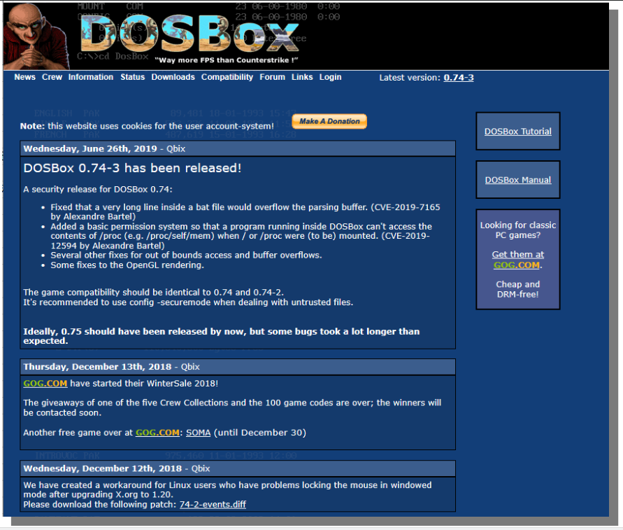

按照默认路径安装即可。		
        
### 2.2	下载debug软件		
        
这个软件本体就是一个debug.exe可执行文件，就这一个文件。可以在网上搜索并下载。		
下载完成后放置在本地任意位置。		
        
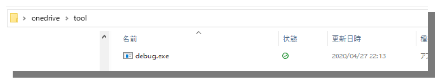

### 2.3	在DosBox中配置debug		
        
要想在DosBox中运行debug，需要执行若干命令，比较麻烦。通常我们对dos也并不感兴趣，也不拿它来做别的事情，所以直接把这些命令写到文件中是一个很好的办法。这样我们打开DosBox就自动帮我们运行debug软件，一步就到debug的界面了。		
        
!!! example "找到DosBox的配置文件"		
        
    默认路径是这里:	
    C:\Program Files (x86)\DOSBox-0.74-3	
        
!!! example "执行DOSBox 0.74-3 Options.bat来编辑配置文件"		
            
    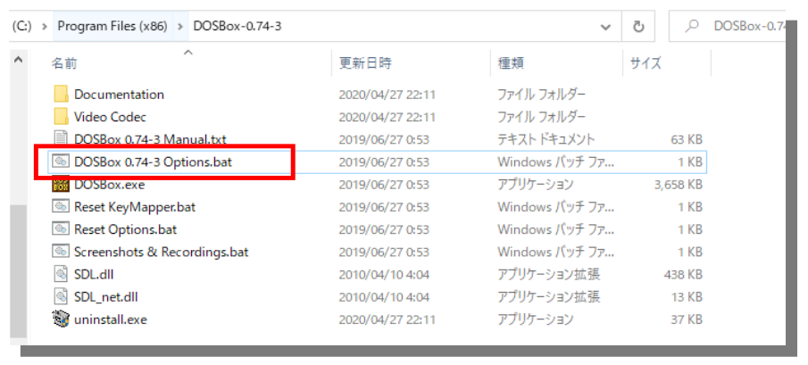

!!! example "追加debug的启动设定"		
    在打开的配置文件的末尾加上如下几句：	
    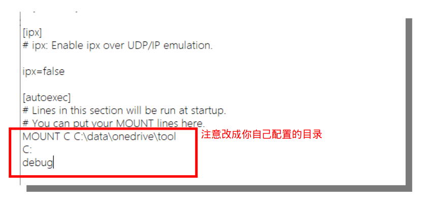
            
    使用过linux系统的人一定不会对这几句命令感觉到陌生。它们的含义是：	
            
    - 挂载目录C:\data\onedrive\tool到dos的C盘
    - 切换当前目录到C盘
    - 执行debug程序
        
### 2.4	启动debug		
        
从开始菜单中启动DosBox即可，他会自动帮我们启动debug。		
        
启动成功后会直接进入debug的界面，如下图:		
        
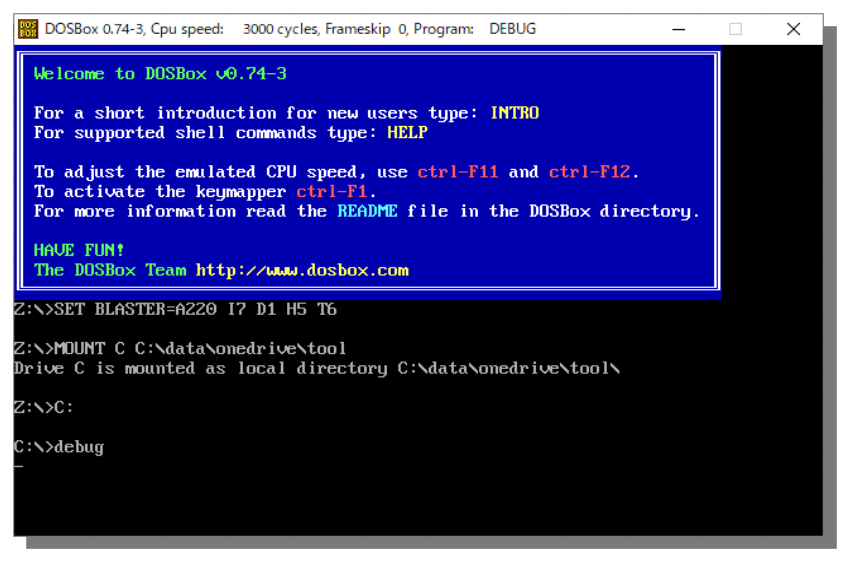

## 3.	debug的基本命令			
        
### 3.1	查看寄存器的值		
        
r 命令	大写 R 和小写 r 都可以	
        
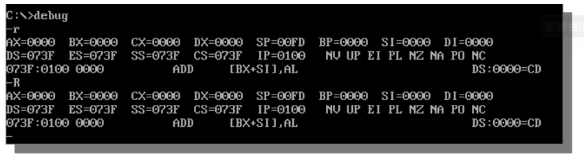
 
### 3.2	修改寄存器的值		
        
仍然是不区分大小写的 r 命令，不过后面要跟上寄存器的名字作为参数。		
        
比如，修改寄存器BX的值：		
        
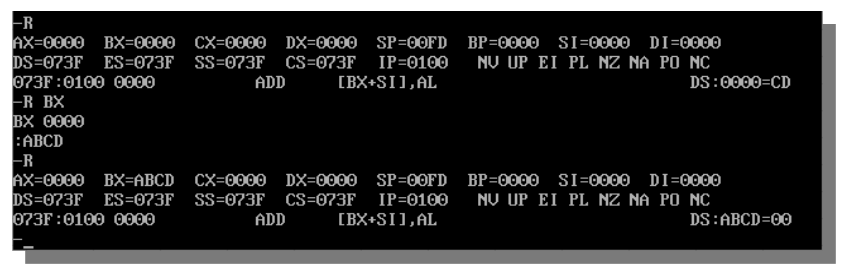
        
从图中可以看到修改前后，寄存器BX中的值的变化情况。		
        
注意：这里的修改没有寄存器限制，所有列出的12个寄存器都可以随便改。		
        
### 3.3	查看当前要读取并执行的指令		
        
我们都知道，这就是CS:IP指向的内容。		
        
仍然通过 r 命令来查看：		
        

     
### 3.4	查看内存中的内容		
        
最普通的用法是如下命令：		
        
    d 2010:0000		
        
也就是 d 后面跟上想要查看的内存区域的起始地址，起始地址使用段地址加偏移地址的方式表示。		
        
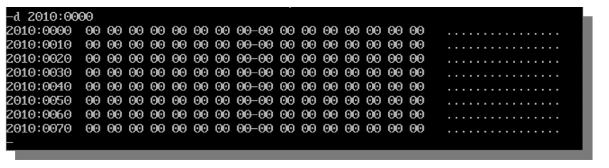

默认显示128个字节的数据。		
        
在上一个 d 命令后跟上另一个 d 命令可以接着上面显示下128个字节的数据。		
        
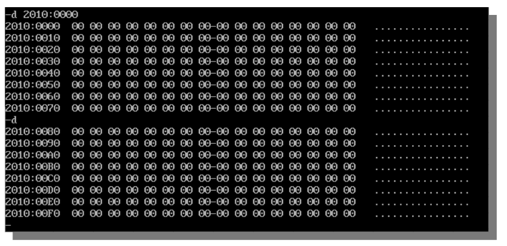
        
### 3.5	查看内存中的指令		
        
使用 u 命令可以将指定内存中的数据看作指令，并翻译成汇编指令打印出来。		
        
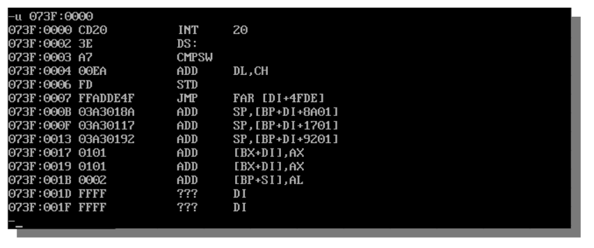

### 3.6	修改内存		
        
使用 e 命令来修改内存，基本格式如下:		
        
    e 2010:0002 2A 6F 12 'hello world' 0 10 55 'asm'		
        
也就是：		
        
    e 段地址:偏移地址 数据1 数据2 数据3 … …	
        
要注意，这里的数据只能是16进制数值，或者字符串。255这种数值会被认为是非法输入。		
        
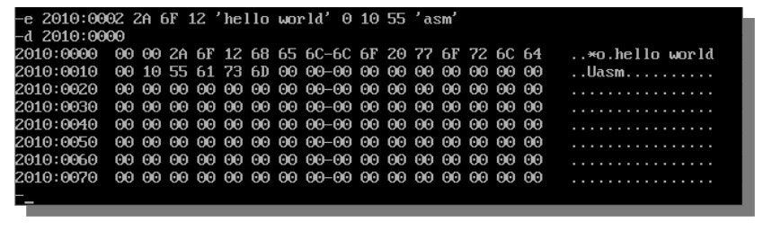

以上为最基础的用法，这个命令有很多种用法。		
        
### 3.7	向内存中写入指令		
        
指令本质上也是数据，我们当然可以使用上面介绍的 e 命令来写入指令。前提是你知道你要写入的指令对应的机器码，通常我们并不知道。		
        
所以debug提供了 a 命令，让我们可以直接写入汇编语言格式的指令到内存中。		
        
例如，要往内存2010:0002中写入如下几条指令:		
        
```asm
SUB AX, AX	
ADD AX, 2011H	
ADD AX, AX	
MOV BX, AX
```	
        
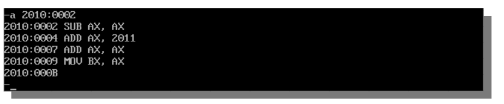

注意十六进制数据2011H的H不要加，debug里的数值默认就是16进制的。		
这个命令是交互式的，要求你逐条输入命令，要结束输入，只需在输入新一条命令时直接敲回车。		
        
输入完成后可以用 u 命令查看输入结果：		
        
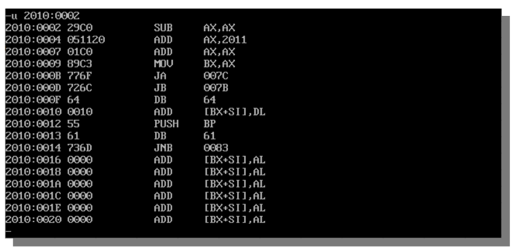
        
### 3.8	单步执行内存中的指令		
        
使用 t 命令可以执行当前CS:IP指向的那条命令。执行完成后CS:IP自动指向下一条指令，再次执行 t 命令就可以连续执行内存中存储的一段代码。		
        
同时 t 命令执行后会自动执行 r 命令打印出当前寄存器中的值。		
        
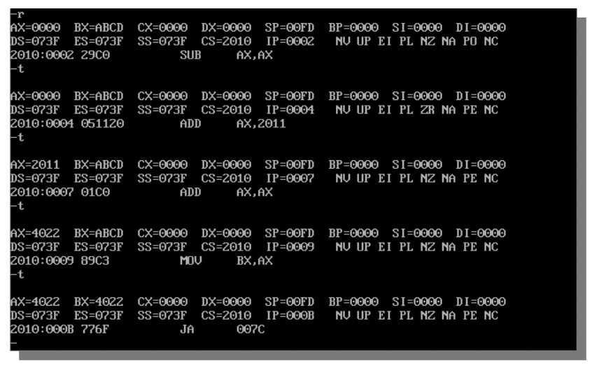

可以看到执行完上面章节中我们向内存中写入的指令之后，AX和BX中的值都为4022，和预期结果一致。		
