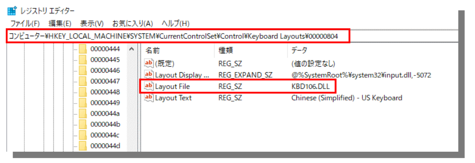

# 28.1 修改Win10的键盘布局为日语键盘

更新日期: 2020-6-23

-----------------------------------------------------

使用日本制键盘的时候，键盘布局会与通常的美式键盘不一样。虽然日文输入法在Win10的`设置`中可以修改键盘布局。但是使用中文输入法时，默认会被切换成美式布局，这样输入符号时就会错乱。	
    
参考了如下链接的文章之后，通过修改注册表解决了这个问题。	
    
https://answers.microsoft.com/zh-hans/windows/forum/all/中文输入法/0d84e4fa-1b43-49ef-bef4-8dce1e1204df?page=1	
    
如果有比较棘手的问题，在微软的社区里面提问和反馈也是不错的办法。	
    
具体的修改方法如下:	
    
!!! example "修改方法"
    注册表位置	
    - [HKEY_LOCAL_MACHINE\SYSTEM\CurrentControlSet\Control\Keyboard Layouts\00000804]
        
    修改如下键值	
    - Layout File
    - KBDUS.DLL
        
    图例	
        
    
        
在PowerShell使用如下命令可以快捷的修改这个值。（需要管理员权限）	
    
```powershell
Set-ItemProperty -Path "HKLM:\SYSTEM\CurrentControlSet\Control\Keyboard Layouts\00000804" -Name "Layout File" -Value "KBD106.DLL"	
```

顺便，日文输入法的键盘布局在这里修改：


