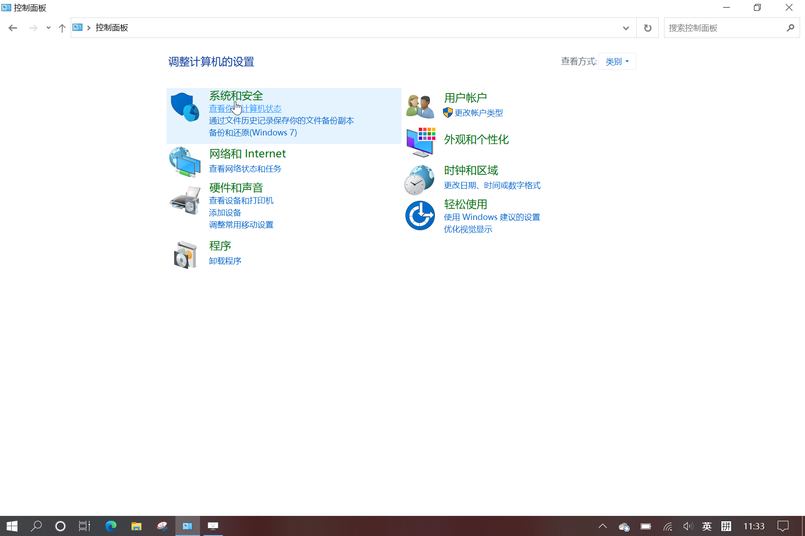

# 28.3 使用出入站规则控制网络连接

更新日期: 2020/5/16

-----------------------------------------------------

## 1.	应用场景	

我们在家里使用Windows操作系统的时候，如果我们有两台电脑，并且我们都连接到了同一个WiFi。	

现在我们想在其中一台电脑上访问另外一台电脑。默认情况下，连接到同一个WiFi之后通过内网IP就可以直接访问了。	
但是在最新的Win10操作系统下，我发现并不能访问，包括ping命令，数据库，远程连接等服务一概不能访问。	

如果此时我们关闭两台机器上的防火墙，会发现是可以访问的。因此可以确定是防火墙配置的问题。	
实际上很多软件在安装的时候，会自动配置好一些出入站规则。	

## 2.	配置防火墙的出入站规则	

防火墙的出入站规则，就是对电脑的外部数据访问制定限制的规则。	

- 入站规则，控制着其它机器访问这台机器时，访问的端口可不可以访问，其它机器的IP地址是否被允许访问。
- 出站规则，控制着这台机器访问其它机器时的规则。出站规则使用较少。

以机器A连接机器B的postgreSQL为例。	

- 机器A的内部IP地址为:192.168.0.1
- 机器B的内部IP地址为:192.168.0.2

机器B上的postgreSQL默认使用端口5432。

这种情况下，就需要配置机器B上的防火墙的入站规则，以使IP地址192.168.0.1可以访问它的5432端口。	
而机器A上通常不需要做什么特别的事情。	

### 2.1	配置机器B上的入站规则

首先我们要打开配置界面：

然后就是创建一个入站规则。

此时再尝试连接postgreSQL，就发现可以连接上了。
