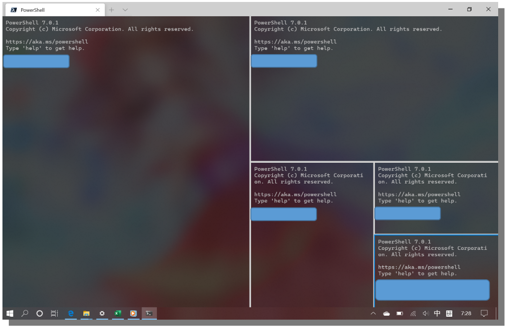
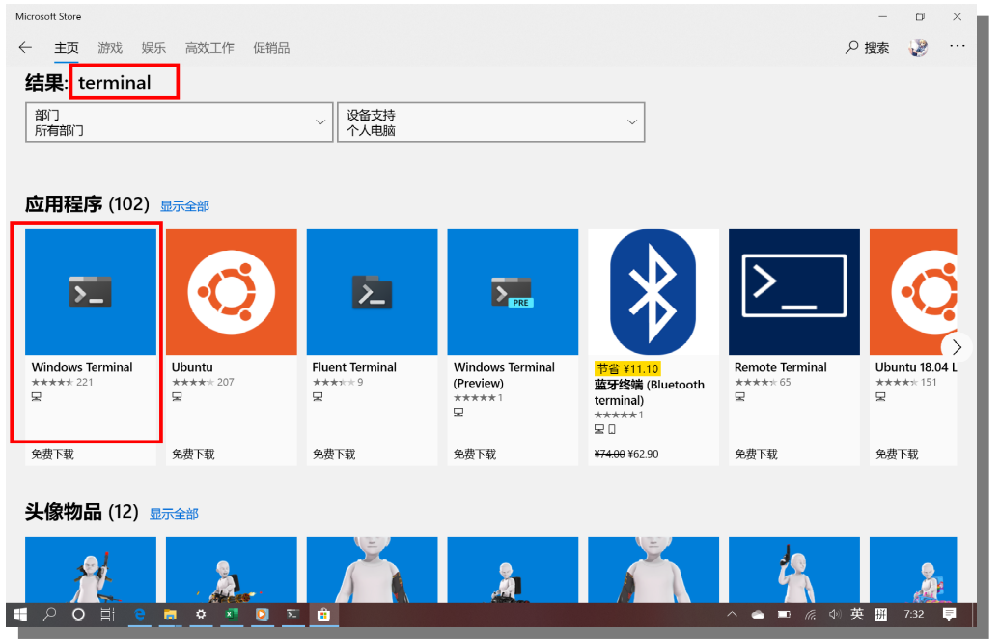
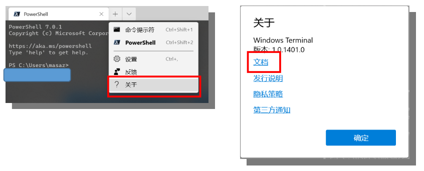

# 28.4 Win10中新的控制台终端

更新日期: 2020/5/27

-----------------------------------------------------

## 1.	概述	

Windows操作系统中的命令行界面一直以丑著称。简陋的黑框白字、满地狗牙的文字、以及中文乱码等问题让人感觉难用。	

现在微软在Win10上推出了一款新的终端:	

- Windows Terminal

这可以说是一款时尚的现代化终端。它支持如下功能：	

- 多选项卡支持
- 分屏
- 高清字体
- 设置背景图片
- 背景毛玻璃效果
- 支持不同的命令行工具：CMD、WSL、Power Shell等
- 全Unicode支持

运行效果：	

有了这款工具，感觉敲命令行的时候也没有那么累了。	

## 2.	安装	

在Win10的应用商店中可以下载安装。下图中搜出来的第一个就是。但要注意这个terminal对win10版本有要求。	

## 3.	配置	

要想配置各种好看的效果，可以参考微软的官方文档，上面有详细的中文介绍。只需按上面介绍的步骤一步一步来即可。	

主要包括下面几种配置：	

- 变更字体
- 默认命令行工具
- 背景图片
- 背景毛玻璃效果
- 快捷键绑定(如分屏打开一个新的控制台就很常用)
