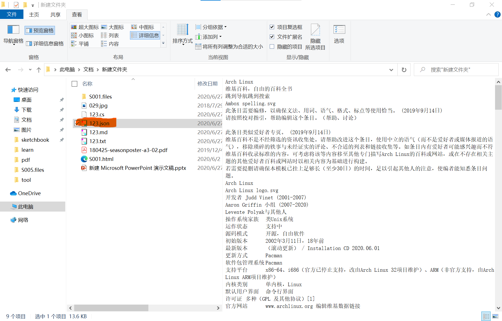

# 28.5 Win10技巧 - 文件预览

更新日期：2020/6/27

-----------------------------------------------------

## 1. 概述

### 1.1. 关注Win10的新特性

从Win8开始，微软向Windows中陆续加入了一系列花里胡哨的新特性。Win10就是新特性的集大成者。
其中一些特性在日常工作中还是很有用的。

### 1.2. 文件预览能做什么

文件预览能够在不打开文件内容的前提下查看文件的内容。
这个特性其实在Vista/Win7时代就有了，只是当时的体验并不是很好。

Win10中的文件预览具有如下特点：

- 预览快。比使用对应的软件打开文件看内容快的不是一星半点。
- 查看完整内容。能够查看文件的全部内容。
- 支持复制内容。能够从预览面板中将内容复制出来。

当我们面对磁盘中成百上千的各类文档代码等文件的时候，这个特性会非常有用。

### 1.3. 文件预览的效果图

直接上图比较能说明问题，这里我随便找几个文件演示一下。

### 1.4. 支持的文件类型

这个功能不仅好用，而且支持的文件类型也很多。基本上涵盖了日常办公所用的各种文件格式。

| 文件类型 | 支持条件
| :------ | :--------
| .txt 文本文件 | 无
| .doc[x] Word文档 | 安装有Microsoft Office三件套
| .xls[x] Excel档 | 安装有Microsoft Office三件套
| .ppt[x] PowerPoint文档 | 安装有Microsoft Office三件套
| .jpg/.png等各种常用图片文件 | 无
| .html 网页文件 | 无
| .pdf 电子书文件 | 安装Adobe Acrobat Reader DC，并设置为默认pdf阅读器

## 2. 开启文件预览功能

直接按下图打开[查看]菜单下的[预览窗格]即可。

预览窗格的宽度可以根据需要进行调整。上图为预览PDF文件的效果。

## 3. 支持各种扩展名的文本文件

我们在工作中会遇到很多基于文本内容的各种格式的文件，就比如各种语言的程序代码文件。
而Win10默认支持 `.txt` 等少量格式的文件预览，我们都知道这是不能容忍的。

一个比较有效的办法是通过修改注册表，将各种文本格式对应的扩展名标记为 `文本类型` 。这样我们就可以把它当作普通的文本文件来预览了。

比如，以[.json]扩展名为例，按下面的步骤修改注册表即可。

位置: [ __HKEY_LOCAL_MACHINE\SOFTWARE\Classes__ ]
按照图中所示在[.json]节点上创建字符串键值对:(如果没[.json]就创建一个出来)
键名： __PerceivedType__
值： __text__

现在我们再次来到文件浏览其中选择json文件，会发现可以预览了。

## 4. 预览功能存在的问题

预览功能存在一个锁文件的问题。虽然号称已经修复了，但是实际上仍然会出现。

当公司里多名员工同时访问同一个文件服务器上的共享文档时，或者访问Web服务器上的log这类可能会实时写的文件时一定要小心一些。

## 5. 更多的文件格式支持

Win10自带的文件预览功能并不是十分完美。考虑下面这些应用场景：

- 我们的文本文件是程序代码，希望在预览时能够进行语法高亮显示。
- 我们有一个MarkDown文档，希望在预览时能显示最终效果。

像这样的功能应该也是有解决方案的。
比如最近微软重启了一个PowerToys的项目，里面全是些有意思的功能，其中就有预览MarkDown文档，但是目前的功能还不是很完善。

另外一件重要的事情是，很多公司办公的计算机会限制可以安装的软件。
如果不是Win10内置的功能，我们也没有办法来使用。
