# 30.1 星际2中有趣的台词

更新日期：2020/5/16

-----------------------------------------------------

## 1.	合作任务		

### 1.1	集结部队	

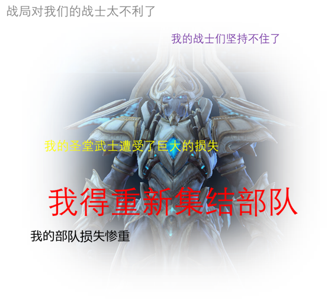

### 1.2	七剑下天山	

!!! example "卡尔达利斯"	

    

    - 啊！卡尔达利斯，我记忆中最勇猛的狂热者。			
    - 卡尔达利斯，拔刀吧。			
    - 能与您并肩作战是我的荣幸，卡尔达利斯。			

!!! example "塔里斯"	

    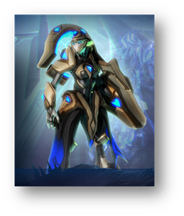

    - 执行官塔里斯，所有使徒听您调遣。			
    - 正在访问塔里斯的记忆。			
    - 您亲自上阵令我感到无比荣幸，执政官塔里斯。			

!!! example "塔尔达林"	

    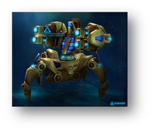

    - 执政官塔尔达林重返战场。			
    - 有了执政官塔尔达林的加入，胜利一定属于我们。			
    - 塔尔达林的英勇寰宇长昭。			

!!! example "战争使者"	

    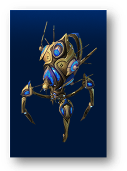

    - 重新激活战争使者。			
    - 战争使者已连线。			
    - 正在向我们的巨像加载战争使者人工智能。			

!!! example "摩约"	

    

    - 执政官摩约，控制这片天空。			
    - 在执政官摩约面前，所有敌人将无所遁形。			
    - 您的英勇传奇无比，执政官摩约。			

!!! example "科罗拉里昂"	

    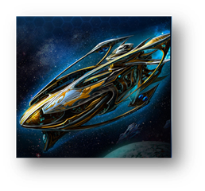

    - 赞美科罗拉里昂，赞美净化者。			
    - 执行官科罗拉里昂，您的支援正当及时。			
    - 科罗拉里昂加入了战斗。			

### 1.3	蒙斯克	

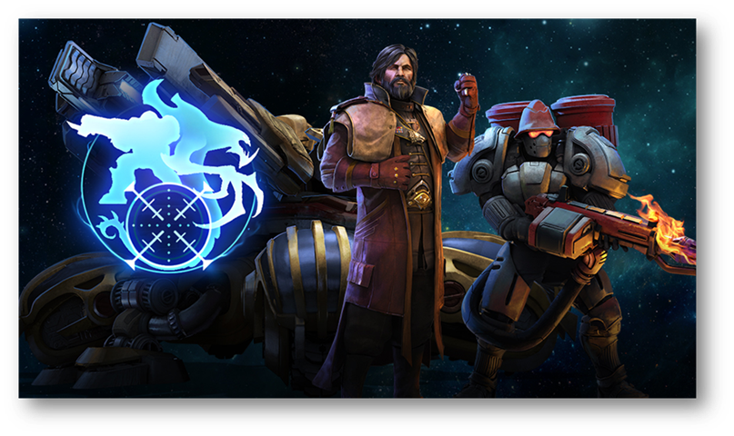

#### 1.3.1	蒙斯克大帝

!!! example "首次遭遇敌人"
    - 是星灵，他们会盗取思想，我们最好先下手为强。
    - 是星灵。乔·萨拉这笔账就算在他们头上。
    - 我知道这很难接受，但是变节的泰伦人必须被清除。
    - 如果这些泰伦人对我们拿起武器，那他们就不再是我们的同胞。
    - 不要对这些泰伦异见者浪费你的同情心。施展雷霆手腕方显仁慈心肠。
    - 必须给这些泰伦人一个教训。如果你不再是帝国的一员，你就会被帝国人道毁灭。

!!! example "大地碎裂炮"
    - 大地碎裂炮建造完毕。亿万生灵的命运就在你的指间。

!!! example "空投地堡"
    - 这场战争已经没有平民可言。

!!! example "辐射打击"
    - 辐射区内的敌人都得死！
    - 把他们变成哥斯拉。

!!! example "战争恶犬"
    - 释放异虫，不用跟我们的敌人讲仁慈。
    - 这是他们逼我们的。释放异虫。
    - 这些虫子会在敌人身上大快朵颐。
    - 一件无比饥饿的武器，远超任何一支泰伦人军队。

!!! example "核弹天劫"
    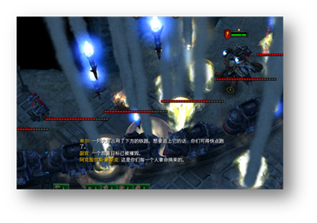

    - 发射导弹！继续发！全射出去！
    - 这是你们逼我的。跟你们身上的原子说再见吧。
    - 让他们灰飞烟灭。
    - 把他们轰成渣。

#### 1.3.2	帝国劳工

!!! example "帝国劳工"
    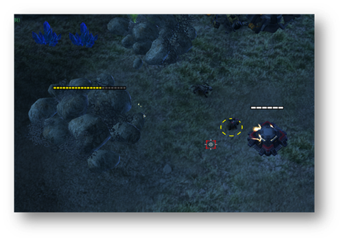

    - 我的脚下就是国门。
    - 帝国在我身后。
    - 誓死效忠，无论对错。
    - 我们是元首的亲兵。
    - 如果离不开它，那就好好爱它。

    - 今天是谁在反抗？
    - 是您吗？陛下？

    - 我们一头扎进了死亡区！
    - 这太不人道了。
    - 嘿！我不是炮灰。

    - 别又搞训练。

    - 我猜我上你的名单了。
    - 我可以拿这枪去换不少钱。

#### 1.3.3	帝国宣传艇

!!! example "帝国宣传艇"
    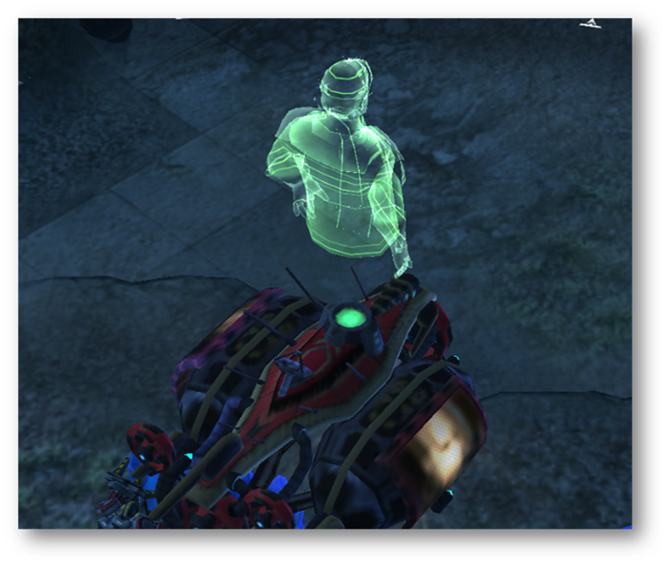

    - 凯莫瑞安联合体的经济崩溃迫在眉睫。对于所有想要离开那片废土，去寻找更美好生活的人来说，克哈是你们所有人安全的港湾。

    - 帝国武装力量无数的优秀儿女正时刻守卫着我们的家园大门。但是它们孤木难支，凡是今天应征入伍者，所获的所有刑法罪责减半。

    - 身为你们的元首，我带领泰伦人实现了人类统治领地和经济的扩张。我们将继续成长，用行动回击那些只会说风凉话，不愿意和我们相向而行的害群之马。

    - 不要听信别人的谗言，我不是什么克隆人。

    - 为了保护尤摩扬人民不受异虫的残害，我所做的比他们自己的领导委员会都多。无论他们如何诽谤我，我将继续为所有泰伦人的最大利益而努力奋斗。

    - 法治是我们的命脉，然而它却受到前所未有的挑战。我将恢复我们帝国的荣光。绝不会向任何外星势力低头。

    - 我已经驯服了异虫，荡平了星灵。如今它们的创造者想要夺走我们拥有的一切。永远记住，谁才是最能保护你们的人。

    - 激进分子和异见者希望你们一听见枪声就背弃多年的和平与繁荣。他们没有勇气和能力带领人类穿越一个充满危险的星系。

### 1.4	斯托科夫	

!!! example "亚历山大号"

    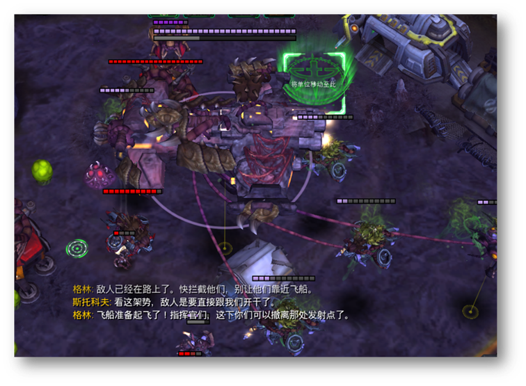

    - 啊，亚历山大号。我很庆幸杰拉德没机会看到它变成如今这个样子。

    - 亚历山大号再次起飞。

    - 现在，我来指挥亚历山大号。

!!! example "末日巨兽"

    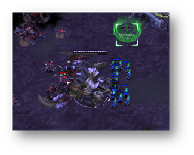

    - 我一直在准备好玩的……新玩意。玩得开心。

    - 我把这个叫“末日巨兽”。您就瞧好了。

    - 看看这家伙，我最得意的。
