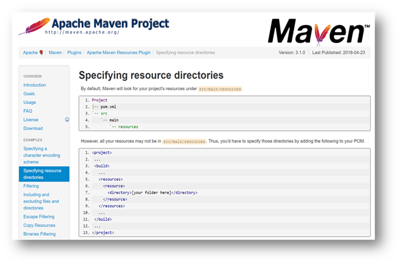
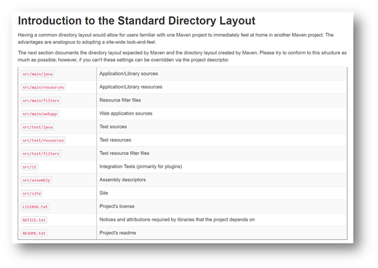

# B. Maven的约定文件夹

更新日期：2020-07-23

------------------------------------- 

## 1. src/main/resources

首先，这个文件夹是使用Maven创建工程的时候创建出来的。根据Maven官方文档:



可以看到Maven项目会默认从这个位置寻找资源。并且允许我们在pom文件中配置我们自己的资源文件夹。

完整的Maven项目默认目录:



按照Maven的官方说法，如果我们都采用这个标准目录结构。那么我们看其他作者开发的Maven项目时就能快速掌握这个新项目的结构。

所以我们要尽可能的采用这个目录结构。

## 2. META-INF

这个文件夹是用来存放Jar包有关信息的文件。通常的Jar包项目打出来后，在根目录都会有这样一个文件夹。一个典型的Maven创建的Jar项目的META-INF如下:

```treer
framework-0.0.1-SNAPSHOT
├─META-INF
|    ├─maven
|    |   ├─org.hakurei
|    |   |      ├─framework
|    |   |      |     ├─pom.properties
|    |   |      |     └pom.xml
|    ├─MANIFEST.MF
```

MANIFEST.MF这个文件存放Jar包的一些基本信息。比如一个简单的Jar包中这个文件的内容如下:

```mf
Manifest-Version: 1.0
Archiver-Version: Plexus Archiver
Built-By: 作者
Created-By: Apache Maven 3.5.4
Build-Jdk: 1.8.0_181
```

这个文件我们自己开发的时候通常并不需要修改它。如果是一个我们不熟悉的第三方Jar包又没有文档和源码的话，我们则可以打开这个文件来了解一下这个Jar包的基本信息。

这个文件中可以配置main-class，classpath等信息。但通常不需要我们动手，还是那句话，对于第三方Jar包，可以看一下这个文件。

maven这个文件夹里面的东西顾名思义都是maven替我们创建出来的。

先说pom.xml。这个文件我们再熟悉不过了。这里的pom.xml就是我们在IDE中看到的工程根目录下的那个pom.xml，还是原汁原味。

再来是pom.properties文件。这个文件和MANIFEST.MF文件有点像。一个典型的pom.properties内容如下:

```mf
#Generated by Maven
#Fri Jun 21 23:11:06 JST 2019
version=0.0.1-SNAPSHOT
groupId=org.hakurei
artifactId=framework
```

如果说MANIFEST.MF是你的工程作为一个Jar工程的描述文件。那个pom.properties就是它作为一个maven工程的描述文件。

对于Web工程来说，一般也有一个META-INF，位于src/main/webapp下面。我们并不需要关心这个文件夹。

## 3. META-INF/resources

这个文件夹是Java Servlet 3.0规范中增加的资源文件夹。放在这个文件下下面的资源文件我们都可以直接引用。它通常的用法如下:

!!! example

    我们假定有一个Base工程，里面有各种页面的模板。

    ```treer
    base
    ├─src
    |  ├─main
    |  |  ├─resource
    |  |  |    ├─META-INF
    |  |  |    |    ├─resources
    |  |  |    |    |     ├─view
    |  |  |    |    |     |  ├─util
    |  |  |    |    |     |  ├─template
    |  |  |    |    |     |  |    └common.xhtml
    |  |  |    |    |     |  ├─01.xhtml
    |  |  |    |    |     ├─js
    |  |  |    |    |     | └base.js
    |  |  |    |    |     ├─img
    |  |  |    |    |     |  ├─01.jpeg
    |  |  |    |    |     |  └pct1.png
    |  |  |    |    |     ├─css
    |  |  |    |    |     |  └base.css
    ```

    又有一个Web工程，来使用这个模板Base工程。

    ```treer
    webProject
    ├─src
    |  ├─main
    |  |  ├─webapp
    |  |  |   ├─view
    |  |  |   |  └index.xhtml
    |  |  |   ├─js
    |  |  |   ├─img
    |  |  |   ├─css
    |  |  |   |  └mystyle.css
    ```

也就是在base工程里面放资源，然后再引用它的工程中可以很方便的调用到这些资源。

比如如上图所示的两个工程，webProject引用base工程。那么对于webProject来说，base的META-INF/resources下面的所有文件都跟放在自己的src/main/webapp目录下一样，可以随便访问。

比如webProject使用JSF框架加载css时只需要像下面这样写:

```html
<h:outputStylesheet library="css" name="base.css" />
<h:outputStylesheet library="css" name="mystyle.css" />
```

可以看到引用base下面的base.css和引用自己下面的mystyle.css相比较，从写法上一样方便。对于分多个模块的项目来说，真的是太方便了。

如果我们查看base工程打出来的jar包。我们会发现css、js、img、view这几个目录都被放在了jar包的根目录下面。