# c. 图形库Graphics2D

更新日期: 2021-01-09

------------------------------------------

## 1.	概述

当我们需要处理图片，或者编写游戏时，就可以使用Java Swing中的图形包`Graphics2D`了。这套图形系统的内容还是比较丰富的。

但要注意的是，它绘制的速度不是很快，用它来写稍大一点的游戏，就会很卡。
在这篇文章中我将总结Graphics2D的用法，以便以后随时查看。
但跟图形绘制有关的主题是非常多的。我将只挑选出感兴趣的来学习：

- 获取Graphics2D对象
- Graphics2D对象的属性
    - 颜色
    - 画笔属性
    - 混合模式
    - 裁剪区域
    - 坐标变换
    - 渲染质量
    - 字体
- 绘制
    - 几何图形
    - 文字
    - 图片

## 2. 获取Graphics2D对象

Swing程序中看的见的东西都是用Graphics2D画出来的。比如窗口里的各种控件：按钮、单选按钮、滚动条等。
这些组件都继承自Swing里面的`JComponent`类。这个类提供了一个绘制组件的方法：`paintComponent`，如果想自己绘制控件，就可以覆盖这个方法。注意不要使用`paint`方法，`paintComponent`自动提供了双缓冲机制，用起来更舒服。

这个方法将给我们传递一个`Graphics2D`参数进来。

下面我将创建一个文本区域，来演示一下如何获取Graphics2D，并使用它来在这个文本区域上进行绘制。

!!! example "获取Graphics2D"

    ```java
    // 自定义一个类来扩展Swing控件
    public static class MyText extends JTextArea {

        @Override
        protected void paintComponent(Graphics g) {
            super.paintComponent(g);
            // 取得Graphics2D对象
            Graphics2D g2 = (Graphics2D)g;
            // 绘制文字
            g2.setFont(font.deriveFont(48.0f));
            g2.setColor(Color.RED);
            g2.drawString("这是按钮上的文字!", 0, 100);
            // 绘制矩形
            g2.setColor(Color.BLUE);
            g2.drawRect(20, 20, 80, 200);
        }
    }

    // 创建并显示窗口
    private static void displayWindow() {
        // 创建JFrame对象
        JFrame jFrame = new JFrame();

        XXXX 其他代码... ...

        // 添加一个文本区域控件
        var textArea = new MyText();
        textArea.setPreferredSize(new Dimension(400, 400));
        textArea.setBorder(new LineBorder(Color.BLACK));
        textArea.setText("这是一个文本框\n这是第二行文字\n\n\n\n\n这是不知道第多少行文字");
        jPanel.add(textArea);

        // 显示窗口
        jFrame.setVisible(true);
    }
    ```

可以看到，通过强制类型转换，得到了Graphics2D对象。然后，使用这个对象绘制了文字和矩形。下面是运行效果：


其他所有Swing控件，都是采用同样的方法。我们在做图形绘制程序时，最常用的是在`JPanel`控件上进行绘制。
后面的例子中，我默认都是在`JPanel`中进行绘制。

除了在看的见的画板上绘图外，还有另外一种方式。叫做在离屏表面中绘图。
所谓离屏表面，就是指不直接显示在画面上，只存在于内存中的画板。这个技术常用于双缓冲绘图。

在Java中使用`BufferedImage`来表示离屏表面，可以从这个对象中获取Graphics2D对象。
还是看代码：

!!! example "离屏表面"

    ```java
    // 创建一个1920 X 1080大小的离屏表面
    BufferedImage offScreenSurface = new BufferedImage(1920, 1080, BufferedImage.TYPE_4BYTE_ABGR);
    // 获取Graphics2D对象
    Graphics2D g2 = (Graphics2D)offScreenSurface.getGraphics();
    ```

## 3. Graphics2D对象的属性

通过调整Graphics2D对象的属性，我们可以控制绘制时的各种效果。这里就只学习一下常用的几个比较重要的属性。
既然是属性，就可以通过`get`和`set`方法来取得当前属性和设定。后面就不再赘述，介绍的重点是属性的值的含义，以及设定不同的值会有什么效果。

### 3.1 颜色

颜色的重要性不用多说，绘制几何图形和文字的时候会生效。Swing中使用`Paint`这个类来表示颜色。

在程序中，创建颜色可以直接使用预定义的常用颜色常量，也可以通过RGBA来指定。

直接看一看代码：

!!! example "创建颜色"

    ```java
    // 设定各种颜色
    g2.setPaint(Color.BLUE);
    g2.setPaint(new Color(0XFF00FF00));
    g2.setPaint(new Color(255, 255, 0, 128));
    ```

这个属性设定后的效果不用多说。

### 3.2 画笔属性

画笔属性会直接影响几何形状绘制时的效果。Swing中使用`Stroke`这个接口来表示，而`BasicStroke`这个类实现了此接口。它主要包含如下几个子属性：

No. | ID | 属性名 | 说明
:--|:--|:--|:--
1 | width | 画笔宽度 | 画笔的粗细。直接影响绘制图形时线条的粗细。
2 | end caps | 两端装饰 | 线条两端的样式。具体的效果下面将会演示。
3 | line joins | 折角装饰 | 主要影响多边形折角处的形状。
4 | miter limit | 折角裁剪阈值 | 与No.3有关，绘制多边形时有效果，这里不做介绍了。
5 | dash attributes | 虚线样式 | 用于绘制虚线线条。

我们将逐个演示各个属性有什么效果，这样介绍起来更直观一点。

!!! example "画笔宽度"

    代码:

    ```java
    // 宽度依次为1,2,4,8,16,32
    g2.setStroke(new BasicStroke(1.0f));
    g2.drawRect(100, 100, 200, 200);
    g2.setStroke(new BasicStroke(2.0f));
    g2.drawRect(150, 150, 200, 200);
    g2.setStroke(new BasicStroke(4.0f));
    g2.drawRect(200, 200, 200, 200);
    g2.setStroke(new BasicStroke(8.0f));
    g2.drawRect(250, 250, 200, 200);
    g2.setStroke(new BasicStroke(16.0f));
    g2.drawRect(300, 300, 200, 200);
    g2.setStroke(new BasicStroke(32.0f));
    g2.drawRect(350, 350, 200, 200);
    ```

    效果：

    

两端装饰只有在线条比较粗的时候才能看的清除，所以我直接用一个比较粗的画笔来绘制。

!!! example "两端装饰"

    代码:

    ```java
    g2.setStroke(new BasicStroke(32.0f, BasicStroke.CAP_BUTT, BasicStroke.JOIN_BEVEL));
    g2.drawString("无装饰", 50, 110);
    g2.drawLine(250, 100, 600, 100);
    g2.setStroke(new BasicStroke(32.0f, BasicStroke.CAP_ROUND, BasicStroke.JOIN_BEVEL));
    g2.drawString("圆角装饰", 50, 210);
    g2.drawLine(250, 200, 600, 200);
    g2.setStroke(new BasicStroke(32.0f, BasicStroke.CAP_SQUARE, BasicStroke.JOIN_BEVEL));
    g2.drawString("方形装饰", 50, 310);
    g2.drawLine(250, 300, 600, 300);
    ```

    效果：

    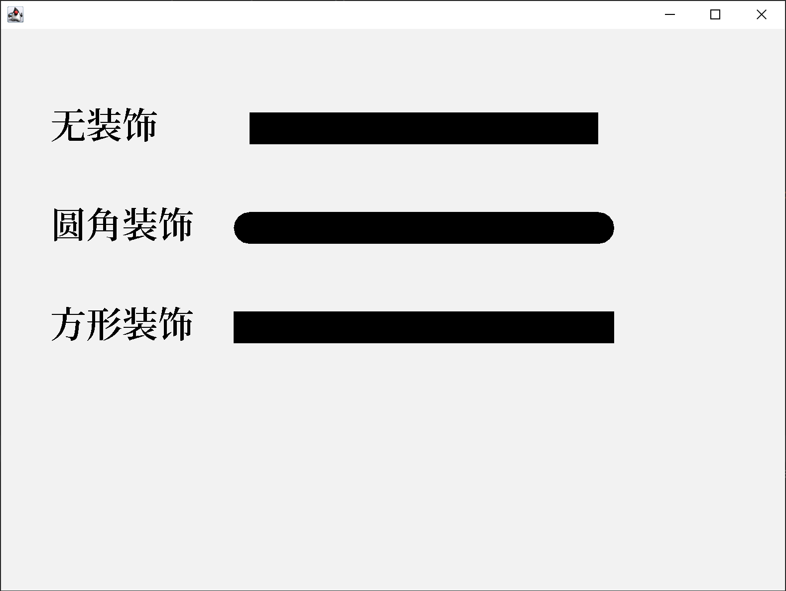

接下来是折角装饰，与两端装饰类似，只是应用的部位不一样。

!!! example "折角装饰"

    代码:

    ```java
    g2.setStroke(new BasicStroke(32.0f, BasicStroke.CAP_BUTT, BasicStroke.JOIN_BEVEL));
    g2.setPaint(Color.RED);
    g2.drawString("直线装饰", 50, 110);
    g2.drawRect(250, 100, 400, 150);
    g2.setStroke(new BasicStroke(32.0f, BasicStroke.CAP_BUTT, BasicStroke.JOIN_ROUND));
    g2.setPaint(Color.GREEN);
    g2.drawString("圆角装饰", 50, 210);
    g2.drawRect(350, 200, 400, 150);
    g2.setStroke(new BasicStroke(32.0f, BasicStroke.CAP_BUTT, BasicStroke.JOIN_MITER));
    g2.setPaint(Color.BLUE);
    g2.drawString("交点闭合装饰", 50, 310);
    g2.drawRect(300, 300, 400, 150);
    ```

    效果：

    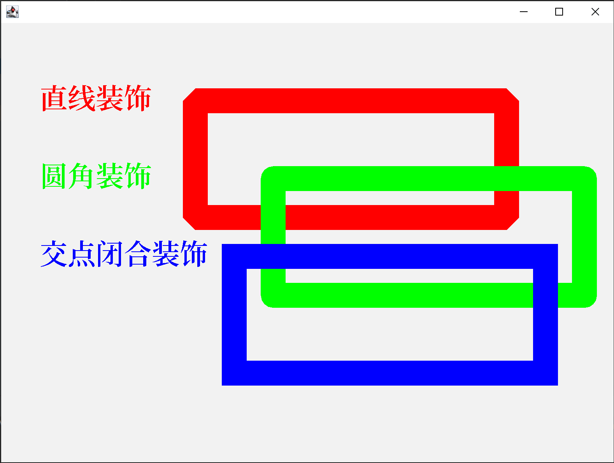

最后是虚线样式，这个可以用来生成各种样式的虚线。通过下面的参数来定义：

- 虚线模式数组
- 虚线第一段开始位置

虚线模式数组是一个包含偶数个数值的数组。比如：[20, 8, 10, 8]。它表示的含义是：

1. 绘制一个20长度的线段
2. 空出8长度的距离
3. 绘制一个10长度的线段
4. 空出8长度的距离
5. 从1.开始重复绘制

虚线第一段开始位置顾名思义，就是说第一个线段从哪里开始绘制。比如还是上面的例子，我指定开始位置为10时。
由于第一段线段长为20，所以第一段从一半的位置开始绘制。

具体的用法还是直接看例子演示。

!!! example "虚线样式"

    代码:

    ```java
    g2.setStroke(new BasicStroke(8.0f, BasicStroke.CAP_BUTT, BasicStroke.JOIN_MITER, 1,
            new float[]{20, 8, 10, 8}, 0));
    g2.setPaint(Color.BLACK);
    g2.drawString("虚线", 50, 110);
    g2.drawLine(400, 100, 600, 100);
    g2.setStroke(new BasicStroke(8.0f, BasicStroke.CAP_BUTT, BasicStroke.JOIN_MITER, 1,
            new float[]{20, 8, 10, 8}, 10));
    g2.setPaint(Color.BLUE);
    g2.drawString("虚线(从10开始)", 50, 210);
    g2.drawLine(400, 200, 600, 200);
    ```

    效果：

    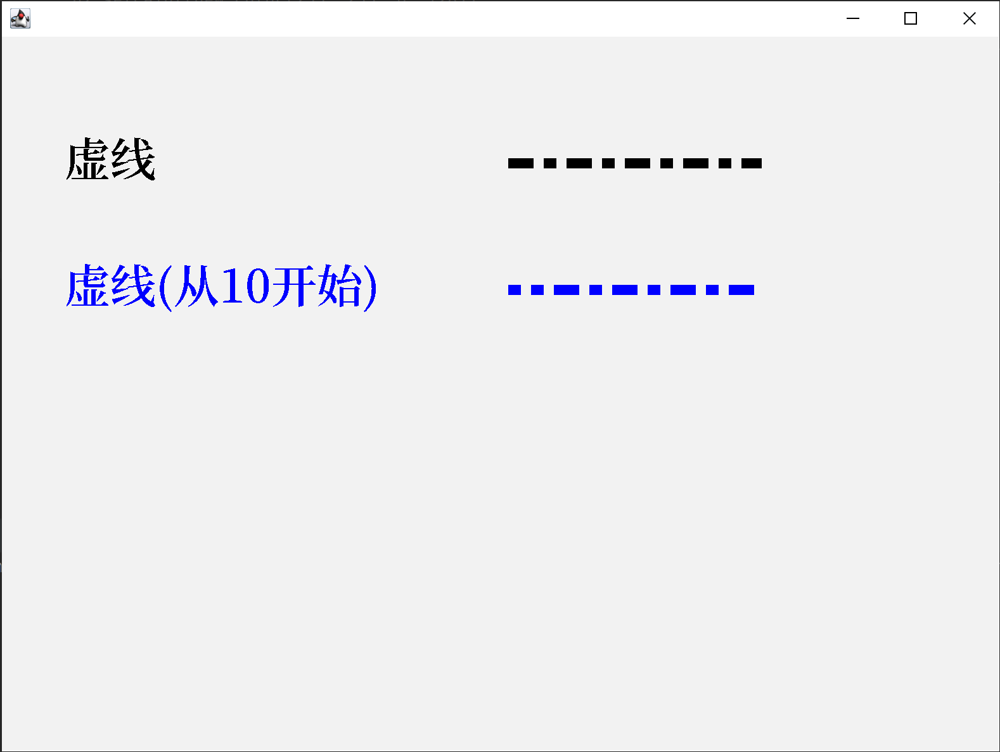

同时，虚线的每个小线段的端点都受两端装饰和折角装饰的影响。看下面的演示。

!!! example "虚线的线段装饰"

    代码:

    ```java
    g2.setStroke(new BasicStroke(8.0f, BasicStroke.CAP_BUTT, BasicStroke.JOIN_ROUND, 1,
            new float[]{20, 8, 10, 8}, 0));
    g2.setPaint(Color.BLACK);
    g2.drawString("两端无装饰，折角圆角装饰", 50, 110);
    g2.drawRect(50, 140, 300, 80);
    g2.setStroke(new BasicStroke(8.0f, BasicStroke.CAP_ROUND, BasicStroke.JOIN_MITER, 1,
            new float[]{20, 10, 0, 10}, 10));
    g2.setPaint(Color.BLUE);
    g2.drawString("两端圆角装饰，折角闭合装饰", 50, 310);
    g2.drawRect(50, 340, 300, 80);
    ```

    效果：

    

### 3.3 混合模式

混合模式，也叫颜色混合模式。所谓混合，是指在进行绘制时，将要绘制的颜色与画板上已有的颜色进行混合。
其实和现实世界中的画画有点类似。

比如：

- 我用覆盖性强的丙烯颜料涂在画布上，则画布上本来的颜料都会被盖住，只呈现我新涂的颜色。
- 我用透明的水彩颜料涂在画布上，则画布上本身的颜料不会被完全覆盖，会呈现出一种半透明效果。

在使用程序绘图时，有类似的概念，而且有很多很多种混合模式。具体可以参考Java官方文档：

[混合模式官方文档](https://docs.oracle.com/en/java/javase/15/docs/api/java.desktop/java/awt/AlphaComposite.html)

这部分的算法相当复杂，我们不需要关心具体的细节。我们最经常使用的混合模式只有一种，就是`SRC_OVER`模式。这个模式下会按照`Alpha`通道的值对源和目标的颜色做一个混合。

- `Alpha`值为1，则源颜色覆盖目标颜色，也即是我们提到的覆盖性强的丙烯颜料的效果。
- `Alpha`值小于1，则源颜色混合目标颜色，也即是我们提到的透明水彩颜料的效果。
- `Alpha`值越小，颜料也就越透明。

直接看例子：

!!! example "混合模式"

    代码:

    ```java
    // 绘制一个蓝色的矩形
    g2.setComposite(AlphaComposite.getInstance(AlphaComposite.SRC_OVER));
    g2.setPaint(Color.BLUE);
    g2.fillRect(100, 100, 300, 200);
    // 在蓝色矩形上，绘制一个绿色的矩形，透明度为50%
    g2.setComposite(AlphaComposite.getInstance(AlphaComposite.SRC_OVER, 0.5f));
    g2.setPaint(Color.GREEN);
    g2.fillRect(200, 200, 300, 200);
    // 在绿色矩形上，绘制一个黄色的矩形，透明度为30%
    g2.setComposite(AlphaComposite.getInstance(AlphaComposite.SRC_OVER, 0.3f));
    g2.setPaint(Color.YELLOW);
    g2.fillRect(100, 300, 300, 200);
    ```

    效果：

    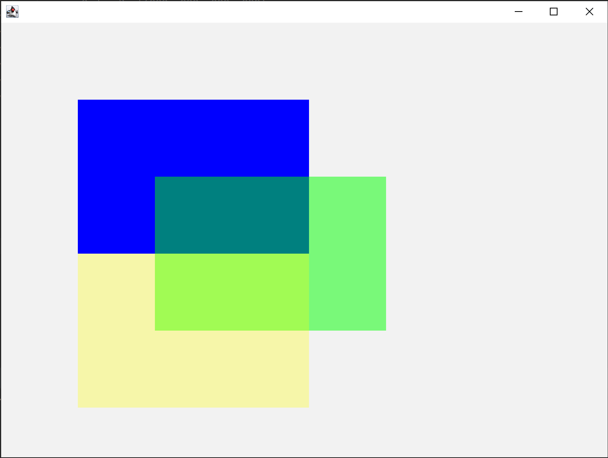

### 3.3 裁剪区域

所谓裁剪区域，就是指设定一个区域，所有的绘图只在这个区域范围内是有效的。超出这个区域的部分不会进行绘制。

下面这个例子中，我先后创建了一个矩形和一个圆形的裁剪区域。他们相交的部分是最终的裁剪区域。

!!! example "裁剪区域"

    代码:

    ```java
    // 绘制裁剪区域图形的框线以易于辨认
    g2.drawRect(200, 200, 300, 300);
    g2.drawOval(250, 250, 350, 350);

    // 创建裁剪区域
    g2.clipRect(200, 200, 300, 300);
    g2.clip(new Ellipse2D.Float(250, 250, 350, 350));

    // 绘制一个蓝色的矩形
    g2.setComposite(AlphaComposite.getInstance(AlphaComposite.SRC_OVER));
    g2.setPaint(Color.BLUE);
    g2.fillRect(100, 100, 300, 200);
    // 在蓝色矩形上，绘制一个绿色的矩形，透明度为50%
    g2.setComposite(AlphaComposite.getInstance(AlphaComposite.SRC_OVER, 0.5f));
    g2.setPaint(Color.GREEN);
    g2.fillRect(200, 200, 300, 200);
    // 在绿色矩形上，绘制一个黄色的矩形，透明度为30%
    g2.setComposite(AlphaComposite.getInstance(AlphaComposite.SRC_OVER, 0.3f));
    g2.setPaint(Color.YELLOW);
    g2.fillRect(100, 300, 300, 200);
    ```

    效果：

    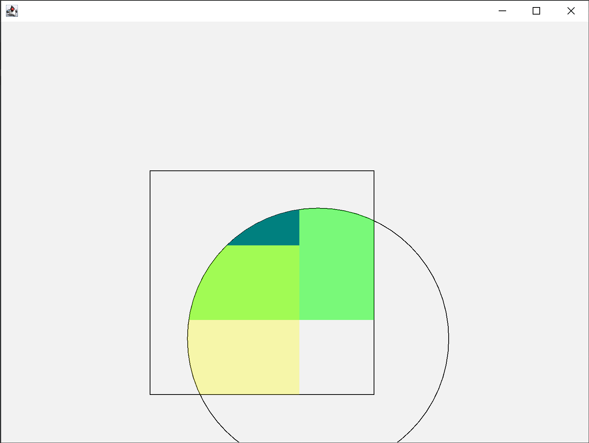

使用`clip`系列函数时，默认是拿现有的裁剪区域与新的裁剪区域相交，得到一个更小的裁剪区域。
如果要想直接设定当前裁剪区域，请使用`setClip`系列函数，这将无视当前裁剪区域，直接将新的裁剪区域设定为新的当前裁剪区域。

### 3.3 坐标变换

坐标变换是一个相对来说比较复杂的东西，我们仍然是只学习最常用的那一部分。

基础的变换主要分为3大类，想必我们在数学课上都已经学过了。也就是：

- 平移变换
- 缩放变换
- 旋转变换

同时，变换之间也可以相互组合，形成组合变换。我们在学习矩阵运算的时候应该也大概学习过。
而在程序中，这些变换确实也是通过矩阵运算来实现的。

Swing中使用`AffineTransform`来表示变换矩阵。这也是Graphics2D的其中一个属性。所有的三种变换都是通过操作这个属性来实现的。

#### 3.3.1 平移变换

最简单的一种变换，只需指定一个x和y的偏移量就可以了。直接看例子。

!!! example "平移变换"

    代码:

    ```java
    g2.drawString("原来的图形", 50, 100);
    g2.drawRect(50, 150, 200, 100);

    g2.setPaint(Color.BLUE);
    // 取得当前变换矩阵
    var oldTransform = g2.getTransform();
    // 进行平移变换
    g2.translate(80, 90);
    g2.drawString("变换后的图形", 50, 100);
    g2.drawRect(50, 150, 200, 100);
    // 恢复原来的变换矩阵
    g2.setTransform(oldTransform);
    ```

    效果：

    

#### 3.3.2 缩放变换

指定一个x和y的缩放倍数就可以了，将会以(0, 0)为原点进行缩放。还是看例子。

!!! example "缩放变换"

    代码:

    ```java
    g2.drawString("原来的图形", 50, 100);
    g2.drawRect(50, 150, 200, 100);
    g2.drawRect(0, 0, 500, 300);

    g2.setPaint(Color.RED);
    // 取得当前变换矩阵
    var oldTransform = g2.getTransform();
    // 进行缩放变换
    g2.scale(1.5, 1.5);
    g2.drawString("变换后的图形", 50, 100);
    g2.drawRect(50, 150, 200, 100);
    g2.drawRect(0, 0, 500, 300);
    // 恢复原来的变换矩阵
    g2.setTransform(oldTransform);
    ```

    效果：

    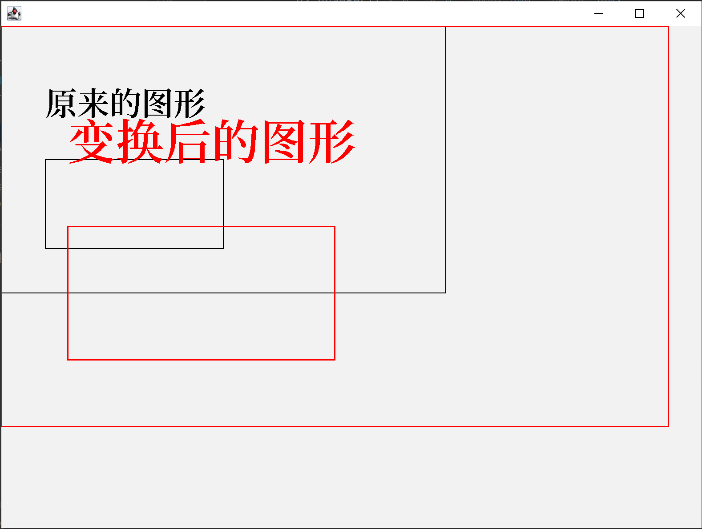

#### 3.3.3 旋转变换

通常是指定一个旋转的中心点，再指定一个旋转角度(顺时针)。
由于可以指定的方式比较多，这里只演示指定中心点的坐标和度数时的情形。

!!! example "旋转"

    代码:

    ```java
    Rectangle rect = new Rectangle(300, 550, 200, 100);
    g2.drawString("原来的图形", rect.x, rect.y + 35);
    g2.drawRect(rect.x, rect.y, rect.width, rect.height);

    // 取得当前变换矩阵
    var oldTransform = g2.getTransform();
    // 绘制旋转路径的圆
    g2.drawOval(50, 50, 500, 500);

    // 旋转60度
    g2.setPaint(Color.RED);
    g2.rotate(- Math.PI / 3, 300, 300);
    g2.drawString("旋转后的图形", rect.x, rect.y + 35);
    g2.drawRect(rect.x, rect.y, rect.width, rect.height);

    // 再旋转60度
    g2.setPaint(Color.BLUE);
    g2.rotate(- Math.PI / 3, 300, 300);
    g2.drawString("二次旋转后的图形", rect.x, rect.y + 35);
    g2.drawRect(rect.x, rect.y, rect.width, rect.height);

    // 恢复原来的变换矩阵
    g2.setTransform(oldTransform);
    ```

    效果：

    

在旋转的时候，有一种特殊的旋转，就是整90度旋转。这种旋转明显不需要进行复杂的矩阵运算，为此专门提供了一系列函数用来进行这种操作。另外即使不明确使用这个系列的函数，仍然使用普通的函数，实际在旋转的过程中，会判断角度是否非常接近整90度，如果是的话，会自动调用这个系列的函数。

来看一下例子吧：

!!! example "整90度旋转"

    代码:

    ```java
    Rectangle rect = new Rectangle(300, 550, 200, 100);
    drawStringLeftTop(g2,"原来的图形", 32, rect.x, rect.y);
    g2.drawRect(rect.x, rect.y, rect.width, rect.height);

    // 取得当前变换矩阵
    var oldTransform = g2.getTransform();
    // 绘制旋转路径的圆
    g2.drawOval(50, 50, 500, 500);

    // 旋转90度
    g2.setPaint(Color.RED);
    g2.transform(AffineTransform.getQuadrantRotateInstance(-1, 300, 300));
    drawStringLeftTop(g2,"旋转90度后的图形", 32, rect.x, rect.y);
    g2.drawRect(rect.x, rect.y, rect.width, rect.height);

    // 再旋转90度
    g2.setPaint(Color.BLUE);
    g2.transform(AffineTransform.getQuadrantRotateInstance(-1, 300, 300));
    drawStringLeftTop(g2,"再次旋转90度后的图形", 32, rect.x, rect.y);
    g2.drawRect(rect.x, rect.y, rect.width, rect.height);

    // 再旋转90度
    g2.setPaint(Color.BLUE);
    g2.transform(AffineTransform.getQuadrantRotateInstance(-1, 300, 300));
    drawStringLeftTop(g2,"再次旋转90度后的图形", 32, rect.x, rect.y);
    g2.drawRect(rect.x, rect.y, rect.width, rect.height);

    // 恢复原来的变换矩阵
    g2.setTransform(oldTransform);
    ```

    效果：

    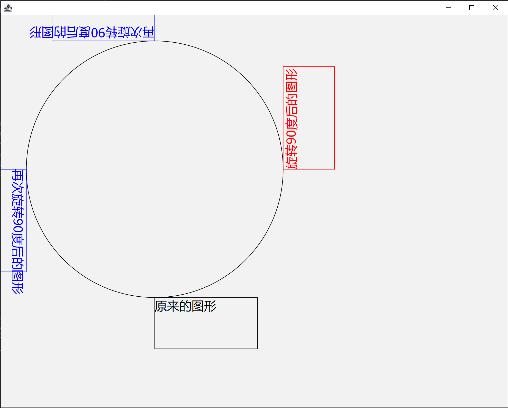

#### 3.3.4 组合变换

这次我们看看如何进行组合变换，首先假定我们要完成这样一个绘制任务。

!!! example "绘制任务"

    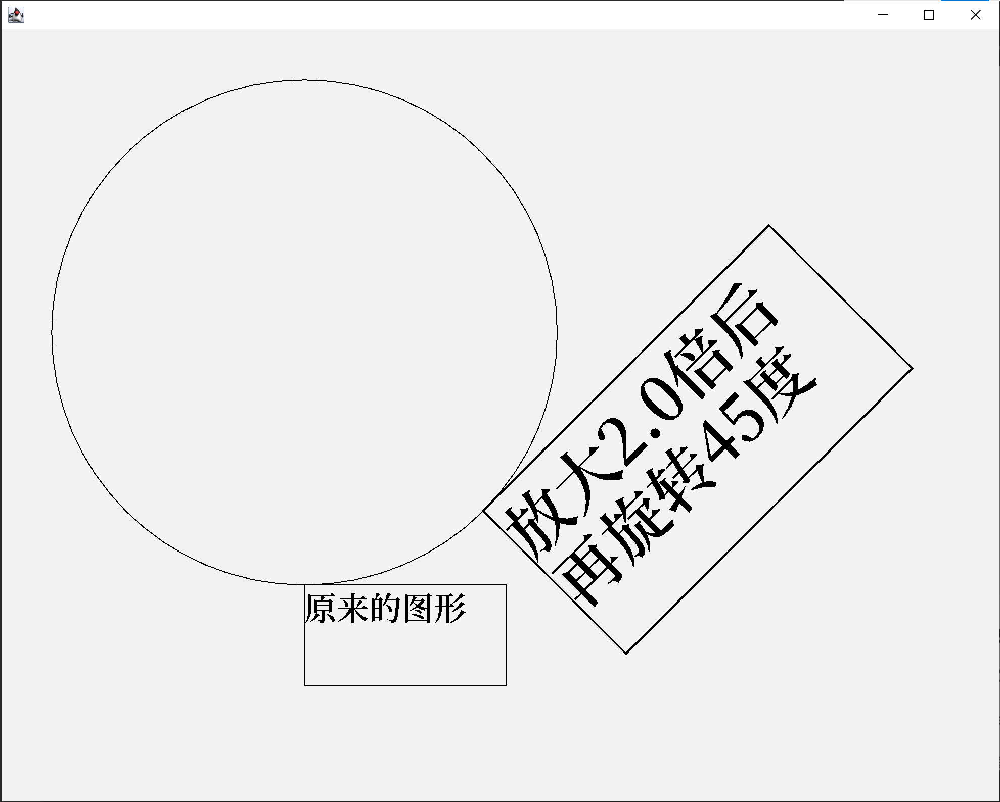

也就是要把原来的矩形，原地放大2倍后，再逆时针旋转45度。

经过一番推导，可以得到如下的变换步骤。

- 1.将矩形移动到原点(0,0)的位置
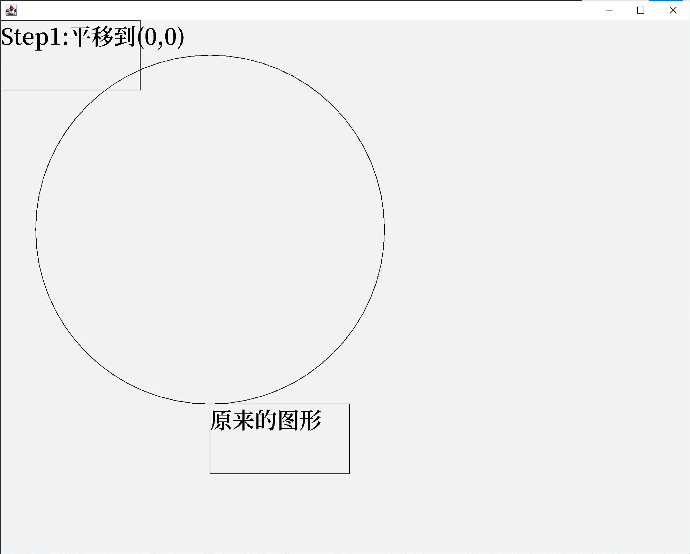
- 2.放大到2倍
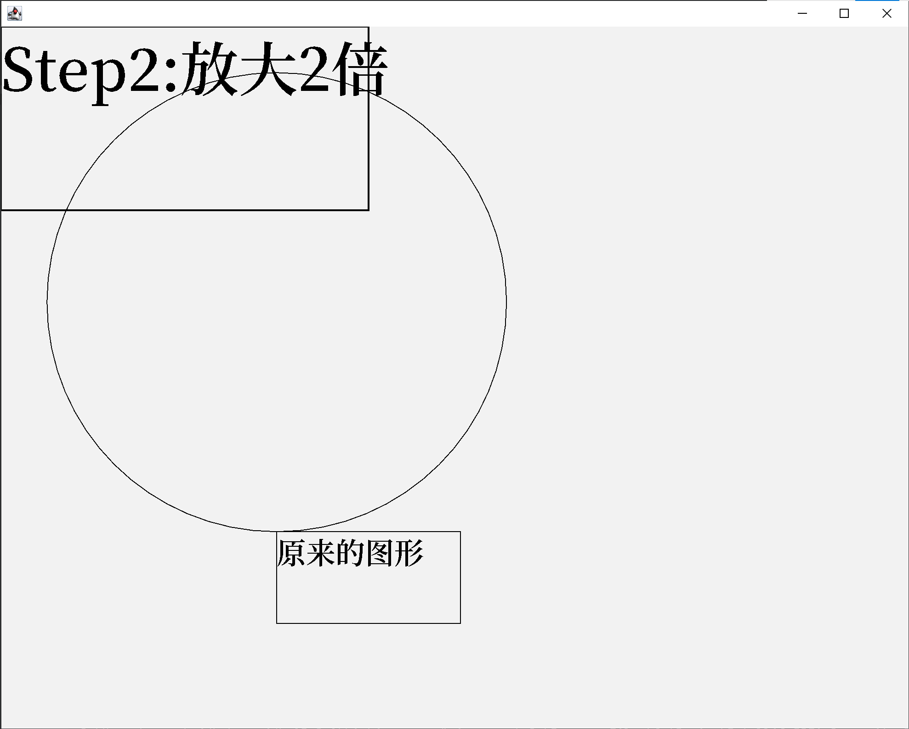
- 3.平移回原来的位置
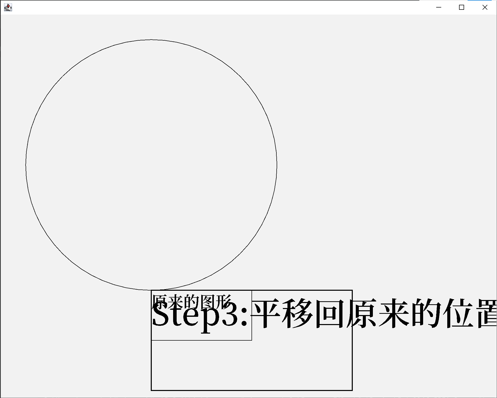
- 4.沿圆心逆时针旋转45度
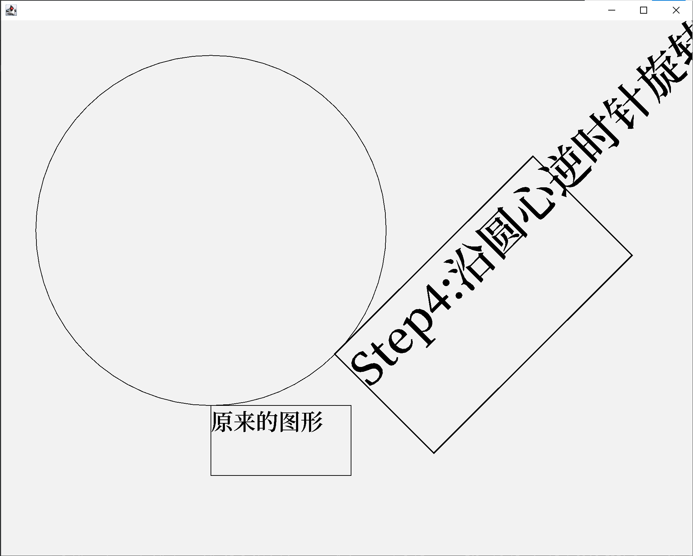

得到了这个步骤之后，我们在程序里面要把这个步骤给倒过来。也就是按照下面的代码：

!!! example "倒序执行变换步骤的代码"

    ```java
    // 4.沿圆心逆时针旋转45度
    g2.rotate(- Math.PI / 4, circleX, circleY);
    // 3.平移回原来的位置
    g2.translate(rect.x, rect.y);
    // 2.放大到2倍
    g2.scale(2, 2);
    // 1.将矩形移动到原点(0,0)的位置
    g2.translate(-rect.x, -rect.y);
    ```

掌握了这个规律后，相信其它的任何复杂的绘制任务都不会是什么难事了。
这个任务完整的演示代码和效果如下：

!!! example "组合变换"

    代码:

    ```java
    Rectangle rect = new Rectangle(300, 550, 200, 100);
    g2.drawString("原来的图形", rect.x, rect.y + 35);
    g2.drawRect(rect.x, rect.y, rect.width, rect.height);

    // 取得当前变换矩阵
    var oldTransform = g2.getTransform();
    // 绘制旋转路径的圆
    int circleX = 300;
    int circleY = 300;
    int circleR = 250;
    g2.drawOval(circleX - circleR, circleY - circleR, 2 * circleR, 2 * circleR);

    double scale = 2d;
    g2.setTransform(oldTransform);

    // 4.沿圆心逆时针旋转45度
    g2.rotate(- Math.PI / 4, circleX, circleY);
    // 3.平移回原来的位置
    g2.translate(rect.x, rect.y);
    // 2.放大到2倍
    g2.scale(2, 2);
    // 1.将矩形移动到原点(0,0)的位置
    g2.translate(-rect.x, -rect.y);

    String text = String.format("组合变换结果");
    g2.drawString(text, rect.x, rect.y + 35);
    g2.drawRect(rect.x, rect.y, rect.width, rect.height);
    ```

    效果：

    

### 3.4 渲染质量

Graphics2D中提供了很多控制选项来控制图形绘制的质量。这些选项存放在一个叫做`renderingHint`的Map类型的属性中。

这个Map中的选项比较多，其中比较重要的选项有：

| 选项ID | 含义
|:--|:--
| KEY_ALPHA_INTERPOLATION 	| Alpha混合的插值算法
| KEY_ANTIALIASING 	| 抗锯齿
| KEY_COLOR_RENDERING | 色彩渲染
| KEY_DITHERING 	| 色彩精度
| KEY_INTERPOLATION 	| 插值算法
| KEY_RENDERING 	| 渲染质量
| KEY_TEXT_ANTIALIASING | 字体抗锯齿

选项的值设定很简单，都是从`ON/OFF`或者从`质量/速度`里面二选一的。
这些选项的默认值都是在绘制质量与速度中比较平衡的。

如果是对绘制质量要求很高，则可以把所有的设置开到最高。
如果是对绘制速度有一定的要求，则可以酌情调整。

我在编写游戏时使用的配置是：

| 选项ID | 含义 | 选择的值
|:--|:--|:--
| KEY_ALPHA_INTERPOLATION 	| Alpha混合的插值算法 | 默认值
| KEY_ANTIALIASING 	| 抗锯齿 | VALUE_ANTIALIAS_OFF
| KEY_COLOR_RENDERING | 色彩渲染 | VALUE_COLOR_RENDER_SPEED
| KEY_DITHERING 	| 色彩精度 | 默认值
| KEY_INTERPOLATION 	| 插值算法 | VALUE_INTERPOLATION_BILINEAR
| KEY_RENDERING 	| 渲染质量 | VALUE_RENDER_SPEED
| KEY_TEXT_ANTIALIASING | 字体抗锯齿 | VALUE_TEXT_ANTIALIAS_ON

下面演示一下默认质量和最高质量的效果：

默认质量 | 高质量
:--|:--
 | 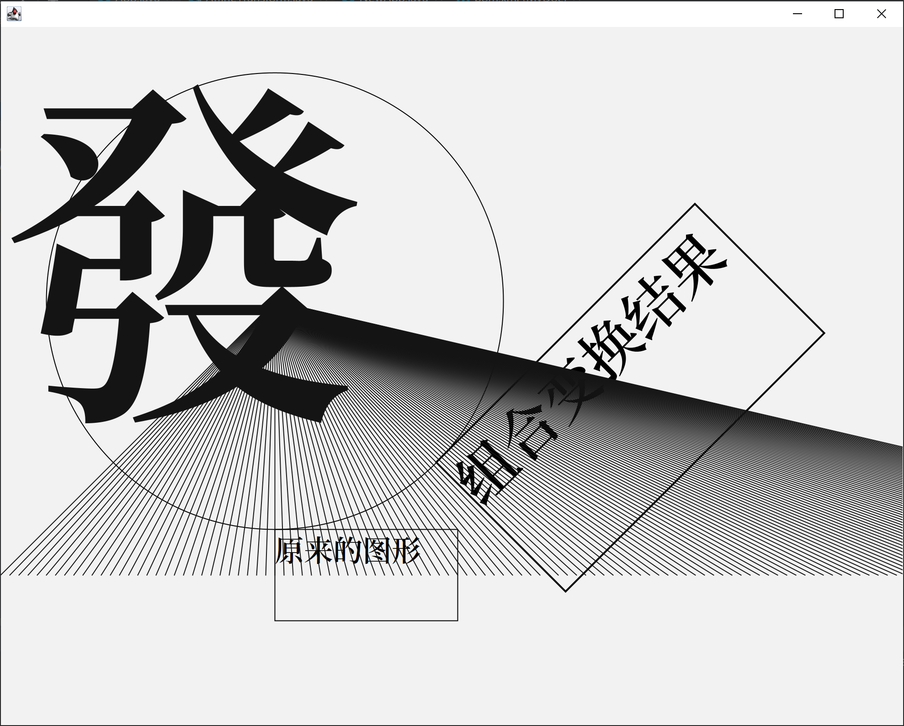
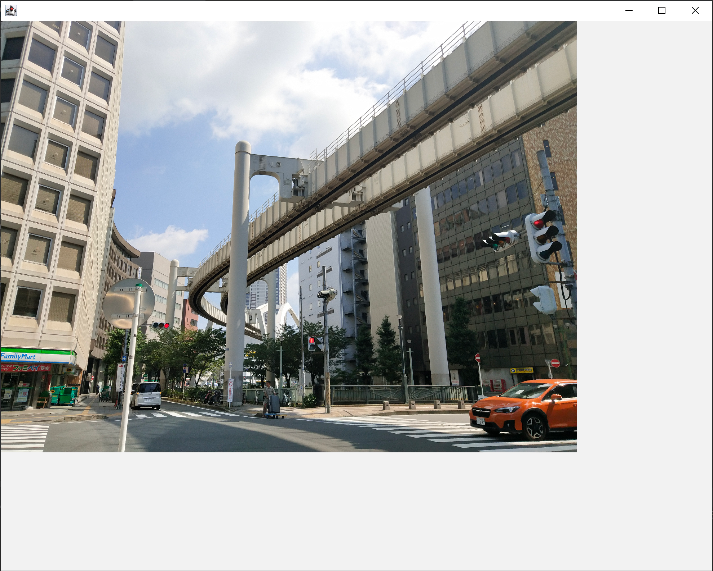 | 
 | 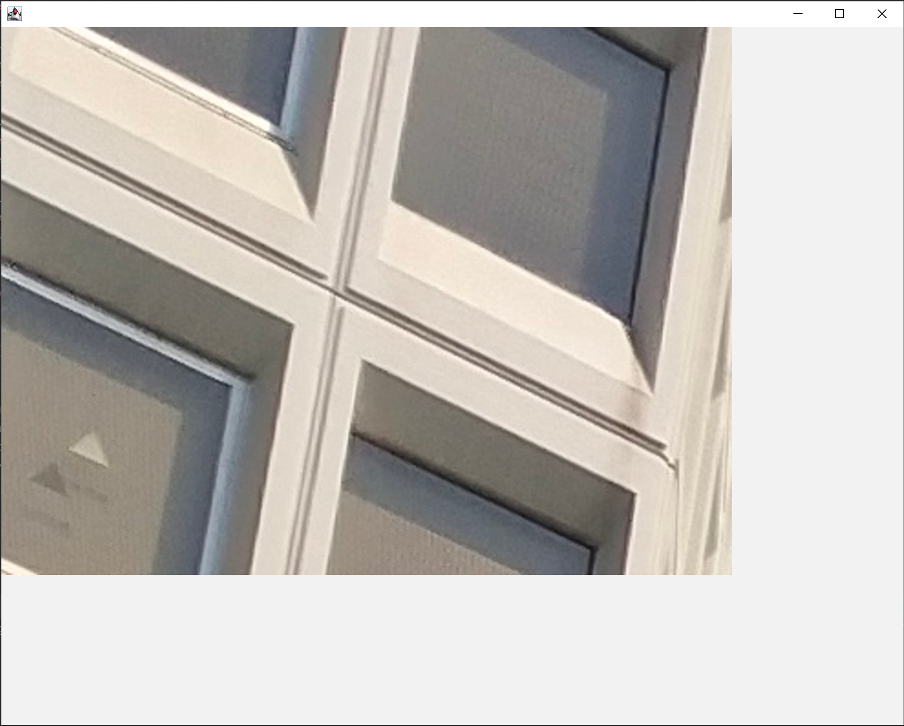

区别不算特别大，但是细看的话高质量确实是平滑无比。

### 3.5 字体

字体这一属性我们早已经使用过了，在Swing中用`Font`类来表示字体。
在`1.6.2 将字体文件嵌入程序内`这一篇文章中我们已经学习了加载字体和字体的一些简单用法。

这里我们来看一看更多用法。

首先是设置字体大小。看下面的代码：

!!! example "设置字体大小"

    ```java
    g2.setFont(font.deriveFont(32.0f));
    ```

然后是字体的样式，就是粗体和斜体之类的。

!!! example "设置字体样式"

    代码:

    ```java
    // 设定字体样式和大小
    g2.setFont(g2.getFont().deriveFont(Font.PLAIN, 32.0f));
    g2.drawString("Font.PLAIN -> Hello, 这是一个演示程序。", 0, 200);
    g2.setFont(g2.getFont().deriveFont(Font.BOLD, 32.0f));
    g2.drawString("Font.BOLD -> Hello, 这是一个演示程序。", 0, 250);
    g2.setFont(g2.getFont().deriveFont(Font.ITALIC, 32.0f));
    g2.drawString("Font.ITALIC -> Hello, 这是一个演示程序。", 0, 300);
    g2.setFont(g2.getFont().deriveFont(Font.BOLD | Font.ITALIC, 32.0f));
    g2.drawString("Font.BOLD | Font.ITALIC -> Hello, 这是一个演示程序。", 0, 350);
    ```

    效果：

    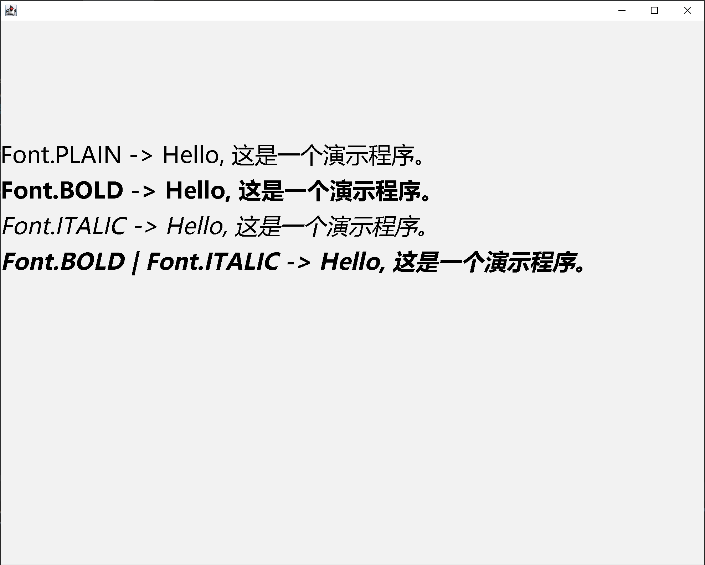

字体还有更多复杂的用法，比如字体布局、字体坐标变换等，这里就不再介绍了。

## 4. 绘制

Graphics2D提供了很多用于进行图形绘制的方法。主要用于绘制如下的图形对象：

- 几何图形
- 文字
- 图片

### 4.1 几何图形

几何图形包括了：直线、多边形、矩形、圆形。多边形用到的不多而且比较麻烦，这里就不多讨论了。

绘制方法非常简单，前面其实已经用过很多次了。这里直接用例子来演示一下：

!!! example "绘制几何图形"

    代码:

    ```java
    // 绘制直线
    g2.drawLine(100, 100, 400, 800);
    g2.drawLine(200, 300, 200, 700);
    // 绘制矩形
    g2.drawRect(50, 80, 400, 100);
    g2.drawRect(300, 200, 500, 500);
    // 绘制圆形
    g2.drawOval(500, 500, 200, 100);
    g2.drawOval(400, 60, 400, 400);
    ```

    效果：

    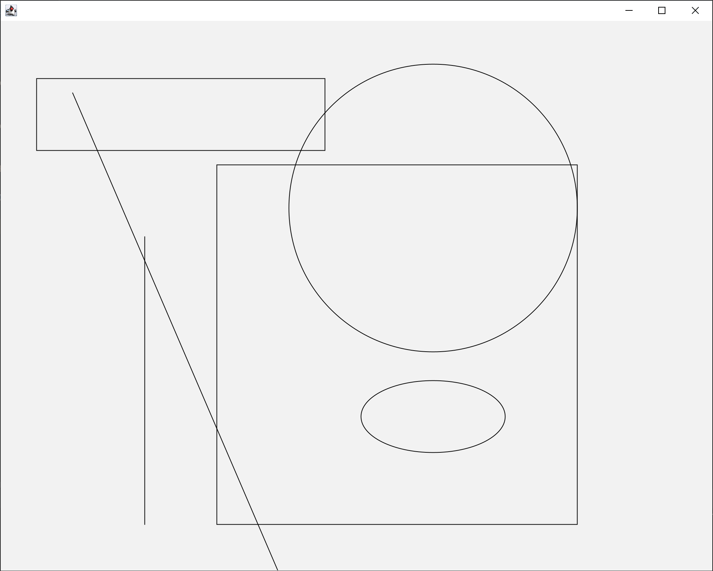

### 4.2 文字

文字的绘制，我们前面已经多次提到过了。这里想补充说明的是文字的绘制位置问题。

Graphics2D提供的函数`drawString`在绘制的时候，y轴是按照文字基准线`baseLine`来指定的。
比如，我想在一个矩形框中绘制文字，但结果却是这样：

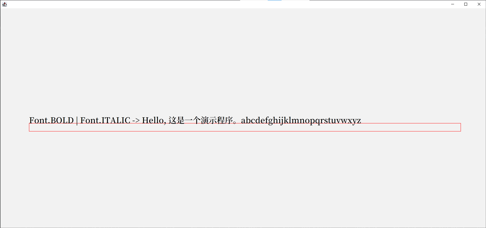

要想方便的调整字体绘制的位置，只能自己调整了，Graphics2D中没有提供方便的绘制方法。
从图中可以看到，如果我们知道文字基准线在字体整体高度中的处于的位置，就是可以调的。

这个计算过程有点麻烦，我封装了一个函数用来在指定的左上角位置开始输出文字：

!!! example "从左上角开始输出文字"

    代码:

    ```java
    // 在指定位置绘制文字（左上角）
    private void drawStringLeftTop(Graphics2D g2, String text,int fontSizePixel, int x, int y) {
        // 显示器的DPI通常为96，计算字体大小
        double fontSize= 72.0 * fontSizePixel / 96.0;
        // 保存当前字体
        Font oldFont = g2.getFont();
        // 重新设定字体大小
        g2.setFont(oldFont.deriveFont((float) fontSize));

        // 绘制表示范围的矩形框
        g2.drawRect(x, y, 1500, fontSizePixel);

        Font font = g2.getFont();
        // 获得文字渲染上下文
        var ctx = g2.getFontRenderContext();
        // 获得行高标尺
        var lineMetries = font.getLineMetrics(text, ctx);
        // 获得文字真实高度
        float textHeight = lineMetries.getAscent() + lineMetries.getDescent();
        // 平衡一下文字高度和显示位置的高度(计算出的文字高度可能比目标区域的高度略高)
        float newHeight = (fontSizePixel + textHeight) / 2;
        // 获得文字基准线位置
        int baseLine = (int)(newHeight - lineMetries.getDescent());
        g2.drawString(text, x, y + baseLine);

        // 复原到原来的字体
        g2.setFont(oldFont);
    }
    ```

    效果：

    

说完了y轴的位置，其实x轴的位置也容易遇到问题。通常我们是从目标位置的最左边开始绘制文字的，但是有时候我们需要居中绘制文字。这时我们如果知道文字绘制之后占据的宽度，就很容易计算了。

同样，我封装了一个函数用来计算这个过程。

!!! example "居中绘制文字"

    代码:

    ```java
    // 水平居中绘制文字
    private void drawStringCenter(Graphics2D g2, String text, int fontSizePixel, int x, int y, int w) {
        // 假定DPI为96，计算字体大小
        double fontSize= 72.0 * fontSizePixel / 96.0;
        // 保存当前字体
        Font oldFont = g2.getFont();
        // 重新设定字体大小
        g2.setFont(oldFont.deriveFont((float) fontSize));

        // 绘制表示范围的矩形框
        g2.drawRect(x, y, w, fontSizePixel);

        Font font = g2.getFont();
        // 获得文字渲染上下文
        var ctx = g2.getFontRenderContext();
        // 获得行高标尺
        var lineMetries = font.getLineMetrics(text, ctx);
        // 获得文字真实高度
        float textHeight = lineMetries.getAscent() + lineMetries.getDescent();
        // 平衡一下文字高度和显示位置的高度(计算出的文字高度可能比目标区域的高度略高)
        float newHeight = (fontSizePixel + textHeight) / 2;
        // 获得文字基准线位置
        int baseLine = (int)(newHeight - lineMetries.getDescent());
        // 计算文字渲染后的宽度
        double textWidth = font.getStringBounds(text, ctx).getWidth();
        g2.drawString(text, x + (int)(w - textWidth) / 2, y + baseLine);

        // 复原到原来的字体
        g2.setFont(oldFont);
    }
    ```

    效果：

    

### 4.3 图片

图片的绘制是非常常用的操作了，在绘制的过程中可以进行各种裁剪操作。并且根据源图片和目标区域的大小自动进行缩放。让我们直接看代码。

!!! example "绘制图片"

    代码:

    ```java
    // 按目标区域进行缩放绘图
    g2.drawImage(img, 100, 100, 400, 300, null);
    // 只显示图片的一部分
    g2.drawImage(img, 520, 100, 520 + 200, 100 + 200, 1000, 1200, 1600, 1800, null);
    // 水平反转贴图(使sx2 < sx1)
    g2.drawImage(img, 520, 320, 520 + 200, 320 + 200, 1000, 1200, 400, 1800, null);
    // 垂直反转贴图(使sy2 < sy1)
    g2.drawImage(img, 100, 420, 500, 720, 0, img.getHeight(null), img.getWidth(null), 0, null);
    ```

    效果：

    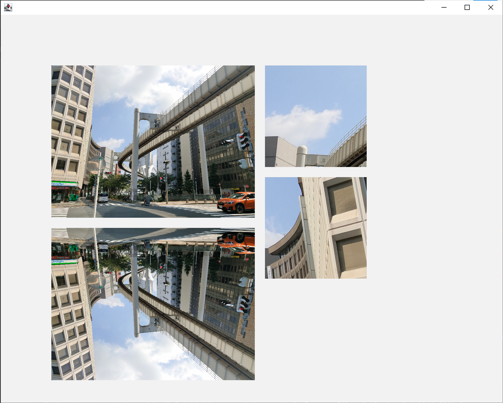
