# G. 打包成可执行程序

更新日期：2021-01-09

-------------------------------------  

## 1. 概述

在这篇文章中我们来讨论一下Java程序的打包问题。
这里的Java程序指的是本地运行的Java控制台程序或者GUI程序。Java Web程序的打包与发布与本地程序所采用的方式很不一样，这里不做讨论。

当我们的程序写完之后。我们都希望这个程序是有用的，而且是便于使用的。
一个便于使用的程序我认为要具有下面这些特点：

- 易于发布
- 易于安装
- 易于运行
- 友好的使用界面

关于程序的使用界面，亦不在这次的讨论范畴中，本篇文章的目标是前三个。

## 2. Java程序面临的问题

我们都知道，Jave程序需要JRE环境才能运行。而且有很多的共用类库，也就是第三方jar包供我们使用。而Java的打包方式又是多种多样的。这在一定程度上造成了混乱。

其他用户在使用Java程序时，往往会遇到如下几个问题：

- 没有安装Jave运行时环境Jre，无法运行
- 安装的Jre版本过低，无法运行
- 缺少依赖的第三方Jar包，无法运行
- 只拿到一个Jar包，不知道该如何运行

本篇文章的具体目标就是为了解决如上几个问题。但首先我先说明一下为何会有这几个问题。

### 2.1 问题一：没有安装Jave运行时环境Jre，无法运行

本来按照设想，Java在普及度提高以后会成为各大操作系统上一定会被安装的组件。然而事实情况却是: Java只在大型Web服务器上普及。

因为大型Web项目，使用Java来开发的公司是很多的。所以服务器上通常都装有Java环境。
而本地程序则没有多少人用Java开发。所以一般用户的电脑上都是没有安装Java运行时环境的。

这个和Windows的VC++ 运行时环境是类似的。微软当然是可以让Windows操作系统自带VC++运行时环境。同理苹果公司也可以让Mac OS X自带自己的一些运行时环境。但Java就没有办法了，必须由用户手动安装。

### 2.2 问题二：安装的Jre版本过低，无法运行

即使用户安装了Jre，也可能由于版本问题的原因而无法运行。

现在Java的版本迭代是很快的，半年一个全新的正式版本。在大多数Java程序还在使用Java8甚至是Java1.7时。Java15已经正式发布，Java16也快要发布了。（2021年1月时点）

有一部分Java程序员喜欢尝试新版本中的新特性，比如我。所以我开发的Java程序通常需要最新的长期支持版Java环境。这样的话，由于很多人的机器上还安装着Java8，就无法运行。

并且，由于Java的后几个版本的改动都有点大。所以，我们安装了一个较低版本的Jre之后，每次发布新版本时可能会有兼容性问题，并不会自动升级到新版Jre。

### 2.3 问题三：缺少依赖的第三方Jar包，无法运行

本来Java的各个程序可以共用一些第三方Jar包，这样这些Jar包只需要在机器上保存一份就可以。然后程序就不需要再带着这个Jar包。这样能减小程序本体这个Jar包的体积。

然而事实情况是，我们通常情况下没有能力创造这样一种环境。或者说太麻烦，实现起来很复杂。

这里举个例子来说明。

!!! example "Tomcat"
    虽然我说不讨论Web程序，但用来举例恰好是合适的。

    假设我们公司开发的Web应用都将部署到Tomcat上，那么服务器上自然要安装Tomcat。
    而Tomcat会自带一些我们开发Java Web程序时经常用到的一些Jar包。这样我们的Web程序在打包的时候就不需要带着这些包了。

而且，要命的是第三方Jar包也会有一个版本的问题。

### 2.4 问题四：只拿到一个Jar包，不知道该如何运行

我们通过IDE编写好程序后给我们生成的就是一个Jar包，而程序员都知道使用`java -jar`命令来运行Jar包。

但是普通人并不知道。或者说即使是知道，要这样来运行程序很麻烦，很别扭。
更何况，没有安装正确版本的Jre时，也不能这样来运行jar包。同时用户也很难按我们想的那样去指定jvm参数。

## 3. 问题的解决策

其实，关于如何发布程序（不限于Java）。是有现成的方案的。

比如：在线安装包。

!!! example "在线安装包"
    这也是现在很多软件安装包喜欢采用的方式。所有运行所需要的文件都可以按需下载到用户的机器上，当然文件的版本也能保证是正确的。安装完成之后即可正常运行。Jre也可以这样来安装。

    用起来很舒服，但是做起来就有点复杂了。而且还需要一台服务器去存放安装所需的文件。
    如果我们只是写一些小工具之类的程序，就生成一个几十KB的Jar包，也没必要花费功夫去搞这些玩意儿。

又比如：战网模式。

!!! example "战网模式"
    战网，也即是暴雪战网。当然战网并不使用Java语言，但我们假设它使用Java语言，正好可以拿来举例。

    我们安装了战网后，可以在战网的界面上选择安装各种游戏。战网就可以起到一个中间运行时平台的作用。

    安装战网的时候，我们可以直接把各个游戏用到的Jre给安装上。同样各个游戏共用的第三方Jar包也可以直接部署上。即使有不同的游戏用了不同的Jre版本，我们也可以把这几个版本的Jre都给安装上。

    更新战网的时候，这些Jre和第三方Jar包也会按我们所需进行更新。

    这和上面举例说到的Tomcat是类似的。
    但是，同样的。实现起来太麻烦。

我们这里想说的是简单的，容易实现的方案。也就是把运行所需要的所有文件直接打包，发布给用户。
这就意味着。

- 内嵌Jre运行时环境。用户的机器上不用安装Java环境也能运行。
- 包含所有依赖的第三方Jar包。用户的机器上不需要额外下载任何其他东西。

由于我们内嵌了Jre，Jre版本当然不会再有问题。这样问题一和二就解决了。
我们也包含了所有依赖的第三方Jar包。所以问题三也解决了。

而对于问题四，针对各个PC操作系统。我们将把Jar包包装成该系统中的可执行程序。让他和系统上的其他程序看起来一样。
比如：Windows系统上，把Jar包给包装成exe可执行程序。用户拿到后都知道双击exe就能运行，或者是点击菜单中的程序图标来运行。
这样就不用安装Jre环境敲命令了，同时jvm调优参数我们也能包装进去，也保证了程序的性能。

下面就详细的介绍一下这个方案的实现细节。主要分为如下几个步骤。

- 将程序打包为包含所有依赖的可执行Jar包
- 制作迷你JRE运行时环境包
- 将Jar包和迷你JRE打包为操作系统中的可执行程序包

## 4. 解决方案的具体步骤

### 4.1 将程序打包为包含所有依赖的可执行Jar包

使用Maven来打包是比较方便的。而Java IDE通常会集成Maven让我们可以用图形界面去执行Maven命令，可以说是很贴心了。

好在这件事做起来很简单，只需在pom.xml文件中进行如下配置。

!!! example "pom.xml"

    ```xml
    <build>
        <plugins>
            <plugin>
            <artifactId>maven-assembly-plugin</artifactId>
            <version>3.3.0</version>
            <configuration>
                <archive>
                <manifest>
                    <mainClass>org.example.App</mainClass>
                </manifest>
                </archive>
                <descriptorRefs>
                <descriptorRef>jar-with-dependencies</descriptorRef>
                </descriptorRefs>
            </configuration>
            <executions>
                <execution>
                <id>make-assembly</id> <!-- this is used for inheritance merges -->
                <phase>package</phase> <!-- bind to the packaging phase -->
                <goals>
                    <goal>single</goal>
                </goals>
                </execution>
            </executions>
            </plugin>
        </plugins>
        XXXX 其他配置
    </build>
    ```

也就是使用了Maven的`maven-assembly-plugin`插件来完成这个任务，这个插件的具体用法可以参考Maven的官方文档:

[maven-assembly-plugin](http://maven.apache.org/plugins/maven-assembly-plugin/usage.html)

上面的代码也是我直接从官方文档中拷贝出来的。
简单的说明一下。

!!! note "配置说明"
    ``` xml
    <mainClass>org.example.App</mainClass>
    这一行用来指定主类，也即是main函数所在的类，相信大家都知道应该怎么配置。

    <descriptorRef>jar-with-dependencies</descriptorRef>
    表明打Jar包时将包含所有依赖的Jar包。这行不用改。

    <id>make-assembly</id> <!-- this is used for inheritance merges -->
    为了区分<execution>xxxx</execution>块的一个标识性ID。通常不用修改。

    <phase>package</phase> <!-- bind to the packaging phase -->
    绑定到package生命周期。这样的话，我们执行Maven的package命令来打包时，就会执行这个插件。
    通常不用修改。

    <goal>single</goal>
    给插件执行的任务起一个名字。通常不用修改。
    ```

说了半天，其实一般情况下，我们把上面的代码拷到自己的pom.xml后，只需要改一下`主类`的配置就行了。

!!! warning "特别提醒"
    如果你正在使用`IntelliJ IDEA`作为Java IDE，则IDEA自动生成的`pom.xml`文件中会包含如下代码块：
    ```xml
    <bulid>
        <pluginManagement><!-- lock down plugins versions to avoid using Maven defaults (may be moved to parent pom) -->
            <plugins>
                <!-- clean lifecycle, see https://maven.apache.org/ref/current/maven-core/lifecycles.html#clean_Lifecycle -->
                <plugin>
                <artifactId>maven-clean-plugin</artifactId>
                <version>3.1.0</version>
                </plugin>
                xxx xxx 其他插件
                <plugin>
                <artifactId>maven-site-plugin</artifactId>
                <version>3.7.1</version>
                </plugin>
            </plugins>
        </pluginManagement>
    </build>
    ```
    注意我们拷贝的`<plugin>`不是放在这个`<pluginManagement>`里面的。是放在如下的位置：
    ```xml
    <build>
        <plugins>
            <plugin>
            <artifactId>maven-assembly-plugin</artifactId>
            xxxx 其他配置
            </plugin>
        </plugins>
        XXXX 其他配置
    </build>
    ```
    放错的话不会生效。

配置完成后，我们执行`mvn package`命令就可以生成Jar包了。在IDEA中，使用Maven工具面板上的package命令可以轻松的完成这个任务。

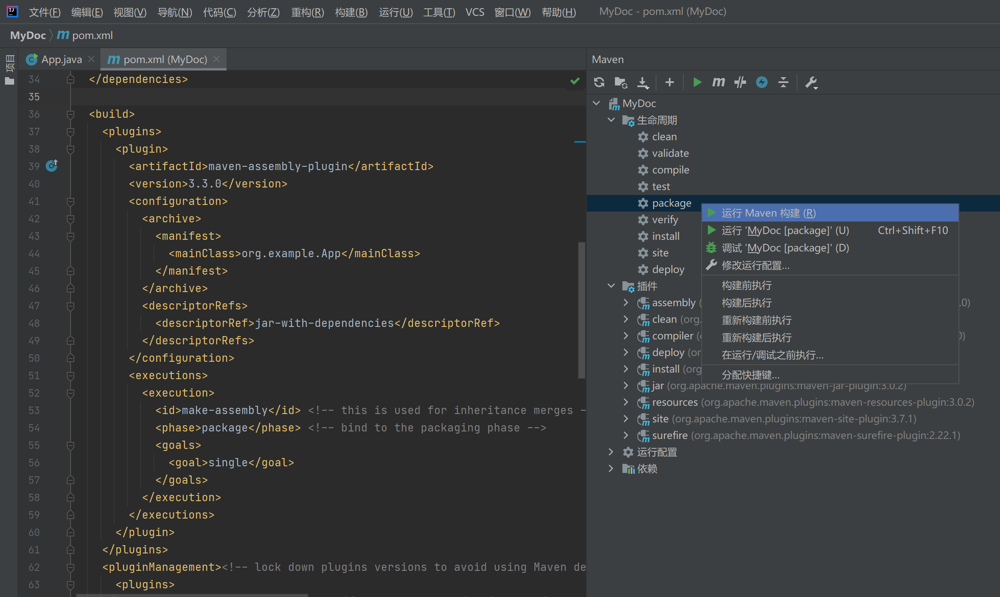

执行完成后，会生成两个Jar包。

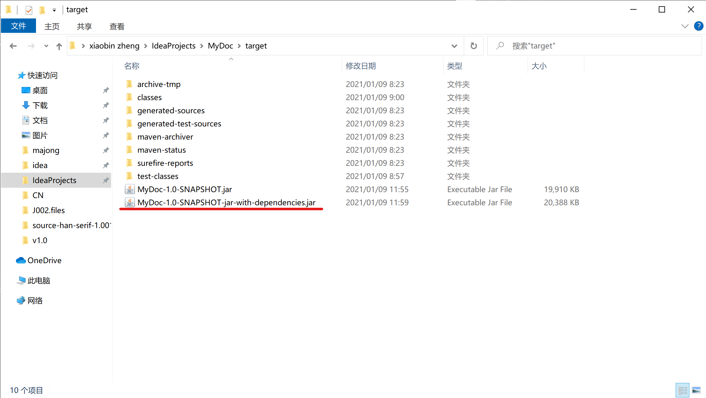

带`jar-with-dependencies`的那个就是包含了所有依赖Jar包的，另外一个则是普通的。可以看到它的体积比普通的那个要大。

然后我们要验证一下这个Jar包确实是能正常执行的。把它随便拷到一个什么地方，然后使用`java -jar`命令来执行。

这是我的程序的运行效果。
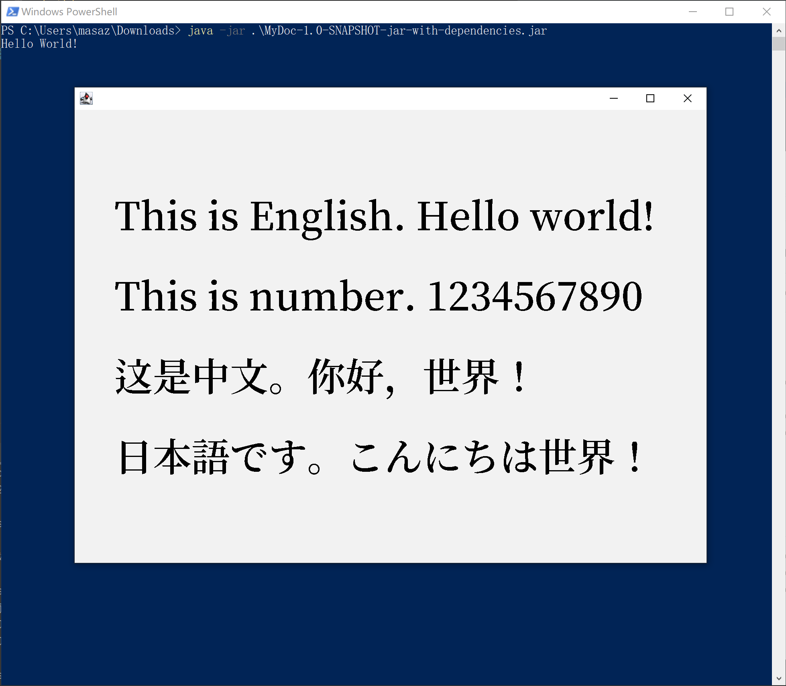

这样的话，我们的第一步就成功了。

### 4.2 制作迷你JRE运行时环境包

这里我将使用JDK中附带的一些工具来完成这个任务，但是这些工具需要Java14或者以上的版本。如果你是使用较低版本的Java，请寻找其他方法。

我们都知道JDK的体积是很大的，通常有几百MB，而我们的程序一般不会使用到Java的所有功能模块。也就意味着如果把整个JDK打进去，则会有大量的文件是没有被使用到的，白白浪费空间。
这一步就是要把这些没用的东西都去除掉，生成一个迷你的Jre。

这个操作我分为两步：

- 找出我们的程序使用到的Java功能模块
- 打包时只使用上面找到的那些功能模块

#### 4.2.1 找出我们的程序使用到的Java功能模块

这里可以使用JDK的`jdeps`工具来完成这个任务。它的详细用法我们可以去看JDK官方文档：

[jdeps官方文档](https://docs.oracle.com/en/java/javase/15/docs/specs/man/jdeps.html)

这里我们只说如何来完成我们这项任务。执行如下命令即可：

!!! example "jdeps"
    ```powershell
    jdeps --list-deps --ignore-missing-deps 你的Jar包
    ```

下面是我的MyDoc程序的运行结果：
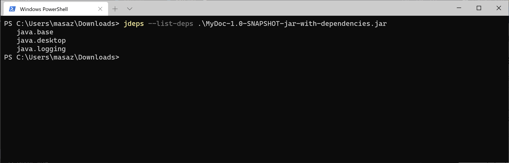

由于我们的程序非常简单，所以只用到了这三个组件。如果是复杂一点的程序，可能这个列表会很长。

这时，我们就记下这个运行结果，以备后用。

#### 4.2.2 打包时只使用上面找到的那些功能模块

使用JDK的`jlink`这个工具来生成Jre运行时环境包。它的详细用法还是去看JDK官方文档：

[jlink官方文档](https://docs.oracle.com/en/java/javase/15/docs/specs/man/jlink.html)

这里我们还是只关注如何来完成我们的这些任务。执行如下命令即可：

!!! example "jlink"
    ```powershell
    jlink --output 生成的文件存放的目录 --add-modules 模块列表 --compress=压缩级别(0, 1, 2) --no-header-files --no-man-pages --strip-debug
    ```

各个选项的参数该怎么设置呢？

|<div style="width:7em">选项</div>|参数的值|说明|
|:--|:--|:--|
|output|生成的文件存放的目录|也就是生成的Jre运行时环境包存放的目录。注意指定的文件夹必须不存在，生成时会自动创建文件夹，如果已存在则命令会报错。|
|add-modules|模块列表|把哪些JDK模块包含进去。这里就设我们上一步`jdeps`命令找出来的模块列表。例如我的MyDoc程序的例子就是：--add-modules java.base,java.desktop,java.logging|
|compress=|压缩级别(0,1,2)|不用说了，当然级别越高，压缩后的体积越小了。直接设定为2。|
|no-header-files|无|不包括无用的header文件。|
|no-man-pages|无|不包括无用的man pages文件。|
|strip-debug|无|剥离无用的调试信息。|

下面是我的MyDoc程序的运行结果：

!!! example "jlink"
    ```powershell
    jlink --output runtime --add-modules java.base,java.desktop,java.logging --compress=2 --no-header-files --no-man-pages --strip-debug
    ```

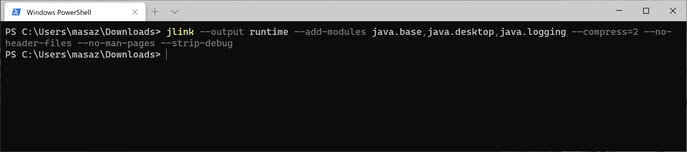

生成的文件：
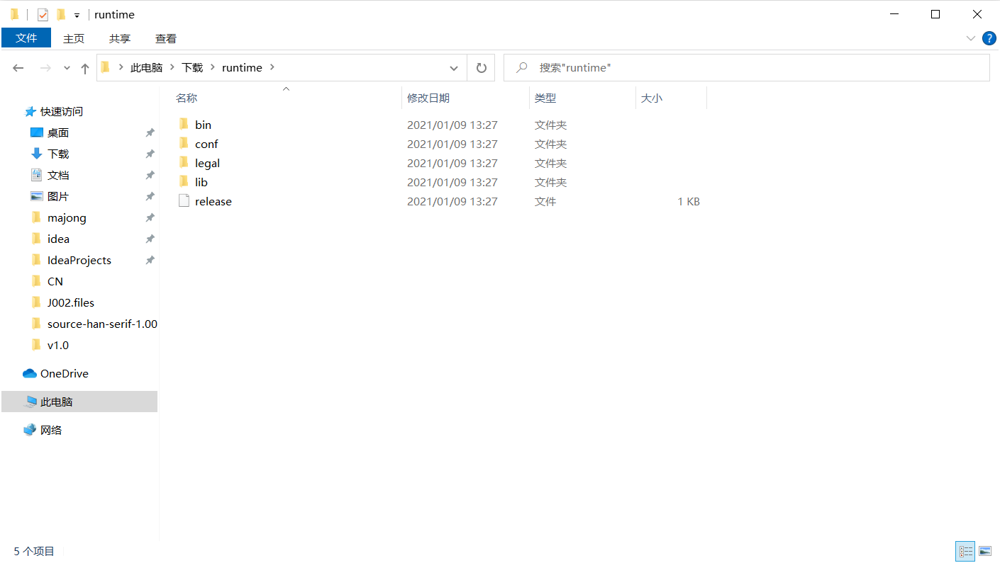

观察这个生成的文件夹，发现它的大小是38.9MB，感觉还是有点大的。

现在我们要验证生成的迷你Jre是否好用。

首先我们把环境变量里的`JAVA_HOME`去掉，使系统变成没有安装Java环境的状态。此时运行`java`命令会直接报错。

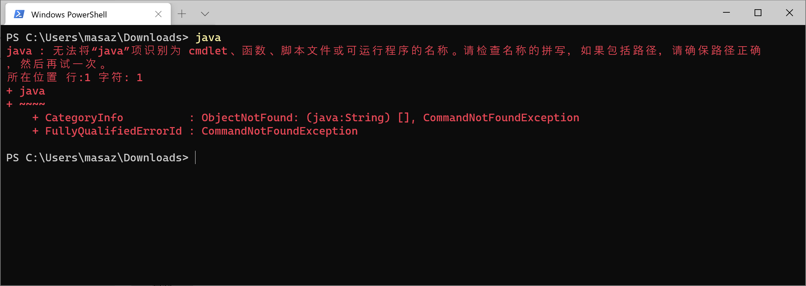

然后使用我们刚才生成的迷你Jre，先列出它包含的模块。

!!! example "列出JRE模块"
    ```powershell
    迷你JRE目录\bin\java --list-modules
    ```

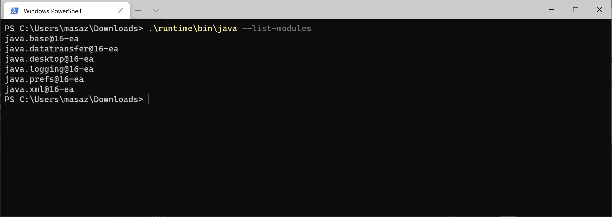

发现除了我们指定的那几个模块之外，还多了几个，不过这也无伤大雅。这就是我们的迷你JRE里面包含的所有模块了。

最后用这个迷你Jre来运行我们的Jar包试试看。

!!! example "列出JRE模块"
    ```powershell
    迷你JRE目录\bin\java -jar jar包路径
    ```

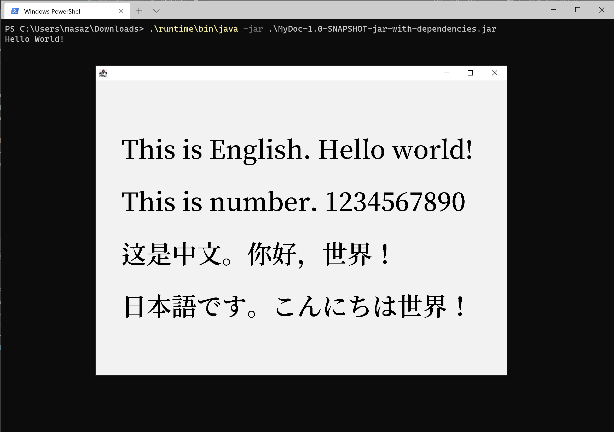

可以看到，成功的运行了我们的这个演示程序。
这样，我们的迷你JRE运行环境包就完成了。

### 4.3 将Jar包和迷你JRE打包为操作系统中的可执行程序包

Jar包和迷你JRE我们制作完成了，现在我们的程序算是已经可以运行了。接下来该把它打包成可执行程序包了。

这一步可以选择的工具是很多的。比如Windows平台上的`launch4j`、`exe4j`等。这里我们就使用JDK的`jpackage`工具来完成这项任务，这个工具比较新。还是老规矩，它的详细用法去看JDK官方文档：

[jpackage官方文档](https://docs.oracle.com/en/java/javase/15/docs/specs/man/jpackage.html)

我们只关注如何来完成我们的这些任务。不过这次要先说明一下我们准备生成怎样的可执行程序包。

现在有3大主流桌面操作系统：Windows、Mac OS X、Linux。
Java程序可以在这三大系统中运行。而这三大系统分别使用不同的可执行程序，那我们自然要分别生成不同的可执行程序包。

- 针对Windows
    - 1.生成绿色免安装的可执行程序文件。包含一个文件夹和里面的多个文件。可直接执行根目录的`.exe`来运行程序。而且可以使用其他工具来进一步制作成安装包。
    - 2.生成`.exe`或者`.msi`格式的单个程序安装包文件。执行这个安装包后将开始一个安装过程，安装完毕后与系统上其他程序一样。可加入开始菜单，可受系统的软件管理功能控制。
- 针对Mac OS X
    - 生成`.pkg`或者`.dmg`格式的单个程序安装包文件。与安装其他Mac程序的过程完全相同。
- 针对Linux
    - 生成`.deb`或者`.rpm`格式的单个程序安装包文件。可使用Linux上的包管理器安装。

在`jpackage`工具中，可以通过设置选项`--type`的参数来指定生成那种结果文件。
这个参数的设置方法如下：

| No. | 平台 | 目标格式 | type参数应设置的值 |
|:--|:--|:--|:--|
| 1 | Windows | 绿色免安装包 | app-image |
| 2 | Windows | .exe | exe |
| 3 | Windows | .msi | msi |
| 4 | Mac OS X | .pkg | pkg |
| 5 | Mac OS X | .dmg | dmg |
| 6 | Linux | .deb | deb |
| 7 | Linux | .rpm | rpm |

要完成我们的任务，`jpackage`工具的完整的命令用法如下：


!!! example "jpackage"
    ```powershell
    jpackage --type 上表中列出的值 --name 目标文件或文件夹名 --icon 图标文件 --input jar包所在目录 --main-jar jar包路径（相对于--input） --runtime-image JRE路径
    ```

唯一需要说明的是这个`--input`，这个目录下所有的文件都会被打包进去，不只是那个可执行jar包。

下面，还是演示Java程序`MyDoc`，以生成Windows系统上的`.msi`格式的安装包为例来运行一下这个命令。（其他格式的话，用法都是相同的，只需修改选项`--type`的值）

不过，在执行命令前，先做一些准备工作。

- 准备一个`.ico`格式的图标文件。
- 新建一个文件夹，把我们的可执行Jar包放进去。

准备完成后，结构如下：
!!! example "目录结构"
    ```powershell
    工作目录
    │  test.ico
    │
    ├─MyJars
    │      MyDoc-1.0-SNAPSHOT-jar-with-dependencies.jar
    │
    └─runtime
        │  release
        │
        ├─bin
        │  │  api-ms-win-core-console-l1-1-0.dll
        │  │  api-ms-win-core-console-l1-2-0.dll
        │  │  api-ms-win-core-datetime-l1-1-0.dll
        其他文件... ...
    ```


然后我们要执行的命令是：

!!! example "生成.msi"
    ```powershell
    jpackage --type msi --name MyDoc --icon test.ico --input MyJars --main-jar MyDoc-1.0-SNAPSHOT-jar-with-dependencies.jar --runtime-image runtime --win-dir-chooser --win-menu --win-shortcut
    ```

这里我在后面加了三个额外的选项，可以使我们的安装包在安装的时候可以指定安装的位置。并将添加到开始菜单，然后会创建一个桌面快捷方式。
要记住，`jpackage`还有更多的功能。而且针对不同的操作系统还有不同的选项，这里我演示的只是Windows系统中的可用选项。

10秒左右过后，生成完毕。
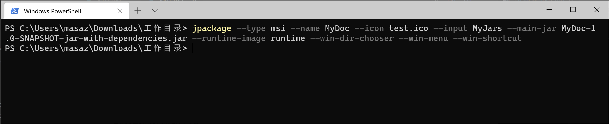

看看我们的目录下，确实是生成了一个`.msi`安装包文件。
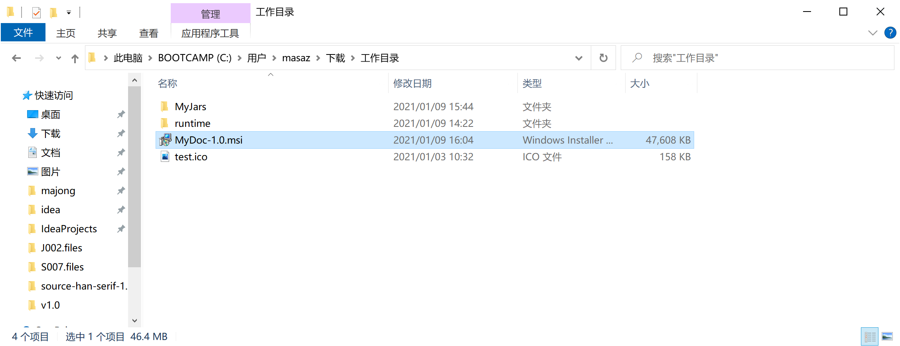

运行这个安装包，我们就可以把程序安装在我们的Windows系统中了。<br/>
※此时我们再次把环境变量里的`JAVA_HOME`去掉，使系统变成没有安装Java环境的状态。在这个状态下运行安装包，并执行安装后的程序，确认是否能正常运行。

双击安装程序，我们将会看到熟悉的Windows经典安装界面。
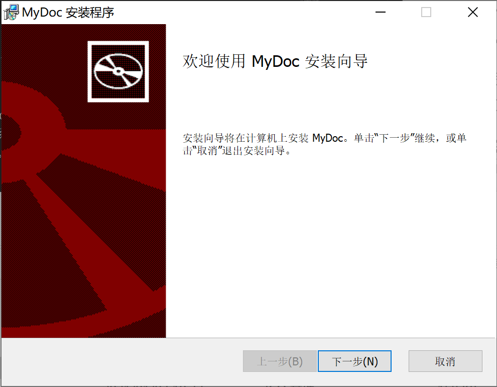

等安装完成后。可以到我们选的安装位置里去看一下里面都有什么。
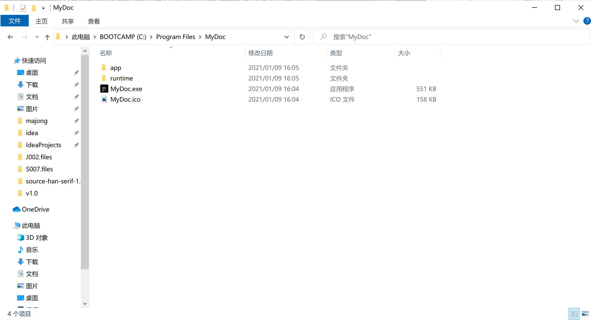

各个文件夹存放的内容如下：

文件或文件夹 | 内容 |
:--|:--|
app|存放可执行Jar包相关的文件。
runtime|存放迷你JRE环境的文件。
MyDoc.exe|可执行程序。
MyDoc.ico|图标文件。

如果上面选择打包成`绿色免安装包`，则生成的文件目录结构就是跟这个一模一样的。

现在从开始菜单中点击执行我们的程序，以验证我们打的安装包确实没有问题。
运行效果如下：
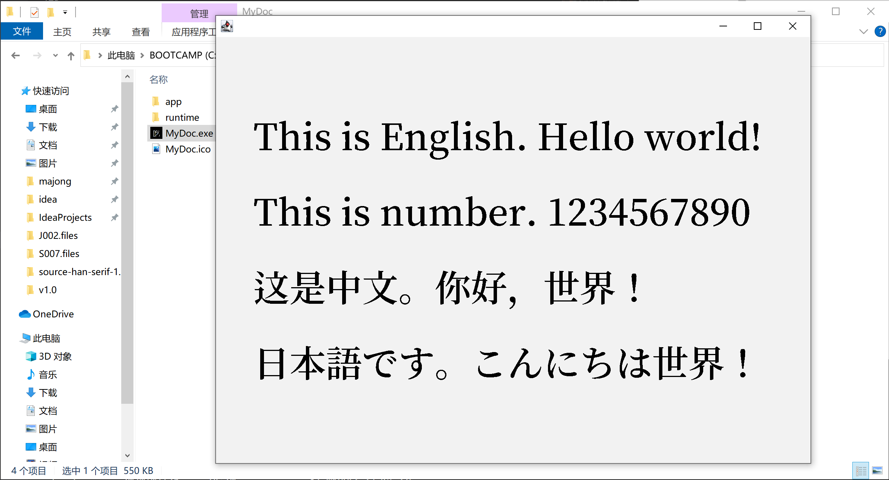

到这里，我们的打包任务就完成了。
同时，这里也可以查看一下系统的软件管理器，看是否我们的程序是被系统所管理的。
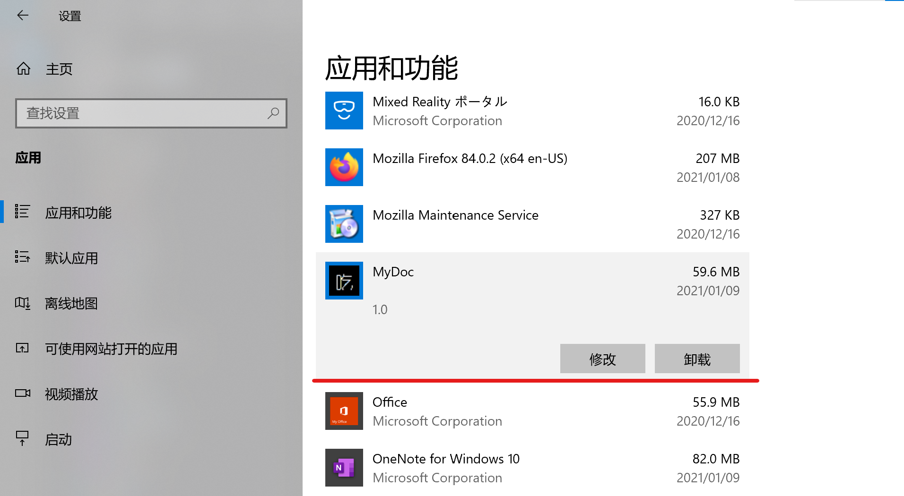

没有问题，我们的安装包做的很漂亮。到这里整个任务总算是可以结束了。