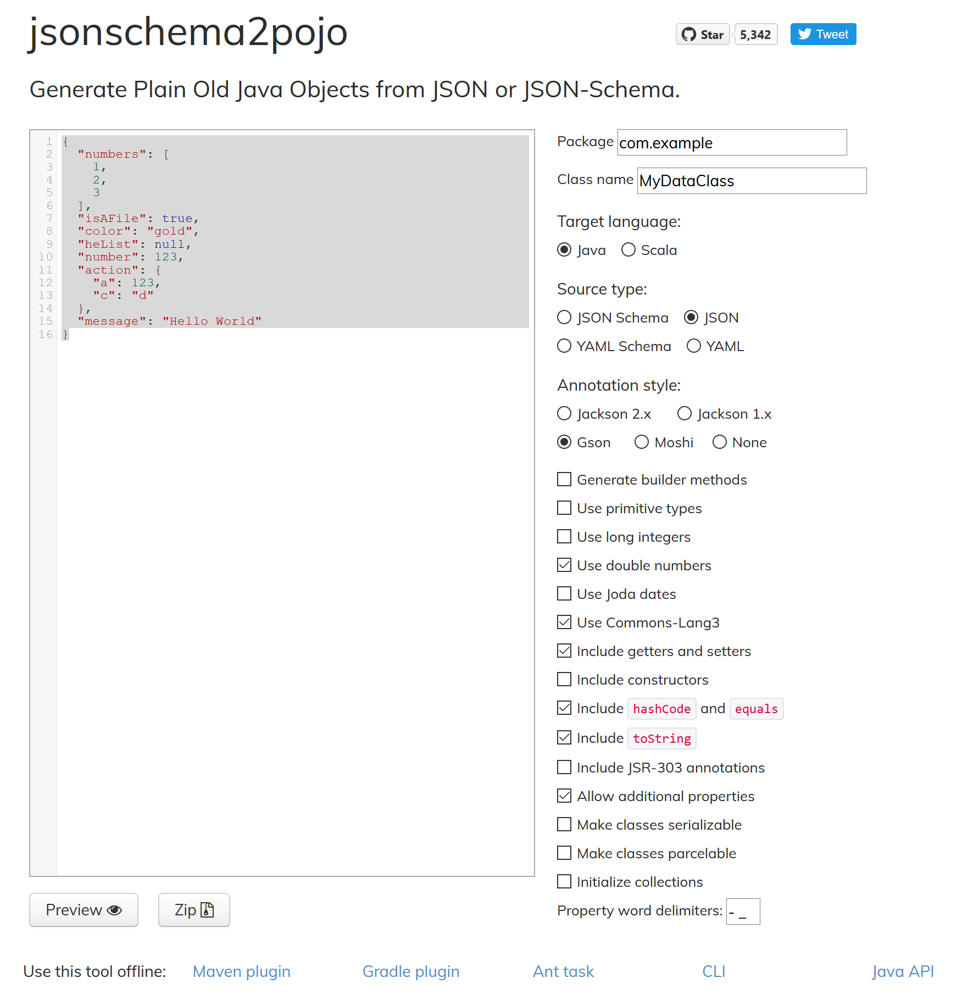
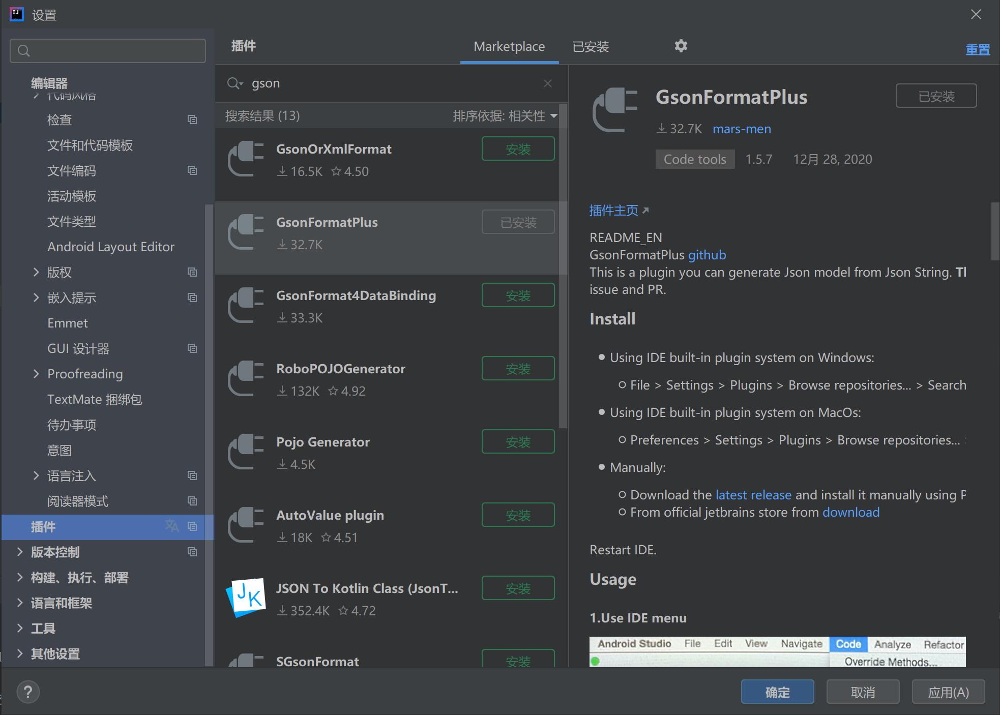
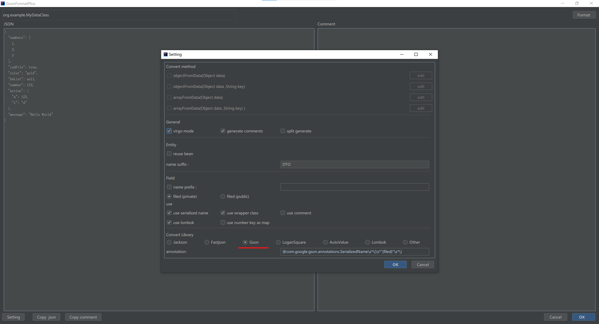

# b. Json与POJO的转换

更新日期：2021-01-11

-------------------------------------

## 1. 概述

在程序中使用Json文件来存储数据是一种越来越流行的方法。使用Google提供的`Gson`库可以帮助我们解决处理Json时遇到的各种问题。

## 2. 利用工具从Json反向生成POJO类

觉得手写POJO类很烦是吗？是的，我也这么认为，很多人都这么认为的，于是便有了这些解放我们双手的工具。而且这样的工具有很多。

比如，这个网页版的POJO生成工具：

网址：[jsonschema2pojo](http://www.jsonschema2pojo.org/)

!!! example "jsonschema2pojo"
    

也可以在我们的IDE里面安装插件。比如在`Intellij IDEA`中可以安装下面这个插件:



下面以IDEA的插件为例，来演示一下这个过程。

首先我们准备一个Json文件。

!!! example "src/main/resources/json/test.json"

    ```json
    {
    "numbers": [
        1,
        2,
        3
    ],
    "isAFile": true,
    "color": "gold",
    "heList": null,
    "number": 123,
    "action": {
        "a": 123,
        "c": "d"
    },
    "message": "Hello World"
    }
    ```

然后我们随便创建一个类，就叫`MyDataClass`好了。在类内部空白处点右键选择`生成`，就可以看见如下选项。


然后我们把准备的Json文件的内容贴进入，还可以在设置里面更改很多选项。这里可以指定生成`Gson`样式的POJO类。



一顿OK之后，POJO类就生成出来了。长下面这个样子。(由于选择了使用lombok，所以看上去很简洁。)

!!! example "POJO生成结果"

    ```java
    package org.example;

    import com.google.gson.annotations.SerializedName;
    import lombok.Data;
    import lombok.NoArgsConstructor;

    import java.util.List;

    @NoArgsConstructor
    @Data
    public class MyDataClass {

        /**
        * numbers : [1,2,3]
        * isAFile : true
        * color : gold
        * heList : null
        * number : 123
        * action : {"a":123,"c":"d"}
        * message : Hello World
        */

        @SerializedName("isAFile")
        private Boolean isAFile;
        @SerializedName("color")
        private String color;
        @SerializedName("heList")
        private Object heList;
        @SerializedName("number")
        private Integer number;
        @SerializedName("action")
        private ActionDTO action;
        @SerializedName("message")
        private String message;
        @SerializedName("numbers")
        private List<Integer> numbers;

        @NoArgsConstructor
        @Data
        public static class ActionDTO {
            /**
            * a : 123
            * c : d
            */

            @SerializedName("a")
            private Integer a;
            @SerializedName("c")
            private String c;
        }
    }
    ```

## 3. 使用Gson进行Json与DataClass之间的相互转换

Gson设计的非常简单易用。只需很少量的代码就可以完成我们的任务。

!!! example "使用Gson"

    ```java
    // 创建Gson对象
    Gson gson = new Gson();

    // Json文件 => DataClass
    var jsonPath = App.class.getResource("/json/test.json").getPath();
    MyDataClass dataClass = gson.fromJson(new FileReader(jsonPath), MyDataClass.class);

    // DataClass => Json文字
    MyDataClass newDataClass = new MyDataClass();
    // 初始化newDataClass
    String jsonRst = gson.toJson(newDataClass);
    ```

## 4. 完整的演示代码

!!! example "演示代码"

    ```java
    package org.example;

    import com.google.gson.Gson;
    import com.google.gson.stream.JsonReader;

    import java.io.FileNotFoundException;
    import java.io.FileReader;
    import java.util.List;
    import java.util.Map;

    public class App {

        public static void main(String[] args) {

            try {
                // Json文件 => DataClass
                testLoadJson();

                // DataClass => Json文字
                testToJson();
            } catch (Exception e) {
                e.printStackTrace();
            }
        }

        // Json文件 => DataClass
        private static void testLoadJson() throws FileNotFoundException {

            // 读取Json文件
            var jsonPath = App4.class.getResource("/json/test.json").getPath();

            // 使用Gson进行转换
            Gson gson = new Gson();
            MyDataClass myDataClass = gson.fromJson(new FileReader(jsonPath), MyDataClass.class);

            // 输出转换后的结果
            System.out.println("Json文件 => DataClass");
            System.out.println(myDataClass);
        }

        // DataClass => Json文字
        private static void testToJson() {

            // 创建DataClass
            MyDataClass dataClass = new MyDataClass();
            dataClass.setColor("green");
            MyDataClass.ActionDTO action = new MyDataClass.ActionDTO();
            action.setA(null);
            action.setC("This is c");
            dataClass.setAction(action);
            dataClass.setHeList(Map.of("a", 1, "b", 234));
            dataClass.setMessage("This is a message.");
            dataClass.setNumber(13566);
            dataClass.setNumbers(List.of(1, 2, 3, 5, 767, 99, 0));
            dataClass.setIsAFile(false);

            // 使用Gson进行转换
            Gson gson = new Gson();
            String json = gson.toJson(dataClass);

            // 输出转换结果
            System.out.println("DataClass => Json文字");
            System.out.println(json);
        }
    }
    ```