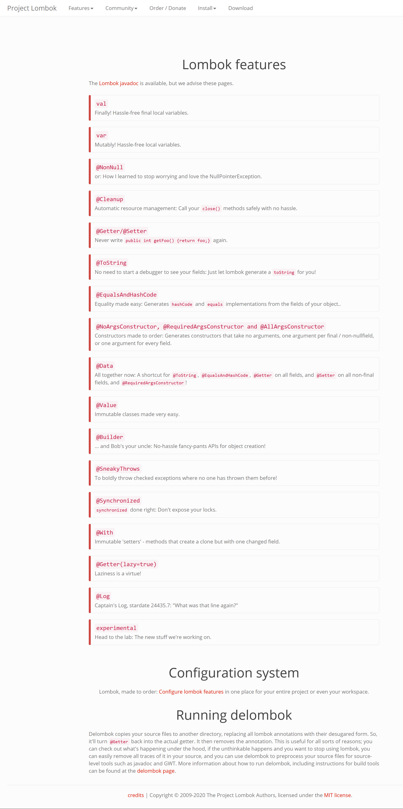

# d. lombok与样板式代码

更新日期：2021-01-11

-------------------------------------

## 1. 概述

编写Java代码时，我们经常要写很多的样本式代码。比如getter、setter之类的。虽然这些可以自动生成，但是会使我们的Java类变得冗长，看起来很不优雅。

lombok是一个可以让我们从这个泥潭里面走出来的插件。

它可以使用注解的方式，轻松的指定出各种你想要添加的样本式代码。但是不会真的把那些代码加到你的文件中去，而产生的效果就如同你已经加过了一样。

## 2. 官方介绍的lombok特性

有一个官方页面简介的介绍了lombok的特性，非常实用。

官方页面：[lombok的特性](https://projectlombok.org/features/all)

## 3. 常用的注解

名字很直观，基本上不需要说明就知道是做什么用的了。

!!! example "类上的注解"

    - Getter
    - Setter
    - ToString
    - EqualsAndHashCode
    - NoArgsConstructor、RequiredArgsConstructor、AllArgsConstructor
    - Data
        - ToString + EqualsAndHashCode + Getter + Setter + RequiredArgsConstructor
    - Log4j2、Log

!!! example "属性上的注解"

    - Getter
    - Setter

!!! example "函数上的注解"

    - SneakyThrows
        - 隐藏异常捕获的代码
    - Synchronized
        - 隐藏同步块的代码，可指定参数为：锁对象

!!! example "代码上的注解"

    - Cleanup
        - 加在可关闭的资源变量前，与Java新版的try资源块作用一样