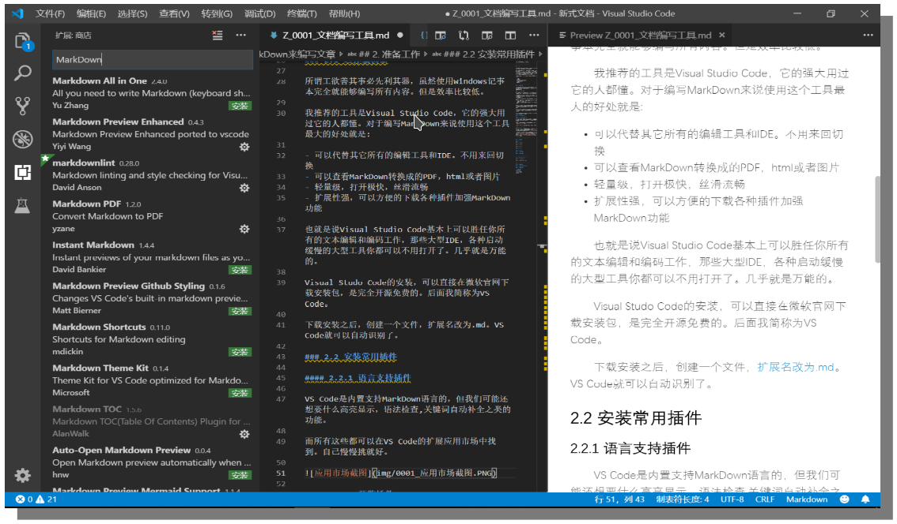
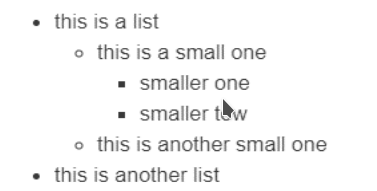
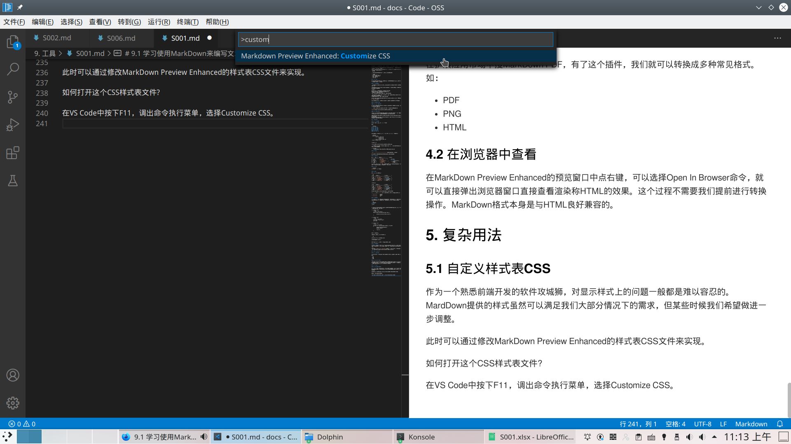

# 使用MarkDown编写文章

更新日期：2020-07-24

-------------------------------------

## 1. 简介

MarkDown是一个轻量级的文本标记语言，允许我们使用约定了格式的文本进行排版工作。

以前我主要在Excel中编辑文档。这个工作是很烦躁的，经常鼠标键盘来回切，字体边框来回调。添加删除行列也是需要
经常进行的操作。虽然Excel有VBA宏这一大杀器，但是它在中文系统中经常崩溃，而你以前编写的所有宏可能会全部被
删除掉。

使用MarkDown来编写就显得轻松惬意，它主要有如下优点:

- 轻量级
- 跨平台，支持非常广泛
- 语法简洁，学习成本低
- 兼容于Web页面
- 扩展性强

## 2. 准备工作

大概了解了MarkDown之后，我们就可以马上着手编写文档了。为了使我们的工作能事半功倍，要提前安装好一些工具。

### 2.1 选择编辑器

所谓工欲善其事必先利其器，虽然使用Windows记事本完全就能够编写所有内容。但是效率比较低。

我推荐的工具是Visual Studio Code，它的强大用过它的人都懂。对于编写MarkDown来说使用这个工具最大的
好处就是:

可以代替其它所有的编辑工具和IDE。不用来回切换
可以查看MarkDown转换成的PDF，html或者图片
轻量级，打开极快，丝滑流畅
扩展性强，可以方便的下载各种插件加强MarkDown功能

也就是说Visual Studio Code基本上可以胜任你所有的文本编辑和编码工作，那些大型IDE，各种启动缓慢的大型
工具你都可以不用打开了。几乎就是万能的。

Visual Studo Code的安装，可以直接在微软官网下载安装包，是完全开源免费的。后面我简称为VS Code。

下载安装之后，创建一个文件，扩展名改为.md。VS Code就可以自动识别了。

### 2.2 安装常用插件

#### 2.2.1 语言支持插件

VS Code是内置支持MarkDown语言的，但我们可能还想要什么高亮显示，语法检查,关键词自动补全之类的功能。

而所有这些都可以在VS Code的扩展应用市场中找到。自己慢慢挑就好。



#### 2.2.2 预览插件

看到上图中右侧窗口的内容了吗？安装了预览插件，编辑器就可以所见即所得了。在左边敲字，右边就实时显示出它渲染后的样子了，是不是很Cooooool。

这么好的插件又怎么安装呢，扩展商店搜MarkDown Preview Enhanced有真相。安装之后在文本编辑
窗口点右键选择：MarkDown Preview Enhanced : Open Preview To The Side。在右边就会出现这个预览窗口。

## 3. 语法示例

### 3.1 标题和列表

要定义标题很简单。使用#加空格开头即可

如：

```markdown
# 我是一级标题
## 我是二级标题1
## 我是二级标题2
## 我是二级标题3
### 我是三级标题
#### 我是四级标题
```

要定义列表也非常容易，使用+ - * 中的一种加上一个空格开头就可以：

```markdown
- this is a list
        + this is a small one
                * smaller one
                * smaller tow
        + this is another small one
- this is another list
```

显示效果为：



使用三种符合中的哪种都一样，全凭你的喜好。一般而言主要用来区分层次关系，不同层次分别使用不同的符号。

!!! warning
    在有的MarkDown实现上，没法识别出这种嵌套的list效果。

### 3.2 分隔线

使用一行`----------------------------`就可以了。下划线也可以。

但是不知道为啥渲染成HTML或者PDF之后下划线有可能会消失。

### 3.3 文字效果

No. |	效果	|	编写格式	|			显示效果
---- | --------- | ----------- | ------
1 |	斜体 |		`_我是斜体_`		|		_我是斜体_
2 |	粗体 |		`__我是粗体__`	|			__我是粗体__
3 |	粗斜体 |		`___我是粗斜体___`	|			___我是粗斜体___
4 |	删除线 |		`~~删除内容~~`		|		~~删除内容~~
5 |	下划线 |		`<u>下划线</u>`		|		<u>下划线</u>

其中粗体和斜体使用前后加下划线_来表示。下划线由于MarkDown并不支持，所有直接使用HTML标签来解决，后面我们再介绍HTML标签的使用。

### 3.4 图片

```markdown

```

### 3.5 表格

表格使用多个|||来表示：

```md
| 效果   | 编写格式           | 显示效果        |
|:-----  |:----------------  |:-------------- |
| 斜体   | `_我是斜体_`       | _我是斜体_      |
| 粗体   | `__我是粗体__`     | __我是粗体__    |
| 粗斜体 | `___我是粗斜体___` | ___我是粗斜体___ |
| 删除线 | `~~删除内容~~`     | ~~删除内容~~    |
| 下划线 | `<u>下划线</u>`    | <u>下划线</u>   |
```

显示效果：

| 效果   | 编写格式           | 显示效果        |
|:-----  |:----------------  |:-------------- |
| 斜体   | `_我是斜体_`       | _我是斜体_      |
| 粗体   | `__我是粗体__`     | __我是粗体__    |
| 粗斜体 | `___我是粗斜体___` | ___我是粗斜体___ |
| 删除线 | `~~删除内容~~`     | ~~删除内容~~    |
| 下划线 | `<u>下划线</u>`    | <u>下划线</u>   |

这个表格的边框样式是我自定义的，默认是四向带边框的。

在第二行使用了`|:-------|`的形式来区分表头和表身，:用来指定对齐方式：

- `|:-------|`		左对齐
- `|-------:|`		右对齐
- `|:------:|`		居中

### 3.6 代码块

作为软件攻城狮，我们免不了要在写文章的时候加入代码了。其实在前面演示MarkDown语法的时候我已经使用过了。要插入一段代码可以使用三个[`]来表示，比如：

```md
    ```markdown
    ## title
    __xxxx_
    ```
```

通过指定语言种类可以高亮显示该语言的关键字。比如可以指定java, lua, c++等，据我所知这个功能支持几乎任何语言:

!!! example "Java"
    ```java
    // this is java source
    public static void main(String[] main) {

            System.out.println("Hello world!");
    }
    ```

!!! example "Lua"
    ```lua
    -- this is lua source
    local msg = "How are you?"
    print(msg)
    ```

!!! example "C++"
    ```c++
    // this is c++ source
    private int _function(Shape* pShape, int width)
    {
            pShape->ResetWidth(Width);
            pShape->area();

            return 0;
    }
    ```

### 3.7 页面内跳转

页面内跳转的写法和显示图片有点像：

```md
... ...
<h3 id="2.1">2.1 选择编辑器</h3>
... ...
[我要跳到章节2.1](#2.1)
```

可以看到，是通过使用HTML标签并指定ID来跳转的。

### 3.8 内置HTML

有时候我们想要的格式没有办法通过MarkDown的语法来实现，那我们怎么办呢。作为软件攻城狮自然对HTML再熟悉不过了。而HTML的所有标签可以直接拿来再MarkDown里直接使用。

比如上面使用过的`<u></u> <h3></h3>`等。这些标签的用法完全和再HTML文件中使用时一模一样，可以自己指定style来达到想要实现的显示效果。

## 4. 输出为其它格式

### 4.1 使用的插件

在扩展应用市场中搜MarkDown PDF，有了这个插件，我们就可以转换成多种常见格式。如：

- PDF
- PNG
- HTML

### 4.2 在浏览器中查看

在MarkDown Preview Enhanced的预览窗口中点右键，可以选择Open In Browser命令，就可以直接弹出浏览器窗口直接查看渲染称HTML的效果。这个过程不需要我们提前进行转换操作。MarkDown格式本身是与HTML良好兼容的。

## 5. 复杂用法

### 5.1 自定义样式表CSS

作为一个熟悉前端开发的软件攻城狮，对显示样式上的问题一般都是难以容忍的。MardDown提供的样式虽然可以满足我们大部分情况下的需求，但某些时候我们希望做进一步调整。

此时可以通过修改MarkDown Preview Enhanced的样式表CSS文件来实现。

如何打开这个CSS样式表文件?

在VS Code中按下F11，调出命令执行菜单，选择Customize CSS。



打开之后就是我们熟悉的CSS文件了。因为MarkDown文件是要渲染成HTML文件的，所以通过查看生成的HTML文件里面的元素，就可以在这里随意设定你想要的样式。

比如`## 标题2`会被渲染成`<H2>标题2</H2>`，通过在CSS中指定H2的样式，就可以改变所有`## 二级标题`的显示效果。

下图是我的样式表：

```css
  // 修改字体（优先使用等线Light和微软雅黑）
  font-family: "DengXian Light", "Microsoft YaHei", "Segoe UI", Helvetica, sans-serif;

  // 将代码注释设定为深绿色
  .token.comment {
    color: darkgreen;
  }

  // 设定表格的边框
  thead th {
    border-top: none;
    border-right: none;
    border-left: none;
    border-color: black;
  }
  td {
    border-bottom: none;
    border-right: none;
    border-left: none;
    border-color: black;
  }

  // 使文本段落首行缩进两个字符
  p {
    text-indent: 2em;
  }

  // 演示效果的DIV层的样式
  .showEffect {
    background-color: blanchedalmond;
  }
```

### 5.2 绘制UML图

可以通过GraphViz插件来支持画图。但由于在mkdocs中显示有问题，所以先按下不表。

### 5.3 自动生成目录

在扩展商店中下载MarkDown TOC插件，然后再编辑器中把光标移动到你想插入目录的地方点右键，选择Markdown TOC: Insert/Update菜单。目录就自动生成出来了。

生成规则也很简单，是根据你设定的6级标题来生成，并自动设定跳转。

但是有时候生成出来的代码格式很奇怪，不会自动换行。如下所示：

```md
<!-- TOC -->autoauto- [目录](#目录)auto- [1. 简介](#1-简介)auto- [2. 准备工作](#2-准备工作)autoauto<!-- /TOC -->
```

此时，可以修改设定，使自动生成代码时使用\n来填充，而不是auto：

在设置里搜Eol来修改。

在mkdocs下，并不能识别这样生成的目录，它有一套自己的目录生成规则，会在渲染出的页面上自动生成目录，不需要我们做任何事情。
