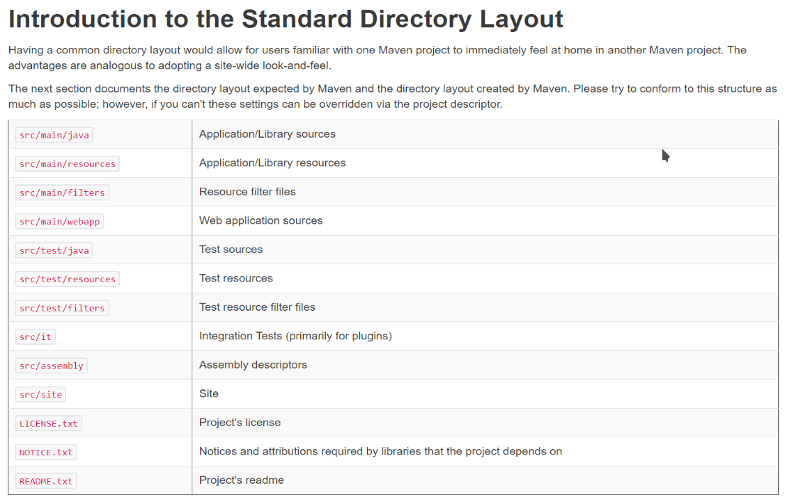

# A. Maven基础知识

更新日期：2020-07-24

-------------------------------------

## 1. 常用命令

先说个学习之后的结论：

- (1)	对于一般的开发而言，我们只要使用clean package命令就足够了。
- (2)	如果是开发公共模块供别人使用，需要了解install和deploy命令。
- (3)	其他几个命令你可能永远也用不上。

### 1.1 官方说明

- validate - validate the project is correct and all necessary information is available
- compile - compile the source code of the project
- test - test the compiled source code using a suitable unit testing framework. These tests should not require the code be packaged or deployed
- package - take the compiled code and package it in its distributable format, such as a JAR.
- verify - run any checks on results of integration tests to ensure quality criteria are met
- install - install the package into the local repository, for use as a dependency in other projects locally
- deploy - done in the build environment, copies the final package to the remote repository for sharing with other developers and projects.

大概翻译如下：

- validate - 验证项目的正确性以及必要的信息是否可用。
- compile - 编译项目的源代码。
- test - 使用一个适当的单元测试框架来测试编译好的源代码。这些测试不应该需要项目提前进行打包或者发布。
- package - 将编译好的代码打包。如打包为jar文件。
- verify - 进行集成测试，验证项目质量。
- install -将项目安装到maven本地仓库，以供其他本地项目引用。
- deploy -将项目发布到maven远程仓库，分享给其他开发者和项目。

### 1.2 常用命令的执行过程

我们可以试着执行一下其中的一些命令来看看它们具体都做了哪些事情。

#### 1.2.1 clean命令

假设有一个多模块工程，结构为:

```treer
parent          .pom
├─web           .jar
├─framework     .jar
├─api           .war
```

此时对parent工程右键执行clean命令时，实际执行过程如下所示:

```powershell
PS C:\data\VS_CODE_WORKSPACE\parent> cmd /c mvn clean -f "c:\data\VS_CODE_WORKSPACE\parent\pom.xml"
[INFO] Scanning for projects...
[INFO] ------------------------------------------------------------------------
[INFO] Reactor Build Order:
[INFO]
[INFO] parent                                                             [pom]
[INFO] api                                                                [jar]
[INFO] framework                                                          [jar]
[INFO] web Maven Webapp                                                   [war]
[INFO]
[INFO] -------------------------< org.hakurei:parent >-------------------------
[INFO] Building parent 1.0                                                [1/4]
[INFO] --------------------------------[ pom ]---------------------------------
[INFO]
[INFO] --- maven-clean-plugin:2.5:clean (default-clean) @ parent ---
[INFO]
[INFO] --------------------------< org.hakurei:api >---------------------------
[INFO] Building api 1.0                                                   [2/4]
[INFO] --------------------------------[ jar ]---------------------------------
[INFO]
[INFO] --- maven-clean-plugin:2.5:clean (default-clean) @ api ---
[INFO]
[INFO] -----------------------< org.hakurei:framework >------------------------
[INFO] Building framework 1.0                                             [3/4]
[INFO] --------------------------------[ jar ]---------------------------------
[INFO]
[INFO] --- maven-clean-plugin:2.5:clean (default-clean) @ framework ---
[INFO]
[INFO] --------------------------< org.hakurei:web >---------------------------
[INFO] Building web Maven Webapp 1.0                                      [4/4]
[INFO] --------------------------------[ war ]---------------------------------
[INFO]
[INFO] --- maven-clean-plugin:2.5:clean (default-clean) @ web ---
[INFO] ------------------------------------------------------------------------
[INFO] Reactor Summary:
[INFO]
[INFO] parent 1.0 ......................................... SUCCESS [  0.454 s]
[INFO] api ................................................ SUCCESS [  0.049 s]
[INFO] framework .......................................... SUCCESS [  0.054 s]
[INFO] web Maven Webapp 1.0 ............................... SUCCESS [  0.058 s]
[INFO] ------------------------------------------------------------------------
[INFO] BUILD SUCCESS
[INFO] ------------------------------------------------------------------------
[INFO] Total time: 1.157 s
[INFO] Finished at: 2019-06-30T17:13:50+09:00
[INFO] ------------------------------------------------------------------------
PS C:\data\VS_CODE_WORKSPACE\parent>
```

总结此命令做的事情，大概如下:

!!! example "clean说明"
    (1)	执行命令：mvn clean -f "c:\data\VS_CODE_WORKSPACE\parent\pom.xml"

    (2)	根据pom.xml扫描项目，也就是说会识别多模块项目的父子和依赖关系。通常对顶层工程parent执行maven命令就可以了，会自动对其下的所有子工程执行一遍。

    ```powershell
    Scanning for projects…
    ```

    (3)	对相关的几个项目依次执行clean:

    ```powershell
    [INFO] --- maven-clean-plugin:2.5:clean (default-clean) @ parent ---
    [INFO] --- maven-clean-plugin:2.5:clean (default-clean) @ api ---
    [INFO] --- maven-clean-plugin:2.5:clean (default-clean) @ framework ---
    [INFO] --- maven-clean-plugin:2.5:clean (default-clean) @ web ---
    ```

    (4)	执行结果。看见BUILD SUCCESS就表示成功了。否则会显示出ERROR。

    ```powershell
    [INFO] BUILD SUCCESS
    ```
#### 1.2.2 package命令

对parent工程右键执行package命令时，输出log很多。这里只梳理一下主要内容:

!!! example "package说明"
    (1)	执行命令：mvn package -f "c:\data\VS_CODE_WORKSPACE\parent\pom.xml"
        
    (2)	根据pom.xml扫描项目，也就是说会识别多模块项目的父子和依赖关系。通常对顶层工程parent执行maven命令就可以了，会自动对其下的所有子工程执行一遍。

    ```powershell
    Scanning for projects…
    ```

    (3)	对有实质内容的工程依次做如下的事情:

    ```powershell
    [INFO] --------------------------< org.hakurei:api >---------------------------
    [INFO] Building api 1.0                                                   [2/4]
    [INFO] --------------------------------[ jar ]---------------------------------
    [INFO]
    [INFO] --- maven-resources-plugin:2.6:resources (default-resources) @ api ---
    [INFO] Using 'UTF-8' encoding to copy filtered resources.
    [INFO] skip non existing resourceDirectory C:\data\VS_CODE_WORKSPACE\parent\api\src\main\resources
    [INFO]
    [INFO] --- maven-compiler-plugin:3.1:compile (default-compile) @ api ---
    [INFO] Changes detected - recompiling the module!
    [INFO] Compiling 1 source file to C:\data\VS_CODE_WORKSPACE\parent\api\target\classes
    [INFO]
    [INFO] --- maven-resources-plugin:2.6:testResources (default-testResources) @ api ---
    [INFO] Using 'UTF-8' encoding to copy filtered resources.
    [INFO] skip non existing resourceDirectory C:\data\VS_CODE_WORKSPACE\parent\api\src\test\resources
    [INFO]
    [INFO] --- maven-compiler-plugin:3.1:testCompile (default-testCompile) @ api ---
    [INFO] Changes detected - recompiling the module!
    [INFO] Compiling 1 source file to C:\data\VS_CODE_WORKSPACE\parent\api\target\test-classes
    [INFO]
    [INFO] --- maven-surefire-plugin:2.12.4:test (default-test) @ api ---
    [INFO] Surefire report directory: C:\data\VS_CODE_WORKSPACE\parent\api\target\surefire-reports

    -------------------------------------------------------
    T E S T S
    -------------------------------------------------------
    Running api.AppTest
    Tests run: 1, Failures: 0, Errors: 0, Skipped: 0, Time elapsed: 0.055 sec

    Results :

    Tests run: 1, Failures: 0, Errors: 0, Skipped: 0

    [INFO]
    [INFO] --- maven-jar-plugin:2.4:jar (default-jar) @ api ---
    [INFO] Building jar: C:\data\VS_CODE_WORKSPACE\parent\api\target\api-1.0.jar
    ```

    可以概括为如下几件事:

    - ①	复制资源
    - ②	编译Java类
    - ③	测试资源
    - ④	测试Java类
    - ⑤	总测试
    - ⑥	测试成功时打jar包

    从这个Log中我们可以获取这样几个有用的信息:

    !!! example "有用的信息"
        ①	Using 'UTF-8' encoding to copy filtered resources.
            
            使用UTF-8来复制资源文本
            
        ②	skip non existing resourceDirectory C:\data\VS_CODE_WORKSPACE\parent\api\src\main\resources
            
            默认从src\main\resources目录下寻找资源，如果没有这个文件夹则跳过。
            如果我们需要放置资源，可以手动创建这个文件夹。
            
        ③	[INFO] Changes detected - recompiling the module!
            [INFO] Compiling 1 source file to C:\data\VS_CODE_WORKSPACE\parent\api\target\classes
            
            会检测Java类的变化，只编译有变化的类。如果先clean再package则自然全部重新编译。
            如果package之后再次执行package，会看到忽略编译class的相关log。
            
        ④	[INFO] Building jar: C:\data\VS_CODE_WORKSPACE\parent\api\target\api-1.0.jar
            
            打出的jar包名字为artifactId-version.jar。

    对于web工程打war包，还会从src\main\webapp\resources目录下面复制资源:

    ```powershell
    [INFO] Copying webapp resources [C:\data\VS_CODE_WORKSPACE\parent\web\src\main\webapp]
    ```

    (4)	打包完成，显示结果:

    ```powershell
    [INFO] ------------------------------------------------------------------------
    [INFO] Reactor Summary:
    [INFO]
    [INFO] parent 1.0 ......................................... SUCCESS [  0.079 s]
    [INFO] api ................................................ SUCCESS [ 18.114 s]
    [INFO] framework .......................................... SUCCESS [  2.076 s]
    [INFO] web Maven Webapp 1.0 ............................... SUCCESS [  1.735 s]
    [INFO] ------------------------------------------------------------------------
    [INFO] BUILD SUCCESS
    [INFO] ------------------------------------------------------------------------
    [INFO] Total time: 22.546 s
    [INFO] Finished at: 2019-06-30T17:24:40+09:00
    [INFO] ------------------------------------------------------------------------
    ```
#### 1.2.3 install命令

分析了install命令的log之后，我发现install命令做了如下的事情：

!!! example "install说明"
    (1)	执行package的所有操作，包括复制资源、编译class、测试打包等。
    (2)	将打出来的jar包安装到maven的localRepository中去。

执行完install命令之后，我们去看localRepository文件夹，会发现我们的jar包被复制到了这里。

 

就如同我们用maven下载第三方jar包一样。观察文件夹的结构，也和第三方jar包别无二致。
所以说这个命令其实会把我们的项目jar包安装到本地仓库中。然后你再开发另外一个工程的时候就可以在pom.xml中直接引用这个jar包了。

比如我们自己写了一些工具类，放在一个jar包里。为了以后所有的maven项目都可以使用这个jar包，就可以把它install到maven的本地仓库中。就如同我们使用其他第三方jar包一样。

#### 1.2.4 compile命令

分析了compile命令的log之后，我发现相比package命令而言，只对每个项目做如下两件事:

- ①	复制资源
- ②	编译Java类
- ~~③	测试资源~~
- ~~④	测试Java类~~
- ~~⑤	总测试~~
- ~~⑥	测试成功时打jar包~~

也就是说，compile命令只复制资源和编译class，而不测试和打包。所以说这个命令其实不是很常用。

#### 1.2.5 validate命令

顾名思义，用来验证项目中有没有错误，如果有错，则打印出错误信息。这里的错误不是Java相关的编译错误等。而是只此项目作为一个maven项目来说的各种错误。比如项目的pom.xml文件中没有定义项目的artifactId。

但问题是我们执行package命令时也会执行validate命令，所以其实这个命令的作用不大。

#### 1.2.6 verify命令

本意是一直做到集成测试，但是实际效果和package没什么两样。

#### 1.2.7 test命令

test命令为每个项目做package命令的前四步，也就是：

- ①	复制资源
- ②	编译Java类
- ③	测试资源
- ④	测试Java类
- ⑤	总测试
- ~~⑥	测试成功时打jar包~~

编译后测试，也就不打包。

#### 1.2.8 deploy命令

这个命令涉及加自己的jar包上传到maven服务器远程仓库或者私服。目前暂时用不到。

## 2. 其它常见用法

### 2.1 maven的标准目录

maven有一套默认的目录。很多操作都会用到这套目录，掌握之后会很方便。



### 2.2 运行时资源加载

我们的配置文件中有的值需要运行时才能决定，或者这些值引用maven的一些内部值。那么我们可以使用这个功能。
参考maven的官方guide:
    How do I filter resource files?

## 3. 创建自己的Archetype工程

有时候maven自带的archetype无法满足我们的需求，比如：

- webapp万年使用Web2.3
- 没有帮我们生成src/main/resources目录
- 我们不想使用index.jsp
- 我们使用固定的一套代码结构模块

这时就适合创建一个Archetype工程出来，它能按照我们给定的模板来生成工程。如果我们长期开发过程中积累了自己常用的项目模板，则就适合使用这个功能。

maven官方网站上有创建archetype工程的步骤：

    http://maven.apache.org/guides/mini/guide-creating-archetypes.html

### 3.1 创建Archetype工程

要创建这种工程，请认准下面这个archetype：

```powershell
maven-archetype-archetype / org.apache.maven.archetypes
```

按照引导输入GroupId,ArtifactId等信息即可。

### 3.2 了解Archetype工程的结构

我创建好的一个web工程的arthetype工程的目录结构如下：

```treer
zweb/
├─ pom.xml ................................... arthetype工程自身的pom.xml文件
├─ src/ ......................................
│  ├─ main/ ..................................
│  │  └─ resources/ ..........................
│  │     ├─ archetype-resources/ ............. 这个文件夹里面存放着你的项目模板
│  │     │  ├─ pom.xml .......................
│  │     │  └─ src/ ..........................
│  │     │     └─ main/ ......................
│  │     │        ├─ resources/ ..............
│  │     │        │  ├─ css/ .................
│  │     │        │  ├─ img/ .................
│  │     │        │  ├─ js/ ..................
│  │     │        │  └─ view/ ................
│  │     │        └─ webapp/ .................
│  │     │           ├─ index.xhtml ..........
│  │     │           ├─ META-INF/ ............
│  │     │           │  └─ MANIFEST.MF .......
│  │     │           └─ WEB-INF/ .............
│  │     │              └─ web.xml ...........
│  │     └─ META-INF/ ........................
│  │        └─ maven/ ........................
│  │           └─ archetype-metadata.xml ..... 这个文件用来配置生成的项目中包含模板里面的哪些东西
│  └─ test/ .................................. arthetype工程用来测试模板工程是否正确的相关文件
│     └─ resources/ ..........................
│        └─ projects/ ........................
│           └─ it-basic/ .....................
│              ├─ archetype.properties .......
│              └─ goal.txt ...................
```

### 3.3 主要配置说明

#### 3.3.1 参数

就像其它archetype项目一样，GroupId和ArfactId以及Package和Version等都是通过参数来传递，在你的模板文件中不能写死。

我的web模板工程的pom.xml大致如下：

!!! example "pom.xml"
    ```xml
    <?xml version="1.0" encoding="UTF-8"?>

    <project xmlns="http://maven.apache.org/POM/4.0.0" xmlns:xsi="http://www.w3.org/2001/XMLSchema-instance"
    xsi:schemaLocation="http://maven.apache.org/POM/4.0.0 http://maven.apache.org/xsd/maven-4.0.0.xsd">
    <modelVersion>4.0.0</modelVersion>

    <groupId>${groupId}</groupId>
    <artifactId>${artifactId}</artifactId>
    <version>${version}</version>
    <packaging>war</packaging>

    <name>${artifactId}</name>

    <properties>
        <project.build.sourceEncoding>UTF-8</project.build.sourceEncoding>
        <maven.compiler.source>11</maven.compiler.source>
        <maven.compiler.target>11</maven.compiler.target>
    </properties>

    <dependencies>
        <dependency>
        <groupId>javax.servlet</groupId>
        <artifactId>javax.servlet-api</artifactId>
        <version>4.0.1</version>
        </dependency>
        <!-- 添加任何你想要的依赖 -->
        <dependency>
        <groupId>junit</groupId>
        <artifactId>junit</artifactId>
        <version>4.12</version>
        <scope>test</scope>
        </dependency>
    </dependencies>

    <build>
        <finalName>${artifactId}</finalName>
    </build>
    </project>
    ```

可以使用的参数只有四个，也就是你平时创建maven时可以指定的几个参数：

- ${groupId}
- ${artifactId}
- ${package}
- ${version}

目前没有找到自己定义参数的办法。

#### 3.3.2 包含目录配置

Maven使用archetype-metadata.xml来配置这个。

它的内容大概如下：

!!! example "archetype-metadata.xml"
    ```xml
    <?xml version="1.0" encoding="UTF-8"?>

    <archetype-descriptor
    xmlns="http://maven.apache.org/plugins/maven-archetype-plugin/archetype-descriptor/1.0.0"
    xmlns:xsi="http://www.w3.org/2001/XMLSchema-instance"
    xsi:schemaLocation="http://maven.apache.org/plugins/maven-archetype-plugin/archetype-descriptor/1.0.0 http://maven.apache.org/xsd/archetype-descriptor-1.0.0.xsd"
    name="${artifactId}">

    <fileSets>
        <fileSet filtered="true">
        <directory>src/main/resources</directory>
        </fileSet>
        <fileSet filtered="true">
        <directory>src/main/webapp</directory>
        </fileSet>
    </fileSets>

    </archetype-descriptor>
    ```

可以看到我要求生成的项目中包含src/main/resources和src/main/webapp这两个目录。

如果是含有Java类的工程，则需要包含src/main/java并给fileSet指定packaged="true"。这样生成出来的工程中src/main/java会自动创建为package。而不带packaged="true"的目录则会创建为普通文件夹。

### 3.4 安装和使用archetype工程

#### 3.4.1 安装archetype工程到maven库

没有安装到maven库中的archetype工程和普通的Maven工程并没有什么区别。其实和普通maven工程一样，使用install命令就可以进行安装。

#### 3.4.2 使用创建好的archetype来创建新的工程

安装好的archetype已经存在于maven的本地库中了，使用maven的生成命令并选择这个新的archetype就可以了。创建项目的过程就和其它archetype没什么两样。不过在各种图形化工具的archetype选择器中，你创建的archetype怎么也不会出现在列表中，不知道为什么。
