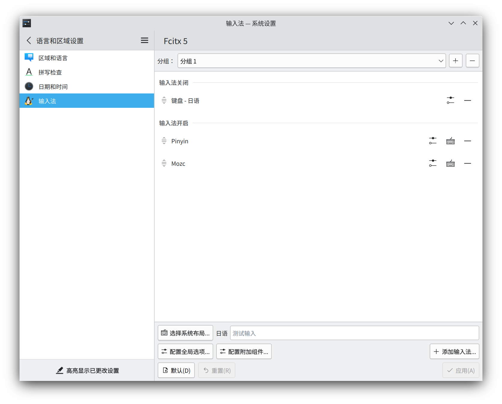
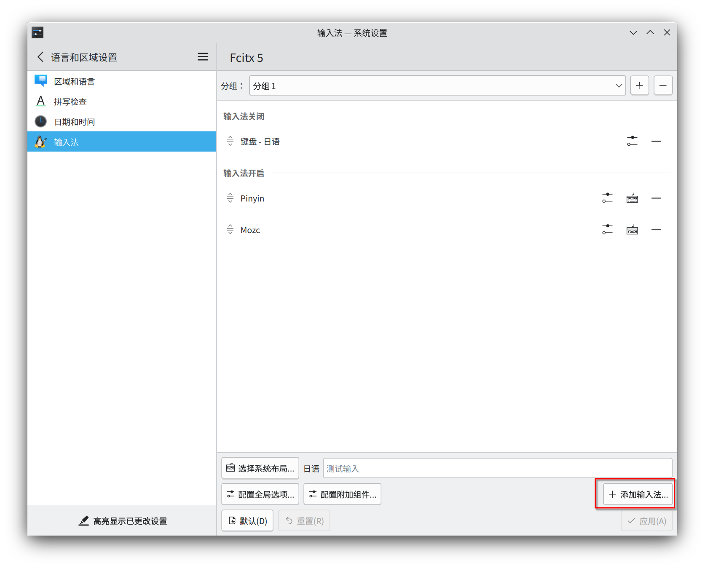

# 安装中日文输入法

更新日期：2022-12-17

-----------------------
基本上按照WiKi上的方法就可以安装成功。

## step1 安装fcitx5-im

这里面就包括了：

- fcitx5
- fcitx5-configtool
- fcitx5-gtk
- fcitx5-qt

安装完成后，fcitx5的设置界面将被自动集成到桌面环境的设置中。



!!! warning "输入法设置打不开？"
    请先在控制台中运行命令`fcitx5`

## step2 安装输入法

- fcitx5-chinese-addons   -- 中文
- fcitx5-pinyin-zhwiki -- 中文字典
- fcitx5-mozc        -- 日文

安装完成后，我们可以在设置中添加输入法。


## step3 配置环境变量

!!! note "~/.bash_profile"
    ``` bash
    # 设定输入法相关的环境变量
    export GTK_IM_MODULE="fcitx5"
    export QT_IM_MODULE="fcitx5"
    export SDL_IM_MODULE="fcitx5"
    export XMODIFIERS='@im=fcitx5'
    ```

注销并重新登陆了一下变量就可以生效了。此时在各种程序中试一试输入法，可以正常的输入中文和日文了。

## step4 美化输入法界面

这里我推荐的是`fcitx5-material-color`这个主题，按照官方手册即可轻松安装。

https://github.com/hosxy/Fcitx5-Material-Color

!!! example "效果"
    
