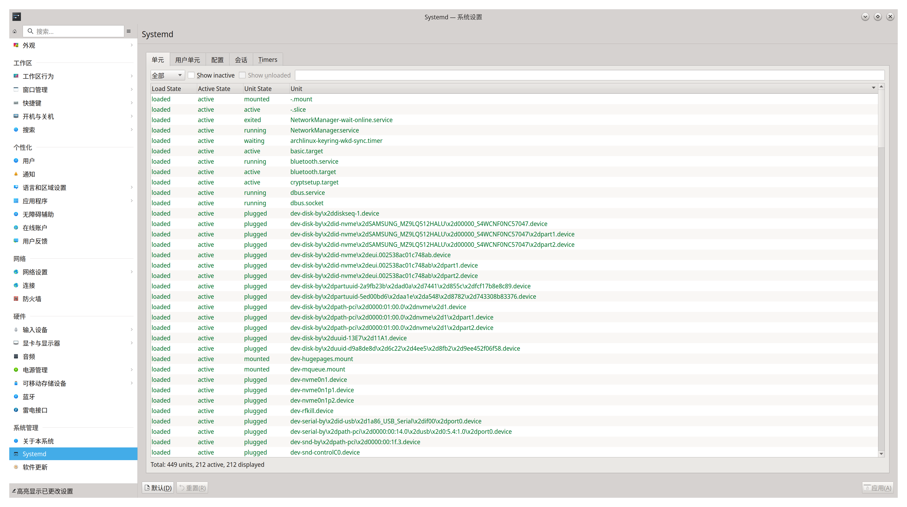
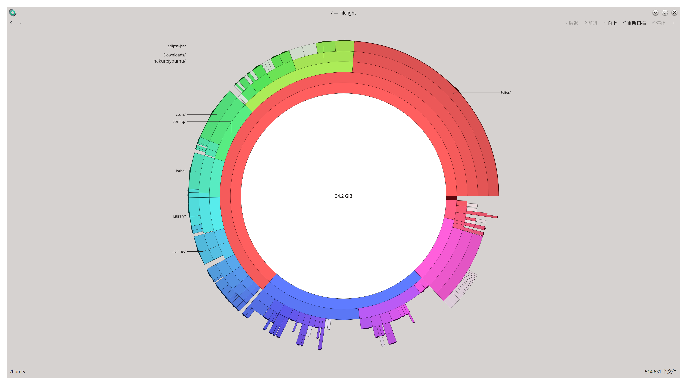
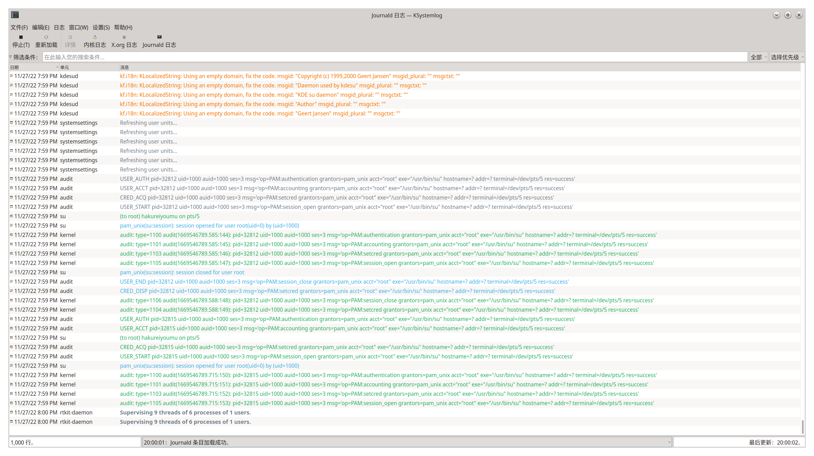
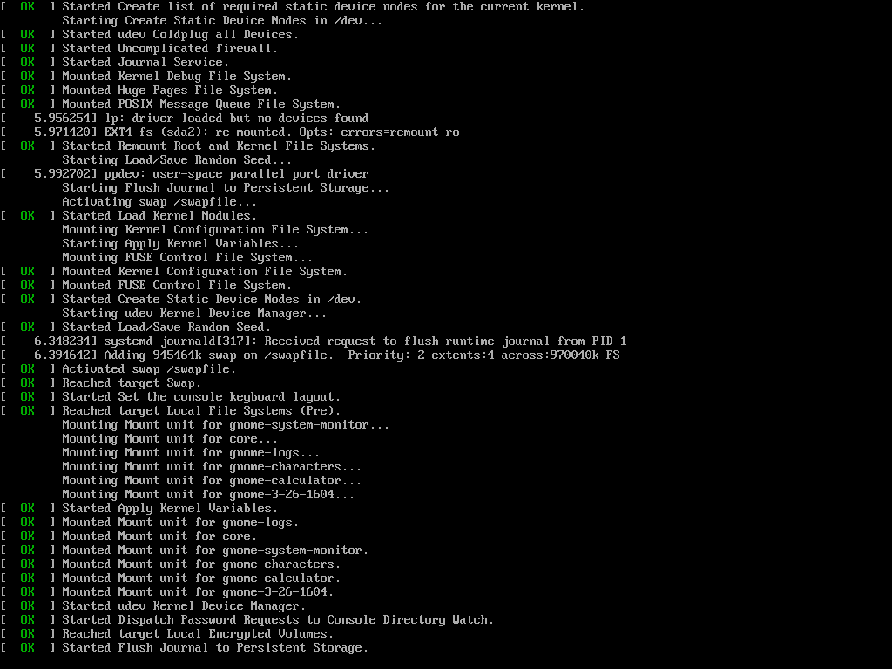
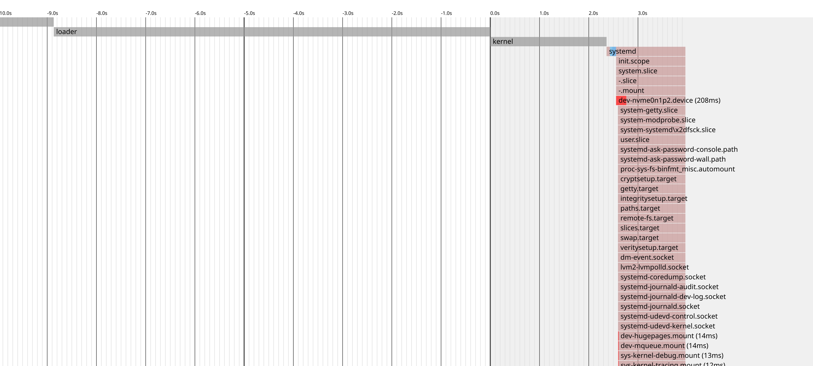
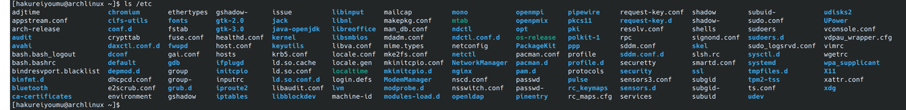
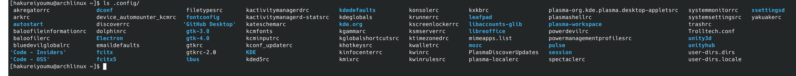

# b. 系统维护与排除问题

更新日期：2022-11-26

----------------------------------

## 1. 概述

linux在作为服务器使用时是非常稳定的系统。但是作为桌面环境使用时，会遇到非常多的问题，对硬件的支持上不是很完善，软件的质量也参差不齐。可能遇到的问题一点不比Windows少，尤其是Arch Linux这种滚动发行的版本。

因此，必须要学习如何进行系统维护以及解决遇到的各种问题。

## 2. 查看系统运行状况

### 2.1 整体状况

使用KDE附带的GUI工具系统工具「系统监视器」是最方便的。这个工具与Windows下的任务管理器功能很相似，而且带有界面自定义功能，能够查看的信息非常的多。

主要可以查看如下信息：

- 内存、磁盘、CPU
- 网络、系统信息
- 应用程序（资源占用情况）
- 进程（支持使用树形结构显示）

<table>
    <tr>
        <td>系统概览</td>
        <td>应用程序</td>
    </tr>
    <tr>
        <td></td>
        <td></td>
    </tr>
    <tr>
        <td>历史记录</td>
        <td>进程列表</td>
    </tr>
    <tr>
        <td></td>
        <td></td>
    </tr>
</table>

### 2.2 查看服务运行状况

安装KDE的GUI工具systemd-kcm之后，可以在图像界面中方便的查看服务的状态，可以筛选，也可以对服务进行各种操作。<br/>
（当然systemd-kcm这个工具可以用来查看各种systemd的单元，不仅仅是服务）



### 2.3 使用命令行程序确认系统状况

| No. | 命令         | 功能                                                                    |
|-----|------------|-----------------------------------------------------------------------|
| 1   | top     | CPU和内存的使用情况（包括各进程的使用情况） |
| 2   | free | 内存的详细使用情况（包括Swap交换内存）|
| 3   | df -h | 磁盘使用状况一览（大小、使用率、挂载点等等） |
| 4   | sensors | 查看各设备的温度（需要安装lm_sensors包） |
| 5   | systemctl status | 查看服务的整体状况<br/>带上参数[服务名]则可以查看具体某一服务的详细状况 |
| 6   | systemctl | 服务一览，可通过指定选项进行功能扩展<br/>比如选项--failed可以查看所有启动失败的服务 |

### 2.4 好玩的工具filelight（查看磁盘的具体使用情况）

安装filelight这个包就可以使用了，它可以轻易的分析出各个文件夹的磁盘占用情况。



## 3. 查看系统日志

KDE附带的KSystemlog工具可以非常方便的查看各种系统日志。

- Journald日志
- 内核日志
- X.org日志



还自带筛选功能，基本上使用这个工具就够了。

### 3.1 开启Grub启动日志

就是我们经常看到的绿色OK这种log。（图是从网上随便搜的）


按照下面的步骤可以开启：

```shell
# 1. 这个log默认是不开启的，我们可以通过修改内核参数来开启。
# 文件：/etc/default/grub 
GRUB_CMDLINE_LINUX_DEFAULT="loglevel=3 quiet" 
GRUB_CMDLINE_LINUX="" 
# 修改为（quiet就是静默模式） 
GRUB_CMDLINE_LINUX_DEFAULT="" 
GRUB_CMDLINE_LINUX="" 

# 2. 然后，我们重新生成grub配置文件。 
grub-mkconfig -o /boot/grub/grub.cfg 

# 3. 重启就可以看到了。 
```

### 3.2 将启动过程输出为图像

使用如下命令即可。

```sh
systemd-analyze plot > plot.svg
```

输出效果大概是这样的。


## 4. 内核模块

| No. | 命令         | 功能                                                                    |
|-----|------------|-----------------------------------------------------------------------|
| 1   | lsmod | 查看已经加载的模块 |
| 2   | Insmod 模块名  | 加载模块|
| 3   | remod 模块名 | 卸载模块 |

当确实需要更加复杂的操作时，可以现查文档。 <br/>
https://wiki.archlinux.org/title/Kernel_module_(%E7%AE%80%E4%BD%93%E4%B8%AD%E6%96%87) 

### 4.1 模块的自动加载

启动时，系统使用udev来加载所有必要的模块，一般而言不需要我们额外加载别的模块。 

如果有需要，则可以配置在如下文件夹中。

!!! note "配置自动加载的模块"
    文件：/etc/modules-load.d/xxxx.conf<br/>
    xxxx.conf文件中列举出要自动加载的模块名，用换行符分隔。

## 5. 常用系统配置文件的位置

按照linux系统的目录结构约定，配置文件主要存放在两个地方。

- /etc/ 系统程序或者提供服务的应用程序的配置文件
- ~/.config/ 日常使用的应用程序的配置文件

### 5.1 /etc下配置文件概况



我们只需按照名字去找即可，可以看到蓝牙(bluetooth)、grub、字体(fonts)和hosts等都名列其中。

### 5.2 ~/.config下配置文件概况



可以看到我安装的VS Code(Code - Insiders)、fcitx5、KDE桌面环境等都名列其中。
