# c. 桌面环境常用软件

更新日期：2022-11-20

--------------------------------------

## 1. 概述

配置好桌面环境后，我们还需要安装一些软件来帮助我们进行日常的工作。
由于KDE中附带的图形界面工具是最多最全的，因此这里以使用KDE桌面环境为前提。

## 2. 系统工具

这些都是装机必备的软件。

### 2.1 网络连接工具

我们安装好了KDE桌面环境后，会带一个图形界面的WiFi连接工具，就不用我们敲命令行了。

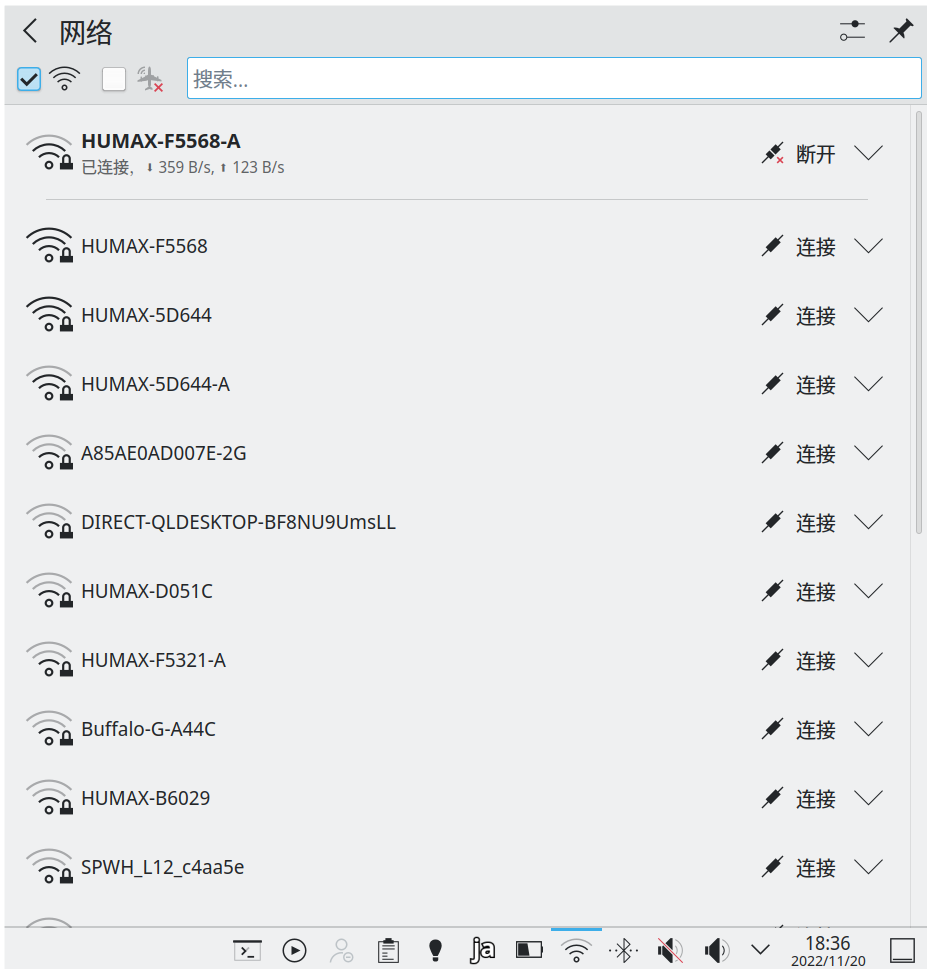{ width="50%" }

### 2.2 蓝牙管理工具

同样，安装好KDE桌面环境后，也是会带一个图形界面的蓝牙连接工具。 
除了开机启动的时候的自动连接有点小问题之外都很完美。但是需要我们自己安装bluez并设定bluetooth服务为开机启动。

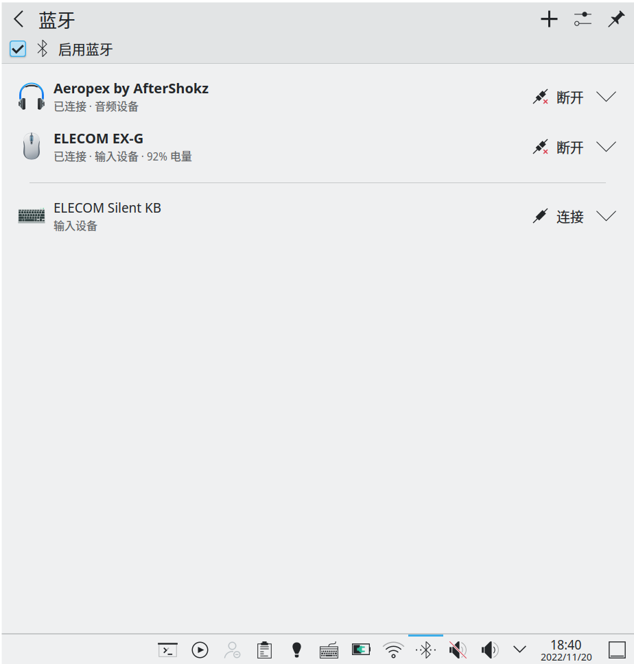{ width="50%" }

### 2.3 浏览器

推荐使用FireFox。（Edge和Chrome也已经支持Linux）

### 2.4 资源管理器

使用dolphin几乎是唯一的选择，其他的感觉嗯，实在是太丑了。

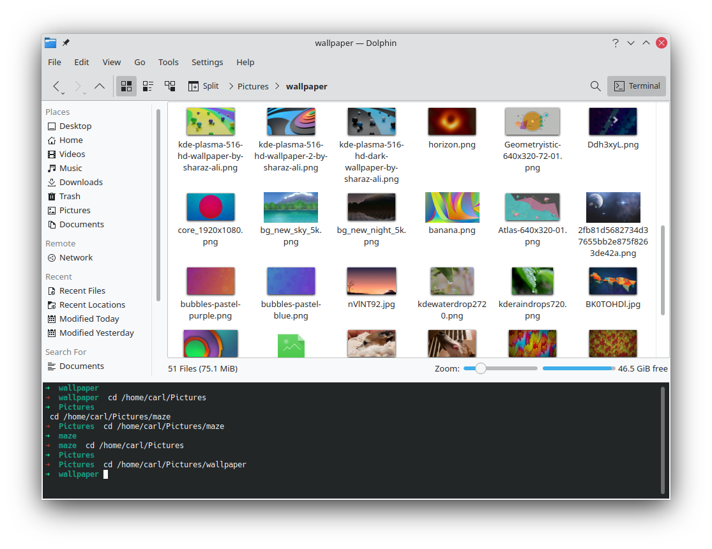

## 3. 文本编辑器

首先是leafpad，这是一个仿Windows记事本的非常轻量级的文本编辑器，功能几乎一模一样，启动速度极快，占用资源极少。而且界面经过升级之后也能融入系统主题，不丑了。

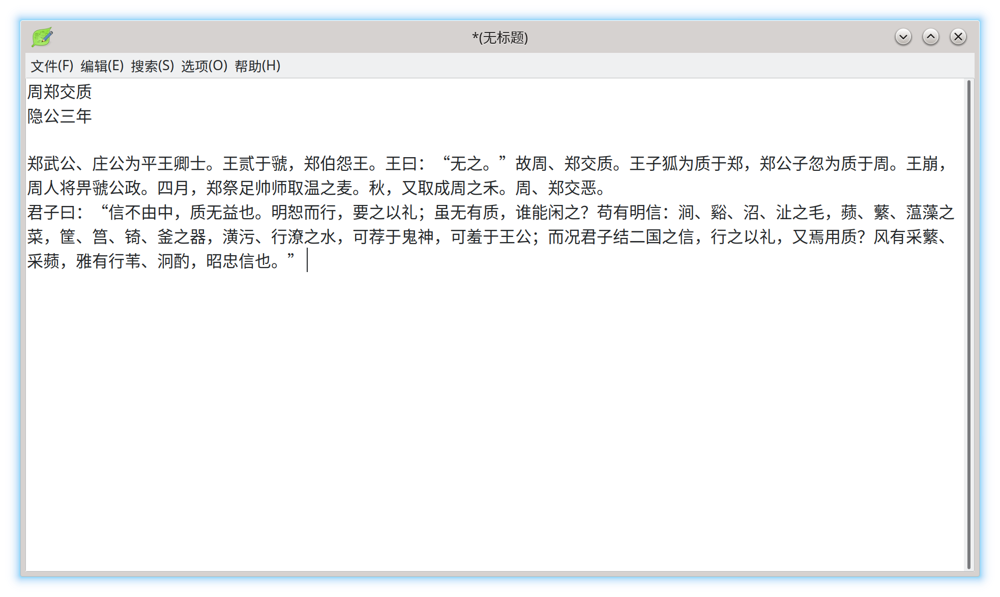

再复杂一点的是KDE自带的Kate，功能更多，启动速度要稍慢一点，支持语法高亮显示。

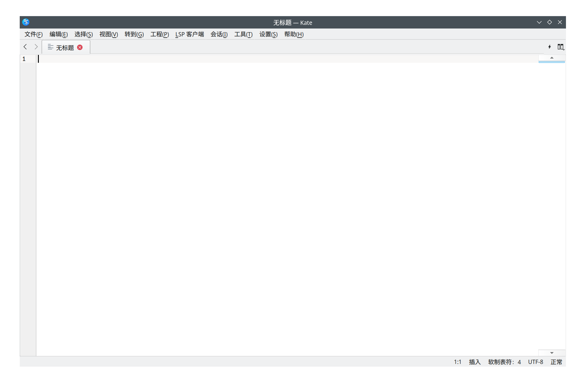

最后就是Visual Studio Code，宇宙级文本编辑器，有了这个几乎所有的文本编辑任务都没有问题了。而且它的启动速度也不会很慢，在低配的计算机上也能表现的很出色。

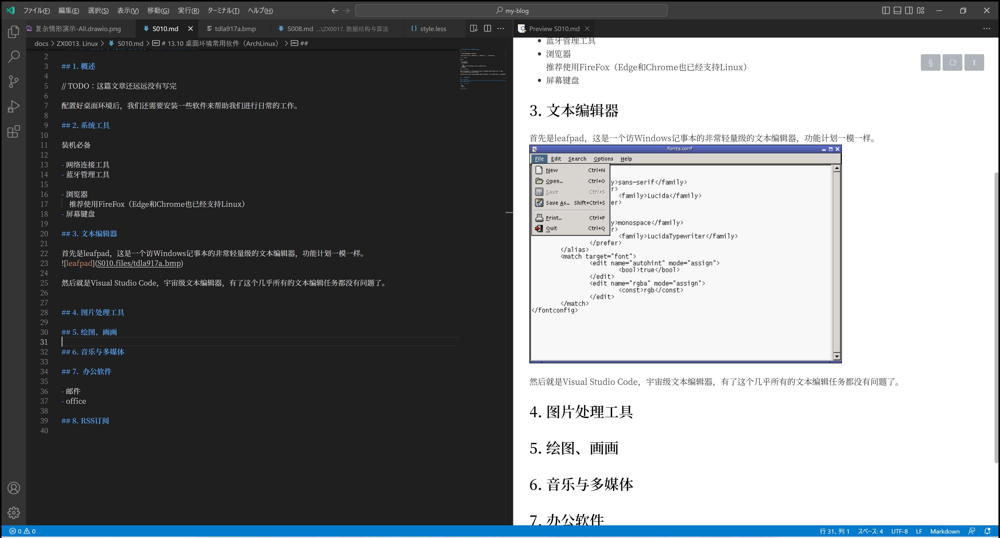

由于我们需要经常使用控制台，所以Vim也是必不可少的。
然后控制台中还需要一个差分比较工具，可以选择使用diffuse。

## 4. 绘图、画画、图片处理工具

选择不是很多，很多软件都没有Linux版本。

首先是仿Windows画图程序的软件KolourPaint。
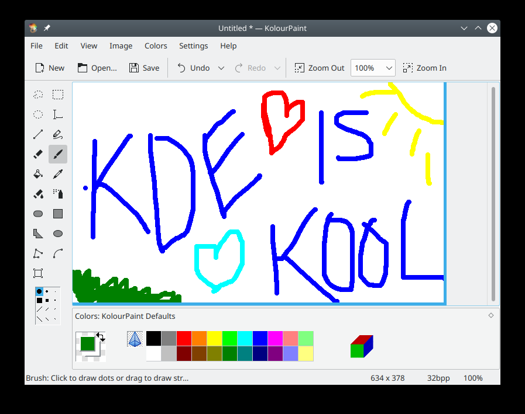

复杂一点的任务，可以使用GIMP，功能非常强大，完全够用了。
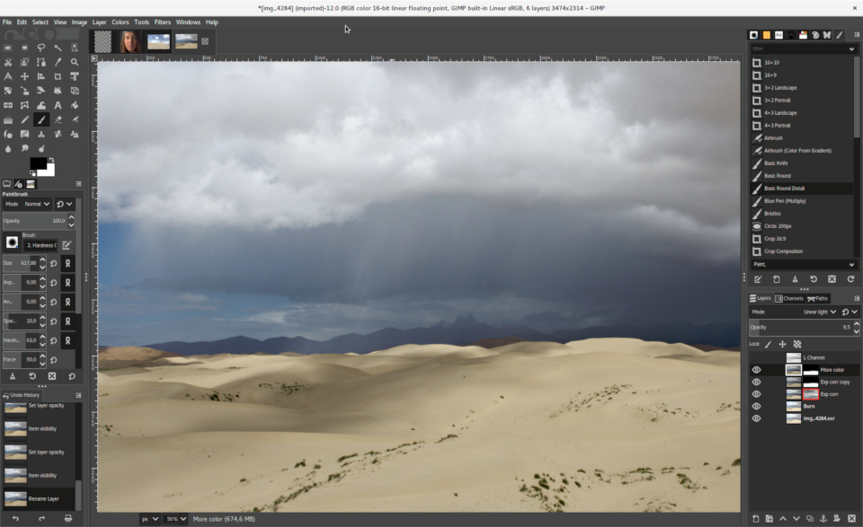

## 5. 音乐与多媒体

使用浏览器就可以了。本地播放器现在几乎没什么使用场景了。 
如果需要的话，可以安装万能播放器VLC。

## 6.  办公软件

自从微软完善了Web版Office，浏览器可以胜任一部分任务了。但是对于稍微复杂一点的作业，在网页上操作还是非常的难受，因此桌面端软件仍然非常的必要。

### 6.1 邮件

如果不想使用浏览器的话，ThunderBird雷鸟是最好的选择，而且它现在是跨平台的，也支持Windows、MacOS了。界面上也有了非常大的改观。

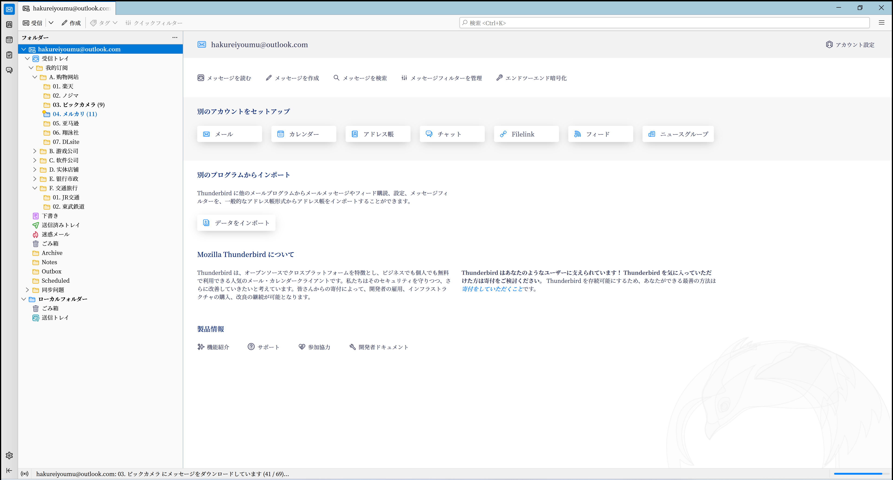

### 6.2 office

可以使用LibreOffice和WPS，但是它们都没有微软的Office那么强大。 
我比较喜欢LibreOffice，微软的软件比较臃肿，各种软件容易绑定在一起。而LibreOffice比较小巧，并且是完全免费的。

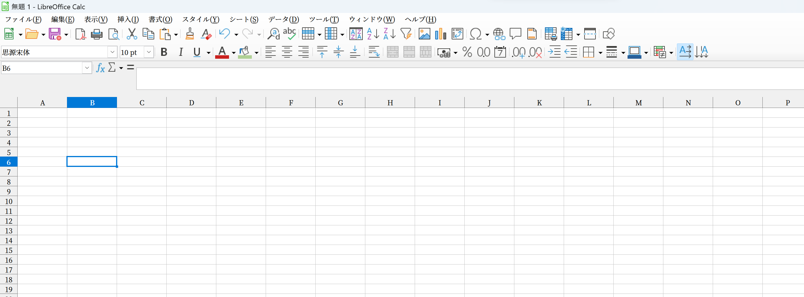

## 7. RSS订阅

还是浏览器搞定，比如FireFox中的插件。

## 8. 游戏

在Linux中玩游戏不是一个好的选择，但是通过使用Lutris游戏平台，确实能够玩一些游戏。
比如暴雪战网中的星际争霸2就可以玩。
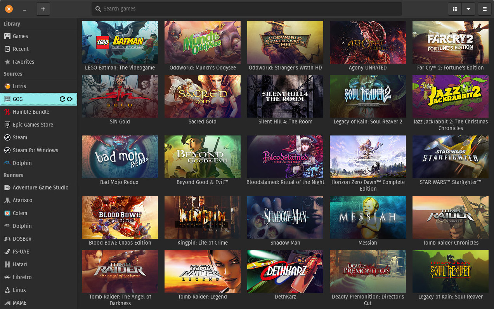