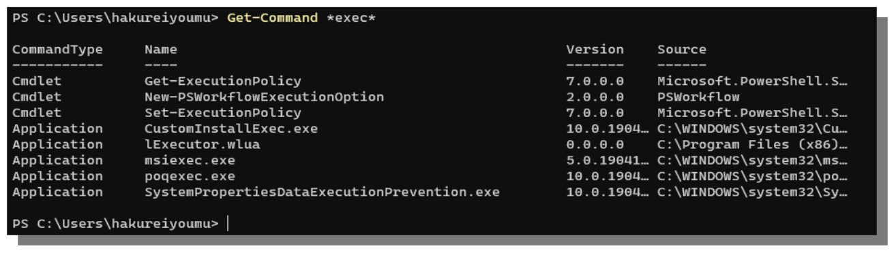

# A. 命令帮助

更新日期: 2022-10-30

--------------------------------------

## 1.	概述

PowerShell是Microsoft设计用来代替CMD的比较新的命令行工具。但是它不是很容易使用，特别是习惯了linux的bash之后。

本章主要就PowerShell的命令使用问题做一些探讨。

## 2.	检索关键字相关的命令

在使用命令行工具的时候，我们通常会因为不知道该用什么命令，也不知道有哪些命令而无从下手。我们不可能记住所有的命令。
使用如下的命令可以列举出所有能够执行的命令，并且可以按照关键字进行查询。

```powershell
Get-Command
Get-Command *exec*
Get-Command exec
```

注意：这里的 * 可以省略，因为默认情况下就是使用两端带 * 来检索的。

上面的第二条命令将执行列出名字里包含有exec的命令。然后我们就能猜测到里面有没有能供我们使用的命令。
它的输出如下：



参数在指定名字的时候可以使用通配符。

其实Get-Help命令默认就具有这个功能，可以说是比较万能。甚至于你可以不必知道有Get-Command这条命令。

它的用法也很简单，比如同样要查找"exec"相关的命令。

```powershell
Get-Help exec
help exec
```

help这个别名用起来特别简洁。想查询什么的时候 help xxxx 这一条命令就可以解决大部分的问题。

## 3.	查看命令的格式

类似于/?和--help等其它命令行语言中用来查看命令手册的命令，PowerShell中也有这样的命令。

```powershell
get-help start-service
```

上面已经介绍过了Get-Help命令(可以简写为help)可以用来查询命令，在这里help命令后面跟上命令的全名则会显示该命令的帮助文档。里面会列出参数的使用方法，命令的别名等。

## 4.	查看详细的命令解释

get-help默认打印出的手册比较简略，如果想查看详细的说明，可以加上-Full参数来显示完整的帮助手册。

```powershell
get-help start-service -Full
```

完整的帮助手册将列出参数和结果的类型信息。但即使是这样，有的命令仍然只是放一个名字和类型在那里，完全不知所云。所以比较难的命令建议一步到位，去查看在线帮助文档，或者直接谷歌百度一下。

## 5.	查看在线帮助文档

同样是get-help命令，在命令后面加上-Online即可。

```powershell
get-help start-service -Online
```

执行这条命令后，会打开浏览器，然后自动打开官方文档中这个命令这一页。这里面有更适合人类阅读的文档。
