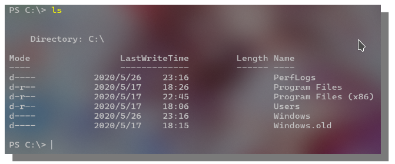
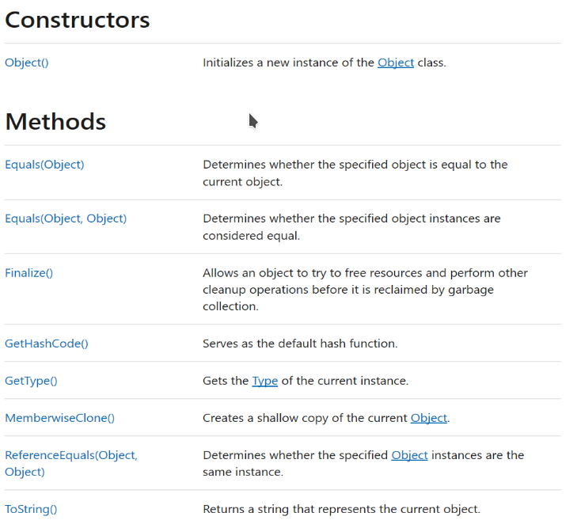
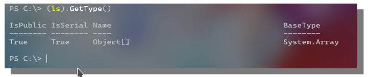
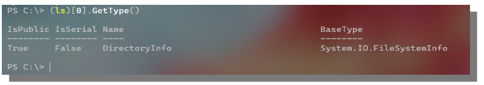
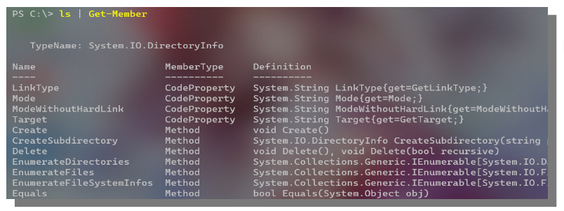
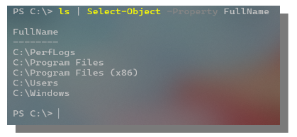
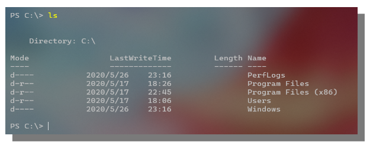

# B. 类型与管道

更新日期: 2020-05-27

--------------------------------------

## 1.	概述	

初次使用Power Shell时，会感觉特别难以使用。（其实用的时间久了，还是觉得很不好用）	
特别是对习惯了使用linux bash的人来说。主要的原因有两个：	

!!! example "原因"
    (1)	主要原因。Windows系统中的大多数系统功能和软件都不提供命令行接口，本来就无法像linux中用命令行控制一切。
    所以Power Shell作为一个命令行前端接口工具，能做的事情很有限。

    反观linux，几乎所有的软件都提供有命令行接口和文档，而且一切皆文件。无窗口界面的情况下完全不影响使用。

    (2)	Power Shell是带强类型系统的脚本语言。Power Shell背靠.NET，命令的输出为对象，在管道中传输的也是对象。即使是在控制台中敲一行命令完成一个小功能，也必须要意识到这一点去写。

所以在使用Power Shell时，要时刻记住，你操作的类型不是字符串，而是对象。	

## 2.	命令的输出类型	

不同于一般的命令行，Power Shell的输出通常都不是字符串，而是.NET对象或者.NET对象的数组。	

下面我以ls命令为例来粗略的说明一下。	



乍看之下，好像输出的结果就是图中的几行文字。	

但实际上如果我们如果用一些文字处理命令来处理这个输出会得到很奇怪的结果。	
这几行文字其实是命令行把真的的输出(.NET对象或数组)以文字的形式呈现给我们。	

### 2.1.	查看命令的输出类型

由于Power Shell的输出结果为.NET对象或数组，也就是System.Object类型。
那么Object的所有方法我们都可以直接调用。

下图是微软文档中对System.Object类型的描述。



可以看到GetType()方法可以返回对象的类型。对ls命令的结果执行GetType:



可以看到结果为Object[]类型。
同样，这里我们也可以调用GetHashCode()和ToString()方法。

要进一步查看数组中元素的类型，可以取出第一个元素并调用GetType()。



可以看到，Power Shell命令的结果确实真的和.NET中的类型一模一样。数组可以直接使用[]来取元素，还可以调用类的成员方法。

### 2.2.	查看输出类型的成员

既然，我们知道了输出的类型是.NET对象或数组。我们自然想知道这个对象都有哪些属性可以查看，有哪些方法可以调用。
好决定我们下一步的行动。

此时可以使用如下命令：

```powershell
ls | Get-Member
```



这里就会列举出所有的方法和属性。

另一种方法是，直接去官方文档中查看此.NET类型的文档。

## 3.	管道	

所谓管道，就是像现实中的水管那样，把一条一条命令首尾连接起来，前一条命令的输出即为下一条命令的输入。	

在Power Shell中，管道里传输的同样是.NET对象或数组。要时刻牢记这一点。	

管道的语法和通常的命令行语言相同，例如下面的命令筛选出ls输出中的FullName字段：	



对比ls的命令，我们可以发现默认情况下控制台上并不会打印出输出结果的所有字段，目录的FullName默认就不会被打印出来。	



这也是Power Shell经常让生手困惑的原因，明明这条命令的结果中就这些内容，怎么再接一条命令就能取出来更多的内容呢？	
所以说Power Shell并不是一上来就能根据以往的经验而很快上手的一门语言。必须先学习一下必备的基础知识。	
