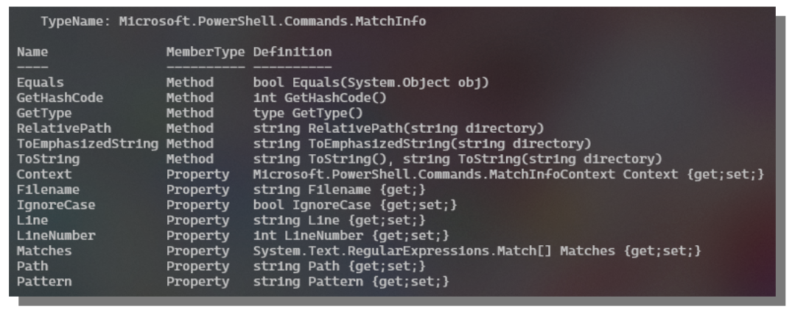
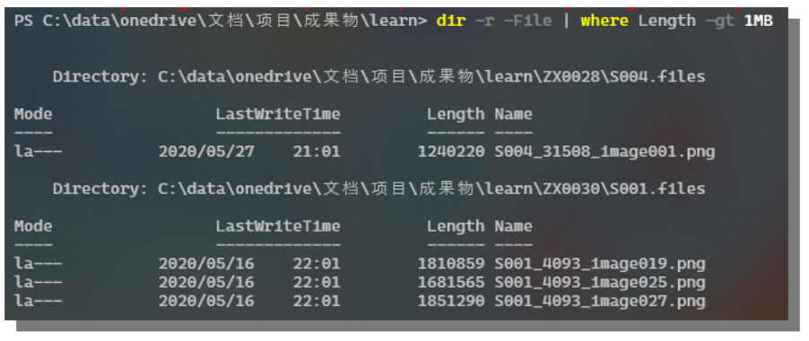
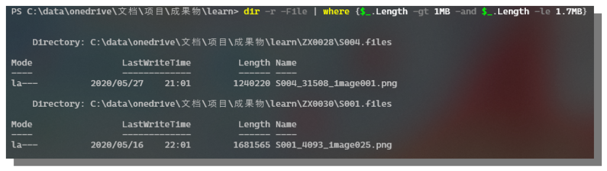
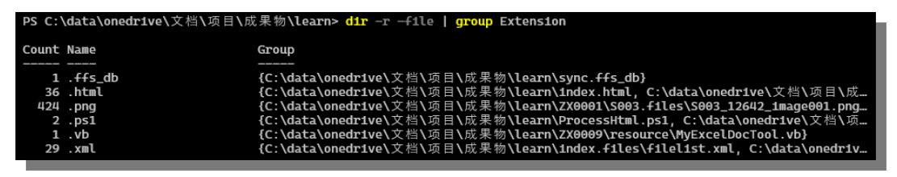
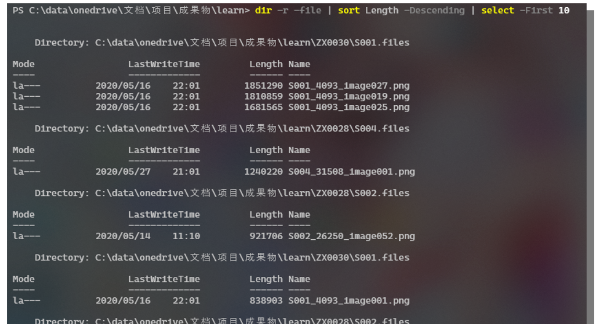

# C. 检索与过滤结果

更新日期：2020-06-06

--------------------------------------

## 1.	概述		

命令行中一个很常用的操作是检索，我们通常需要从字符串、文本文件或者命令的结果中检索内容。		
而过滤结果又是另一个重要的非常常用的动作。要记住Power Shell返回的是对象，默认并不会完整的显示对象的所有成员信息。		

## 2.	字符串检索		

使用Select-String可以执行这个操作，这里只介绍一下基本用法。		
要注意的是这个命令默认使用正则表达式进行检索。		

### 2.1	基本用法	

!!! example "对某一文件进行检索"	

    ```powershell
    Get-Content 文件 | Select-String "要检索的文字"
    ```

!!! example "在指定的目录下检索文字（包括子目录）"	

    例如在当前目录及子目录中检索包含div元素的html:

    ```powershell
    dir *.html -R | Select-String "<div"
    ```

!!! example "在命令的结果中进行检索"	

    通常应该使用过滤的相关命令，命令的结果并不是字符串而是对象，直接检索将得到意想不到的结果。

### 2.2	配置检索选项	

可以对Select-String附加参数来控制检索的行为，同样我们只关注最常用的几个。	

```powershell
-SimpleMatch	
-CaseSensitive	
-AllMatches	
-Raw	
-Context m,n
```	

这条命令默认只显示结果行的内容，如果想显示行号，可以使用下一节介绍的过滤命令来显示。	

## 3.	筛选结果		

### 3.1	筛选结果列	

由于Power Shell的命令结果为对象，而对象一般都有许多属性，往往默认的输出会挑一些重要的常用的显示出来。	
要显示出想要的属性列通常分为检索和从结果中二次筛选两步。	

!!! example "查看结果对象的成员	"

    使用Get-Member命令查看结果对象的成员，前面已经介绍过了。必须我们得先知道结果对象有哪些成员，才能决定想显示哪些成员。	

    以上面的检索命令为例，现在我想显示结果所在行的行号。	

    ```powershell
    Get-Content .\index.html | Select-String "x:" -SimpleMatch -Context 3,2 | Get-Member	
    ```

    结果如下：	

    

    可以看到有个LineNumber，应该就是我们想要的行号。而Line则是那行文本的内容。	

!!! example "筛选属性列	"

    使用Select-Object命令可以筛选结果对象中的属性列。	
    这条命令类似于SQL语言中的select语句，并且可以简写为Select。	

    ```powershell
    Get-Content .\index.html | Select-String "x:" -SimpleMatch -Context 3,2 | Select-Object LineNumber, Line	
    ```

    结果如下：	

    

    Select-Object命令有很多复杂的用法，比如查看前10行，对属性值进行运算、重新定义属性列等。	
    基本上SQL中Select语句能进行的操作这条命令也都可以做。	
    暂时不用给自己加上这么重的负担。筛选列就是它最基本的用法。	

!!! example "筛选结果行	"

    很多命令的结果是对象的数组，如果这个数组比较大，可能会显示好几屏的数据。我们自然会想要进行筛选。	
    使用Where-Object命令可以完成这个功能。	

    这条命令类似于SQL语言中的where语句，可以指定一些条件语句来筛选结果。这条命令也可以简写为Where。	

    例如，我想查看当前目录下大于1M的文件有哪些：	

    ```powershell
    dir -r -File | where Length -gt 1MB	
    ```

    结果如下：	

    

    同样可以使用And和Or来指定多个条件。只不过不能使用where的简写形式了。	

    ```powershell
    dir -r -File | where {$_.Length -gt 1MB -and $_.Length -le 1.7MB}	
    ```

    结果如下：	

    

Power Shell中条件表达式的写法会在其它章节中进行介绍。	

## 4.	分组与排序		

既然是和SQL语言类似。那可以猜测到也有Group和Sort了。它们的基本用法如下：		

!!! example "按扩展名对文件进行分组"

    

!!! example "按文件大小倒序排列并取前10条结果"

    

更复杂的用法可以直接去参考官方文档。		
