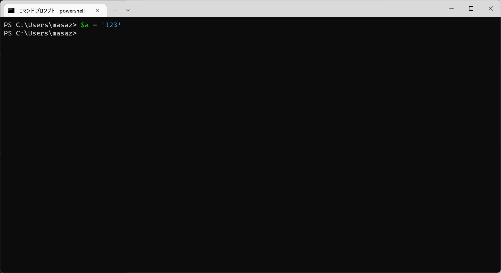
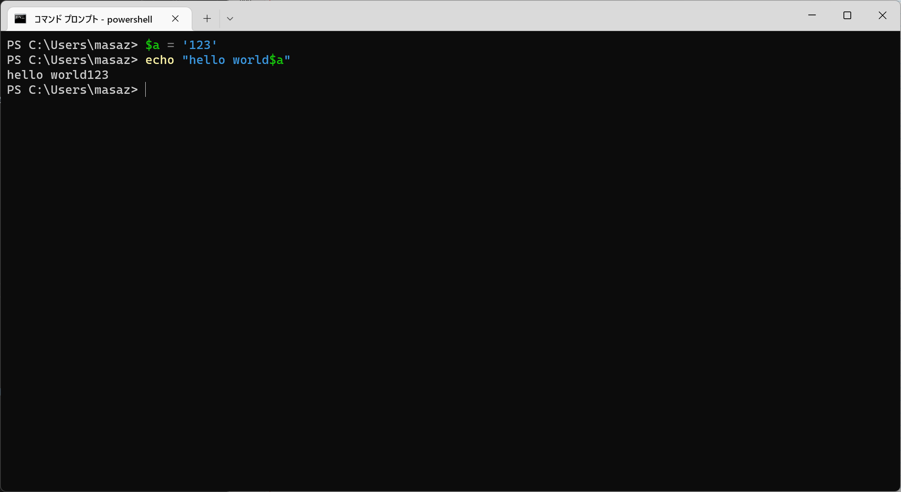
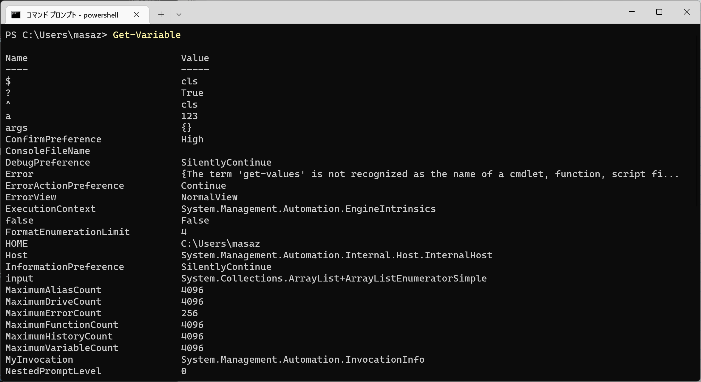
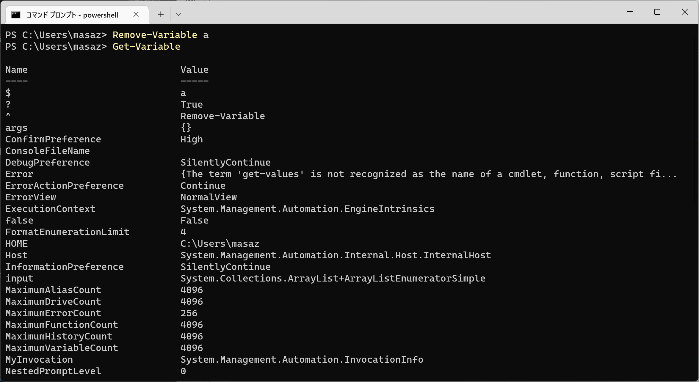

# G. 变量的使用

更新日期: 2022-10-30

------------------------------------------

## 1. 概述

变量的作用不用多说。在脚本语言中使用变量可以使复杂的代码化解为多行的作用明确、容易理解的代码。

## 2. 使用方法

### 2.1 定义

使用`$`这个符号就可以定义一个变量，并且不需要指定类型。

### 2.2 使用

使用的时候，同样是用`$`这个符号。

不过要注意的是，在字符串中使用变量，要使用双引号来标识字符串，而不要使用单引号。

### 2.3 列出当前环境中的所有变量

直接使用`Get-Variable`这个命令就可以了，这里可以看到我们前面定义的变量`a`。

### 2.4 删除当前环境中的指定变量

使用`Remove-Variable 变量名`即可，我基本上是猜出来了这个命令的名字。
执行完成后可以看到变量`a`被删掉了。

