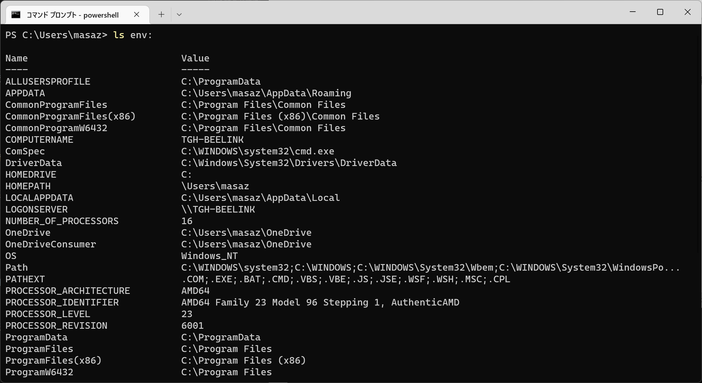
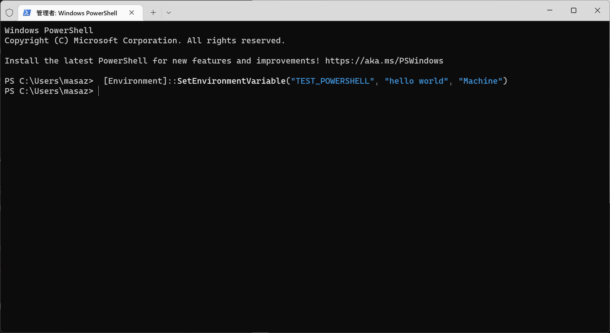
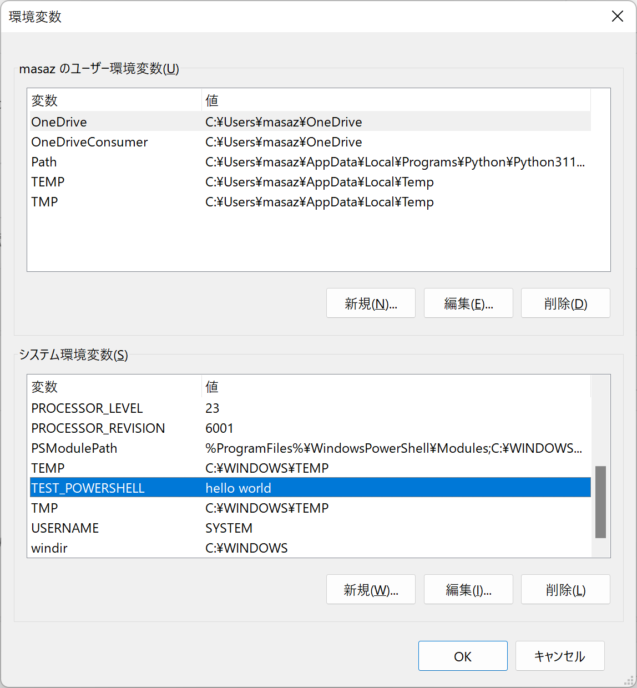
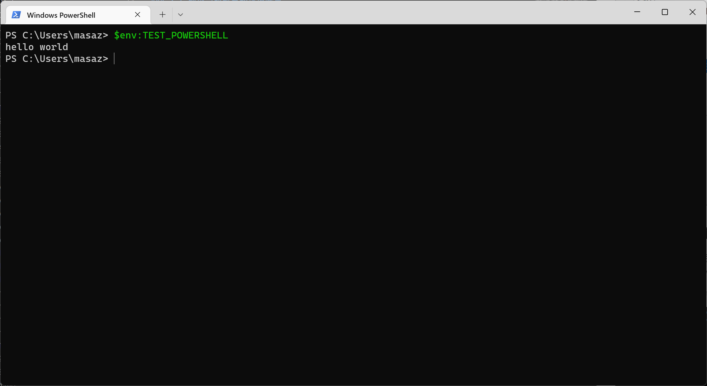
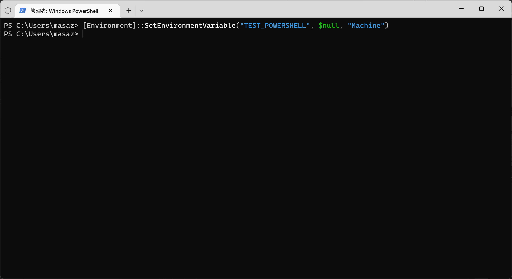
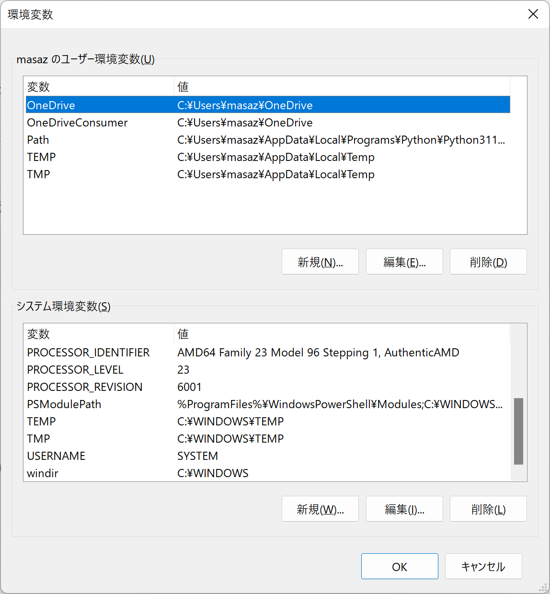

# H. 环境变量的使用

更新日期: 2022-10-30

------------------------------------------

## 1. 概述

这里的环境变量，指的是当前操作系统的环境变量。在脚本语言中访问系统环境变量也是很常见的需求。

## 2. 使用方法

### 2.1 列举当前所有的环境变量

在powershell中，环境变量使用文件系统来进行管理，`env:`这个驱动器盘符就可以用了访问这个环境变量文件夹。



### 2.2 添加或修改一个系统环境变量

借助于下面的.net命令可以完成这个任务。

```powershell
# 需要使用管理员权限
[Environment]::SetEnvironmentVariable("变量名", "变量值", "Machine")
```



添加完成后，我们通过查看Windows系统提供的功能来查看一下环境变量，可以看到成功添加上去了。



当然这个命令也可以用来修改环境变量的值。

### 2.3 使用系统环境变量

使用`$env:环境变量名`即可，当然我们在上面新加了一个环境变量的话，在当前session中是不会立刻生效的，我们需要打开另外一个powershell窗口，才可以开始使用。



### 2.4 删除一个系统环境变量

和添加和修改的时候一样，同样是借助于这条.net命令来完成这个任务，只不过这次我们指定的设定值是`$null`。

```powershell
# 需要使用管理员权限
[Environment]::SetEnvironmentVariable("变量名", $null, "Machine")
```



此时，我们再次查看Windows系统提供的功能来查看一下环境变量，可以看到成功删除掉了。

