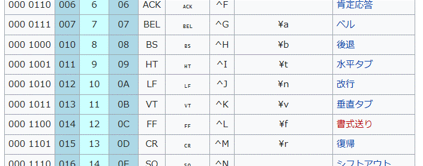
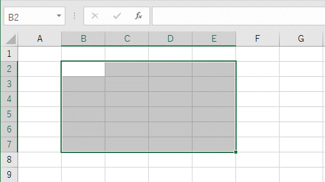
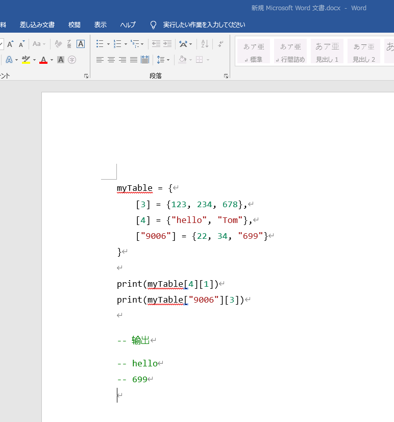
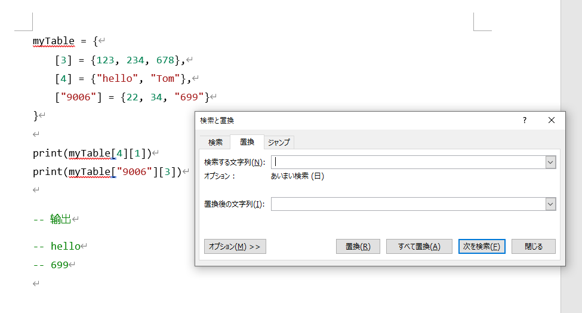
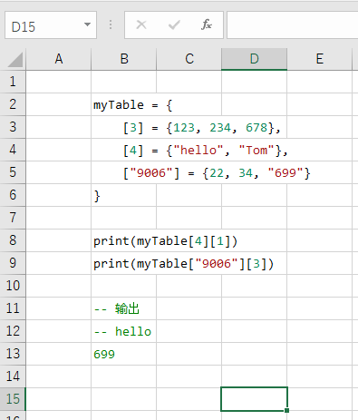

# VBA基础知识

更新日期: 2020-05-17

----------------------------------------------

## 1.	查询官方手册
                    
VBA的语法比较古怪，而代码编辑器比较老旧，使用体验并不好，给我们的学习使用带来很大的障碍。
在开始之前，先介绍一个方便的查询文档方法。
                    
选择代码中的类型或者属性，按下F1，可以立即跳转到微软官方手册上的相关页面。
                    
比如，我想知道可以对单元格进行哪些操作。可以直接选中Range这几个字母，按下F1。
                    
## 2.	语法参考
                    
VBA中有很多特殊的语法，与主流的编程语言不太一样。为了减少记忆量，尽量使用最简单的语法来编程会使自己轻松一些。
                    
### 2.1	变量，常量						
                    
在VBA中使用Dim关键字来定义变量，并可以作为局部变量或者全局变量。						
                    
```vb                    
Dim text As String						
```                    
                    
要注意，在定义常量的时候并不需要指定类型:						
                    
```vb                    
Public Const HTML_A_TEXT = "Hello world!!!"						
```                    
                    
在VBA中如果要给对象类型的变量赋值，需要加上Set关键字。						
                    
```vb                    
Dim abc As Object						
Set abc = CreateObject(XXXX …						
```                    
                    
### 2.2	数组						
                    
数组的使用比较复杂，直接用例子来说明。要注意的是数组的下标从 1 开始：						
                    
```vb                    
' 创建一个数组						
Dim myArr(200) As Variant						
                    
' 给数组中的元素赋值						
myArr(1) = 1						
                    
' 取出指定索引的元素						
myArr(2)						
                    
' 数组作为函数参数时的写法						
Sub MyFunc(ByRef myArr() As Variant, ...						
                    
' 可以通过嵌套来定义二维数组						
Dim secArr(4) As Variant						
myArr(1) = secArr						
' 这样myArr就成了一个200 x N的二维数组						
' 这个写法可以引用二维数组中的元素						
myArr(30)(2)						
```                    
                    
### 2.3	函数，过程						
                    
函数和过程并没有太大区别，函数可以带返回值。过程也可以通过传递ref参数来输出结果。						
函数的返回值用它的名字来指代。						
                    
```vb                    
' 定义一个函数						
' Count the Used Line						
Function CountUsedLine() As Integer						
    Dim n As Integer						
    						
    n = ActiveSheet.UsedRange.Rows.Count						
    CountUsedLine = ActiveSheet.UsedRange.Rows(n).Row						
End Function						
                    
' 定义一个过程						
' Set Font Size						
Sub SetFontSize(rangeStr As String, size As Integer)						
                    
    With Range(rangeStr).Font						
        .size = size						
    End With						
End Sub						
```                    
                    
使用输出类型的参数:						
                    
```vb                    
' 带输出参数的过程						
Sub MySub(ByRef myArr() As Variant, ByRef capCount As Integer)						
    						
    ' TODO						
End Sub						
```                    
                    
这里为了返回多个值使用了数组来作为输出参数。						
                    
调用过程与函数。						
                    
```vb                    
Call SetFontSize						
n = CountUsedLine()						
```                    
                    
### 2.4	控制语句						
                    
!!! example "IF语句"						
                        
    ```vb                    
    If x = 1 Then					
        ' do some thing					
    ElseIf x = 4 Then					
        ' do some thing					
    Else					
        ' do some thing					
    End If					
    ```                    
                    
!!! example "SWITCH语句"						
                        
    switch的写法比较多，有的也很方便，但是语句格式不同于一般的编程语言。可以尽量少用。					
    这里我们只看最基本的用法，也就是和其它语言中相同的用法。					
                        
    ```vb                    
    Select Case n					
        Case 1					
            ' do some thing					
        Case 2					
            ' do some thing					
        Case Else					
           ' do some thing					
    End Select					
    ```                    
                        
    注意，这里并没有break。					
                    
!!! example "WHILE语句"						
                        
    ```vb                    
    Do While true ' 条件					
        ' do some thing					
    Loop					
                        
    Do					
        ' do some thing					
    Loop While true ' 条件					
    ```                    
                        
    要退出循环，可以使用Exit Do。					
                        
!!! example "FOR语句"						
                        
    ```vb                    
    ' 从1到100，每次加2					
    For i = 1 To 100 Step 2					
        ' do some thing					
    Next					
    ```                    
                        
    要退出循环，可以使用Exit For。					
                    
### 2.5	逻辑运算符						
                    
!!! example "相等比较"						
                        
    注意只使用一个=，而不是==。					
                    
!!! example "逻辑与和或"						
                        
    使用And和Or关键字。					
                    
!!! example "逻辑取反"						
                        
    使用Not。					
                    
!!! example "判断空对象"						
                        
    ```vb                    
    Dim rst As Range					
    Set rst = Rows(9).Find("")					
    ' 判断对象是否为空					
    If rst Is Nothing Then					
        ' do something					
    End If					
                        
    ' 判断对象是否不为空					
    If Not rst Is Nothing Then					
        ' do something					
    End If					
    ```                    
                        
## 3.	字符串操作
                    
### 3.1	字符串拼接						
                    
使用 & 来进行字符串拼接。注意多种语言的拼接字符不要混淆了。						
                    
```vb                    
"Hello " & "World!!!"						
```                    
                    
### 3.2	特殊字符						
                    
有很多特殊字符无法在代码里面直接打出来，VBA并没有提供转义字符来表示，而是通过直接指定ASCII码的方式：						
                    
此处引用WiKi百科上的ASCII码表：						
                    
                    
          
比如要在字符串种使用水平制表符(\t)，可以这样写:						
                    
```vb                    
"Hello" & Chr(9) & "World!!!"      ' 十进制						
"Hello" & Chr(&H09) & "World!!!"   ' 十六进制						
```                    
                    
### 3.3	字符串比较						
                    
直接使用一个 = 来比较，不需要equals之类的专门的方法。						
                    
### 3.4	查找						
                    
#### 3.4.1	查找指定范围内的文本					
                    
使用Range对象的Find方法可以进行字符串的查找，可以配置的参数也比较多。					
                    
查找一个范围内的文本的通常用法如下：					
                    
```vb                    
Dim rst As Range					
With Range(Cells(1, "A"), Cells(10, "J"))					
    Set rst = .Find("abc", After:=.Cells(.Cells.Count))					
    ' rst中就是检索结果的单元格					
End With					
```                    
                    
具体的参数可以查询微软的文档。主要可以配置如下参数：					
 
参数 | 含义
--- | ---         
After  |   开始检索的位置，默认从范围左上角开始的第二个单元格开始		
LookIn	|	在单元格的什么属性中查找，默认从单元格的值里面查找		
LookAt	|	部分匹配或者是全部匹配，默认为部分匹配		
SearchOrder	|	查找顺序，行优先或者列优先。默认为行优先		
SearchDirection	|	查找方向，默认从前往后查找		
MatchCase	|	是否区分大小写，默认不区分		
MatchByte	|	双字节匹配，通常用不到		
SearchFormat	|	搜索格式，字体颜色等，通常用不到		
                    
这里之所以用奇怪的方法指定了After参数，是因为Find有一个非常坑的特性。					
你以为Find函数会从指定的范围内的第一个单元格开始查找，然而其实是从第二个单元格开始找。					
所以如果查找范围内有多个单元格都是匹配的，可能会得到奇怪的结果。					
                    
上面After配置的值，就是配置为该范围内的最后一个单元格。由于是循环查找的，那么最后一个单元格的下一个单元格就是范围内的第一个单元格。					
                    
#### 3.4.2	继续查找下一个					
                    
就像我们在窗口中查找一样，代码里也可以循环查找下一个。使用如下函数：					

```vb                    
FindNext					
```

详细的用法可以在微软的文档中找到。					
                    
用法示例：					
                    
```vb                    
Dim rst As Range					
With Range(Cells(1, "A"), Cells(10, "J"))					
    Set rst = .Find("abc", After:=.Cells(.Cells.Count))					
    ' rst中就是检索结果的单元格					
                    
    ' 现在继续查找					
    Set rst = .FindNext(rst)					
End With					
```                    
                    
#### 3.4.3	查找空白单元格					
                    
使用""即可表示空白单元格：					
                    
```vb                    
Dim rst As Range					
Set rst = Rows(9).Find("")					
```                    
                    
### 3.5	常用字符串参照函数						
                    
函数 | 意义
 |                     
Len(字符串)		|	取字符串长度			
Left(字符串)	|		从左边截取子字符串			
Mid(字符串)		|	从中间截取子字符串
Right(字符串)	|	从右边截取子字符串
                    
## 4.	EXCEL表格中的对象
                    
### 4.1	Book对象						
                    
类型	Workbook					
                    
当前处于激活状态的Book为ActiveWorkbook。						
                    
这个类型我们使用的不多，通常的VBA代码都是针对某一个特定的Excel文件来运行的。						
我们操作Sheet的时候一般默认操作当前处于激活状态的Book。						
                    
### 4.2	Sheet对象						
                    
类型	WorkSheet					
                    
!!! example "取得当前激活状态的sheet"						
    ```vb                     
    ActiveSheet					
    ```       

!!! example "取得指定的sheet"						
    ```vb                     
    Sheets("sheet名")					
    Sheets(sheetIndex)			※从1开始编号		
    Worksheets("sheet名")					
    Worksheets(sheetIndex)				※从1开始编号	
    ```

    Sheet与Worksheet的概念我们一般是不用关心的。					
                    
!!! example "激活一个sheet"						
    ```vb                    
    sheet对象.Activate					
    ```

    激活后，会切换输入焦点到那个sheet页，并且使用ActiveSheet可以取得这个sheet。					
                    
### 4.3	Cell对象						
                    
类型	Range					
                    
所谓Cell，也就是单元格。使用Range类型来表示单元格，也就是说可以指定一个矩形框范围内的单元格。						
                    
Range的写法也比较多，掌握最简单实用的写法可以节约脑细胞。						

写法 | 含义
 |                     
Cells(2, 4)	|		第二行第四列的单个单元格			
Range(A1:K20)	|		从A1到K20的多个单元格			
Rows(2)		|	第二行所有单元格			
Columns(3)		|	第三列所有单元格			
Range(Rows(2), Rows(4))		|				第二行到第四行的所有单元格
Range(Columns(3), Columns(9))		|				第三列到第九列的所有单元格
Range(Cells(2, 4), Cells(5, 10))	|					从第二行第四列到第五行第十列的所有单元格
                    
### 4.4	当前选择中的区域						
                    
                    
                    
像这种矩形选择区域。
使用录制宏自动生成的代码里面很常见。

使用如下代码可以将指定的Cell对象选中：						

```vb                    
Cell对象.Select						
```

Selection就表示当前选择中的区域，通常情况下这也是一个Range类型的对象。						
                    
## 5.	特殊处理
                    
### 5.1	nonbreaking space导致的错误						
                    
从其它地方往sheet页上带着样式拷贝文本的时候，经常会有奇怪的东西被拷贝进来。就比如这种特殊的空格。						
例如: 从Visual Studio Code带着样式往Excel种贴代码。						
                    
这种空格叫做【UTF8半角空格】，通常使用的时候和一般的空格区别不大。经常在html中用来表示固定宽度的空白，因为一般的半角空格会被自动压缩宽度，而这种空格能保持固定宽度。			   
绝大多数情况下，我们不需要关心它。几乎所有的编程语言都把它当作一个普通的空格。但是像lua这种语言，到现在也不支持unicode编码的字符，就是出语法错误。						
                    
在程序中使用Chrw(160)来表示这个特殊空格，写相关代码的时候可以考虑使用。						
                    
但通常，我使用如下方法来解决这个问题。						
                    
(1)	将代码从Visual Studio Code拷贝到Word文档中。					
                    
                    

(2)	使用替换功能将这种空格替换为普通半角空格。					
                    
在查找框里面输入这个特殊空格的方式是：					
                    
- a.	按住键盘上的Alt键			
- b.	输入数字160		※160是这个特殊空格的AscII码	
- c.	松开Alt键			
                    
                    
  
(3)	全选Word文档中的内容，然后粘贴到Excel中。					
                    
                    
                    
之所以不在Excel中替换这个字符，是因为替换后文字的样式就乱了，而在Word中替换则不会影响文字的样式。					
