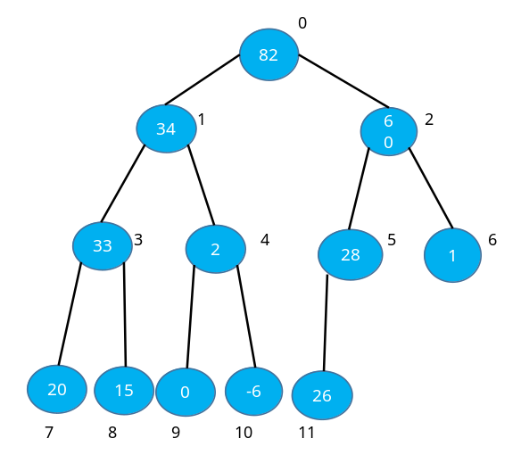

# B. 堆排序

更新日期: 2020-05-12

----------------------------------------------

## 1.	堆的概念	
    
堆是一种树形数据结构。满足如下两个条件：	
    
- (1)	是完全二叉树。
- (2)	任何父节点都大于等于或者小于等于它的子节点。
    
其中，父节点大于等于子节点的成为大顶堆。父节点小于等于子节点的称为小顶堆。	
    
以大顶堆为例：	
    


由于完全二叉树除了最后一层，都是满的。而最后一层从左到右也是满满当当，因此经常用数组来存储二叉树。上图中的元素编号直接对应数组下标。	
    
用数组表示时。可以很容易推导出如下关系:	
    
- 假设父节点的下标为k，则它的左子节点下标为2 * k + 1，右子节点为2 * k + 2;
    
从图中可以看出大顶堆的最大元素就是根节点，小顶堆的最小元素在根节点。	
    
## 2.	堆排序原理	
    
以从小到大排序为例。假设有一个数组，它有10个元素。则它的排序过程如下。	
    
- (1)	将这个数组看作完全二叉树，调整其结构，使其成为大顶堆。
    
- (2)	将堆顶元素和末尾元素交换。此时最大值自然就被移到了最后。
    
- (3)	将前9个元素再次调整结构使其成为大顶堆。
    
- (4)	将堆顶元素与倒数第二个元素交换。此时最大值在末尾，第二大的值在倒数第二位。
    
- (5)	重复上述过程，直至剩下最后一个元素。
    
可以看到，算法的关键就在于构造大顶堆。	
    
要描述构造大顶堆的过程，请允许我用自己的语言先定义几个堆中的常用操作。	
    
!!! example "下沉"	
    
    对于一个节点，如果它具有子节点并且它的值小于其中一个子节点。则我们将这个节点和它较大的子节点交换位置。相当于按大小顺序将这个节点向下调整一层。
    
    被向下调整一层之后，如果这个节点还有子节点，而且它的值又小于其中一个子节点。则再次交换这个节点和它较大的子节点的位置。也就是将它再次向下调整一层。
    
    如此重复上面的步骤，将这个节点连续向下层调整。由于在树的图例中，这个节点表现为连续向下移动。所以我称这个过程为下沉。
    
!!! example "沉底"	
    
    对一个节点进行下沉操作，如果它被调整到底层了，或者它的值不小于两个子节点了，则它已经沉到了适合它的位置。我称这个状态为沉底。一般而言，下沉操作就是指将一个节点连续向下层调整，直到它达到沉底状态。
    
有了上面这个操作定义。则构造大顶堆的过程可以描述为：	
    
- 将数组中所有元素逆序遍历，逐一进行下沉操作。
    
将所有元素下沉一遍，则最大的元素自然就浮到最上面去了。	
    
由于叶节点已经是沉底状态了，不用执行下沉操作。所以其实我们可以从倒数第一个有子节点的父节点开始下沉。它的位置也很容易推导出来：	
    
- 如果一个数组的长度为length，则倒数第一个父节点的索引为: (length -2) / 2。
    
至此，构造大顶堆的问题我们也解决了。构造小顶堆也是同样的思路。	
    
## 3.	代码示范(Java)	
    
```java    
public class HeapSort {	
    
    // 堆排序	
    public static void heapSort(int[] numArray) {	
        	
        _heapSort(numArray, numArray.length);	
    }	
    
    // 对数组的前部进行排序(length为前部范围)	
    private static void _heapSort(int[] numArray, int length) {	
    
        // 如果只有一个元素，则不需要排序	
        if (length <= 1) {	
    
            // 排序结束	
            return;	
        }	
    
        // 将数组做成大顶堆	
        makeBigHeap(numArray, length);	
    
        // 将堆顶与最后一个元素交换	
        swap(numArray, 0, length - 1);	
    
        // 对刨除最后一个元素的剩余部分数组进行排序	
        _heapSort(numArray, length - 1);	
    }	
    
    // 将数组做成大顶堆	
    private static void makeBigHeap(int[] numArray, int length) {	
        	
        // 寻找最后一个父节点	
        int lastRoot = (length -2) / 2;	
    
        // 从最后一个父节点开始，按照从右往左，从下到上的顺序逐一沉底	
        for (int root = lastRoot; root >= 0; root--) {	
    
            // 沉底指定节点	
            goDown(numArray, length, root);	
        }	
    }	
    
    // 沉底指定节点	
    private static void goDown(int[] numArray, int length, int root) {	
        	
        // 下沉此节点直至它到底沉底状态	
        while (true) {	
    
            // 寻找此父节点的两个子节点中较大的那个	
            int leftLeafIndex = root * 2 + 1;	
            int rightLeafIndex = leftLeafIndex + 1;	
            // 默认左子节点大	
            int biggerIndex = leftLeafIndex;	
            // 如果右子节点存在并且比左子节点大，则右节点大	
            if (rightLeafIndex < length	
                    && numArray[rightLeafIndex] > numArray[leftLeafIndex]) {	
                biggerIndex = rightLeafIndex;	
            }	
            	
            // 如果此父节点小于较大的子节点，则交换父节点和这个子节点的位置	
            // 也就是父节点下沉一层	
            if (numArray[root] < numArray[biggerIndex]) {	
    
                // 交换父节点和这个字节点的位置	
                swap(numArray, root, biggerIndex);	
                // 现在此父节点位于这个新的位置	
                root = biggerIndex;	
                // 如果在这个新的位置上它没有子节点，则它达到了沉底状态	
                int newLeftLeafIndex = root * 2 + 1;	
                if (newLeftLeafIndex >= length) {	
                    break;	
                }	
                // 如果在新位置上还有子节点，则进行下一次循环，继续下沉操作	
    
            // 如果此时父节点不小于两个子节点，则它已经达到沉底状态	
            } else {	
                break;	
            }	
        }	
    }	
    
    // 交换两个元素	
    private static void swap(int[] numArray, int aIndex, int bIndex) {	
    
        int temp = numArray[aIndex];	
        numArray[aIndex] = numArray[bIndex];	
        numArray[bIndex] = temp;	
    }	
}	
```