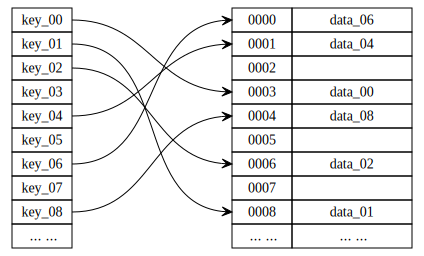
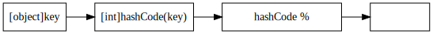
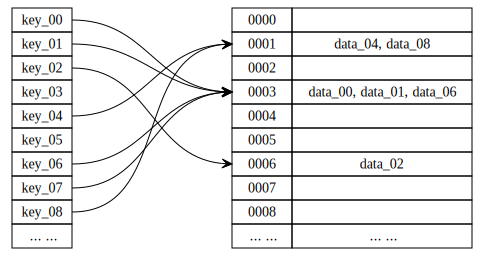
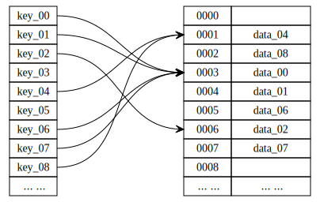
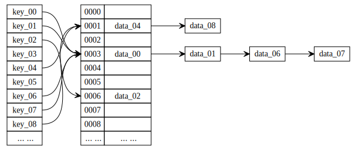

# D. 散列表

更新日期：2020-06-24

--------------------------------------------------

## 1. 概述

散列表又叫做哈希表，是一种保存key->value键值对数据的线性结构。
由于其能够通过key来直接进行定址，所以可以以常数时间来随机存取表中所有数据。

散列表通常作为各种关联数组的底层结构。比如Java中的HashTable和HashMap。

从使用上来说与数组很像，散列表本身背后也是一个数组，只不过这个数组不是直接通过下标定址，而是将key做一次映射然后得到数组的下标，然后再找到要访问的元素。

## 2. 基本概念

散列表本质上就是一个数组。在访问数组时，我们会给定一个index，也就是直接给出地址。
但是对于散列表来说，给我们的不是index而是一个任意类型和值的key，需要通过`散列函数`来得到地址(即数组的索引)。

散列函数的实现有很多。以最简单的一种为例：

简单的说明一下：
- 计算key的hashCode值
- 使用hashCode除以数组长度取余数
- 余数就是数组的索引，也就是地址

余数的范围一定是落在[0 到 数组长 - 1]范围内的。所以作为地址没有什么问题。

我们也可以设计自己的散列函数来做这个Key到地址的映射。

## 3. 地址冲突

观察上面的例子的算法不难发现。将HashCode除以数组长度取余数的时候，不同的HashCode可能会算出来同一个余数，这就产生的地址冲突。
换成其它的散列函数同样会有这样的问题。因为数组的大小始终有有限的，而key的数量是未知的，所以冲突是一定会产生的。

比如有这样的情况：

但是我们的数组中，一个位置只能放一个元素，放不下多个元素。所以就有了一些解决冲突的方案。
最简单的办法当然是扩充数组的大小，以使映射出来的地址不再冲突。但是这通常比较耗时，且有可能浪费很多空间。

同时，不难看出。如果映射出的地址分布的比较均匀，就能更有效的利用数组空间，并且会较少的产生冲突。如果我们自己设计散列函数，就一定要注意到这一点。

比如：产生冲突的时候顺延到下一个没有使用的位置上去。

再比如：产生冲突时，不直接存储数据本身，而是存一个单链表来保存这些有冲突的数据。

当然还有其它的解决冲突的办法。
比如在Java的HashMap中，就使用红黑树来存储地址冲突的元素。

## 4. 载荷因子

上一章我们提到过，可以通过扩充数组的大小来解决冲突。这个过程会重构散列表，可能需要复制大量元素，耗费的空间和时间都会比较多。这个操作肯定不能经常做。

因此散列表定义了`载荷因子`这个指标。由`已经使用的空间个数 / 数组总大小`计算出来，其实也就是表示了当前这个散列表有多满。

当载荷因子超过了规定值时，就是重构散列表的时机。

这通常表示，散列表已经很满了，由于元素过多可能会产生了大量的地址冲突，继续使用散列表的话，性能会大幅下降。
