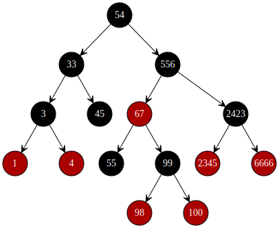
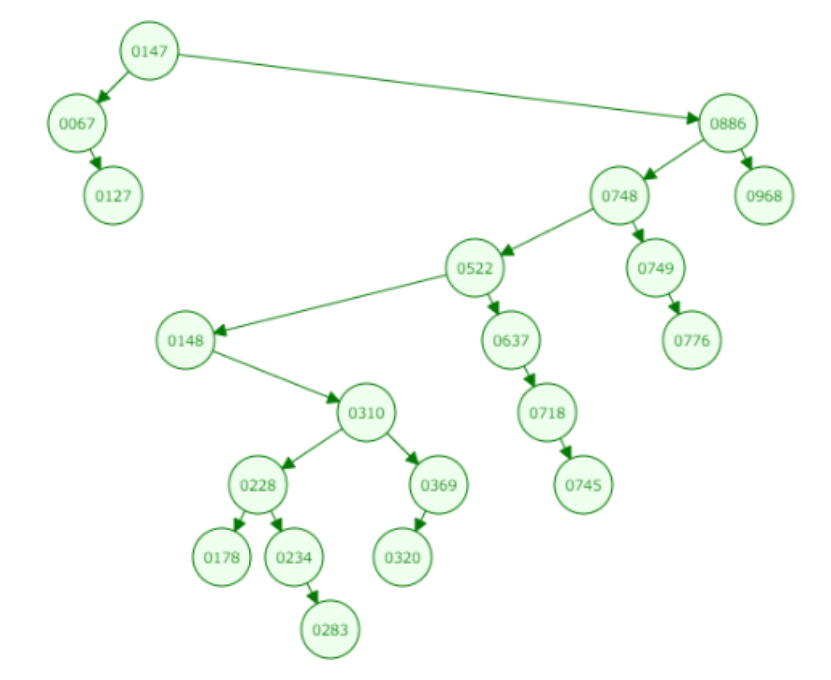
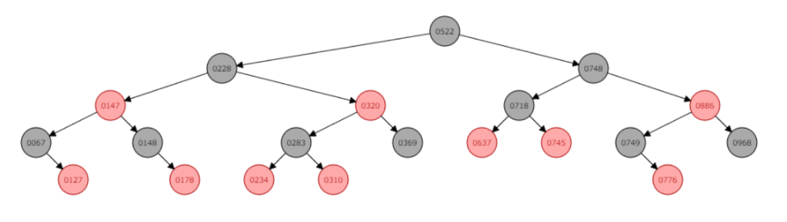

# E. 红黑树（1）- 基本概念

更新日期：2020-06-26

---------------------------------------

## 1. 概述

据说，红黑树是最复杂的一种数据结构。从标题就可以看出来，需要分成多个章节来学习和介绍。

想要用一句话简洁的说明白红黑树确实是很困难的。下面我就分成几个小节来说明。

## 2. 定义

直接列出维基百科上关于红黑树的定义。话说居然有5个条件之多，要定义出一棵符合这样的条件的树也绝非易事。

- (1) 节点是红色或黑色。
- (2) 根是黑色。
- (3) 所有叶子都是黑色（叶子是NIL节点）。
- (4) 每个红色节点必须有两个黑色的子节点。（从每个叶子到根的所有路径上不能有两个连续的红色节点。）
- (5) 从任一节点到其每个叶子的所有简单路径都包含相同数目的黑色节点。

符合这样条件的红黑树大概长什么样子呢？先来张图感受一下。

## 3. 为什么需要红黑树

红黑树起源于排序二叉树。也就是`左子节点 <= 父节点 <= 右子节点`的那种二叉树。

排序二叉树的特点就是查找元素比较快，比较较少的次数就可以查找到目标元素。有点像排序数组的二分查找。

但是排序二叉树有其弱点。比如我连续插入20个随机数来创建一棵树。

有没有发现这棵二叉树有点丑，它的元素分布极不均匀。查找有的元素需要比较很多的次数，查找效率极不均匀。最坏的情况下甚至需要比较所有的元素才能找到目标元素。

再看看同样的这20个数字创建出来的红黑树。

可以看到，这棵树非常的均匀。查找任何元素都不会需要很多的比较次数，最坏的情况也没有很坏。

## 4. 需要学习的主题

目前为止只是大概了解了一下红黑树的概念。红黑树的算法实现比较复杂，我将分为三个章节来学习。

- 红黑树的基本原理
- 红黑树的插入
- 红黑树的删除