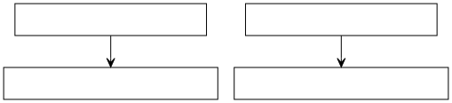
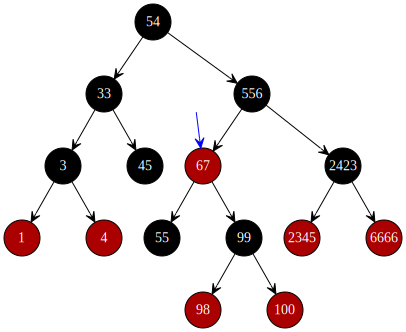
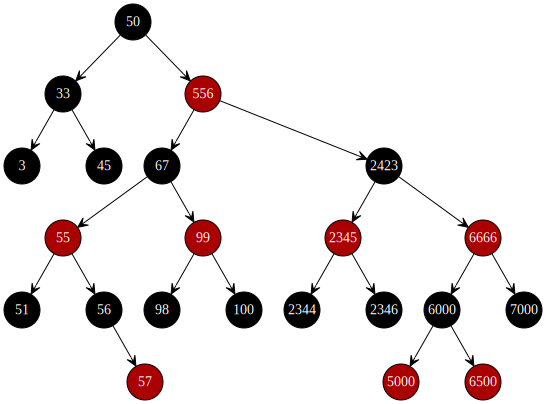

# F. 红黑树（2）- 基本原理

更新日期：2020-06-30

-------------------

## 1. 概述

在学习红黑树的时候，我阅读了包括WiKi百科在内的很多介绍性文章。但是看了一篇又一篇之后，我仍然是一头雾水。

有各种各样的情形，有旋转颜色反转等花式操作。我们的确可能记住了每一种情形应该做什么操作，但过一段时间之后我们估计就全忘记了。主要是它背后的思想没有搞懂，正所谓知其然不知其所以然。

在本章我就试图理一理红黑树背后的思想。

## 2. 红黑树与二叉树

红黑树是一种特殊的排序二叉树。也就是说它满足所有排序二叉树的性质，所有二叉树的操作它都可以做。

而实际上，红黑树的各种操作正是建立在二叉树操作的基础之上。比如插入元素、删除元素这些操作。就是先按照普通排序二叉树的方法进行操作。然后再通过各种调整手段使其满足红黑树不同于普通二叉树的特殊性质。在用具体代码实现红黑树的操作时，基本都是这么个步骤。

我们在各种教程上看到的步骤都是在讲调整二叉树。因此在学习红黑树之前，我们应该复习一遍二叉树。

## 3. 红与黑到底代表了什么

刚开始接触红黑树时，容易被这个颜色搞糊涂。这个颜色标记自然是有其作用的。注意我说了 __标记__ 这个词，给节点涂上颜色自然是在作一种记号，也就是说黑色节点和红色节点是有所不同。

我先说我个人看法的结论: ___同一个节点的红色子节点所在的路径比黑色子节点所在的路径深度要多1___

更通俗一点的说法，如果节点具有重量的话，就是红色节点的那一层比较重，子结点较多。

还是看先前那棵二叉树:

注意比较节点 __67__ 和同一层的其他节点，比如节点 __2423__，你会发现 __67__ 那一层多了一层子节点。这是由红黑树的性质决定的，因为每条路径上的黑色节点必须是一样的，每多一个红色节点，这条路径自然就深了一层。

可以说，红黑树调整的所有操作都是基于这一点。

## 4. 所谓的5条规则

红黑树的5条规则，是对红黑树添加一些限制，使其逐渐平衡。各个规则可能要组合起来看才能看出端倪。

再来看一遍这5条规则:

- (1) 节点是红色或黑色。
- (2) 根是黑色。
- (3) 所有叶子都是黑色（叶子是NIL节点）。
- (4) 每个红色节点必须有两个黑色的子节点。（从每个叶子到根的所有路径上不能有两个连续的红色节点。）
- (5) 从任一节点到其每个叶子的所有简单路径都包含相同数目的黑色节点。

这里面真正重要并且起关键作用的是4和5。规则123更多的是一中约定俗成的东西，主要为了描述规则4和5时能更方便，更容易描述清楚。也就是在给它们铺路。

而规则4和5一起保证了红黑树的一个最重要的特性：__任何路径都不能多于任何其他路径的两倍长__

所谓两倍长，是一种极端情况，有多极端呢？看看下面这图。

图中的最短路径为连续3个黑色节点。最长路径为红黑间隔的 3 + 3 共6个节点。

其实可以看到，即便是这种非常极端的情况，整体来说还是比较平衡的。
