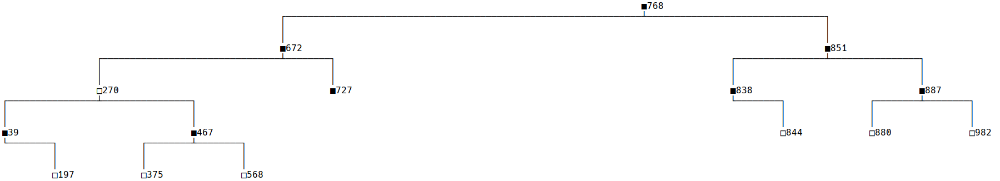
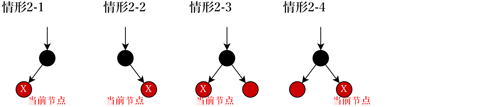
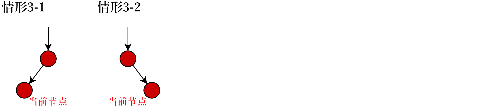
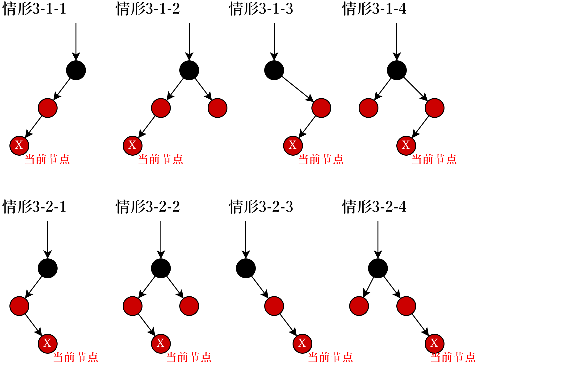
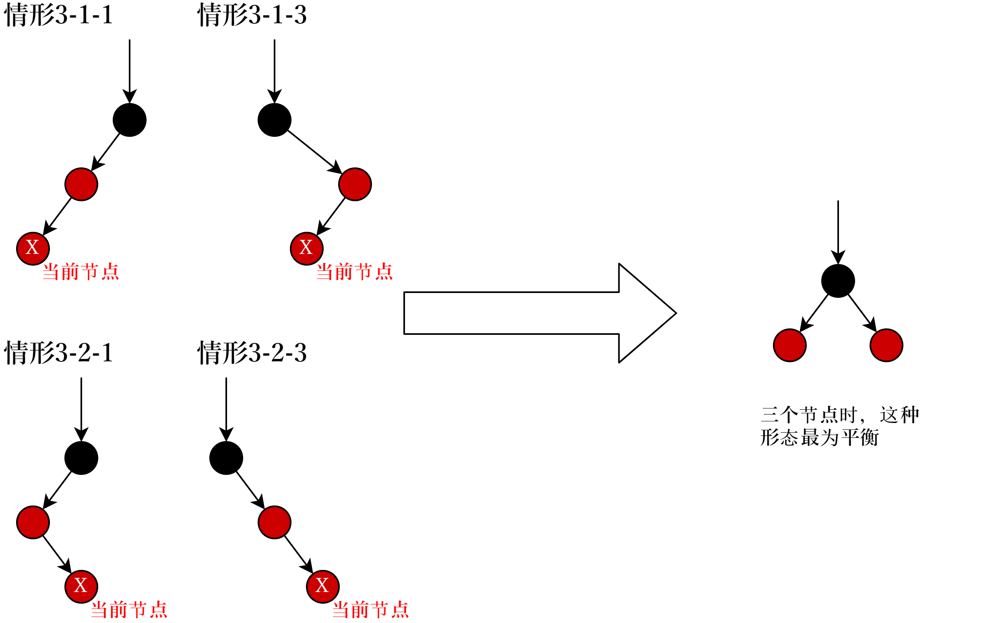
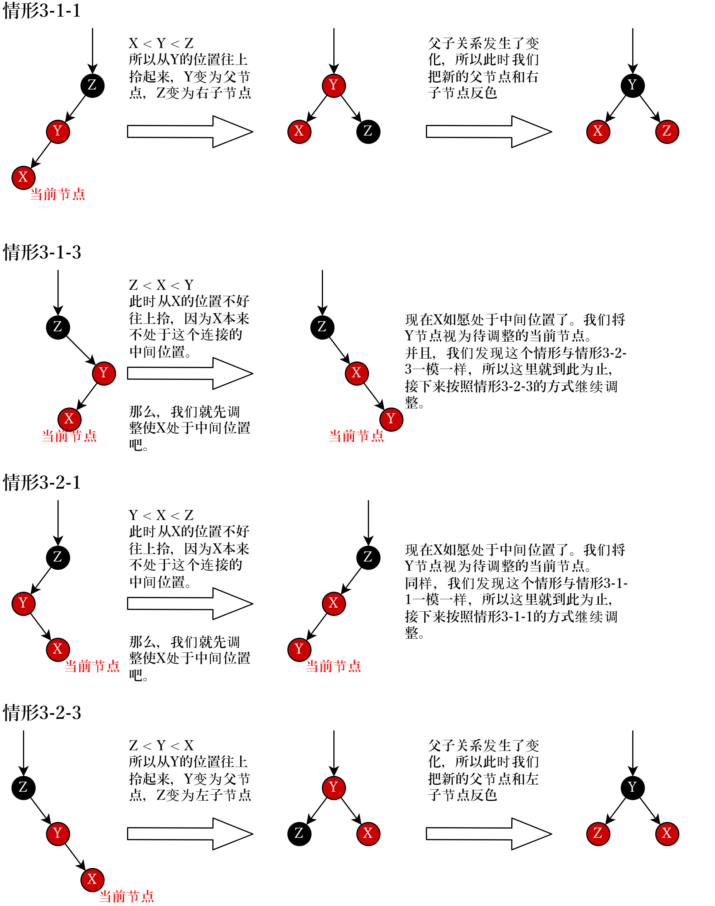
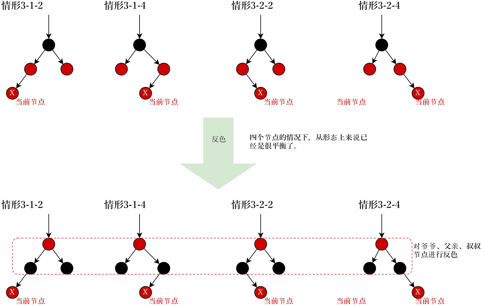
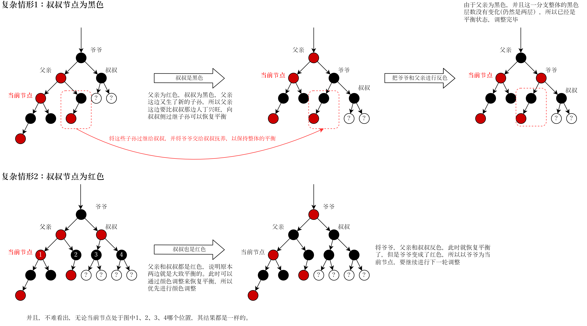
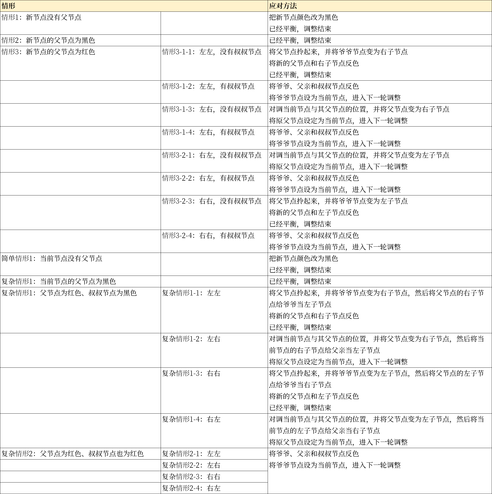
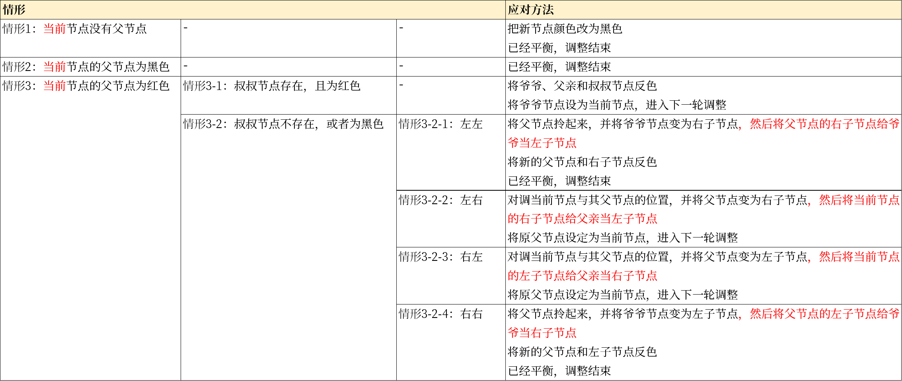

# H. 红黑树（4）插入I

更新日期：2022-11-06

-----------------------------------------------------

## 1. 概述

红黑树的插入和删除操作是比较繁杂的，是红黑树的难点所在。这篇文章主要是描述一下解决这类问题的基本思路，试图把这团浆糊解释明白。

在学习之初，我也看过很多篇结束红黑树的文章，但是看完之后还是一头雾水。我仔细想了想，这些文章其实相当于是把已经知道的结论拿出来讲了一遍，也就是在已经有结论的前提下去说明结论，而没有解释如何得到这些结论。
所以看完之后，我好像知道了该如何去写代码了，但是要问为什么这么写，还是不知道。

试着考虑一下下面这些问题。

<u>__插入问题为什么可以使用递归来解决？__</u>

答案是，我们先分析了较为简单的情形，然后分析较复杂的情形。在对复杂情形进行分析时，我们发现复杂的情形可以先变形、调整为简单情形，然后再按照简单情形的的办法去做。

我想这个过程不是一蹴而就的，不是说我们一上来就知道要用递归，而是在分析的过程中我们发现了可以使用递归。

<u>__为什么插入可以分成这么几种情形(七种）来处理？__</u>

这个结论的得来同样不是一蹴而就的。如果你自己去做情形分析的话，会发现可以分出很多很多种不同的情形，远超七种。而这里面有些情形的处理办法是相同的，亦或是差异很小。

我们把这些处理办法类似的情形进行合并，最后发现是可以分为这七种情形。这样我们才得出了这个结论。

## 2. 红黑树的插入过程

### 2.1 着手点

由于我们一上来不知道如何处理这个问题，所以可以随意找一颗普通点的红黑树来观察一下。

还是之前那棵普通的红黑树。

第一个问题就是往哪个地方插入，这个问题前面已经讨论过了。
    
    对于一个指定值的新节点，按照普通排序二叉树的规则就可以找到一个确定的位置。
    
很明显得先有空位才行吧，有空位的地方就是那些没有子节点的（叶子节点）和只有一个子节点的。上图中的树里这样的位置有很多，这里自然而然的就可以分为几种不同的情形来看。

这样，我们总算是迈出了第一步。

### 2.2 具体的插入过程

按照上面的思路。我们假定已经按照排序二叉树的规则把新的节点插入到指定位置上去了，现在来分析一下接下来应该如何调整来使整棵树保持平衡。

所谓保持平衡就是使其满足红黑树定义的5个条件，并且我们的调整措施应该要尽量简单，比如：
- 只调整颜色就能保持平衡的话就不要移动节点。也就是优先使用调整颜色这一手段
- 能用尽量少的步骤达到平衡时，就不要采用步骤较多的那个。尽管步骤多的那个的结果看上去更加平衡

#### 2.2.1 假定插入的节点为红色

根据规则`【(1) 节点是红色或黑色。】`，节点必须要有一个颜色，所以我们先来看看如果给新节点设定颜色。

<u>__如果设定为黑色__</u>

根据规则`【(5) 从任一节点到其每个叶子的所有简单路径都包含相同数目的黑色节点。】`，我们知道，凭空插入一个黑色节点必定会导致插入的那个分支多一层黑色节点，从而必定破坏这一规则。

<u>__如果设定为红色__</u>

根据规则`【(4) 每个红色节点必须有两个黑色的子节点。（从每个叶子到根的所有路径上不能有两个连续的红色节点。）】`，插入一个红色节点有可能会导致出现两个连续的红色节点，故而可能会打破这一规则。

<u>__结论__</u>

由于设为黑色一定会打破规则，设定红色只是有可能打破规则。所以结论是设定为红色更好。

#### 2.2.2 分情形考虑

这里我们假设出插入新节点后可能出现的各种情形，然后各个击破。对于简单的情形，我们可能看一眼就知道该如何应对，但是对于复杂的情形，有可能需要再分成更多更细的情形来考虑。

另外，为了方便描述期间，我们把新节点也称为`当前节点`。

<u>__情形1：新节点没有父节点__</u>

也就是插入到一棵空树中，那么应对方法很简单，只需把新节点颜色改为黑色使其满足规则`【(2) 根是黑色。】`即可。

<u>__情形2：新节点的父节点为黑色__</u>

由于父节点为黑色，所以就一定不会出现连续的两个红色节点。这种情况下已经平衡了，不需要做任何调整。

其实，根据新节点的位置，以及是否有兄弟节点，情形2又可以详细地分成几种不同的情形，只不过其结果都是不用做任何调整。

<u>__情形3：新节点的父节点为红色__</u>

首先，既然父节点为红色并且有空位置可以插入新的节点，就说明父节点本来是没有任何子节点的。如果有的话，必须是两个黑色子节点，那么就没有空位置了。所以首先可以简单的分外如下情形。

很明确，此时出现了连续两个红色节点，需要进行调整。

那么，调整颜色行不行呢？

两个父子节点，必须要一黑一红才可以。但是如果把其中一个节点变为黑色，则会使这一分支多出一层黑色节点，必然是不能平衡的。

所以此时，我们不得不考虑移动节点了。但是就这么两个简单的节点实在是没有移动空间，所以我们进一步考虑父节点更上层的节点，也就是爷爷节点和叔叔节点分支。
 ※何以知道一定有爷爷节点？因为父节点为红色，而根节点必须为黑色，所以父节点不是根节点，他一定也有父节点，也就是爷爷节点

根据父节点所处的左右位置，已经是否有叔叔节点，我们将情形3更加细分。

经过简单的观察，我们不难发现其中没有叔叔节点的四种情形是非常容易调整的，从整体形态上就可以看出来。

调整的方法也是非常简单，三个数根据大小关系，不大不小的居于父节点，小的那个为左子节点，大的那个为右子节点。

然后我们再来看剩余4种有叔叔节点的看起来有点困难的情形。简单观察他们的形态，发现他们都已经基本平衡，并且可以通过调整颜色直接使其满足规则。

反色之后我们发现黑色的层数与之前保持一致了，都是一层，但是爷爷节点变成了红色。那么爷爷节点就有可能和他的父节点产生两个连续红色节点。也就是我们需要继续调整。

要继续调整，我们以爷爷节点为当前节点再对情形进行细分。

首先，我们可以发现有两种情形很简单。

- 简单情形1：当前节点(之前的爷爷节点)为根节点，则与情形1是相似的，调整方法也一样
- 简单情形2：当前节点(之前的爷爷节点)的父节点为黑色节点，则与情形2是相似的，调整方法也一样

剩下的就是所谓的复杂情形了。

这里的【复杂情形1：叔叔节点为黑色】，只是其中的一种情况，也就是当前节点是左子节点，父节点也是左子节点。我们分析了调整过程后，发现它和上面的情形3-1-1特别像，都是把不大不小的那个节点拎起来，再下放爷爷节点。只不过情形3-1-1的相关节点都没啥子节点，而这里的复杂情形1带有很多的子节点，所以我们在情形3-1-1的基础之上，再附加上对子节点的调整就可以了。

而这里的【复杂情形2：叔叔节点为红色】，我们发现它和上面的情形3-1-2、3-1-4、3-2-2、3-2-4如出一辙，都可以通过反色爷爷、父亲、叔叔来进行解决。

复杂情形1的所有情形我在下一节中列出来了。

- 17.9 红黑树（4）插入II

而到了这里，我们也发现我们又开始进行变形，或者是去调整一个新的红色节点了。我们又回到了原点，解决的办法都和上面已经讨论过的一样。这种情况下，我们都知道了，可以使用递归来解决。

接下来，我将对上面的情形进行归纳整理，以便更加理清思路。

## 3. 插入过程整理

初步的整理结果如下。

然后我们将上表中应对方法相似的情形进行合并，得到了如下结果。

其中，应对方法里面标红色的部分，是复杂情形比简单情形要多做的步骤。稍微想一下我们就会发现，简单情形即使也做了这些步骤也是没有任何影响的。毕竟，把自己的空子节点给别人当子节点，也是相当于什么都没做的。

至此，我们终于得出了结论：插入过程可以分为七种情形来考虑。

## 4. 代码示例

本章已经过长了，所以代码就放到后面的章节吧。
