# K. 红黑树（7）删除I

更新日期：2022-11-14

-----------------------------------------------------

## 1. 概述

这篇文章将解决红黑树最复杂的操作：删除。并且这里不是简单的列举一下结论，而将着重介绍推导的过程，以求掌握解决复杂问题的办法。

<u>__删除不是难，而是繁琐__</u>

删除由于其复杂性，令很多人望而却步。但是... 其实删除并没有想象中的那么复杂，只是相比于插入元素而言，它的情形要多很多，而调整的步骤也比较多。

所以我们的应对方法非常的简单，就是分情况进行演算推导。如果当前情况难以处理，就继续细分出更多的子情形。直到我们列完所有的情形，那么删除难题也就解决了。

<u>__删除建立在插入的基础之上__</u>

我们推导删除的时候，不是从零开始的。此时，我们已经推到完了插入元素的过程，已经掌握了一些调整红黑树的方法，比如下面这些：

- 可以先把元素插入到目标位置，再做进一步调整使其平衡
- 使用左旋转和右旋转可以调整左右子树的平衡
- 可以使用递归的思路来简化整个过程

## 2. 基本思路

首先题纲契领，简单说明一下解决这个复杂问题的思路。

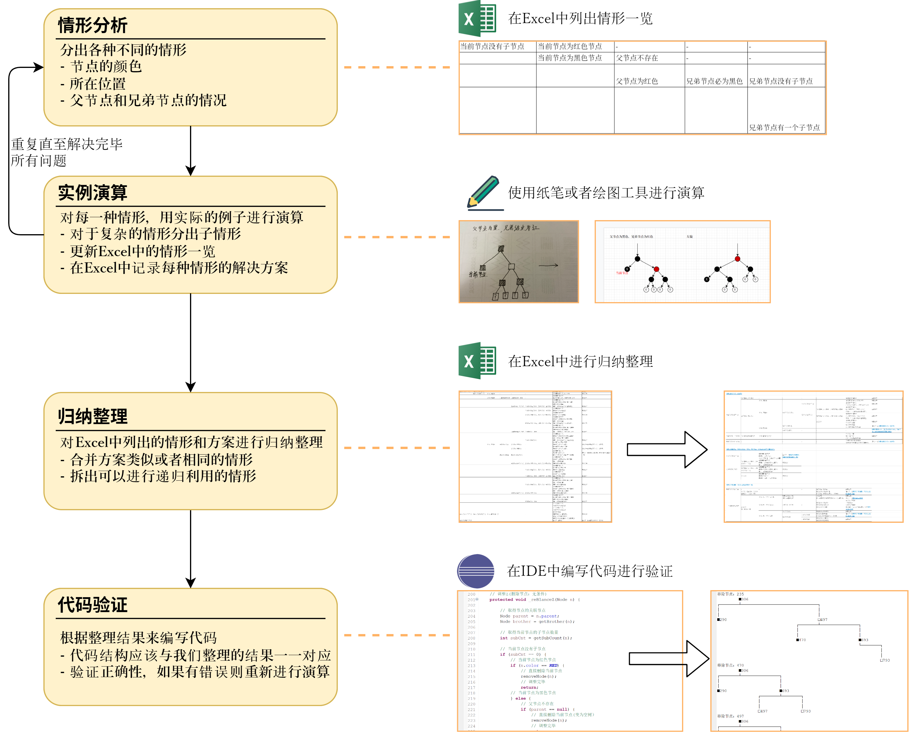

上面的每一步都是非常重要的。

其中，实例演算是所有人都最关心的一步，这个过程虽然很繁琐，但是的确非常有效。如果只是在脑子里进行思考，肯定是无法记住整棵树的，只会越想越乱。

## 3. 具体推导过程

这一小节我将说明上面的基本思路中的四个步骤该如何具体进行实施。

### 3.1 情形分析

在学习红黑树的插入时，我们已经用过了这个办法。那就是先来观察一颗具体的红黑树，看一看哪些位置容易处理，哪些位置不好处理。并根据观察的结果粗略的进行一个情形的分组。

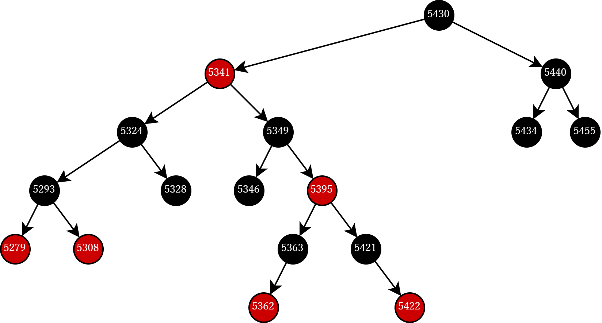

通过简单的观察我们可以发现如下事实：

- 当删除的节点为叶子节点时更容易处理
- 当删除的节点为红色的叶子节点时，可以直接删除而不破坏平衡
- 当删除的节点只有一个子节点时也非常容易处理

因此，我们首先根据要删除的节点的子节点的数量分出情形，然后再根据节点的颜色进一步分出情形。这样我们情形分类的雏形就完成了。

!!! example "在Excel中列出初步情形"
    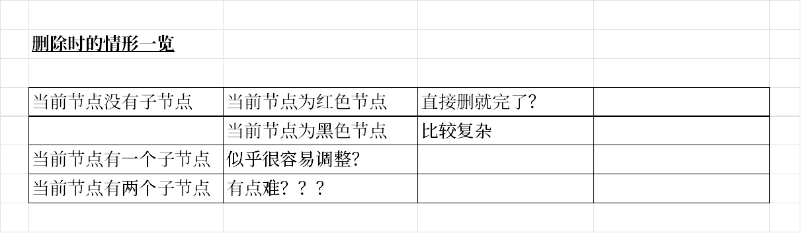

然后我们就可以进入下一步，针对每种情形进行演算了。

### 3.2 实例演算

所谓演算，就是说如同我们初高中做数学题时打草稿一样，手动画出各种情形的具体处理过程。

<u>__绘图工具推荐__</u>

虽然我们说是用纸笔或者绘图工具进行演算，但是用绘图工具明显更好一点。对于简单的情形还可以，但是复杂的情形用纸笔就非常的慢，能把人累死。

这里推荐`draw.io`这款强大的绘图工具，谁用谁知道。
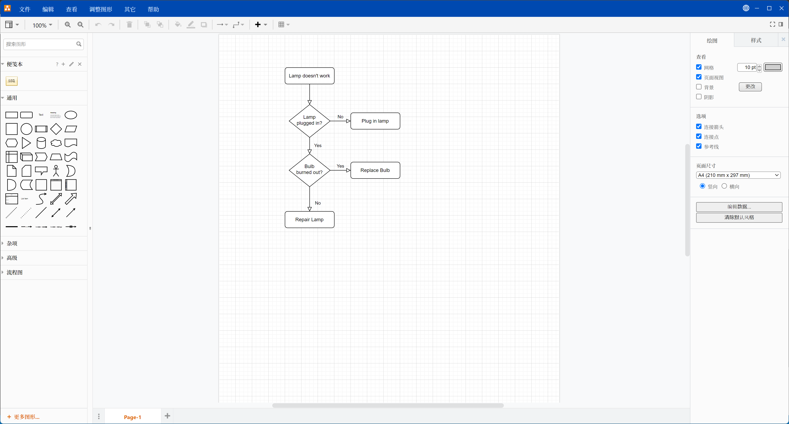

!!! note "关于【当前节点】"
    为了便于描述起见，我将【要删除的节点】称之为【当前节点】。

<u>__演算①：当前节点没有子节点，当前节点为红色节点__</u>
此时，父节点必为黑色，如果有兄弟节点，则兄弟节点也为红色。
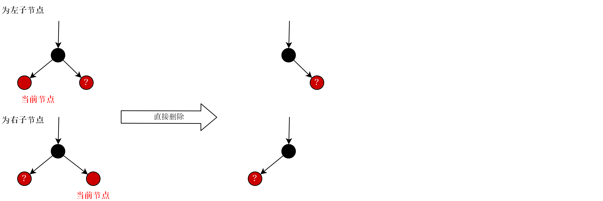

<u>__演算②：当前节点没有子节点，当前节点为黑色节点__</u>
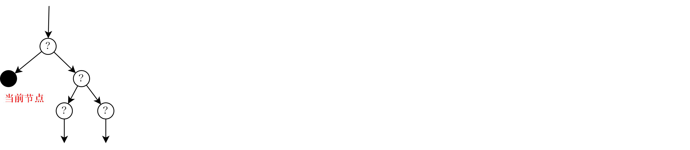
简单的观察之后，我们发现父节点的颜色不定，兄弟节点的颜色也不定，兄弟节点有没有子节点也不定。此时是否有点不知如何下手？

那么，这就到了细分情形的时候了。我们假定出父节点和兄弟节点的各种情况来分出更多子情形。
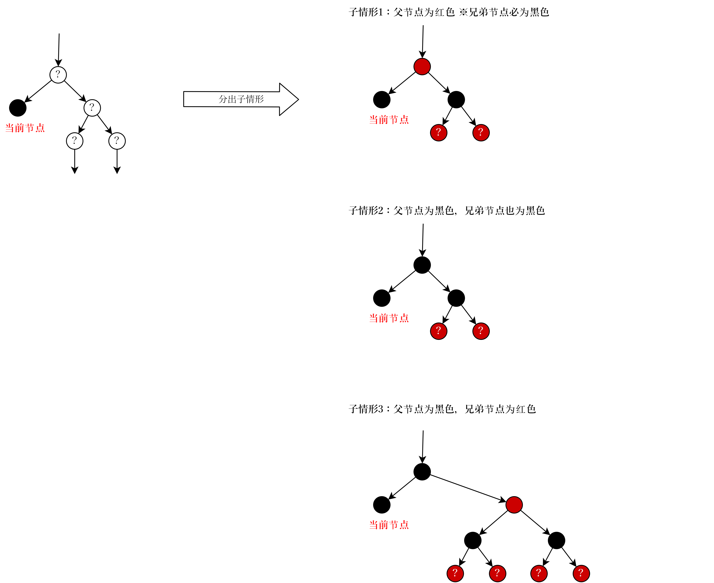

<u>__演算③：当前节点有一个子节点__</u>
简单的思考一下我们就知道，当前节点必为黑色节点，而它的子节点必为红色。而我们删掉当前节点并用子节点来代替当前节点就可以了。
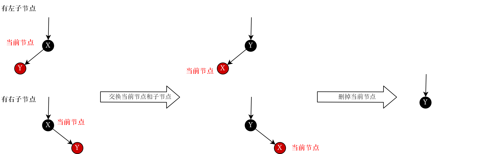

<u>__演算④：当前节点有两个子节点__</u>
由于当前节点处于整棵树的中间位置，无法简单的进行删除，似乎又无从下手了。但是联想到排序二叉树删除元素时的方法，我们这里也可以采用同样的方法。

1. 交换当前节点与其左子树的最大节点
2. 删除此当前节点

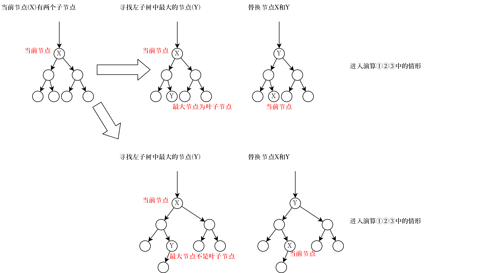

我们发现，交换之后，就进入了上面的演算①②③的情形。

<u>__重新整理情形__</u>

下面我们该回到第一步的情形分析，对我们演算的结果进行梳理了。

!!! example "再次梳理情形"
    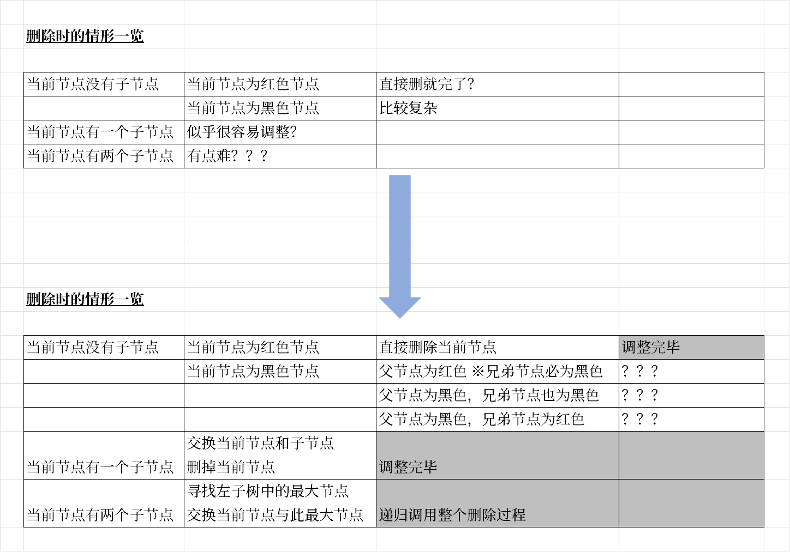

此时，我们就解决了一部分问题，没有解决的`？？？`这三种情形需要进行下一轮的演算。

### 3.3 完成所有情形的分析与演算过程

重复【情形分析】和【实例演算】这两个步骤直至所有问题全部解决完毕。

这个过程比较长，但是每一步都不难，都是经过观察可以得出解决办法的，所需要的仅仅是耐心。但是要列出所有的推导过程，这文章就没有尽头了，所以就只列出几张我演算时的草稿和最后整理出的情形分析结果让诸公感受一下。

<u>__演算草稿1__</u>

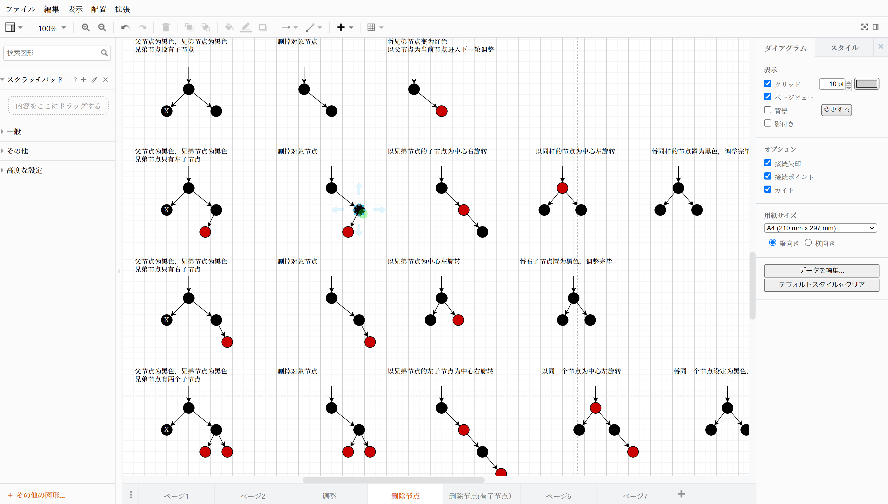

<u>__演算草稿2__</u>

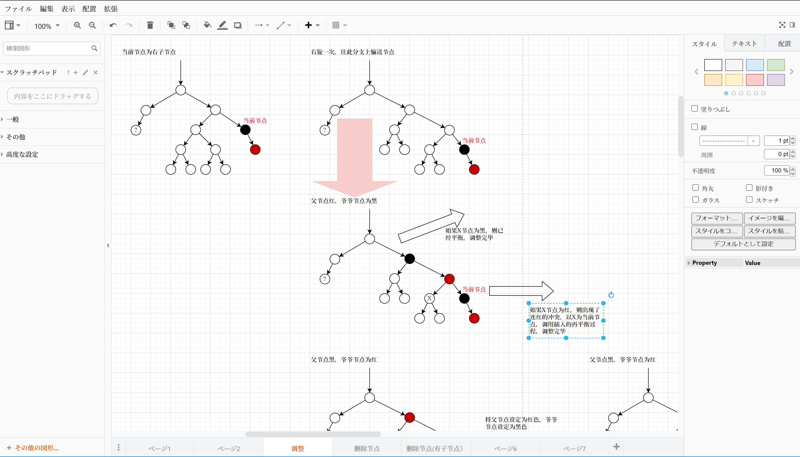

<u>__情形分析完成版(节点删除部分)__</u>

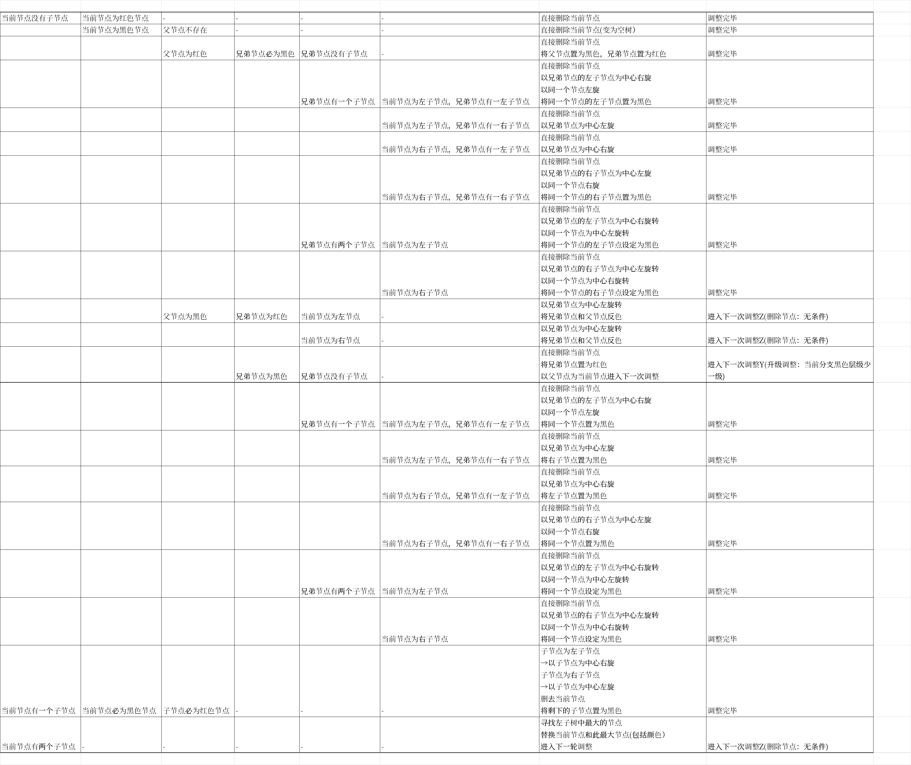

<u>__情形分析完成版(进一步调整部分)__</u>

没错，全部分析演算万就是有这么长，所以才说删除复杂。

### 3.4 归纳整理

看着上一节那长长的情形列表，有点绝望，靠着这个写代码会很难受，所以有了这一步。
目的就是为了化繁为简，理清思路。

方法在前面的推导思路中已经给出了。
- 合并方案类似或者相同的情形
- 拆出可以进行递归利用的情形

这里我不打算列出所有的过程，而是用例子来演示具体的实施方法。

<u>__合并方案类似或者相同的情形__</u>

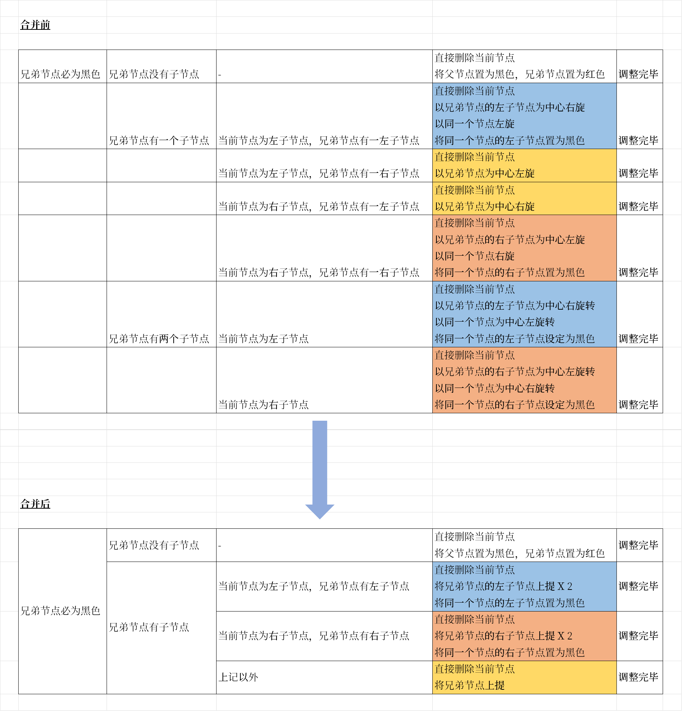

图中颜色相同的这些情形是分别进行演算的，演算的结果是处理相同或相似，因此可以进行合并。

其中黄色部分的处理，一种情形为左旋转，另一种情形为右旋转。我仔细想了一下，其实对于一个节点来说，根据它所处的位置。
- 如果它是左子节点，则只能右旋
- 如果它是右子节点，则只能左旋

因此，我把左旋转和右旋转合并起来称之为【上提】。（旋转后这个节点被拎起来了，故得此名）
而将所有的左旋转和右旋转都替换为【上提】之后，整个一览表清爽了很多。

通过这次合并，图中的7种情形变为4种情形，效果明显。

<u>__拆出可以进行递归利用的情形__</u>

直接看一看这步完成之后的结果，大的表格被拆成了几个部分，复杂的地方都被拆分开了。每一个表格不超过10种情形，这样的表格更易读，更容易对照的编写代码。

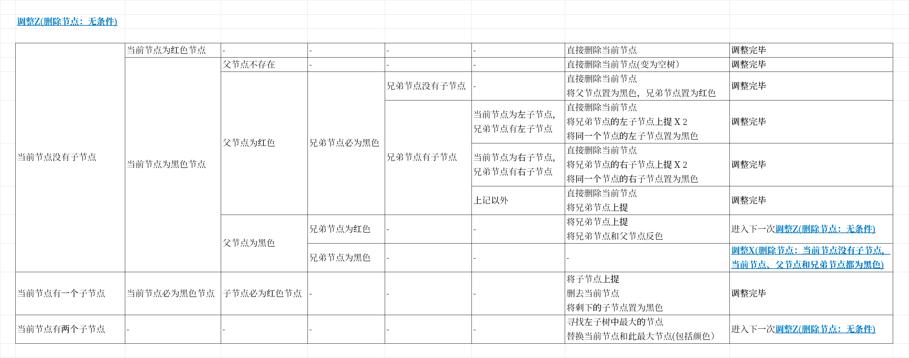
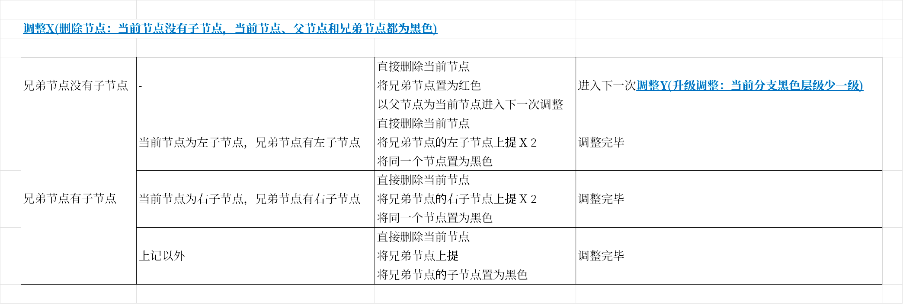
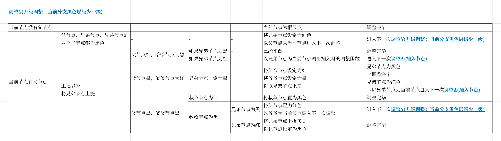

### 3.5 代码验证

有了上面归纳整理好的结果，我们终于可以对照着编写代码了。由于我们前面只是纸上谈兵，而情形又很繁杂，难免会有疏漏。编写代码并运行可以检查出我们考虑不周的地方，实际上我刚开始归纳整理的结果确实就发现了好几处错误的地方，当然上面放出的是改正后的结果。

由于本节的内容已经很长了，所以代码将放入下一小节中。
