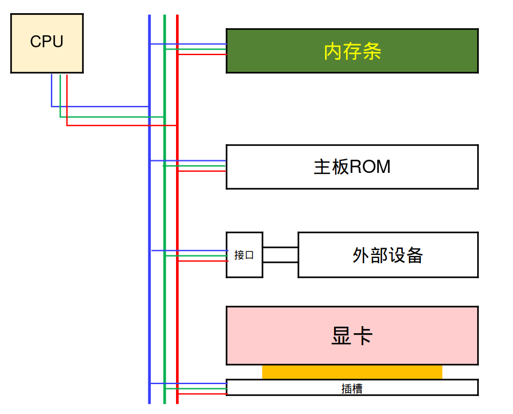
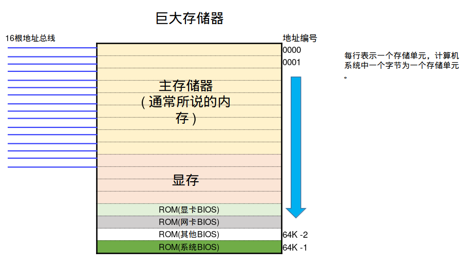

# A. 总线与内存地址空间

更新日期：2020-05-03

-----------------------------------------------------

## 1.	概述		
        
计算机主板上的各个部件通过总线连接在一起，总线可以认为是主板上的多组导线的集合。		
CPU通过总线连接和控制其他器件。而根据功能不同，总线又分为3类：		
        
- 地址总线：传输内存区域的地址
- 数据总线：传输读或写的数据
- 控制总线：传输控制信号，表明具体是什么操作
        
我们知道一根导线在一个时刻只能表示一种状态，也就是一位二进制数。要想表示真正有用的数据，就需要同时表示多个状态，也就需要多根导线。		
导线的根数通常称为总线的宽度，导线越多能够表示的二进制数据就越大越多。		
        
!!! example "总线示意图"

    
        
总线连接着主板上所有的接口、插槽，再进一步连接所有的板载和外部设备。		
        
## 2.	地址总线与内存地址空间		
        
地址总线用于CPU执行操作时指定要操作的内存区域的地址。		
        
对于CPU来说，所有的板载存储器和内存一样没有什么区别。这些存储设备主要有:		
        
- 板载内存		
- 内存条(也就是主存储器)		
- 主板ROM		
- 显卡ROM		
- 显存		
- 网卡ROM		
- 其他板载芯片的ROM		
        
ROM中通常储存着一些BIOS程序，对于CPU来说，程序和普通的数据都以二进制数据的形式存放。也即程序代码、指令等也是数据，它们也需要存放在内存中才能够运行。比如我们写java程序时会有ClassLoader类来把类的代码加载到内存中。	

由于CPU把上面说的这些存储器都当作通常所说的内存来使用，所以可以将所有这些存储器进行统一的编址，就好像它们整个合起来是一块巨大的存储器，每种存储器在巨大存储器内部都占据一段地址。唯一的区别可能是ROM通常是只读的，不能往那个区域写数据。

这个编址构成了内存地址空间。		
        
地址总线就是要指定这个内存地址空间中具体的地址。地址总线的宽度就决定了它到底能指定多大范围的编号。		
        
地址总线根数	|	可以指定的编号为		|		范围大小
--- | --- | ---
1根	|	0、1	|			2
2根	|	0、1、2、3	|			4
4根	|	0、1、2 ~ 15	|			16
8根	|	0、1、2 ~ 255		|		256
16根	|	0、1、2 ~ (2^16 - 1)	|			64K
20根	|	0、1、2 ~  (2^20 - 1)	|			1M
32根	|	0、1、2 ~  (2^32 - 1)	|			4G

        
这个范围大小也就是内存地址空间的大小，地址总线能指定的内存地址空间的大小被称作寻址能力。		
        
以16根地址总线为例：

!!! example "内存地址空间示意图"

    
        
在C/C++这类直接使用指针来操作内存的语言中，指针的值就是这里的地址编号。通常编写程序时指针操作的内存区域几乎都是主存储器中的堆内存，但是要注意指针可以指向整个内存地址空间中的任何位置。		
        
我们通常所说的32位应用程序即是指程序中使用了32位指针，也就是假设硬件系统有32根地址总线。由于32根地址总线的寻址能力是4GB，所以32位应用程序能使用的地址空间也是4GB。比如32位Windows系统就只能使用最多4G的内存。	

目前的CPU都支持64位寻址，2的64次方是一个天文数字，所以64位程序几乎具有无限大的内存地址空间。而64位操作系统再也没有只能使用4G内存的限制。		
        
## 3.	数据总线		
        
数据总线用来传递数据。而数据总线的根数就决定了一次能够传输多少位的数据。		
        
数据总线根数	|	每次可以传输数据的位数		|	每次传输数据的大小
--- | --- | ---
1根	|	1		|	1比特位
2根	|	2		|	2比特位
4根	|	4		|	4比特位
8根	|	8		|	1个字节
16根	|	16	|		2个字节
32根	|	32	|		4个字节

数据总线的根数被称作数据总线宽度，它和总线频率一起决定了总线能以多快的速度传输数据，当然是越快越好了。		
实际的计算机中，数据传输速度的计算过程很复杂，影响因素很多，这里没必要了解所有细节。通常我们关注一下内存条的频率就可以了，频率越高内存条越快。		
        
## 4.	控制总线		
        
控制总线用来传递指令。比如CPU向各个器件发送命令，某个器件向CPU发送请求等，都通过控制总线来进行。		
        
对于我们平时的使用来说，控制总线可能是最不需要我们关心的总线，它的细节我们并不用深究。		
