# 文件夹同步

更新日期: 2020-05-14

-----------------------------------------------------

## 1.	概述			
    
文件夹同步，是指对于系统中的两个位置的文件夹，使用某种手段使它们的内容保持同步，当某一个文件夹的内容变化时，另一个会自动跟着变化。这个同步可以是同一个系统中的两个文件夹，也可以是本地机器与远程机器之间的两个文件夹，可以是单向同步也可以是双向同步。			
有点类似DataBase的自动备份。			
    
## 2.	同步盘OneDrive			
    
使用Win10系统的化，很方便，尤其是使用多台安装了Windows10操作系统的机器时，尤其方便。在一个设备上更新的文件会同步反应到其它机器上去。			
订阅了Office365的情况下，OneDrive有1T的空间，完全够用了，即使是免费情况下，也有5G的使用空间。			
    
但是OneDrive也有一些不足之处。			
    
- (1)	文件夹比较特殊，虽然看起来是跟普通文件夹一模一样，但是实际使用时会有一些限制。		
- (2)	linux版本很难用，经常出莫名其妙的问题。并且不是微软官方维护的版本。		
    
比如配置为Tomcat的项目发布目录时，会不识别里面的文件。当然绝大多数软件，配置使用OneDrive的目录都是没有问题的。			
    
OneDrive的文件夹可以设置使用下面两种模式：			
    
- (1)	在线模式		这种模式下，文件不占用磁盘空间。只有需要使用文件时，才会去下载这个文件，使用完毕后可以释放磁盘空间。
- (2)	本地模式		这种模式下，文件将一直存在于磁盘上，并时刻与最新版本保持一致。
    
如果磁盘空间比较紧张，可以定时对在线模式的文件夹进行空间释放。			
    
## 3.	使用FreeFileSync进行同步			
    
FreeFileSync是一个免费开源的软件。专门用来进行文件和文件夹的同步，并支持多种操作系统。			
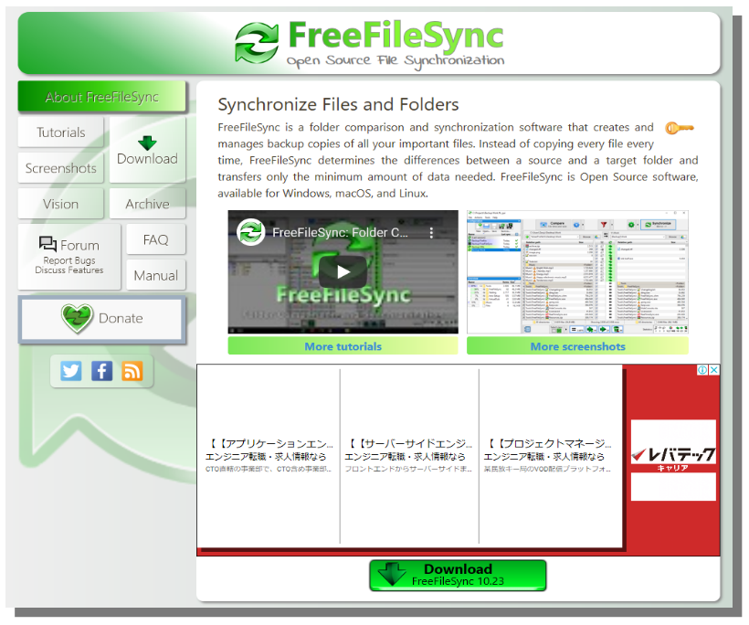
 
安装完成后的界面如下：			
    
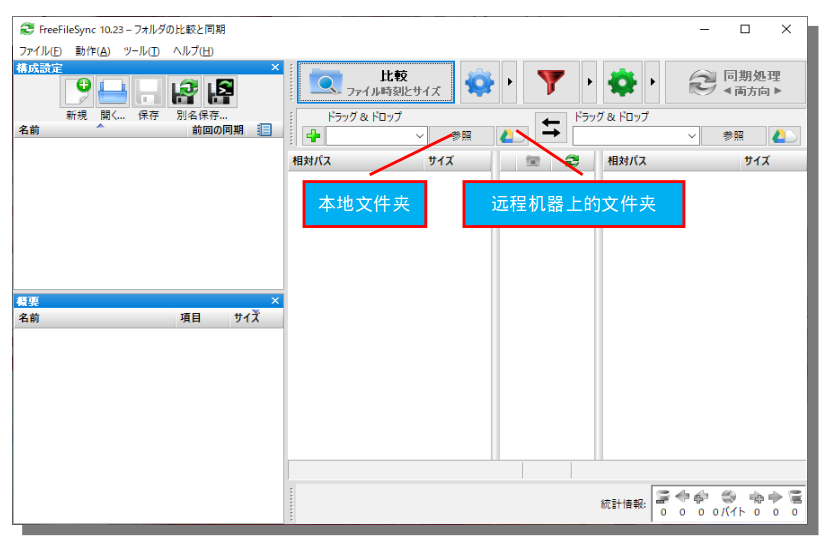
    
本地文件夹只需要把文件夹拖拽进去就行了。打开那个云图标的按钮之后，可以选择连接到远程机器：			
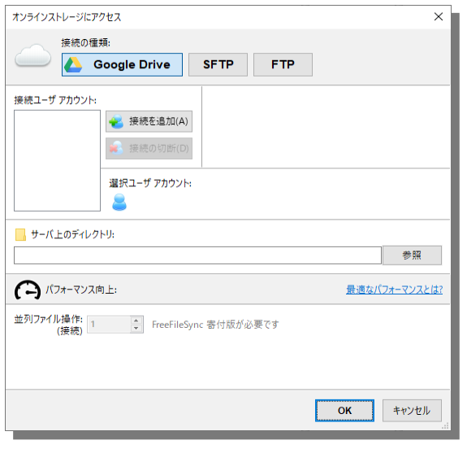
    
对linux比较熟悉的小伙伴们肯定听说过SFTP。			
    
### 3.1	配置示例 (Windows10 <=> linux服务器)		
    
现在我们有两台机器：		
    
- (1)	手边办公桌上的机器，装有Windows系统	
- (2)	安装着CentOS系统的linux服务器，在某机房里面放着	(※能够通过SSH连接上)	
    
然后我们要同步这两个文件夹：		
    
- Windows10下：桌面/TestFolder
- Linux下：/tmp/test123
    
!!! note
    这两个文件夹要先创建出来，否则会出错		
    
#### 3.1.1	配置Win10侧文件夹	
    
直接把桌面上的TestFolder拖到左侧窗口即可。	
    
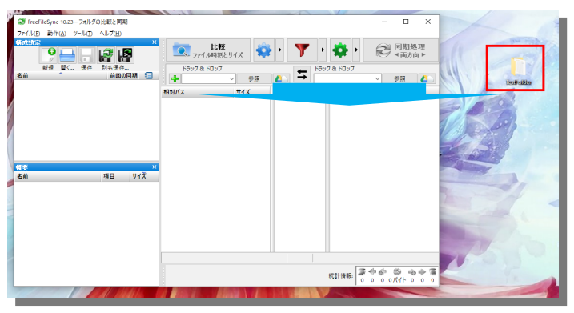

#### 3.1.2	配置linux侧文件夹	
    
首先点击右侧的云图标。	
    
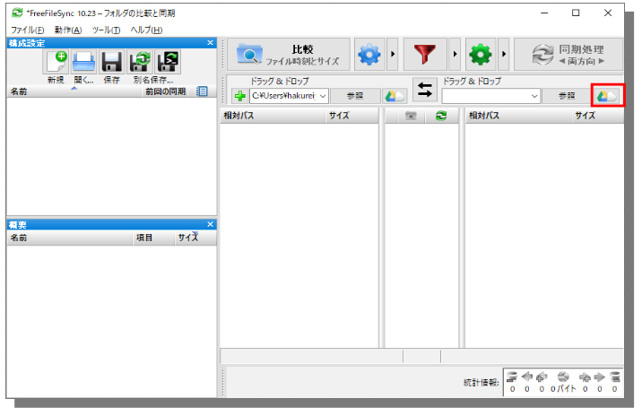
    
然后选择SFTP，并配置服务器连接信息和文件夹路径。	
    
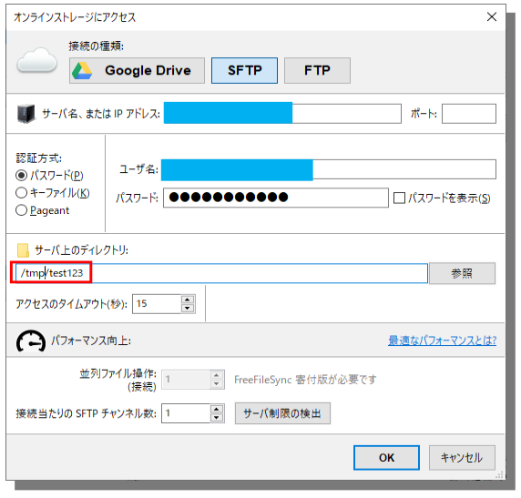

#### 3.1.3	开始同步	
    
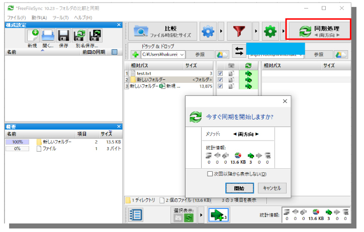

可以看到，由于我的本地文件夹中有随意创建的几个文件，linux上面是空的，所以第一次同步时是把文件复制到linux上去。	
    
出下面这个框就表示同步完成了：	
    
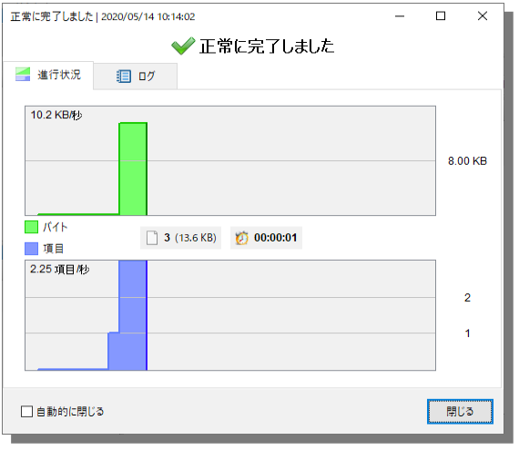

此时去查看linux服务器的目录，会发现就有了那几个文件了。	
    
### 3.2	设置同步选项		
    
点击画面上的这三个按钮中的任意，一个，可以进入设置界面：		
    

能够设置的选项也是一目了然：		
    
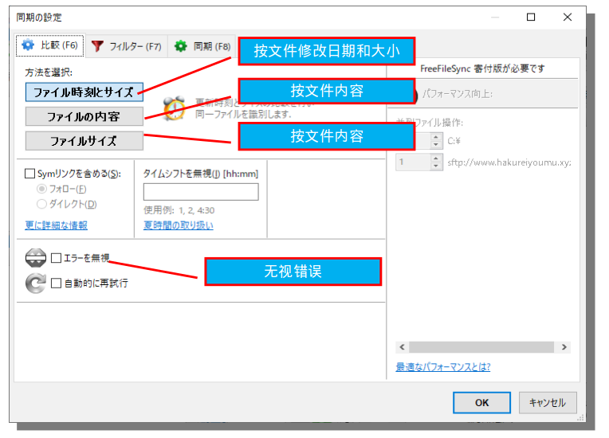

这里可以设定包含和除外文件，通常把一些无所谓，我们也不想看到的文件设置为除外。		
    
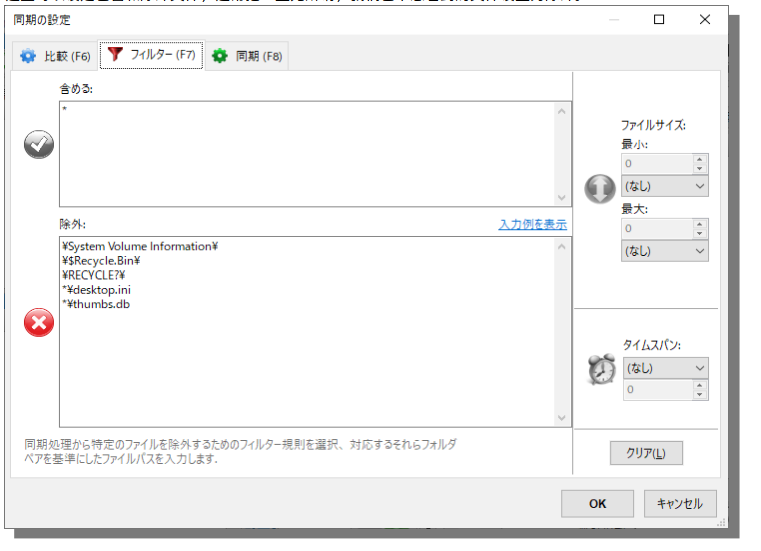

这里可以设定单向同步或者是双向同步。		
    
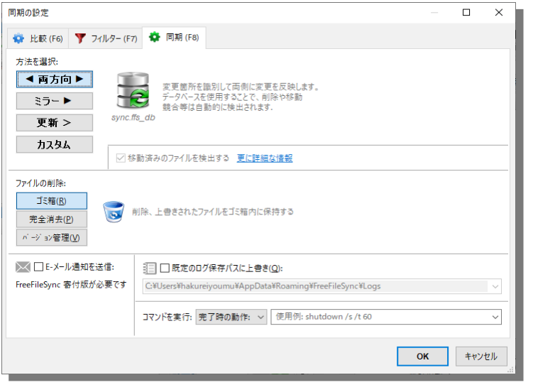

### 3.3	开启实时同步		
    
有时候，我们想达到这样一种效果：		
    
我们每次修改文件的时候，不用来这个软件这里点按钮进行同步。而是实时帮我们自动同步。	
    
这个功能其实是通过在后台保持一个进程，来定时执行同步操作来实现的。每当检测到文件夹中的内容有变化，就会执行同步操作。		
    
!!! note
    FreeFileSync只支持本地机器之间的实时同步，不支持SFTP和FTP协议下的实时同步。	
    在下面的步骤中会生成一个批处理文件，直接双击批处理文件可以进行手动同步。这个支持SFTP和FTP。	
    
#### 3.3.1	将当前的同步方案保存为批处理文件	
    
选择图中的【保存为批处理文件】按钮。	
    
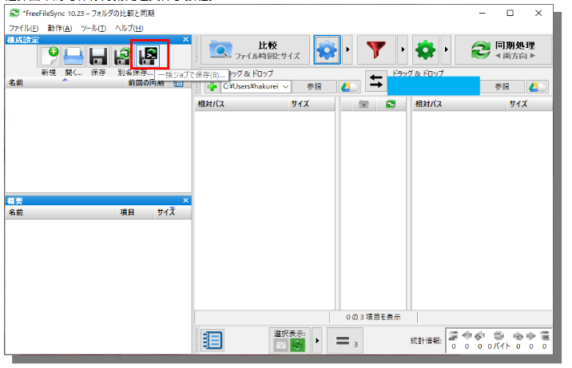
    
设置为无视错误，最小化启动和自动关闭进度窗口。这样定时任务就不会一直卡在进度界面上。	
    
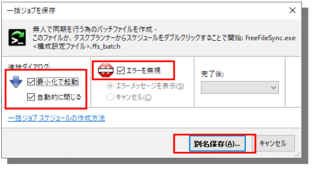
    
保存的文件示例：	
    

此时可以关掉这个软件了。	
    
#### 3.3.2	开始实时同步	
    
打开这个软件的另外一个程序【RealTimeSync】，是一个红色的图标。	
    

将上面保存的批处理文件拖到里面。	
    
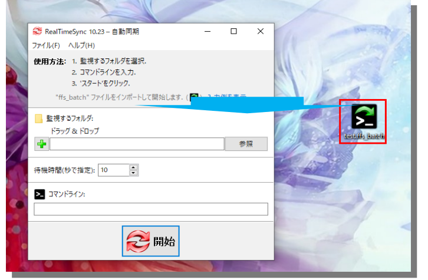

此时可以看到我们在文件中配置的内容都被自动填充上去了。	
    
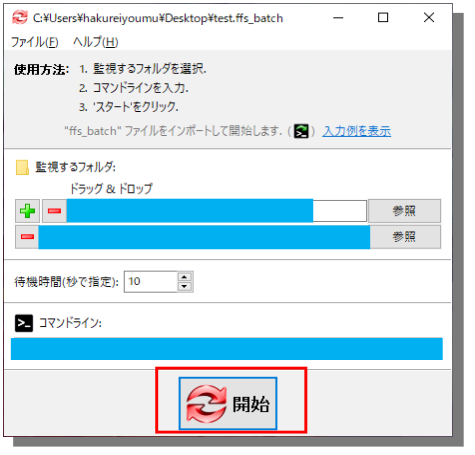

而定时的间隔为10秒，点击开始按钮就开启了实时同步。	
此时，我们可以修改下文件夹的内容，看看在10秒左右是否会真的进行自动同步。	
