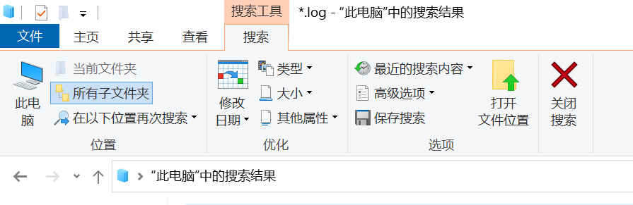
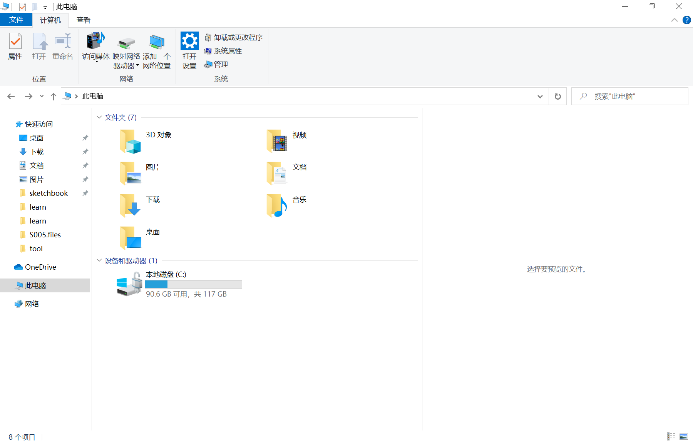
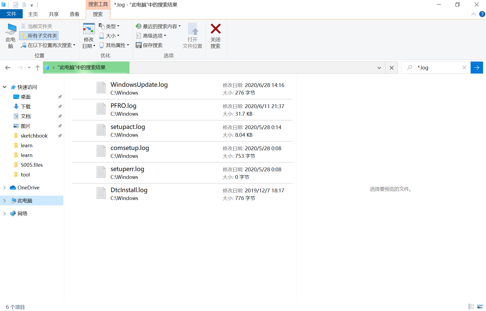
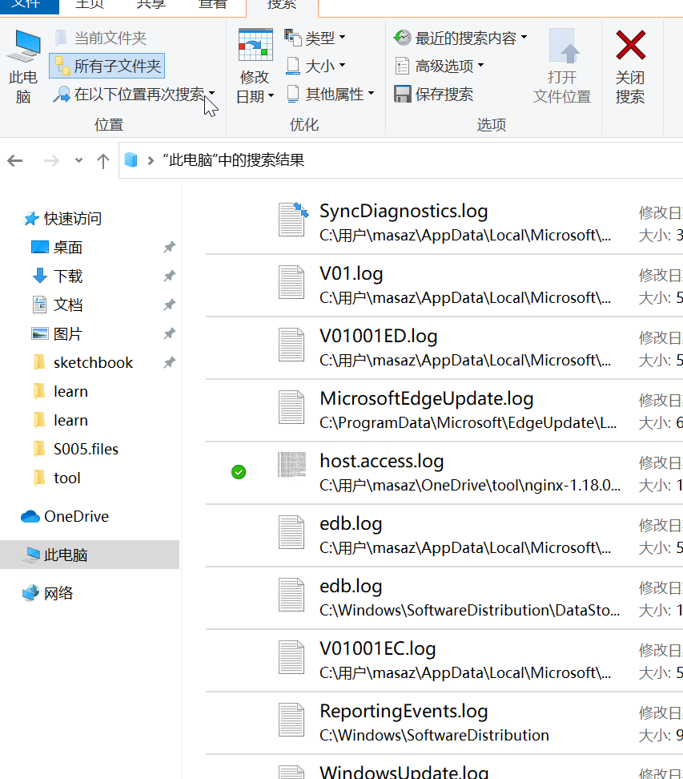
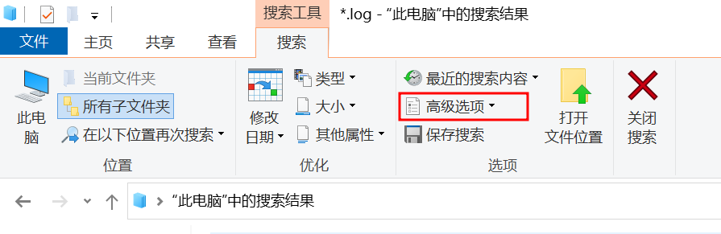

# E. 文件搜索

更新日期：2022-12-17

-----------------------------------------------------

## 1. 概述

Win10在某一个更新中加强了资源管理器的文件搜索功能。正确使用这个功能将提高我们的办公效率。
但是，这个功能隐蔽在菜单的新选项卡中。平时是很难发现的。

效果图：

## 2. 用法介绍

用法其实并不复杂，选项卡上的内容可以说是一目了然。只是选项卡的显示有点坑。

### 2.1. 开启[搜索]选项卡

默认情况下，在资源浏览器上并不会显示出这个选项卡。即使把光标放入搜索框里面也是如此。

必须先输入搜索内容开始搜索后才能调出这个选项卡来。

一旦[搜索]选项卡出来以后，反而不需要搜索内容了。可以只根据选项卡上的配置进行搜索。

### 2.2. 选项卡功能列表

这里用动图列出选项卡上各个功能的详细内容，可以看出来选项都比较简单，一看就知道如何使用。

其中，按日期搜索这个功能尤其有用。
比如我们要搜服务器上的log文件时，只想列出所有今天有变化的log文件。就可以选日期为今天来进行搜索。

## 3. 重磅功能：文档内容搜索

win10的搜索功能支持搜索文件内容，包括Office文件（Word、Excle、PPT）。这个特性在办公的时候非常的有用。

在`高级选项`中可以打开这个功能。
