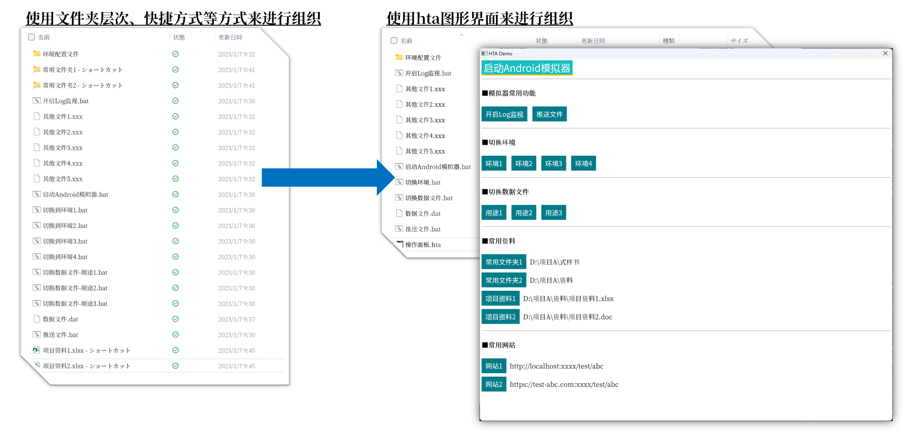
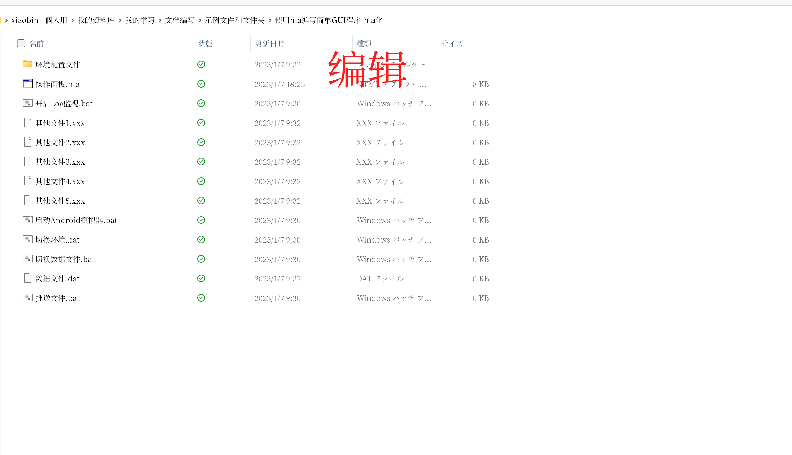
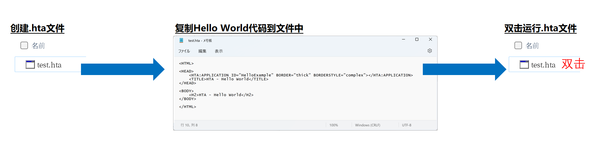
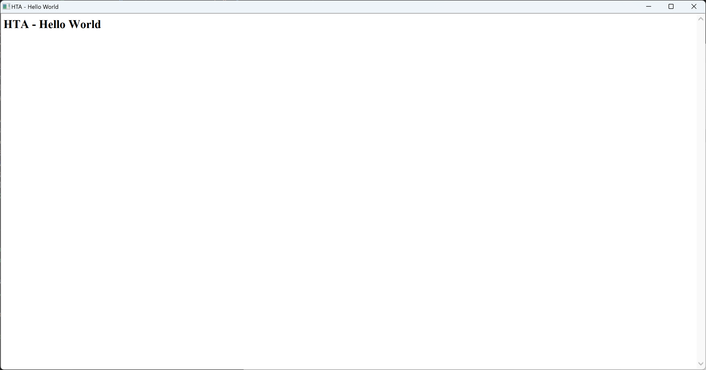
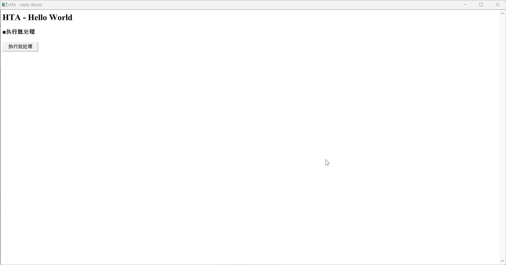
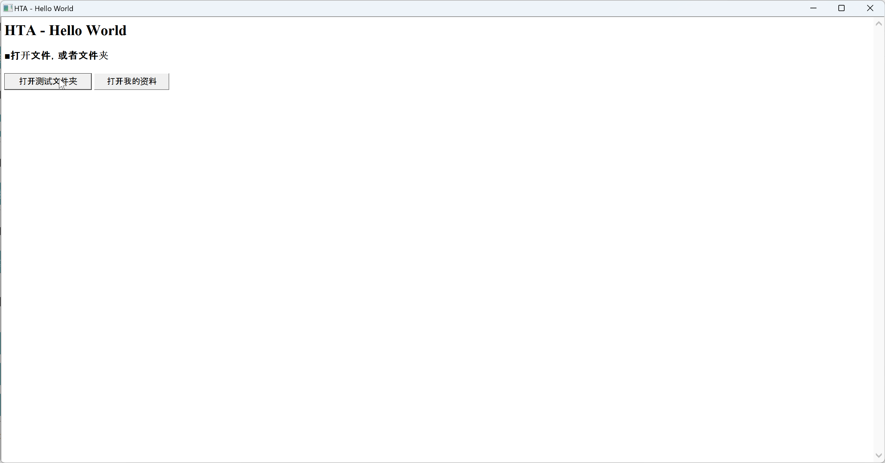
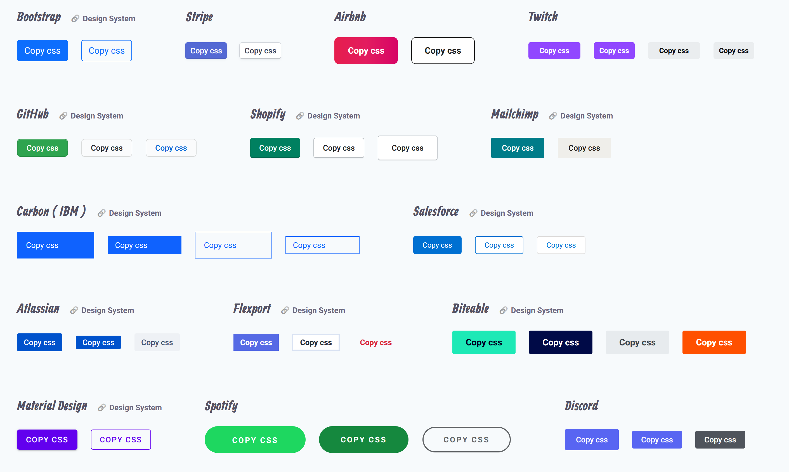
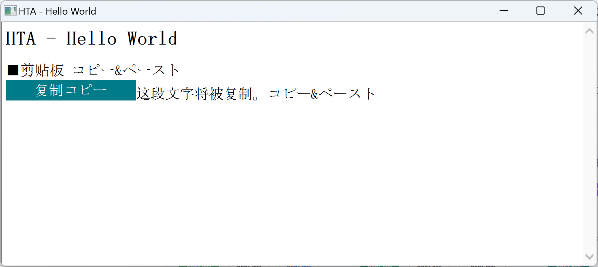

# 为.bat批处理套上GUI外壳（使用HTA）

更新日期: 2022-01-07

-----------------------------------------------------

## 1. 你需要HTA图形界面程序吗？

<div style="font-size:1.5em;color:red;">你是否经常使用大量的bat批处理程序？<br/>※直接敲命令行也算</div>

如果答案=<span style="font-size:1.5em;color:red;">是</span>，则你需要HTA图形界面程序。

一张图告诉你HTA可以用来做什么？



使用图形界面的主要优点：

- 布局清晰，更容易点击
- 减少了重复冗余的批处理和快捷方式

## 2. HTA非常适用于办公场景

HTA程序的特性使其非常适合在办公场景中使用。

<h3 style="color:red;"><b><u>特性1：轻量级（秒开启动快，耗资源少，响应迅速）</b></u></h3>

我知道大家办公的电脑都比较卡，比较慢，很难再运行一个重量级的大型应用了。

<h3 style="color:red;"><b><u>特性2：Windows原生支持（双击即可运行，不用安装任何其它软件）</b></u></h3>

办公电脑通常不允许随意安装软件。而HTA在Windows XP以上系统（Windows XP~Windows11）都可直接使用，VM虚拟机系统里也可使用，或者说只要你是Windows系统都可以开箱即用。

<h3 style="color:red;"><b><u>特性3：编写HTA也不需要安装任何其它软件（记事本即可编写）</b></u></h3>

在忙碌的工作中打开沉重的IDE来编写代码是难以令人接受的，又或者我们的办公电脑上不允许我们随意安装与当前工作内容无关的大型IDE。

好在HTA不需要编译，HTA文件和普通的html文件几乎是一样的，只是扩展名不同。你要做的只是编写html代码（包括js和css），编写完后双击HTA文件后即可直接运行，也可以一边写一边刷新画面。
任何文本编辑器都可以轻松胜任，不需要安装任何的IDE。

<h3 style="color:red;"><b><u>特性4：几乎没有学习成本（会html、js、css即可）</b></u></h3>

即使不会也没有太大问题，只靠复制粘贴本文的实例代码即可满足大部分需求。可以说是有手就行。

## 3. 究竟何谓HTA应用程序？

 HTA全称为HTML Application，也就是HTML应用程序。

!!! note "维基百科的词条说明"
    HTML应用程序是一个使用HTML和动态 HTML构建的Microsoft Windows应用程序，运行在Internet Explorer中，并且支持其它的脚本语言，比如VBS和JavaScript。HTML用来创建用户界面，脚本语言则用来构建程序主体。HTA运行时不受浏览器安全模型的限制，实际上，它就像是一个被“完全信任”的应用程序。

    大部分HTA可执行文件的后缀为.hta。 

简单来说，hta程序就是一个扩展名为.hta的可直接运行的文本文件。双击可以运行，使用文本编辑器打开则可以修改。

!!! note "HTA程序演示"
    

在本文中我们主要使用HTA来包装我们的bat批处理程序，但是其实它能做的事情还有很多。

## 4. 编写HTA应用程序

虽然使用记事本也可以编写，但是使用Visual Studio Code这样的支持语法检查和高亮显示的轻量级IDE来进行编写，体验会更好。

另外，本文使用js脚本来完成主要的功能，HTA也支持VB脚本语言。

### 4.1 Hello World

虽说万事开头难， 但是HTA程序一点也不难。我们甚至不需要自己编写这个入门程序的代码，直接从网上的HTA教程中复制即可。
而整个过程也仅仅只有简单的三步。



第一步：在任意你喜欢的位置创建一个文本文件，并重命名为test.hta（扩展名改为.hta）。


第二步：从各种HTA教程中找一段HTA的入门代码，复制到test.hta中并保存。

!!! example "test.hta ※来自于维基百科的Hello World"
    ```html
    <HTML>

    <HEAD>
        <HTA:APPLICATION ID="HelloExample" BORDER="thick" BORDERSTYLE="complex"></HTA:APPLICATION>
        <TITLE>HTA - Hello World</TITLE>
    </HEAD>

    <BODY>
        <H2>HTA - Hello World</H2>
    </BODY>

    </HTML>
    ```

第三步：双击test.hta运行。

!!! example "双击运行test.hta"
    

### 4.2 执行批处理文件

很容易，我们在html的body中添加一个按钮，并在js中给这个按钮添加响应。
然后，我们在js代码中去调用一个.bat文件。

首先我们在hta同目录下准备一个简单的批处理文件。

!!! example "我的批处理.bat"
    ```bat
    echo 现在的时间是：%date%
    pause
    ```

然后我们修改一下test.hta的代码。

!!! example "test.hta"
    ```html
    <HTML>

    <HEAD>
        <HTA:APPLICATION ID="HelloExample" BORDER="thick" BORDERSTYLE="complex"></HTA:APPLICATION>
        <TITLE>HTA - Hello World</TITLE>


        <script>
            // 当前路径
            var curPath;

            window.onload = function () {
                // 设定当前路径
                var cmd = HelloExample.commandLine;
                cmd = cmd.substring(1, cmd.length - 2);
                cmd = cmd.substring(0, cmd.lastIndexOf("\\") + 1);
                curPath = cmd;
            }

            // 执行批处理
            function RunBat(batPath, isShow) {
                RunCmd(batPath, isShow);
            }

            // 执行控制台命令
            function RunCmd(cmd, isShow) {
                var shell = new ActiveXObject("WScript.Shell");
                shell.run(curPath + cmd, 1, false);
            }
        </script>
    </HEAD>

    <BODY>
        <H2>HTA - Hello World</H2>

        <h4>■执行批处理</h4>
        <div>
            <input class="btn" type="button" value="执行批处理" OnClick="RunBat('我的批处理.bat', false)" />
        </div>
    </BODY>

    </HTML>
    ```

注意这里我写了一段取得当前路径的处理，这是因为使用WScript.Shell来执行控制台命令时必须要指定全路径才行。

最后，我们保存test.hta并运行来看一看效果吧。

!!! note "运行效果"
    

上面的例子中，这个简单的批处理没有参数，而添加参数也是非常简单的。

!!! note "批处理的参数"
    ```html
    <input class="btn" type="button" value="执行批处理" OnClick="RunBat('我的批处理.bat 参数1 参数2', false)" />
    ```

### 4.3 打开指定的文件夹或文件

很简单，我们直接来看一看代码。

!!! example "test.hta"
    ```html
    <HTML>

    <HEAD>
        <HTA:APPLICATION ID="HelloExample" BORDER="thick" BORDERSTYLE="complex"></HTA:APPLICATION>
        <TITLE>HTA - Hello World</TITLE>

        <script>
            // 打开文件或者文件夹
            function OpenFolder(path) {
                var shell = new ActiveXObject("WScript.Shell");
                shell.run("explorer.exe /e," + path, 1, false);
            }
        </script>
    </HEAD>

    <BODY>
        <H2>HTA - Hello World</H2>

        <h4>■打开文件，或者文件夹</h4>
        <div>
            <input class="btn" type="button" value="打开测试文件夹" OnClick="OpenFolder('C:\\Data\\测试文件夹\\')" />
            <input class="btn" type="button" value="打开我的资料" OnClick="OpenFolder('C:\\Data\\我的资料.xlsx')" />
        </div>

    </BODY>

    </HTML>
    ```

看一看运行效果吧。

!!! note "运行效果"
    

### 4.4 打开网页链接

过于简单，我们直奔代码。

!!! example "test.hta"
    ```html
    <HTML>

    <HEAD>
        <HTA:APPLICATION ID="HelloExample" BORDER="thick" BORDERSTYLE="complex"></HTA:APPLICATION>
        <TITLE>HTA - Hello World</TITLE>

        <script>
            // 打开链接
            function OpenLink(link) {
                var shell = new ActiveXObject("WScript.Shell");
                shell.run(link);
            }
        </script>
    </HEAD>

    <BODY>
        <H2>HTA - Hello World</H2>

        <h4>■打开网页链接</h4>
        <div>
            <input class="btn" type="button" value="打开链接" OnClick="OpenLink('https://doc.hakureiyoumu.xyz')" />
        </div>

    </BODY>

    </HTML>
    ```

### 4.5 复制到剪贴板

仍然直奔代码。

!!! example "test.hta"
    ```html
    <HTML>

    <HEAD>
        <HTA:APPLICATION ID="HelloExample" BORDER="thick" BORDERSTYLE="complex"></HTA:APPLICATION>
        <TITLE>HTA - Hello World</TITLE>

        <script>
            // 复制文本
            function Copy(text) {
                window.clipboardData.setData("text", text);
            }
        </script>
    </HEAD>

    <BODY>
        <H2>HTA - Hello World</H2>

        <h4>■剪贴板</h4>
        <div>
            <input class="btn" type="button" value="复制" OnClick="Copy('这段文字将被复制。')" />这段文字将被复制。
        </div>

    </BODY>

    </HTML>
    ```

## 5. 界面美化

一个整洁的界面可以使这个工具更好用，程序员经常会忽略这一点，实际上好不好看非常重要。这里我们通过css来调整界面的样式。

### 5.1 字体

日文字体推荐使用`ＭＳ 明朝`这个经典字体，并适当调大字体以减少锯齿。

如果是自己使用的电脑，则推荐使用`思源宋体`和`思源黑体`，这套字体支持中文、日文、韩文。当我们混合使用这三种语言的文字时使用思源系列字体可能使三种文字显示的非常协调。

### 5.2 按钮样式

仍然是当代码的搬运工，这里推荐下面这个网站，喜欢哪种样式就点击复制。

[Copy & Paste CSS](https://copy-paste-css.com/)




### 5.3 略微调整后的效果



!!! example "代码"
    ```html
    <HTML>

    <HEAD>
        <HTA:APPLICATION ID="HelloExample" BORDER="thick" BORDERSTYLE="complex"></HTA:APPLICATION>
        <TITLE>HTA - Hello World</TITLE>

        <script>
            // 复制文本
            function Copy(text) {
                window.clipboardData.setData("text", text);
            }
        </script>
        <style>
            body {
                font-family: 'ＭＳ 明朝';
                font-size: 36px;
            }

            .btn {
                display: inline-block;
                outline: none;
                cursor: pointer;
                font-weight: 500;
                border: 1px solid transparent;
                border-radius: 2px;
                font-size: 36px;
                color: #ffffff;
                background-color: #007c89;
                transition: background-color 0.2s ease-in-out 0s, opacity 0.2s ease-in-out 0s;
                padding: 0 18px;
                font-family: 'ＭＳ 明朝';
            }

            .btn:hover {
                color: #ffffff;
                background-color: #006570;
            }
        </style>
    </HEAD>

    <BODY>
        <H2>HTA - Hello World</H2>

        <div>■剪贴板 コピー&ペースト</div>
        <div>
            <input class="btn" type="button" value="复制コピー" OnClick="Copy('这段文字将被复制。')" />这段文字将被复制。コピー&ペースト
        </div>

    </BODY>

    </HTML>
    ```