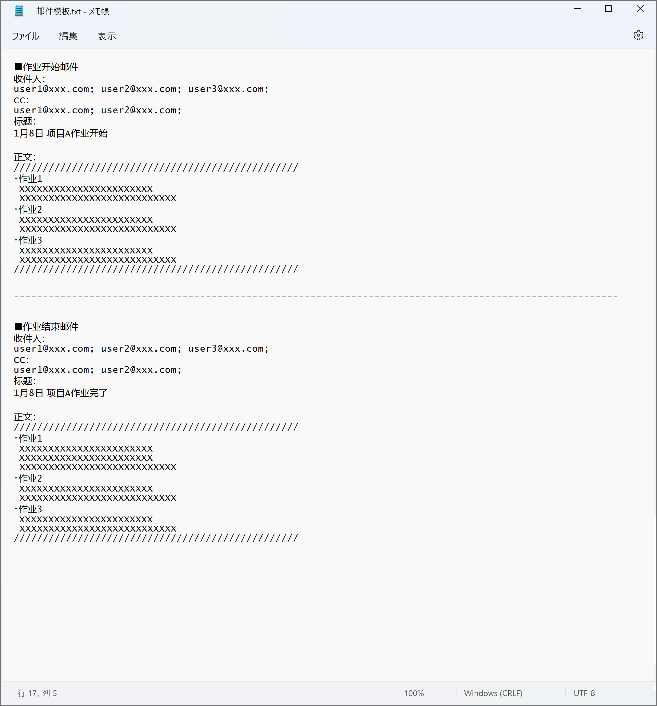
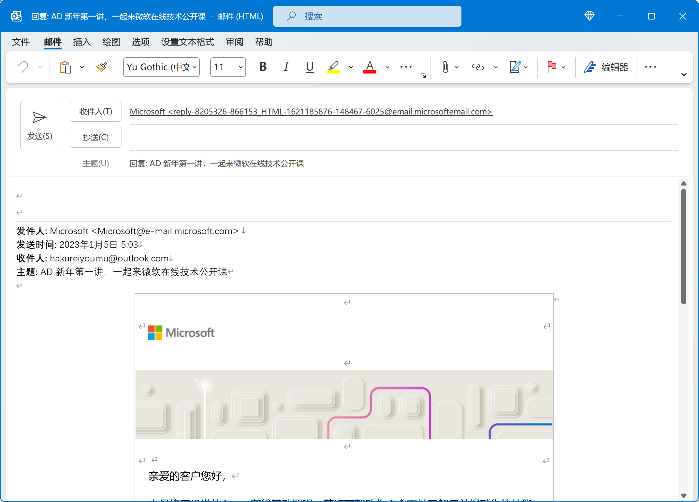
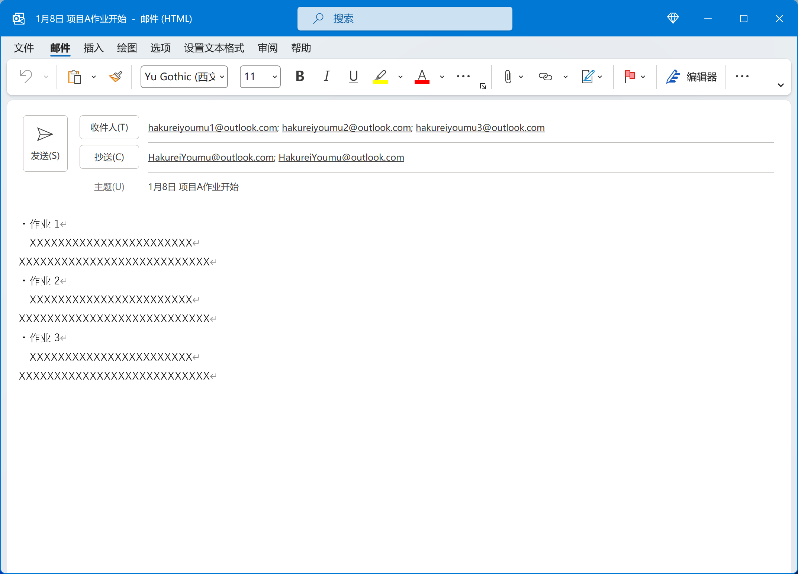
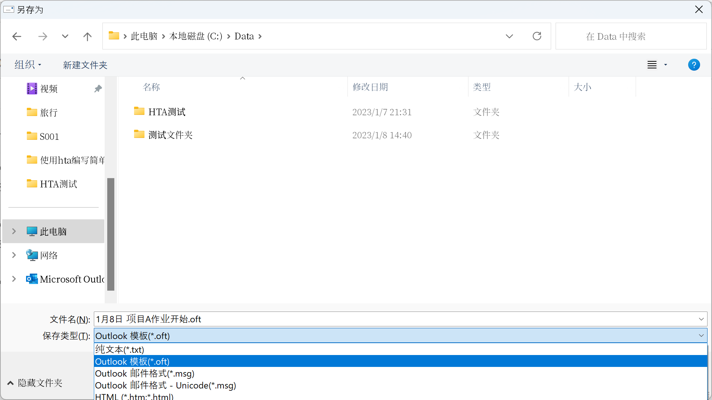

# Outlook无脑极速发邮件

更新日期: 2023-01-08

-----------------------------------------------------

## 1. 每天都要发送一些固定格式的邮件是不是很烦？

笔者所在的项目组每天都要发送好几封固定格式的邮件，比如下面这些：

- 早上要发作业开始的邮件，列出预定的作业内容
- 晚上要给不同的人发送作业结束的邮件，列出作业实绩
- 其他一些给固定人发的联络性质的邮件

虽然是很简单的任务，但是每天做就会感觉不胜其烦。天天发，每次都要检查一遍收件人和标题对不对，就这样有时候还容易发错。

于是乎有了这篇教你如何使用Outlook无脑快速发送邮件的文章。
其实Outlook这类软件在学校时老师是不会教的，需要我们自己去学习它的用法。

!!! warning "要学习常用软件的用法"
    我知道有很多人会觉得这种软件还需要特意去学习用法吗？

## 2. 常见的发送固定格式邮件的方法

__<u>方法一</u>__

以前我是这样发的。

在一个文本文件中保存邮件的各种信息，在发送时创建一个新的邮件，一项一项复制各项内容。

!!! note "邮件内容模板"
    

1. 打开Outlook
2. 点击【新建电子邮件】
3. 找到保存了邮件内容的文本文件并打开
4. 复制收件人到新电子邮件
5. 复制CC到新电子邮件
6. 复制标题到新电子邮件
7. 复制正文到新电子邮件
8. 根据需要修改标题和正文的内容
9. 检查收件人、CC、标题等内容
10. 点击【发送】

__<u>方法二</u>__

我还看到我们有些同志是这样发的。

找到以前发送过的邮件，利用【全部答复】功能帮助自动填充各项内容，然后再逐一修改。

!!! note "【全部答复】大概长这样"
    

1. 打开Outlook
2. 找到以前发送过的这种邮件 ※有点麻烦
3. 点击【全部答复】
4. 去掉标题中的“回复：”文字
5. 删去正文中以前邮件的多余内容
6. 根据需要在正文中填入本次的内容
7. 检查标题、正文内容
8. 点击【发送】

## 3. 极速发送邮件

这个方法利用了Outlook的邮件模板功能，要不先来看看实际的效果？

!!! note "秒发邮件"
    

不仅仅步骤少，而且不用去做找文件、找邮件、选中复制之类的耗神操作，突出一个无脑。
另外此方法也避免了一些复制错、错选、误删之类的低级失误。

这方法可以概括为以下几步。

1. 移动到【桌面】
2. 双击模板文件
3. 根据需要修改标题和正文内容
4. 检查标题、正文内容
5. 点击【发送】

## 4. 具体方法

说起来创建邮件模板也很简单。

__<u>第一步：新建邮件，并填好需要的内容</u>__

__<u>第二步：保存为oft邮件模板</u>__

选择【文件】→【另存为】，然后选择保存为【.oft】格式的模板文件。

