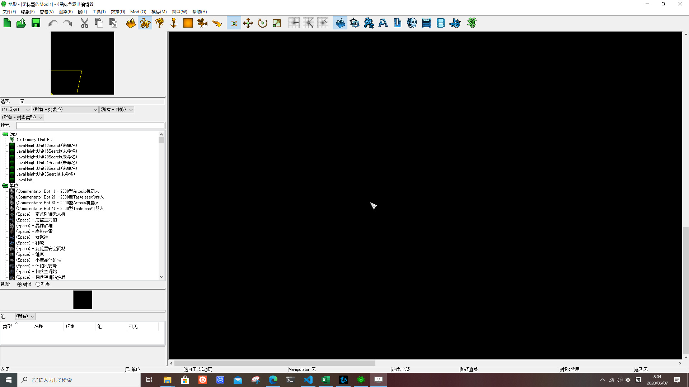
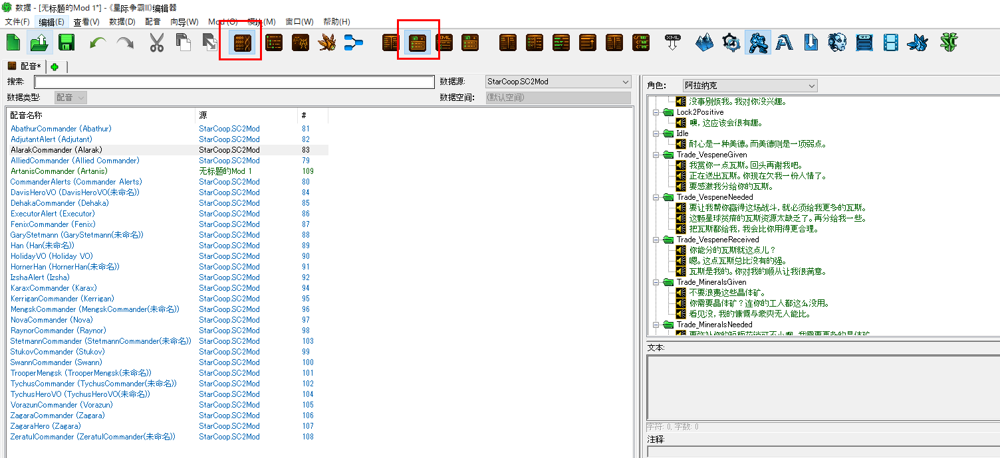

# 查看合作单位语音

更新日期：2020-06-07

------------------------------------------------

## 1. 概述

合作单位的台词通常都设计的很有意思，相信你和我一样每次听到集结部队的语音时都感会到无比荣耀。
现在在银河编辑器中你可以任意查看合作单位的数据了，当然这里面也包括了语音。

!!! warnning
    并文档包括体积较大的动态图片，可能加载缓慢。并且，如果图片不会动，请使用最新版的Chrome、Edge或者Safari浏览器来查看本页面。

## 2. 创建一张包含合作任务数据的地图

按照下图的步骤即可，要注意的是中间有一步需要登录暴雪账号，否则会提示需要虫群之心和虚空之遗的证书，我想应该没有人没买战役吧。
登录账号这一步可能会等待很长时间才能加载出来。

## 3. 查看单位的语音数据

仍然按照动图上的步骤即可。请再次播放大主教的语音，感受达拉姆的荣耀。

补充说明，可能默认打开数据窗口时右边的面板会和上面动图中的不一样。按下图这样设置可以直接在右边窗口中查看语音：

